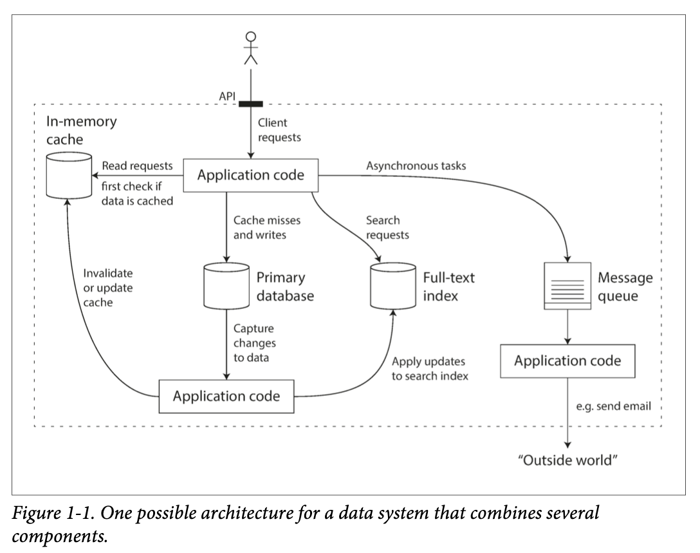

# Reliable, Scalable, and Maintainable Applications

Many applications are data-intensive as opposed to compute-intensive.

## 1.1 Thinking About Data Systems



Many new tools no longer neatly fit into traditional categories [1].

1. Redis, datastore also used as message queues
1. Kafka, message queues with database-like durability

Influence factors

1. skills and experience of people involved
1. legacy system dependencies
1. time-scale for delivery
1. organization tolerance on differnt kinds of task
1. regulatory constraints

## 1.2 Reliability

1. functional requirements
1. tolerate user mistakes or using the software in unexpected ways
1. performance under load and data volume
1. prevents unauthorized access and abuse

Continue to work correctly even when things go wrong. Fault-tolerant (certain types) or resilient.

Fault is not the same as a failure [2]. Fault is usually one component only and failure is when the whole system stops providing the required service to the user. It's impossible to reduce fault probability to zero and usually best to prevent faults from causign failures.

Many critical bugs are due to poor error handling [3]. Deliverately inducing faults can increase confidence and ensure fault-tolerance machinery is continually exercised and tested. The netflix chaos monkey [4] is an example.

We generally prefer tolerating faults over preventing. Although for security matters prevention is better.

### 1.2.1 Hardware Faults

Hard disks have a mean time to failure (MTTF) of about 10 to 50 years [5], [6]. Thus, on a storage cluster with 10k disks, we should expect on average one disk to die per day.

Our first response is usually to add redundancy. Disks may be set up in a RAID configuration, servers may have dual power supplies and hot-swappable CPUs, and datacenters may have batteries and diesel generators for backup power.

Until recently, redundancy of hardware components was sufficient. As long as restore a backup onto a new machine fairly quickly, the downtime in case of failure is not catastrophic in most applications. Multi-machine redundancy was only required by a small number of applications.

However, more applications have begin using larger number os machines, which proportionally increases the rate of hardware faults. Moreover, in some cloud platforms such as AWS it is common for virtual machine to become unavailable without warning [7], as the platforms are designed to prioritize flexibility and elasticity over single-machine reliability.

There is a move towards systems tolerating loss of entire machines, by using software fault-tolerance techniques in addition to hardware redundancy. Such system can tolerate machine failure can be patched one node at a time, without downtime (a rolling upgrade, chapter 4).

### 1.2.2 Software Errors

Typically hardware faults are random and independent except for weak correlations: temperature in the server rack.

Another category is systematic error [8]. Such faults are harder to anticipate and because they are correlated across nodes, they will cause many more system failures than hardware faults [9]. Examples:

- leap second on June 30 2012 causing many applications to hang simultaneously due to a bug in linux kernel [9]
- a runaway process using up resource: cpu, memory, disk, or network bandwidth
- a dependent service slow down, unresponsive, or returning corrupted responses
- cascading failures, when a small fault in one component triggers a fault in another, which in turn triggers further [10]

These bugs often lie dormant for a long time until triggered by an unusual set of circumstances. Assumption may no longer be true [11].

Lots of small things can help:

1. carefully thinking about assumptions and interactions
1. thorough testing
1. process isolation
1. allowing process to crash and restart
1. measuring, monitoring, and analyzing behavior in prod
1. constantly check gurantee (e.g., messaging system incoming messages == outgoing)


### 1.2.3 Human Errors

One study found configuration errors by operators were the leading cause of outages, whereas hardware faults is 10-25% [13].

- Design in a way to minimize opprotunities for error. Well-designed APIs, abstractions, and admin interfaces make it easy to do "the right thing". Balance not to be too strict so people will work around.
- Provide fully-featured non-production sandbox environments using real data without affecting real users.
- Testing thoroughly. Unit tests, whole-system integration tests, and manual tests [3]. Automated tests is widely used, well understood, and sepecially valuable in covering corner cases rarely arise in normal operation.
- Allow quick and easy recovery from human errors, minimize impact. Fast to roll back configuration chagnes, roll out new code gradually (unexpected bugs only affect a small subset of users), and provide tools to recompute data (old computation incorrect).
- Detailed and clear monitoring, performance and error rates, referred to as telemetry (after rocket launch [14]).
- Implement good management practices and training


### 1.2.4 How Important Is Reliability?

Consider a parent who stores pictures of videos of all children in your photo application [15]. Would they know how to restore from DB corruption?

You may choose to sacrifice reliability to reduce develoment cost, e.g., when developing a prototype product for an unproven market. Or operational cost, e.g., for a service with a narrow profit margin. But should be conscious when cutting corners.

## 1.3 Scalability

One common reason for degradation is increasing load, e.g., 10k-100k concurrent users, or 1 to 10 million.

Scalability is not 1D label. "How can we add computing resources to handle the additional load?"

### 1.3.1 Describing Load

The best choice of load parameters depends on the system architecture:

- QPS web server
- DB read/write ratio
- number of simultaneous users in a chat room
- cache hit rate
- perhaps average case
- perhaps a number of extreme cases is the bottleneck

Using twitter 2012 data as example [16].

Two main operations:

1. post tweet 4.6k avg, 12k peak QPS
1. home timeline 300k QPS

Handling 12k QPS tweet write is fairly easy. However, twitter's scaling challenge is due to fan-out (a term borrowed from electrical engineering, describing number of logic gate inputs connected to another gate's output. The output need to suplly enough current to drive all the attached inputs. In transaction processing systems, describing number of requests to other services in order to serve one imncoming request).

Broadly two ways to implement:

1, Posting simply inserts. Timeline look up all and merge.

```sql
SELECT tweets.*, users.* FROM tweets
  JOIN users ON tweets.sender_id = users.id 
  JOIN follows ON follows.followee_id = users.id
  WHERE follows.follower_id = current_user
```

2, Maintain a cache for timeline, insert new tweet to follower's caches.

The first version of twitter used approach 1, but the systems struggled to keep up with the timeline queries. The average rate of published tweets is almost two orders of magnitude lower than the rate of timeline reads. It's preferrable to do more work at write time and less at read time.

On average, a tweet is delivered to avout 75 followers, so 4.6k QPS becomes 345k to the timeline caches. This average hides that number of followers varies wildly. Some users have over 30 million followers.

The distribution of followers per user (weighted by how often those users tweet) is a key load parameter for discussing scalability, since it determines the fan-out load.

Twitter is moving to a hybrid of the two approaches. Celebrities are excepted from this fan-out.

### 1.3.2 Describing Performance
### 1.3.3 Approaches for Coping with Load

## 1.4 Maintainability
## 1.5 Summary

<!-- references -->

[2]: Walter L. Heimerdinger and Charles B. Weinstock: “A Conceptual Framework for System Fault Tolerance,” Technical Report CMU/SEI-92-TR-033, Software Engineering Institute, Carnegie Mellon University, October 1992.

[4]: Yury Izrailevsky and Ariel Tseitlin: “The Netflix Simian Army,” techblog.net‐ flix.com, July 19, 2011.

[7]: Laurie Voss: “AWS: The Good, the Bad and the Ugly,” blog.awe.sm, December 18, 2012.

[16]: