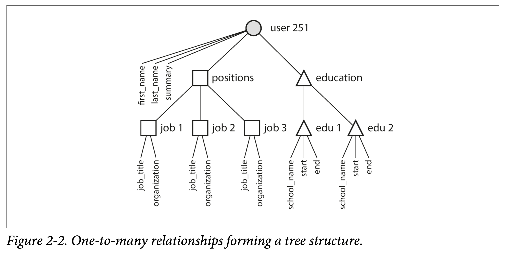

# Data Models and Query Languages

Most applications are built by layering one data model on top of another. For each layer, the key question is: how is it represented in terms of the next lower layer. For example:

1. As an application developer, you model the real word in terms of objects or data structures, and APIs that manipulate those data structures.
1. You express the data structures in terms of a general-purpose data model, such as JSON or XML documents, tables in a relational database, or a graph model.
1. The engineers who built your DB software decided on a way of representing that JSON/XML/relational/graph data in terms of bytes in memory, on disl, or on a network. The representation may allow query, search, manipulation, and processing in various ways.
1. On yet lower levels, hardware engineers have figured out how to represent bytes in terms of electrical currents, pulses of light, magnetic fields, and more.

Data model has a profound effect on what the software above it can and can't do, it's important to choose one appropriate.

## 2.1 Relational Model Versus Document Model

Best known data model is probably SQL [1]: data is organized into relations (tables), where each relation is an unordered collection of tuples (rows).

The dominance of relational databases has lasted around 30 years since mid-1980s, an eternity in computing history.

The use cases appear mundane from today's perspective:

- transaction processing: sales, bank transactions, airline reservations, stock-keeping in warehouses
- batch processing: customer invoicing, payroll, reporting

Other databases at the time forced application developers to think a lot about the internal representation of the data in the database. The goal of the relational model was to hide the implementation detail behind a cleaner interface.

In the 1970s and early 1980s, the network model and the hierarchical model were the main alternatives, but the relational model came to dominate them. Object databases came and went again in the late 1980s and early 1990s. XML databases appeared in the early 2000s, but have only seen niche adoption.

As computers became more powerful and networked, relational model continue to generalize well, beyond their original scope of business data processing, to a broad variety: online publishing, discusssion, social networking, .etc.

### 2.1.1 The Birth of NoSQL

The name "NoSQL" is unfortunate, originally intended simply as a catchy Twitter hashtag for a meetup on open source, distributed, nonrelational databases in 2009 [3]. It has been retroactively reinterpreted as Not Only SQL [4].

Driving forces:

1. Greater scalability than relational databases, including very large datasets or very high write throughput
1. Widespread preference for free and open source software over commercial database products
1. Specialized query opterations not well supported by the relational model
1. Frustration with the restrictiveness of relational schemas, desire for a more dynamic and expressive data model

### 2.1.2 The Object-Relational Mismatch

The disconnect between the object-oriented model and the SQL data model is sometimes called an impedance mismatch (a term borrowed from electronics).

Object-relational mapping (ORM) frameworks like ActiveRecord and Hibernate reduce boilerplate code required for the translation layer but they can't completely hide the differences between the two models.

For a resume or a LinkedIn profile, the profile as a whole can be identified by a unique identifier, `user_id`. Fields like `first_name` and `last_name` can be columns on the `users` table. However, most people have had more than one job and varying numners of education. The one-to-many relationship can be represented:

1, In the traditional SQL (prior to SQL 1999), put positions, education, and contact information in separate tables, with a foreign key reference to the `users` table.
1. Later versions of SQL added support for structured datatypes and XML, with support for querying and indexing inside those documents. These features are supported to varying degrees by Orable, IBM DB2, MS SQL Server, and PostegreSQL. A JSON datatype is also supported by some, including IBM DB2, MySQL, and PostgreSQL.
1. A third options is to encode jobs as a JSON or XML, store as text column and let the application interpret structure and content. In this setup, you typically cannot use the database to query values inside that encoded column.

For a data structure like a resume, which is mostly a self-contained document, a JSON representation is quite appropriate. JSON has the appeal of much simper than XML. Document oriented databses like MongoDB, RethinkDB, CouchDB, and Espresso support this data model.

The JSON representation has better locality than the multi-table schema. If you want to fetch a profile in the relational example, you need to either perform multiple queries (query each table by `user_id`) or perform a messy multi-way join between the user table and its subordinate tables. In the JSON example, all the information is in one place and one query is enough.

The one-to-many relationships from the user to positions, contact info, and education history imply a tree structure, and the JSON makes that explicit.

### 2.1.3 Many-to-One and Many-to-Many Relationships

In previous example, `region_id` and `industry_id` are given as IDs, not plain-text strings.

When you use an ID, the information meaningful to human is stored only at one-place. The advantage is the ID never has to change and since it is not meaningful to human. The info it identifies can change and ID remains the same. If the information is duplicated, all the redudant copies need to be updated. That incurs write overheads, and risks inconsistences (some copies updated and some not). Removing such duplication is the key idea of normalization in relational databses (The distinctions among the normal forms are of little practical impact. As a rule of thumb, duplicating values indicate the schema is not normalized).

Normalizing this data requires many-to-one relationships, which don't fit nicely into the document model. In document databases, joins are not needed for one-to-many tree structures, and support for joins is often weak (supported in RethinkDB, not in MongoDB, only supported in predeclared views in CouchDB). If the database does not support joins, you have to emulate joins in applicaiton code by making multiple queries.

Moreover, initial version of an application may fit well in a join-free document model. Data has a tendency of becoming more interconnected as features are added.

### 2.1.4 Are Document Databases Repeating History?

The most popular database for business data processing in the 1970s was IBM's Information Management System (IMS), which used a fairly simple data model called he hirearchical model. It has some remarkable similarities to the JSON model used by document databases.

Like document databases, IMS worked well for one-to-many relationships, but it made many-to-many relationships difficult, and did not support joins. Developers had to decide whether to duplicate (denormalize) data or to manually resolve references from one record to another. These problems of the 1960s and '70s were much like the problems with document databases today [15].

Various solutions were proposed to solve the limitations of the hierarchical model. The two most prominent were the relational model (which became SQL) and the network model (which initially had a large following but eventually faded into obscurity). The "great debate" between these two camps lasted for much of the 1970s.

**The network model**

The network model was standarized by a committee called the Conference on Data Systems Languages (CODASYL). The CODASYL model was a generalization of the hirearchical model. In the tree structure of the hierarchical model, every record has exactly one parent; in the network model, a record could have multiple parents. This allowed many-to-one and many-to-many relationships to be modeled.

The links in the network model were not foreign keys but more like pointers (while still being stored on disk). The only way of accessing a record was to follow a path from a root record along these chains of links. This was called an access path. If a record had multiple parents, the application code had to keep track of all the various relationships. Even CODASYL committee members admitted that this was like navigating around an n-dimensional data space [17].

**The relational model**

### 2.1.5 Relational Versus Document Databases Today

## 2.2 Query Languages for Data

### 2.2.1 Declarative Queries on the Web
### 2.2.2 MapReduce Querying

## 2.3 Graph-Like Data Models

### 2.3.1 Property Graphs
### 2.3.2 The Cypher Query Language
### 2.3.3 Graph Queries in SQL
### 2.3.4 Triple-Stores and SPARQL
### 2.3.5 The Foundation: Datalog

## 2.4 Summary

<!-- references -->

[1]:

[15]: