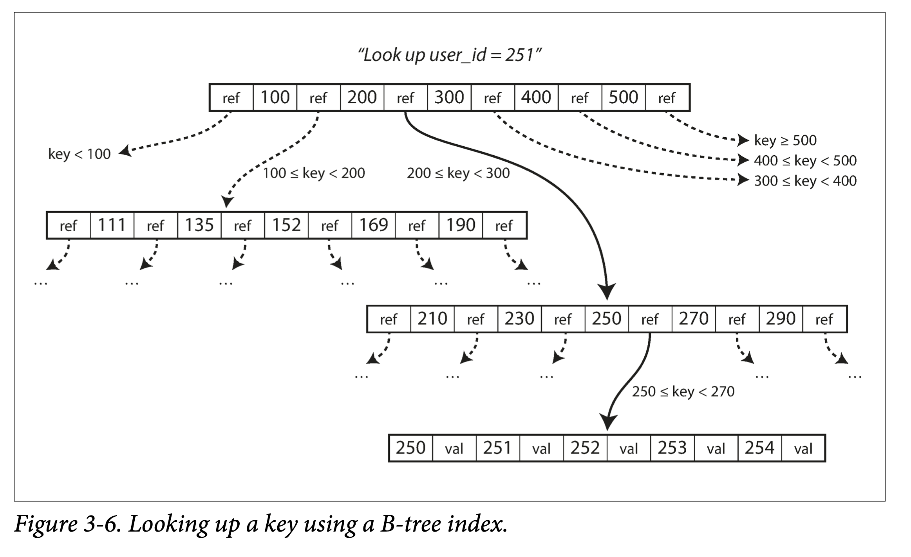

# Chapter 3 Storage and Retrieval

There is a big difference between storage engines that are optimized for transactional workloads and those that are optimized for analytics.

Database kinds:

1. traditional relational databases
1. NoSQL databases

Storage Engine Familes

1. log-structured
1. page-oriented

## 3.1 Data Structures That Power Your Database

```bash
#!/bin/bash
    db_set () {
        echo "$1,$2" >> database
}
    db_get () {
        grep "^$1," database | sed -e "s/^$1,//" | tail -n 1
}
```

Our `db_set` function actually has pretty good performance for something that is so simple, because appending to a file is generally very efficient. Similarly to what `db_set` does, many databases internally use a log, which is an append-only data file. Real databases have more issues to deal with (such as concurrency control, reclaiming disk space so that the log doesn’t grow forever, and handling errors and partially written records), but the basic principle is the same.

In this book, log is used in the more general sense: an append-only sequence of records. It doesn’t have to be human-readable; it might be binary and intended only for other programs to read.

This is an important trade-off in storage systems: well-chosen indexes speed up read queries, but every index slows down writes.

### 3.1.1 Hash Indexes


The simplest possible indexing strategy is this: keep an in-memory hash map where every key is mapped to a byte offset in the data file—the location at which the value can be found, as illustrated in Figure 3-1. In fact, this is essentially what Bitcask (the default storage engine in Riak) does [3].

A storage engine like Bitcask is well suited to situations where the value for each key is updated frequently. For example, the key might be the URL of a cat video, and the value might be the number of times it has been played (incremented every time someone hits the play button). In this kind of workload, there are a lot of writes, but there are not too many distinct keys—you have a large number of writes per key, but it’s feasible to keep all keys in memory. If that part of the data file is already in the filesystem cache, a read doesn’t require any disk I/O at all.

Lots of detail goes into making this simple idea work in practice. Briefly, some of the issues that are important in a real implementation are:

1. File format: CSV is not the best format for a log. It’s faster and simpler to use a binary format that first encodes the length of a string in bytes, followed by the raw string (without need for escaping).
1. Deleting records:  If you want to delete a key and its associated value, you have to append a special deletion record to the data file (sometimes called a tombstone). When log segments are merged, the tombstone tells the merging process to discard any previous values for the deleted key.
1. Crash recovery: If the database is restarted, the in-memory hash maps are lost. In principle, you can restore each segment’s hash map by reading the entire segment file from beginning to end and noting the offset of the most recent value for every key as you go along. However, that might take a long time if the segment files are large, which would make server restarts painful. Bitcask speeds up recovery by storing a snapshot of each segment’s hash map on disk, which can be loaded into memory more quickly.
1. Partially written records: The database may crash at any time, including halfway through appending a record to the log. Bitcask files include checksums, allowing such corrupted parts of the log to be detected and ignored.
1. Concurrency control: As writes are appended to the log in a strictly sequential order, a common implementation choice is to have only one writer thread. Data file segments are append-only and otherwise immutable, so they can be read concurrently by multiple threads.

Benefits for append-only logs:

1. sequential write more efficient than random writes
1. concurrency and crash recovery much simpler for immutable logs
1. merging old segments avoid data files fragmented over time

Limitations
1. range queries not efficient
1. hash table must fit in memory

### 3.1.2 SSTables and LSM-Trees

For the append-only log database, we make a simple change: we require that the sequence of key-value pairs is sorted by key. We call this format Sorted String Table, or SSTable for short. We also require that each key only appears once within each merged segment file (the compaction process already ensures that). SSTables have several big advantages over log segments with hash indexes:


1. Merging segments is simple and efficient, even if the files are bigger than the available memory. Use approach based on merge sort. When multiple segments contain the same key, we can keep the value from the most recent segment and discard the values in older segments.
1. In order to find a particular key in the file, you no longer need to keep an index of all the keys in memory. You still need an in-memory index to tell you the offsets for some of the keys, but it can be sparse: one key for every few kilobytes of segment file is sufficient, because a few kilobytes can be scanned very quickly. If all keys and values had a fixed size, you could use binary search on a segment file and avoid the in-memory index entirely. However, they are usually variable-length in practice, which makes it difficult to tell where one record ends and the next one starts if you don’t have an index.
1. Since read requests need to scan over several key-value pairs in the requested range anyway, it is possible to group those records into a block and compress it before writing it to disk (indicated by the shaded area in Figure 3-5). Each entry of the sparse in-memory index then points at the start of a compressed block. Besides saving disk space, compression also reduces the I/O bandwidth use.


#### 3.1.2.1 Constructing and maintaining SSTables

Maintaining a sorted structure on disk is possible (see “B-Trees” in the next section), but maintaining it in memory is much easier. There are plenty of well-known tree data structures that you can use, such as red-black trees or AVL trees [2]. With these data structures, you can insert keys in any order and read them back in sorted order.

1. When a write comes in, add it to an in-memory balanced tree data structure (for example, a red-black tree). This in-memory tree is sometimes called a memtable.
1. When the memtable gets bigger than some threshold—typically a few megabytes—write it out to disk as an SSTable file. This can be done efficiently because the tree already maintains the key-value pairs sorted by key. The new SSTable file becomes the most recent segment of the database. While the SSTable is being written out to disk, writes can continue to a new memtable instance.
1. In order to serve a read request, first try to find the key in the memtable, then in the most recent on-disk segment, then in the next-older segment, etc.
1. From time to time, run a merging and compaction process in the background to combine segment files and to discard overwritten or deleted values.

It only suffers from one problem: if the database crashes, the most recent writes (which are in the memtable but not yet written out to disk) are lost. In order to avoid that problem, we can keep a separate log on disk to which every write is immediately appended, just like in the previous section. That log is not in sorted order, but that doesn’t matter, because its only purpose is to restore the memtable after a crash. Every time the memtable is written out to an SSTable, the corresponding log can be discarded.

#### 3.1.2.2 Making an LSM-tree out of SSTables

The algorithm described here is essentially what is used in LevelDB [6] and RocksDB [7], key-value storage engine libraries that are designed to be embedded into other applications. Among other things, LevelDB can be used in Riak as an alternative to Bitcask. Similar storage engines are used in Cassandra and HBase [8], both of which were inspired by Google’s Bigtable paper [9] (which introduced the terms SSTable and memtable).

Originally this indexing structure was described by Patrick O’Neil et al. under the name Log-Structured Merge-Tree (or LSM-Tree) [10], building on earlier work on log-structured filesystems [11]. Storage engines that are based on this principle of merging and compacting sorted files are often called LSM storage engines.

Lucene, an indexing engine for full-text search used by Elasticsearch and Solr, uses a similar method for storing its term dictionary [12, 13]. A full-text index is much more complex than a key-value index but is based on a similar idea: given a word in a search query, find all the documents (web pages, product descriptions, etc.) that mention the word. This is implemented with a key-value structure where the key is a word (a term) and the value is the list of IDs of all the documents that contain the word (the postings list). In Lucene, this mapping from term to postings list is kept in SSTable-like sorted files, which are merged in the background as needed [14].

#### 3.2.2.3 Performance optimizations

The LSM-tree algorithm can be slow when looking up keys that do not exist in the database: you have to check the memtable, then the segments all the way back to the oldest (possibly having to read from disk for each one) before you can be sure that the key does not exist. In order to optimize this kind of access, storage engines often use additional Bloom filters [15]. (A Bloom filter is a memory-efficient data structure for approximating the contents of a set. It can tell you if a key does not appear in the database, and thus saves many unnecessary disk reads for nonexistent keys.)

There are also different strategies to determine the order and timing of how SSTables are compacted and merged. The most common options are size-tiered and leveled compaction. LevelDB and RocksDB use leveled compaction (hence the name of LevelDB), HBase uses size-tiered, and Cassandra supports both. In size-tiered compaction, newer and smaller SSTables are successively merged into older and larger SSTables. In leveled compaction, the key range is split up into smaller SSTables and older data is moved into separate “levels”, which allows the compaction to proceed more incrementally and use less disk space.

Even when the dataset is much bigger than the available memory it continues to work well. Since data is stored in sorted order, you can efficiently perform range queries, and because the disk writes are sequential the LSM-tree can support remarkably high write throughput.

### 3.1.3 B-Trees

The most widely used indexing structure is quite different: the B-tree.

The log-structured indexes break the database down into variable-size segments, typically several megabytes or more in size, and always write a segment sequentially. By contrast, B-trees break the database down into fixed-size blocks or pages, traditionally 4 KB in size (sometimes bigger), and read or write one page at a time. This design corresponds more closely to the underlying hardware, as disks are also arranged in fixed-size blocks.

Each page can be identified using an address or location, which allows one page to refer to another—similar to a pointer, but on disk instead of in memory. We can use these page references to construct a tree of pages, as illustrated in Figure 3-6.



The number of references to child pages in one page of the B-tree is called the branching factor. For example, in Figure 3-6 the branching factor is six. In practice, the branching factor depends on the amount of space required to store the page references and the range boundaries, but typically it is several hundred.

If you want to update the value for an existing key in a B-tree, you search for the leaf page containing that key, change the value in that page, and write the page back to disk (any references to that page remain valid). If you want to add a new key, you need to find the page whose range encompasses the new key and add it to that page. If there isn’t enough free space in the page to accommodate the new key, it is split into two half-full pages, and the parent page is updated to account for the new subdivision of key ranges.

Most databases can fit into a B-tree that is three or four levels deep, so you don’t need to follow many page references to find the page you are looking for. (A four-level tree of 4 KB pages with a branching factor of 500 can store up to 256 TB.)

#### 3.1.3.1 Making B-trees reliable

The basic underlying write operation of a B-tree is to overwrite a page on disk with new data. It is assumed that the overwrite does not change the location of the page; i.e., all references to that page remain intact when the page is overwritten. This is in stark contrast to log-structured indexes such as LSM-trees, which only append to files (and eventually delete obsolete files) but never modify files in place.

You can think of overwriting a page on disk as an actual hardware operation. On a magnetic hard drive, this means moving the disk head to the right place, waiting for the right position on the spinning platter to come around, and then overwriting the appropriate sector with new data. On SSDs, what happens is somewhat more complicated, due to the fact that an SSD must erase and rewrite fairly large blocks of a storage chip at a time [19].

Moreover, some operations require several different pages to be overwritten. For example, if you split a page because an insertion caused it to be overfull, you need to write the two pages that were split, and also overwrite their parent page to update the references to the two child pages. This is a dangerous operation, because if the database crashes after only some of the pages have been written, you end up with a corrupted index (e.g., there may be an orphan page that is not a child of any parent).

In order to make the database resilient to crashes, it is common for B-tree implementations to include an additional data structure on disk: a write-ahead log (WAL, also known as a redo log).

An additional complication of updating pages in place is that careful concurrency control is required if multiple threads are going to access the B-tree at the same time—otherwise a thread may see the tree in an inconsistent state. This is typically done by protecting the tree’s data structures with latches (lightweight locks). Log- structured approaches are simpler in this regard, because they do all the merging in the background without interfering with incoming queries and atomically swap old segments for new segments from time to time.

#### 3.1.3.2 B-tree optimizations

1. Instead of overwriting pages and maintaining a WAL for crash recovery, some databases (like LMDB) use a copy-on-write scheme [21]. A modified page is written to a different location, and a new version of the parent pages in the tree is created, pointing at the new location. This approach is also useful for concurrency control, as we shall see in “Snapshot Isolation and Repeatable Read” in Chapter 7.
1. We can save space in pages by not storing the entire key, but abbreviating it. Especially in pages on the interior of the tree, keys only need to provide enough information to act as boundaries between key ranges. Packing more keys into a page allows the tree to have a higher branching factor, and thus fewer levels. (This variant is sometimes known as a B+ tree, although the optimization is so common that it often isn’t distinguished from other B-tree variants.)
1. In general, pages can be positioned anywhere on disk; there is nothing requiring pages with nearby key ranges to be nearby on disk. If a query needs to scan over a large part of the key range in sorted order, that page-by-page layout can be inefficient, because a disk seek may be required for every page that is read. Many B-tree implementations therefore try to lay out the tree so that leaf pages appear in sequential order on disk. However, it’s difficult to maintain that order as the tree grows. By contrast, since LSM-trees rewrite large segments of the storage in one go during merging, it’s easier for them to keep sequential keys close to each other on disk.
1. Additional pointers have been added to the tree. For example, each leaf page may have references to its sibling pages to the left and right, which allows scanning keys in order without jumping back to parent pages.
1. B-tree variants such as fractal trees [22] borrow some log-structured ideas to reduce disk seeks (and they have nothing to do with fractals).

### 3.1.4 Comparing B-Trees and LSM-Trees

Even though B-tree implementations are generally more mature than LSM-tree implementations, LSM-trees are also interesting due to their performance characteristics. As a rule of thumb, LSM-trees are typically faster for writes, whereas B-trees are thought to be faster for reads [23]. Reads are typically slower on LSM-trees because they have to check several different data structures and SSTables at different stages of compaction.

However, benchmarks are often inconclusive and sensitive to details of the workload. You need to test systems with your particular workload in order to make a valid comparison. In this section we will briefly discuss a few things that are worth considering when measuring the performance of a storage engine.

#### 3.1.4.1 Advantages of LSM-trees

A B-tree index must write every piece of data at least twice: once to the write-ahead log, and once to the tree page itself (and perhaps again as pages are split). There is also overhead from having to write an entire page at a time, even if only a few bytes in that page changed. Some storage engines even overwrite the same page twice in order to avoid ending up with a partially updated page in the event of a power failure.

Log-structured indexes also rewrite data multiple times due to repeated compaction and merging of SSTables. This effect—one write to the database resulting in multiple writes to the disk over the course of the database’s lifetime—is known as write amplification. It is of particular concern on SSDs, which can only overwrite blocks a limited number of times before wearing out.

In write-heavy applications, the performance bottleneck might be the rate at which the database can write to disk. In this case, write amplification has a direct performance cost: the more that a storage engine writes to disk, the fewer writes per second it can handle within the available disk bandwidth.

Moreover, LSM-trees are typically able to sustain higher write throughput than B-trees, partly because they sometimes have lower write amplification (although this depends on the storage engine configuration and workload), and partly because they sequentially write compact SSTable files rather than having to overwrite several pages in the tree. This difference is particularly important on magnetic hard drives, where sequential writes are much faster than random writes.

LSM-trees can be compressed better, and thus often produce smaller files on disk than B-trees. B-tree storage engines leave some disk space unused due to fragmentation: when a page is split or when a row cannot fit into an existing page, some space in a page remains unused. Since LSM-trees are not page-oriented and periodically rewrite SSTables to remove fragmentation, they have lower storage overheads, especially when using leveled compaction.

On many SSDs, the firmware internally uses a log-structured algorithm to turn random writes into sequential writes on the underlying storage chips, so the impact of the storage engine’s write pattern is less pronounced [19]. However, lower write amplification and reduced fragmentation are still advantageous on SSDs: representing data more compactly allows more read and write requests within the available I/O bandwidth.

1. lower write amplification
1. wear out SSD slower
1. more writes in write-heavy app
1. sequential writes
1. higher write throughput
1. lower storage overhead especially with leveled compaction

#### 3.1.4.2 Downsides of LSM-trees

A downside of log-structured storage is that the compaction process can sometimes interfere with the performance of ongoing reads and writes. Even though storage engines try to perform compaction incrementally and without affecting concurrent access, disks have limited resources, so it can easily happen that a request needs to wait while the disk finishes an expensive compaction operation. The impact on throughput and average response time is usually small, but at higher percentiles (see “Describing Performance” on page 13) the response time of queries to log-structured storage engines can sometimes be quite high, and B-trees can be more predictable [28].

Another issue with compaction arises at high write throughput: the disk’s finite write bandwidth needs to be shared between the initial write (logging and flushing a memtable to disk) and the compaction threads running in the background. When writing to an empty database, the full disk bandwidth can be used for the initial write, but the bigger the database gets, the more disk bandwidth is required for compaction. If write throughput is high and compaction is not configured carefully, it can happen that compaction cannot keep up with the rate of incoming writes. In this case, the number of unmerged segments on disk keeps growing until you run out of disk space, and reads also slow down because they need to check more segment files. Typically, SSTable-based storage engines do not throttle the rate of incoming writes, even if compaction cannot keep up, so you need explicit monitoring to detect this situation.

An advantage of B-trees is that each key exists in exactly one place in the index, whereas a log-structured storage engine may have multiple copies of the same key in different segments. This aspect makes B-trees attractive in databases that want to offer strong transactional semantics: in many relational databases, transaction isolation is implemented using locks on ranges of keys, and in a B-tree index, those locks can be directly attached to the tree. In Chapter 7 we will discuss this point in more detail.

B-trees are very ingrained in the architecture of databases and provide consistently good performance for many workloads, so it’s unlikely that they will go away anytime soon. In new datastores, log-structured indexes are becoming increasingly popular. There is no quick and easy rule for determining which type of storage engine is better for your use case, so it is worth testing empirically.

Summary:

1. compaction may have similar effect of garbage collection and affect p100 write throughput
1. compaction may not keep up as database grows which affects both read and write
1. b-trees more attractive for transaction isolation

### 3.1.5 Other Indexing Structures

So far we have only discussed key-value indexes, which are like a primary key index in the relational model. A primary key uniquely identifies one row in a relational table, or one document in a document database, or one vertex in a graph database. Other records in the database can refer to that row/document/vertex by its primary key (or ID), and the index is used to resolve such references.

It is also very common to have secondary indexes. In relational databases, you can create several secondary indexes on the same table using the `CREATE INDEX` command, and they are often crucial for performing joins efficiently.

A secondary index can easily be constructed from a key-value index. The main difference is that keys are not unique; i.e., there might be many rows (documents, vertices) with the same key. This can be solved in two ways: either by making each value in the index a list of matching row identifiers (like a postings list in a full-text index) or by making each key unique by appending a row identifier to it. Either way, both B-trees and log-structured indexes can be used as secondary indexes.

#### 3.1.5.1 Storing values within the index

The value could be the actual row (document, vertex) or it could be a reference to the row stored elsewhere. In the latter case, the place is know as a heap file, and it stores data in no particular order (append only or keep track of deleted rows in order to overwrite with new data later). The heap file approach is common because it avoids duplicating data when multiple secondary indexes are present: each index just references a location in the heap file, and the actual data is kept in one place.

When updating a value without changing the key, the heap file approach can be quite efficient: the record can be overwritten in place, provided that the new value is not larger than the old value. The situation is more complicated if the new value is larger, as it probably needs to be moved to a new location in the heap where there is enough space. In that case, either all indexes need to be updated to point at the new heap location of the record, or a forwarding pointer is left behind in the old heap location [5].

In some situations, the extra hop from the index to the heap file is too much of a performance penalty for reads, so it can be desirable to store the indexed row directly within an index. This is known as a clustered index. For example, in MySQL’s InnoDB storage engine, the primary key of a table is always a clustered index, and secondary indexes refer to the primary key (rather than a heap file location) [31]. In SQL Server, you can specify one clustered index per table [32].

A compromise between a clustered index (storing all row data within the index) and a nonclustered index (storing only references to the data within the index) is known as a covering index or index with included columns, which stores some of a table’s columns within the index [33]. This allows some queries to be answered by using the index alone (in which case, the index is said to cover the query) [32].

As with any kind of duplication of data, clustered and covering indexes can speed up reads, but they require additional storage and can add overhead on writes. Databases also need to go to additional effort to enforce transactional guarantees, because applications should not see inconsistencies due to the duplication.

#### 3.1.5.2 Multi-column indexes

The most common type of multi-column index is called a concatenated index, which simply combines several fields into one key by appending one column to another (the index definition specifies in which order the fields are concatenated). This is like an old-fashioned paper phone book, which provides an index from (lastname, firstname) to phone number. Due to the sort order, the index can be used to find all the people with a particular last name, or all the people with a particular lastname-firstname combination. However, the index is useless if you want to find all the people with a particular first name.

Multi-dimensional indexes are a more general way of querying several columns at once, which is particularly important for geospatial data. For example, a restaurant-search website may have a database containing the latitude and longitude of each restaurant. When a user is looking at the restaurants on a map, the website needs to search for all the restaurants within the rectangular map area that the user is currently viewing. This requires a two-dimensional range query like the following:

```sql
SELECT * FROM restaurants WHERE latitude > 51.4946 AND latitude < 51.5079
                            AND longitude > -0.1162 AND longitude < -0.1004;
```

A standard B-tree or LSM-tree index is not able to answer that kind of query efficiently: it can give you either all the restaurants in a range of latitudes (but at any longitude), or all the restaurants in a range of longitudes (but anywhere between the North and South poles), but not both simultaneously.

One option is to translate a two-dimensional location into a single number using a space-filling curve, and then to use a regular B-tree index [34]. More commonly, specialized spatial indexes such as R-trees are used. For example, PostGIS implements geospatial indexes as R-trees using PostgreSQL’s Generalized Search Tree indexing facility [35]. We don’t have space to describe R-trees in detail here, but there is plenty of literature on them.

Multi-dimensional indexes are not just for geographic locations. For example, on an ecommerce website you could use a three-dimensional index on the dimensions (red, green, blue) to search for products in a certain range of colors, or in a database of weather observations you could have a two-dimensional index on (date, temperature) in order to efficiently search for all the observations during the year 2013 where the temperature was between 25 and 30°C. With a one-dimensional index, you would have to either scan over all the records from 2013 and then filter by temperature, or vice versa. A 2D index could narrow down by timestamp and temperature simultaneously. This technique is used by HyperDex [36].

#### 3.1.5.3 Full-text search and fuzzy indexes

All the indexes discussed so far assume that you have exact data and allow you to query for exact values of a key, or a range of values of a key with a sort order. What they don’t allow you to do is search for similar keys, such as misspelled words. Such fuzzy querying requires different techniques.

For example, full-text search engines commonly allow a search for synonyms of the word, to ignore grammatical variations of words, and to search for occurrences of words near each other in the same document, and support various other features that depend on linguistic analysis of the text. To cope with typos in documents or queries, Lucene is able to search text for words within a certain edit distance (an edit distance of 1 means that one letter has been added, removed, or replaced) [37].

As mentioned in “Making an LSM-tree out of SSTables”, Lucene uses a SSTable-like structure for its term dictionary. This structure requires a small in-memory index that tells queries at which offset in the sorted file they need to look for a key. In LevelDB, this in-memory index is a sparse collection of some of the keys, but in Lucene, the in-memory index is a finite state automaton over the characters in the keys, similar to a trie [38]. This automaton can be transformed into a Levenshtein automaton, which supports efficient search for words within a given edit distance [39].

Other fuzzy search techniques go in the direction of document classification and machine learning. See an information retrieval textbook for more detail [40].

#### 3.1.5.4

## 3.2 Transaction Processing or Analytics?


## 3.3 Column-Oriented Storage


## Summary


## References

[6]:

[7]:

[8]:

[9]:

[10]:

[11]:

[12]:

[13]:

[14]:

[15]:

[19]:

[21]:

[22]:

[23]:

[28]:

[31]:

[32]:

[34]:

[35]:

[36]:

[37]:

[39]:

[40]:
