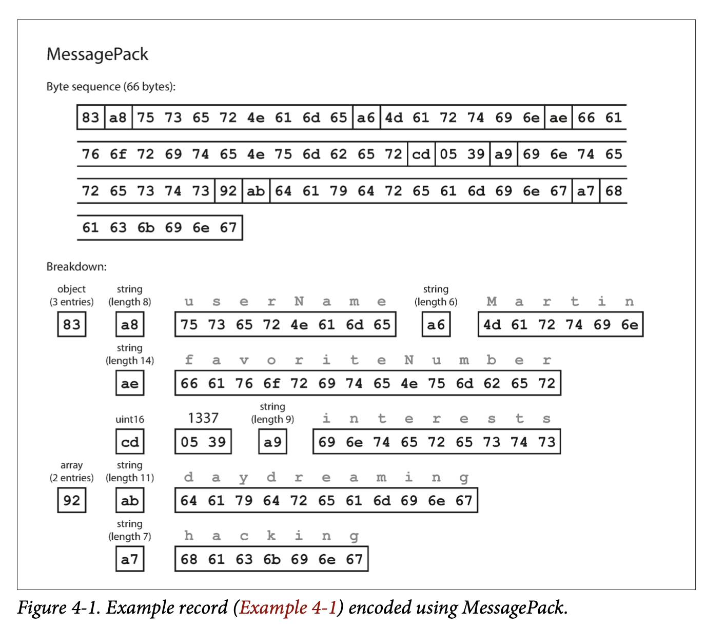
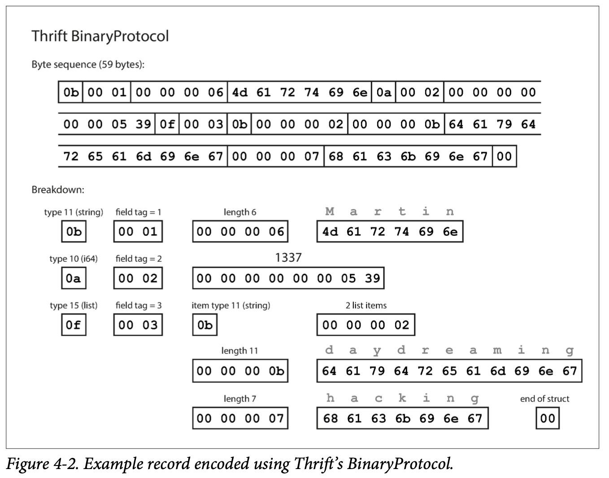
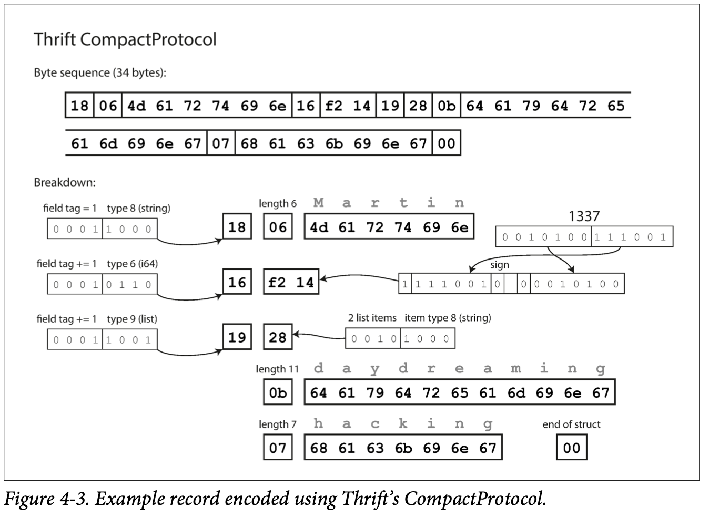
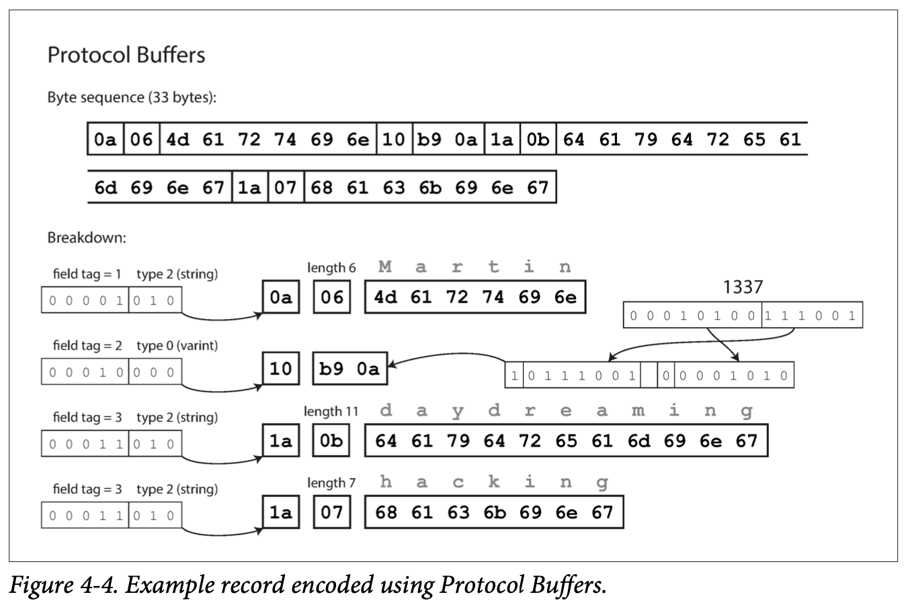
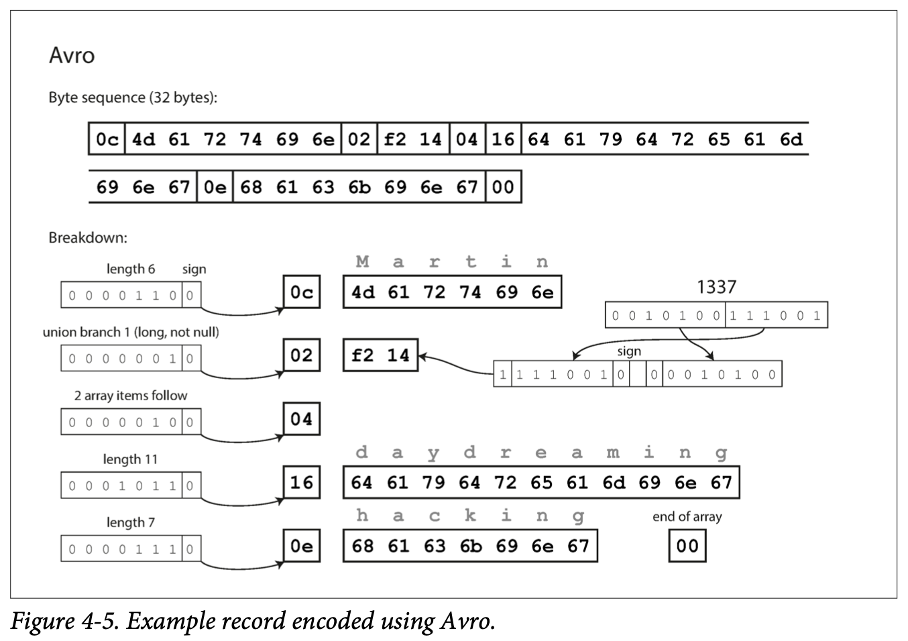
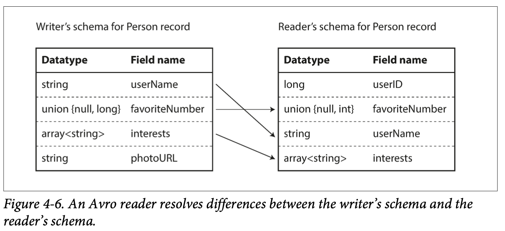
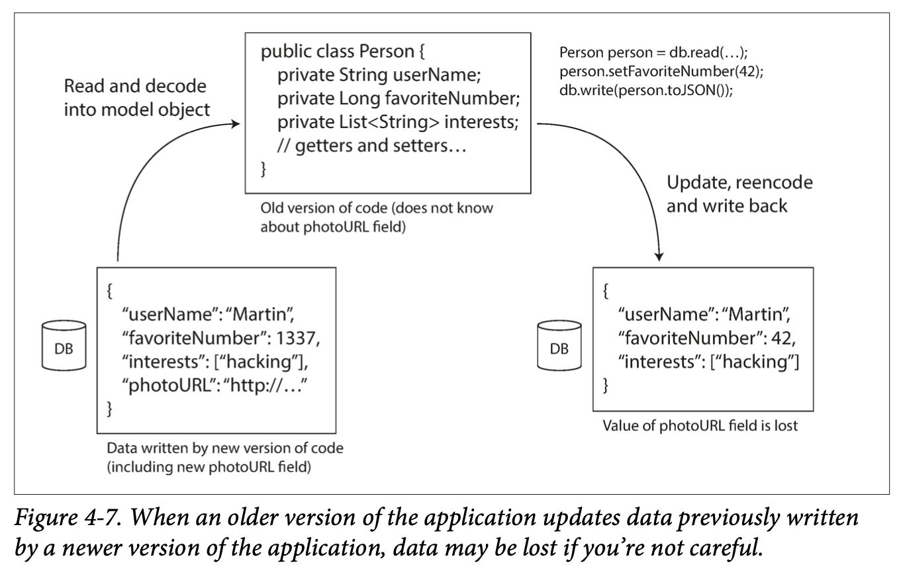

# Chapter 4 Encoding and Evolution

Applications inevitably change over time. In Chapter 1 we introduced the idea of evolvability: we should aim to build systems that make it easy to adapt to change (see “Evolvability: Making Change Easy” in chapter 1).

In most cases, a change to an application’s features also requires a change to data that it stores: perhaps a new field or record type needs to be captured, or perhaps existing data needs to be presented in a new way.

The data models we discussed in Chapter 2 have different ways of coping with such change. **Relational databases generally assume that all data in the database conforms to one schema**: although that schema can be changed (through schema migrations; i.e., ALTER statements), there is exactly one schema in force at any one point in time. By contrast, **schema-on-read (“schemaless”) databases don’t enforce a schema**, so the database can contain a mixture of older and newer data formats written at different times (see “Schema flexibility in the document model” in chapter 2).

When a data format or schema changes, a corresponding change to application code often needs to happen (for example, you add a new field to a record, and the application code starts reading and writing that field). However, in a large application, code changes often cannot happen instantaneously:

With server-side applications you may want to perform a rolling upgrade (also known as a staged rollout), deploying the new version to a few nodes at a time, checking whether the new version is running smoothly, and gradually working your way through all the nodes. This allows new versions to be deployed without service downtime, and thus encourages more frequent releases and better evolvability.

With client-side applications you’re at the mercy of the user, who may not install the update for some time. This means that old and new versions of the code, and old and new data formats, may potentially all coexist in the system at the same time. In order for the system to continue running smoothly, we need to maintain compatibility in both directions:

Backward compatibility: Newer code can read data that was written by older code.
Forward compatibility: Older code can read data that was written by newer code.

Backward compatibility is normally not hard to achieve: as author of the newer code, you know the format of data written by older code, and so you can explicitly handle it (if necessary by simply keeping the old code to read the old data). **Forward compatibility can be trickier**, because it requires older code to ignore additions made by a newer version of the code.

In this chapter we will look at several formats for encoding data, including JSON, XML, Protocol Buffers, Thrift, and Avro. In particular, we will look at how they handle schema changes and how they support systems where old and new data and code need to coexist. We will then discuss how those formats are used for data storage and for communication: in web services, Representational State Transfer (REST), and remote procedure calls (RPC), as well as message-passing systems such as actors and message queues.

## 4.1 Formats for Encoding Data

Programs usually work with data in (at least) two different representations:

1. In memory, data is kept in objects, structs, lists, arrays, hash tables, trees, and so on. These data structures are optimized for efficient access and manipulation by the CPU (typically using pointers).
1. When you want to write data to a file or send it over the network, you have to encode it as some kind of self-contained sequence of bytes (for example, a JSON document). Since a pointer wouldn’t make sense to any other process, this sequence-of-bytes representation looks quite different from the data structures that are normally used in memory, with the exception of some special cases, such as certain memory-mapped files or when operating directly on compressed data (as described in “Column Compression” in chapter 3).

Thus, we need some kind of translation between the two representations. The translation from the in-memory representation to a byte sequence is called encoding (also known as serialization or marshalling), and the reverse is called decoding (parsing, deserialization, unmarshalling).

### 4.1.1 Language-Specific Formats

Many programming languages come with built-in support for encoding in-memory objects into byte sequences. For example, Java has `java.io.Serializable`, Ruby has `Marshal`, Python has `pickle`, and so on. Many third-party libraries also exist, such as Kryo for Java.

These encoding libraries are very convenient, because they allow in-memory objects to be saved and restored with minimal additional code. However, they also have a number of deep problems:

1. The encoding is often tied to a particular programming language, and reading the data in another language is very difficult. If you store or transmit data in such an encoding, you are committing yourself to your current programming language for potentially a very long time, and precluding integrating your systems with those of other organizations (which may use different languages).
1. In order to restore data in the same object types, the decoding process needs to be able to **instantiate arbitrary classes**. This is frequently a source of security problems: if an attacker can get your application to decode an arbitrary byte sequence, they can instantiate arbitrary classes, which in turn often allows them to do terrible things such as remotely executing arbitrary code.
1. Versioning data is often an afterthought in these libraries: as they are intended for quick and easy encoding of data, they often neglect the inconvenient problems of forward and backward compatibility.
1. Efficiency (CPU time taken to encode or decode, and the size of the encoded structure) is also often an afterthought. For example, Java’s built-in serialization is notorious for its bad performance and bloated encoding.

For these reasons it’s **generally a bad idea to use your language’s built-in encoding** for anything other than very transient purposes.

### 4.1.2 JSON, XML, and Binary Variants

Moving to standardized encodings that can be written and read by many programming languages, JSON and XML are the obvious contenders. They are widely known, widely supported, and almost as widely disliked. XML is often criticized for being too verbose and unnecessarily complicated. JSON’s popularity is mainly due to its built-in support in web browsers (by virtue of being a subset of JavaScript) and simplicity relative to XML. CSV is another popular language-independent format, albeit less powerful.

**JSON, XML, and CSV are textual formats**, and thus somewhat human-readable (although the syntax is a popular topic of debate). Besides the superficial syntactic issues, they also have some subtle problems:

1. There is a lot of ambiguity around the encoding of numbers. In XML and CSV, you cannot distinguish between a number and a string that happens to consist of digits (except by referring to an external schema). JSON distinguishes strings and numbers, but it doesn’t distinguish **integers and floating-point numbers, and it doesn’t specify a precision**. This is a problem when dealing with large numbers; for example, integers greater than 253 cannot be exactly represented in an IEEE 754 double-precision floating-point number, so such numbers become inaccurate when parsed in a language that uses floating-point numbers (such as JavaScript). An example of numbers larger than 253 occurs on Twitter, which uses a 64-bit number to identify each tweet. The JSON returned by Twitter’s API includes tweet IDs twice, once as a JSON number and once as a decimal string, to work around the fact that the numbers are not correctly parsed by JavaScript applications.
1. JSON and XML have good support for Unicode character strings (i.e., human-readable text), but they **don’t support binary strings** (sequences of bytes without a character encoding). Binary strings are a useful feature, so people get around this limitation by encoding the binary data as text using **Base64**. The schema is then used to indicate that the value should be interpreted as Base64-encoded. This works, but it’s somewhat hacky and increases the data size by 33%.
1. There is optional schema support for both XML [11] and JSON [12]. These schema languages are quite powerful, and thus quite complicated to learn and implement. Use of XML schemas is fairly widespread, but many JSON-based tools don’t bother using schemas. Since the correct interpretation of data (such as numbers and binary strings) depends on information in the schema, applications that don’t use XML/JSON schemas need to potentially hardcode the appropriate encoding/decoding logic instead.
1. CSV does not have any schema, so it is up to the application to define the meaning of each row and column. If an application change adds a new row or column, you have to handle that change manually. CSV is also a quite vague format (what happens if a value contains a comma or a newline character?). Although its escaping rules have been formally specified, not all parsers implement them correctly.

Despite these flaws, JSON, XML, and CSV are good enough for many purposes. It’s likely that they will remain popular, especially as data interchange formats (i.e., for sending data from one organization to another). In these situations, as long as people agree on what the format is, it often doesn’t matter how pretty or efficient the format is. The difficulty of getting different organizations to agree on anything outweighs most other concerns.

#### 4.1.2.1 Binary encoding

For data that is used only internally within your organization, there is less pressure to use a lowest-common-denominator encoding format. For example, you could choose a format that is more compact or faster to parse. For a small dataset, the gains are negligible, but once you get into the terabytes, the choice of data format can have a big impact.

JSON is less verbose than XML, but both still use a lot of space compared to binary formats. This observation led to the development of a profusion of binary encodings for **JSON (MessagePack, BSON, BJSON, UBJSON, BISON, and Smile, to name a few)** and for XML (WBXML and Fast Infoset, for example). These formats have been adopted in various niches, but none of them are as widely adopted as the textual versions of JSON and XML.

Some of these formats extend the set of datatypes (e.g., distinguishing integers and floating-point numbers, or adding support for binary strings), but otherwise they keep the JSON/XML data model unchanged. In particular, since they don’t prescribe a schema, they need to include all the object field names within the encoded data. That is, in a binary encoding of the JSON document in Example 4-1, they will need to include the strings userName, favoriteNumber, and interests somewhere.

Example 4-1. Example record which we will encode in several binary formats in this chapter

```json
{
    "userName": "Martin",
    "favoriteNumber": 1337,
    "interests": ["daydreaming", "hacking"]
}
```

Let’s look at an example of MessagePack, a binary encoding for JSON. Figure 4-1 shows the byte sequence that you get if you encode the JSON document in Example 4-1 with MessagePack. The first few bytes are as follows:



1. The first byte, `0x83`, indicates that what follows is an object (top four bits = `0x80`) with three fields (bottom four bits = `0x03`). (In case you’re wondering what happens if an object has more than 15 fields, so that the number of fields doesn’t fit in four bits, it then gets a different type indicator, and the number of fields is encoded in two or four bytes.)
1. The second byte, `0xa8`, indicates that what follows is a string (top four bits = `0xa0`) that is eight bytes long (bottom four bits = `0x08`).
1. The next eight bytes are the field name `userName` in ASCII. Since the length was indicated previously, there’s no need for any marker to tell us where the string ends (or any escaping).
1. The next seven bytes encode the six-letter string value Martin with a prefix `0xa6`, and so on.

The binary encoding is 66 bytes long, which is only a little less than the 81 bytes taken by the textual JSON encoding (with whitespace removed). All the binary encodings of JSON are similar in this regard. It’s not clear whether such a small space reduction (and perhaps a speedup in parsing) is worth the loss of human-readability.

### 4.1.3 Thrift and Protocol Buffers

**Apache Thrift and Protocol Buffers (protobuf)** are binary encoding libraries that are based on the same principle. Protocol Buffers was originally developed at Google, Thrift was originally developed at Facebook, and both were made open source in 2007–08.

Both Thrift and Protocol Buffers require a schema for any data that is encoded. To encode the data in Example 4-1 in Thrift, you would describe the schema in the Thrift interface definition language (IDL) like this:

```
struct Person {
    1: required string          userName,
    2: optional i64             favoriteNumber,
    3: optional list<string>    interests
}
```

The equivalent schema definition for Protocol Buffers looks very similar:

```
message Person {
    required string user_name       = 1;
    optional int64  favorite_number = 2;
    repeated string interests       = 3;
}
```

Thrift and Protocol Buffers each come with a code generation tool that takes a schema definition like the ones shown here, and produces classes that implement the schema in various programming languages. Your application code can call this generated code to encode or decode records of the schema.

What does data encoded with this schema look like? Confusingly, Thrift has has three—BinaryProtocol, CompactProtocol, and DenseProtocol—although DenseProtocol is only supported by the C++ implementation, so it doesn’t count as cross-language. Besides those, it also has two different JSON-based encoding formats. What fun!. Let’s look at BinaryProtocol first. Encoding Example 4-1 in that format takes 59 bytes, as shown in Figure 4-2.



Similarly to Figure 4-1, each field has a type annotation (to indicate whether it is a string, integer, list, etc.) and, where required, a length indication (length of a string, number of items in a list). The strings that appear in the data (“Martin”, “daydreaming”, “hacking”) are also encoded as ASCII (or rather, UTF-8), similar to before.

The big difference compared to Figure 4-1 is that there are no field names (userName, favoriteNumber, interests). Instead, the encoded data contains **field tags**, which are numbers (1, 2, and 3). Those are the numbers that appear in the schema definition. Field tags are like aliases for fields—they are a compact way of saying what field we’re talking about, without having to spell out the field name.

The Thrift CompactProtocol encoding is semantically equivalent to BinaryProtocol, but as you can see in Figure 4-3, it packs the same information into only 34 bytes. It does this by packing the field type and tag number into a single byte, and by using variable-length integers. Rather than using a full eight bytes for the number 1337, it is encoded in two bytes, with the top bit of each byte used to indicate whether there are still more bytes to come. This means numbers between –64 and 63 are encoded in one byte, numbers between –8192 and 8191 are encoded in two bytes, etc. Bigger numbers use more bytes.



Finally, Protocol Buffers (which has only one binary encoding format) encodes the same data as shown in Figure 4-4. It does the bit packing slightly differently, but is otherwise very similar to Thrift’s CompactProtocol. Protocol Buffers fits the same record in 33 bytes.



One detail to note: in the schemas shown earlier, each field was marked either required or optional, but this makes no difference to how the field is encoded (nothing in the binary data indicates whether a field was required). The difference is simply that required enables a runtime check that fails if the field is not set, which can be useful for catching bugs.

#### 4.1.3.1 Field tags and schema evolution

We said previously that schemas inevitably need to change over time. We call this schema evolution. How do Thrift and Protocol Buffers handle schema changes while keeping backward and forward compatibility?

As you can see from the examples, an encoded record is just the concatenation of its encoded fields. Each field is identified by its tag number (the numbers 1, 2, 3 in the sample schemas) and annotated with a datatype (e.g., string or integer). If a field value is not set, it is simply omitted from the encoded record. From this you can see that field tags are critical to the meaning of the encoded data. You can change the name of a field in the schema, since the encoded data never refers to field names, but you cannot change a field’s tag, since that would make all existing encoded data invalid.

You can add new fields to the schema, provided that you give each field a new tag number. If old code (which doesn’t know about the new tag numbers you added) tries to read data written by new code, including a new field with a tag number it doesn’t recognize, it can simply ignore that field. The datatype annotation allows the parser to determine how many bytes it needs to skip. This maintains forward compatibility: old code can read records that were written by new code.

What about backward compatibility? As long as each field has a unique tag number, new code can always read old data, because the tag numbers still have the same meaning. The only detail is that if you add a new field, you **cannot make it required**. If you were to add a field and make it required, that check would fail if new code read data written by old code, because the old code will not have written the new field that you added. Therefore, to maintain backward compatibility, every field you add after the initial deployment of the schema must be optional or have a default value.

Removing a field is just like adding a field, with backward and forward compatibility concerns reversed. That means you can only remove a field that is optional (a required field can never be removed), and you can never use the same tag number again (because you may still have data written somewhere that includes the old tag number, and that field must be ignored by new code).

#### 4.1.3.2 Datatypes and schema evolution

What about changing the datatype of a field? That may be possible—check the documentation for details—but there is a risk that values will lose precision or get truncated. For example, say you change a 32-bit integer into a 64-bit integer. New code can easily read data written by old code, because the parser can fill in any missing bits with zeros. However, if old code reads data written by new code, the old code is still using a 32-bit variable to hold the value. If the decoded 64-bit value won’t fit in 32 bits, it will be truncated.

A curious detail of Protocol Buffers is that it does not have a list or array datatype, but instead has a repeated marker for fields (which is a third option alongside required and optional). As you can see in Figure 4-4, the encoding of a repeated field is just what it says on the tin: the same field tag simply appears multiple times in the record. This has the nice effect that it’s okay to change an optional (single-valued) field into a repeated (multi-valued) field. New code reading old data sees a list with zero or one elements (depending on whether the field was present); old code reading new data sees only the last element of the list.

Thrift has a dedicated list datatype, which is parameterized with the datatype of the list elements. This does not allow the same evolution from single-valued to multi-valued as Protocol Buffers does, but it has the advantage of supporting **nested lists**.

### 4.1.4 Avro

Apache Avro is another binary encoding format that is interestingly different from Protocol Buffers and Thrift. It was started in 2009 as a subproject of Hadoop, as a result of Thrift not being a good fit for Hadoop’s use cases.

Avro also uses a schema to specify the structure of the data being encoded. It has two schema languages: one (Avro IDL) intended for human editing, and one (based on JSON) that is more easily machine-readable.

Our example schema, written in Avro IDL, might look like this:

```
record Person {
    string               userName;
    union { null, long } favoriteNumber = null;
    array<string>        interests;
}
```

The equivalent JSON representation of that schema is as follows:

```
{
    "type": "record",
    "name": "Person",
    "fields": [
        {"name": "userName", "type": "string"},
        {"name": "favoriteNumber", "type": ["null", "long"], "default": null},
        {"name": "interests", "type": {"type": "array", "items": "string"}}
    ]
}
```

First of all, notice that there are no tag numbers in the schema. If we encode our example record (Example 4-1) using this schema, the Avro binary encoding is just 32 bytes long—the most compact of all the encodings we have seen. The breakdown of the encoded byte sequence is shown in Figure 4-5.



If you examine the byte sequence, you can see that there is nothing to identify fields or their datatypes. The encoding simply consists of values concatenated together. A string is just a length prefix followed by UTF-8 bytes, but there’s nothing in the encoded data that tells you that it is a string. It could just as well be an integer, or something else entirely. An integer is encoded using a variable-length encoding (the same as Thrift’s CompactProtocol).

To parse the binary data, you go through the fields in the order that they appear in the schema and use the schema to tell you the datatype of each field. This means that the binary data can only be decoded correctly if the code reading the data is using the exact same schema as the code that wrote the data. Any mismatch in the schema between the reader and the writer would mean incorrectly decoded data.

So, how does Avro support schema evolution?

#### 4.1.4.1 The writer’s schema and the reader’s schema

With Avro, when an application wants to encode some data (to write it to a file or database, to send it over the network, etc.), it encodes the data using whatever version of the schema it knows about—for example, that schema may be compiled into the application. This is known as the writer’s schema.

When an application wants to decode some data (read it from a file or database, receive it from the network, etc.), it is expecting the data to be in some schema, which is known as the reader’s schema. That is the schema the application code is relying on-code may have been generated from that schema during the application’s build process.

The key idea with Avro is that the writer’s schema and the reader’s schema **don’t have to be the same**—they only need to be compatible. When data is decoded (read), the Avro library resolves the differences by looking at the writer’s schema and the reader’s schema side by side and translating the data from the writer’s schema into the reader’s schema. The Avro specification defines exactly how this resolution works, and it is illustrated in Figure 4-6.



For example, it’s no problem if the writer’s schema and the reader’s schema have their fields in a different order, because the schema resolution matches up the fields by field name. If the code reading the data encounters a field that appears in the writer’s schema but not in the reader’s schema, it is ignored. If the code reading the data expects some field, but the writer’s schema does not contain a field of that name, it is filled in with a default value declared in the reader’s schema.

#### 4.1.4.2 Schema evolution rules

With Avro, forward compatibility means that you can have a new version of the schema as writer and an old version of the schema as reader. Conversely, backward compatibility means that you can have a new version of the schema as reader and an old version as writer.

To maintain compatibility, you may only **add or remove a field that has a default value**. (The field favoriteNumber in our Avro schema has a default value of null.) For example, say you add a field with a default value, so this new field exists in the new schema but not the old one. When a reader using the new schema reads a record written with the old schema, the default value is filled in for the missing field.

If you were to add a field that has no default value, new readers wouldn’t be able to read data written by old writers, so you would break backward compatibility. If you were to remove a field that has no default value, old readers wouldn’t be able to read data written by new writers, so you would break forward compatibility.

In some programming languages, null is an acceptable default for any variable, but this is not the case in Avro: if you want to allow a field to be null, you have to use a union type. For example, union { null, long, string } field; indicates that field can be a number, or a string, or null. You can only use null as a default value if it is one of the branches of the union. (To be precise, the default value must be of the type of the first branch of the union, although this is a specific limitation of Avro, not a general feature of union types.) This is a little more verbose than having everything nullable by default, but it helps prevent bugs by being explicit about what can and cannot be null.

Consequently, Avro doesn’t have optional and required markers in the same way as Protocol Buffers and Thrift do (it has union types and default values instead).

Changing the datatype of a field is possible, provided that Avro can convert the type. Changing the name of a field is possible but a little tricky: the reader’s schema can contain aliases for field names, so it can match an old writer’s schema field names against the aliases. This means that changing a field name is backward compatible but not forward compatible. Similarly, adding a branch to a union type is backward compatible but not forward compatible.

#### 4.1.4.3 But what is the writer’s schema?

There is an important question that we’ve glossed over so far: how does the reader know the writer’s schema with which a particular piece of data was encoded? We can’t just include the entire schema with every record, because the schema would likely be much bigger than the encoded data, making all the space savings from the binary encoding futile.

The answer depends on the context in which Avro is being used. To give a few examples:

1. Large file with lots of records

A common use for Avro—especially in the context of Hadoop—is for storing a large file containing millions of records, all encoded with the same schema. (We will discuss this kind of situation in Chapter 10.) In this case, the writer of that file can just include the writer’s schema once at the beginning of the file. Avro specifies a file format **(object container files)** to do this.

2. Database with individually written records

In a database, different records may be written at different points in time using different writer’s schemas—you cannot assume that all the records will have the same schema. The simplest solution is to include a version number at the beginning of every encoded record, and to keep a list of schema versions in your database. A reader can fetch a record, extract the version number, and then fetch the writer’s schema for that version number from the database. Using that writer’s schema, it can decode the rest of the record. (Espresso works this way, for example.)

3. Sending records over a network connection

When two processes are communicating over a bidirectional network connection, they can negotiate the schema version on connection setup and then use that schema for the lifetime of the connection. The Avro RPC protocol (see “Dataflow Through Services: REST and RPC” on page 131) works like this.

A database of schema versions is a useful thing to have in any case, since it acts as documentation and gives you a chance to check schema compatibility. As the version number, you could use a simple incrementing integer, or you could use a hash of the schema.

#### 4.1.4.4 Dynamically generated schemas

One advantage of Avro’s approach, compared to Protocol Buffers and Thrift, is that the schema doesn’t contain any tag numbers. But why is this important? What’s the problem with keeping a couple of numbers in the schema?

The difference is that Avro is friendlier to dynamically generated schemas. For example, say you have a relational database whose contents you want to dump to a file, and you want to use a binary format to avoid the aforementioned problems with textual formats (JSON, CSV, SQL). If you use Avro, you can fairly easily generate an Avro schema (in the JSON representation we saw earlier) from the relational schema and encode the database contents using that schema, dumping it all to an Avro object container file. You generate a record schema for each database table, and each column becomes a field in that record. The column name in the database maps to the field name in Avro.

Now, if the database schema changes (for example, a table has one column added and one column removed), you can just generate a new Avro schema from the updated database schema and export data in the new Avro schema. The data export process does not need to pay any attention to the schema change—it can simply do the schema conversion every time it runs. Anyone who reads the new data files will see that the fields of the record have changed, but since the fields are identified by name, the updated writer’s schema can still be matched up with the old reader’s schema.

By contrast, if you were using Thrift or Protocol Buffers for this purpose, the field tags would likely have to be assigned by hand: every time the database schema changes, an administrator would have to manually update the mapping from database column names to field tags. (It might be possible to automate this, but the schema generator would have to be very careful to not assign previously used field tags.) This kind of dynamically generated schema simply wasn’t a design goal of Thrift or Protocol Buffers, whereas it was for Avro.

#### 4.1.4.5 Code generation and dynamically typed languages

Thrift and Protocol Buffers rely on code generation: after a schema has been defined, you can generate code that implements this schema in a programming language of your choice. This is useful in statically typed languages such as Java, C++, or C#, because it allows efficient in-memory structures to be used for decoded data, and it allows type checking and autocompletion in IDEs when writing programs that access the data structures.

In dynamically typed programming languages such as JavaScript, Ruby, or Python, there is not much point in generating code, since there is no compile-time type checker to satisfy. Code generation is often frowned upon in these languages, since they otherwise avoid an explicit compilation step. Moreover, in the case of a dynamically generated schema (such as an Avro schema generated from a database table), code generation is an unnecessarily obstacle to getting to the data.

Avro provides optional code generation for statically typed programming languages, but it can be used just as well without any code generation. If you have an object container file (which embeds the writer’s schema), you can simply open it using the Avro library and look at the data in the same way as you could look at a JSON file. The file is self-describing since it includes all the necessary metadata.

This property is especially useful in conjunction with dynamically typed data processing languages like Apache Pig]. In Pig, you can just open some Avro files, start analyzing them, and write derived datasets to output files in Avro format without even thinking about schemas.

### 4.1.5 The Merits of Schemas

As we saw, Protocol Buffers, Thrift, and Avro all use a schema to describe a binary encoding format. Their schema languages are much simpler than XML Schema or JSON Schema, which support much more detailed validation rules (e.g., “the string value of this field must match this regular expression” or “the integer value of this field must be between 0 and 100”). As Protocol Buffers, Thrift, and Avro are simpler to implement and simpler to use, they have grown to support a fairly wide range of programming languages.
The ideas on which these encodings are based are by no means new. For example, they have a lot in common with **ASN.1**, a schema definition language that was first standardized in 1984. It was used to define various network protocols, and its binary encoding (DER) is still used to encode SSL certificates (X.509), for example. ASN.1 supports schema evolution using tag numbers, similar to Protocol Buffers and Thrift. However, it’s also very complex and badly documented, so ASN.1 is probably not a good choice for new applications.

Many data systems also implement some kind of proprietary binary encoding for their data. For example, most relational databases have a network protocol over which you can send queries to the database and get back responses. Those protocols are generally specific to a particular database, and the database vendor provides a driver (e.g., using the ODBC or JDBC APIs) that decodes responses from the database’s network protocol into in-memory data structures.

So, we can see that although textual data formats such as JSON, XML, and CSV are widespread, binary encodings based on schemas are also a viable option. They have a number of nice properties:

1. They can be much more compact than the various “binary JSON” variants, since they can omit field names from the encoded data.
1. The schema is a valuable form of documentation, and because the schema is required for decoding, you can be sure that it is up to date (whereas manually maintained documentation may easily diverge from reality).
1. Keeping a database of schemas allows you to check forward and backward compatibility of schema changes, before anything is deployed.
1. For users of statically typed programming languages, the ability to generate code from the schema is useful, since it enables type checking at compile time.

In summary, schema evolution allows the same kind of flexibility as schemaless/schema-on-read JSON databases provide (see “Schema flexibility in the document model” in chapter 2), while also providing better guarantees about your data and better tooling.

## 4.2 Modes of Dataflow

At the beginning of this chapter we said that whenever you want to send some data to another process with which you don’t share memory—for example, whenever you want to send data over the network or write it to a file—you need to encode it as a sequence of bytes. We then discussed a variety of different encodings for doing this.

We talked about forward and backward compatibility, which are important for evolvability (making change easy by allowing you to upgrade different parts of your system independently, and not having to change everything at once). Compatibility is a relationship between one process that encodes the data, and another process that decodes it.

We will explore some of the most common ways how data flows between processes:

1. Via databases (see “Dataflow Through Databases”)
1. Via service calls (see “Dataflow Through Services: REST and RPC”)
1. Via asynchronous message passing (see “Message-Passing Dataflow”)

### 4.2.1 Dataflow Through Databases

In a database, the process that writes to the database encodes the data, and the process that reads from the database decodes it. There may just be a single process accessing the database, in which case the reader is simply a later version of the same process—in that case you can think of storing something in the database as sending a message to your future self.

Backward compatibility is clearly necessary here; otherwise your future self won’t be able to decode what you previously wrote.
In general, it’s common for several different processes to be accessing a database at the same time. Those processes might be several different applications or services, or they may simply be several instances of the same service (running in parallel for scalability or fault tolerance). Either way, in an environment where the application is changing, it is likely that some processes accessing the database will be running newer code and some will be running older code—for example because a new version is currently being deployed in a rolling upgrade, so some instances have been updated while others haven’t yet.

This means that a value in the database may be written by a newer version of the code, and subsequently read by an older version of the code that is still running. Thus, forward compatibility is also often required for databases.

However, there is an additional snag. Say you add a field to a record schema, and the newer code writes a value for that new field to the database. Subsequently, an older version of the code (which doesn’t yet know about the new field) reads the record, updates it, and writes it back. In this situation, the desirable behavior is usually for the old code to keep the new field intact, even though it couldn’t be interpreted.

The encoding formats discussed previously support such preservation of unknown fields, but sometimes you need to take care at an application level, as illustrated in Figure 4-7. For example, if you decode a database value into model objects in the application, and later reencode those model objects, the unknown field might be lost in that translation process. Solving this is not a hard problem; you just need to be aware of it.



#### 4.2.1.1 Different values written at different times

A database generally allows any value to be updated at any time. This means that within a single database you may have some values that were written five milliseconds ago, and some values that were written five years ago.

When you deploy a new version of your application (of a server-side application, at least), you may entirely replace the old version with the new version within a few minutes. The same is not true of database contents: the five-year-old data will still be there, in the original encoding, unless you have explicitly rewritten it since then. This observation is sometimes summed up as **data outlives code**.

Rewriting (migrating) data into a new schema is certainly possible, but it’s an expensive thing to do on a large dataset, so most databases avoid it if possible. Most relational databases allow simple schema changes, such as adding a new column with a null default value, without rewriting existing data.(Except for MySQL, which often rewrites an entire table even though it is not strictly necessary, as men‐ tioned in “Schema flexibility in the document model” in chapter 2). When an old row is read, the database fills in nulls for any columns that are missing from the encoded data on disk. **LinkedIn’s document database Espresso uses Avro for storage**, allowing it to use Avro’s schema evolution rules.

Schema evolution thus allows the entire database to appear as if it was encoded with a single schema, even though the underlying storage may contain records encoded with various historical versions of the schema.

#### 4.2.1.2 Archival storage

Perhaps you take a snapshot of your database from time to time, say for backup purposes or for loading into a data warehouse (see “Data Warehousing” in chapter 3). In this case, the data dump will typically be encoded using the latest schema, even if the original encoding in the source database contained a mixture of schema versions from different eras. Since you’re copying the data anyway, you might as well encode the copy of the data consistently.

As the data dump is written in one go and is thereafter immutable, formats like Avro object container files are a good fit. This is also a good opportunity to encode the data in an analytics-friendly column-oriented format such as Parquet (see “Column Compression” in chapter 3).

In Chapter 10 we will talk more about using data in archival storage.

### 4.2.2 Dataflow Through Services: REST and RPC

When you have processes that need to communicate over a network, there are a few different ways of arranging that communication. The most common arrangement is to have two roles: **clients and servers**. The servers expose an API over the network, and the clients can connect to the servers to make requests to that API. The API exposed by the server is known as a service.

The web works this way: clients (web browsers) make requests to web servers, making GET requests to download HTML, CSS, JavaScript, images, etc., and making POST requests to submit data to the server. The API consists of a standardized set of protocols and data formats (HTTP, URLs, SSL/TLS, HTML, etc.). Because web browsers, web servers, and website authors mostly agree on these standards, you can use any web browser to access any website (at least in theory!).

Web browsers are not the only type of client. For example, a native app running on a mobile device or a desktop computer can also make network requests to a server, and a client-side JavaScript application running inside a web browser can use XMLHttpRequest to become an HTTP client (this technique is known as Ajax). In this case, the server’s response is typically not HTML for displaying to a human, but rather data in an encoding that is convenient for further processing by the client-side application code (such as JSON). Although HTTP may be used as the transport protocol, the API implemented on top is application-specific, and the client and server need to agree on the details of that API.

Moreover, a server can itself be a client to another service (for example, a typical web app server acts as client to a database). This approach is often used to decompose a large application into smaller services by area of functionality, such that one service makes a request to another when it requires some functionality or data from that other service. This way of building applications has traditionally been called a service-oriented architecture (SOA), more recently refined and rebranded as microservices architecture.

In some ways, services are similar to databases: they typically allow clients to submit and query data. However, while databases allow arbitrary queries using the query languages we discussed in Chapter 2, services expose an application-specific API that only allows inputs and outputs that are predetermined by the business logic (application code) of the service. This restriction provides a degree of encapsulation: services can impose fine-grained restrictions on what clients can and cannot do.

A key design goal of a service-oriented/microservices architecture is to make the application easier to change and maintain by making services independently deployable and evolvable. For example, each service should be owned by one team, and that team should be able to release new versions of the service frequently, without having to coordinate with other teams. In other words, we should expect old and new versions of servers and clients to be running at the same time, and so the data encoding used by servers and clients must be compatible across versions of the service API—precisely what we’ve been talking about in this chapter.

#### 4.2.2.1 Web services

When HTTP is used as the underlying protocol for talking to the service, it is called a web service. This is perhaps a slight misnomer, because web services are not only used on the web, but in several different contexts. For example:

1. A client application running on a user’s device (e.g., a native app on a mobile device, or JavaScript web app using Ajax) making requests to a service over HTTP. These requests typically go over the public internet.
1. One service making requests to another service owned by the same organization, often located within the same datacenter, as part of a service-oriented/microservices architecture. (Software that supports this kind of use case is sometimes called middleware.)
1. One service making requests to a service owned by a different organization, usually via the internet. This is used for data exchange between different organizations’ backend systems. This category includes public APIs provided by online services, such as credit card processing systems, or OAuth for shared access to user data.

There are two popular approaches to web services: **REST and SOAP**. They are almost diametrically opposed in terms of philosophy, and often the subject of heated debate among their respective proponents. (Even within each camp there are plenty of arguments. For example, HATEOAS (hypermedia as the engine of application state), often provokes discussions).

REST is not a protocol, but rather a design philosophy that builds upon the principles of HTTP. It emphasizes simple data formats, using URLs for identifying resources and using HTTP features for cache control, authentication, and content type negotiation. REST has been gaining popularity compared to SOAP, at least in the context of cross-organizational service integration, and is often associated with microservices. An API designed according to the principles of REST is called RESTful.

By contrast, SOAP is an XML-based protocol for making network API requests. (Despite the similarity of acronyms, SOAP is not a requirement for SOA. SOAP is a particular technology, whereas SOA is a general approach to building systems.) Although it is most commonly used over HTTP, it aims to be independent from HTTP and **avoids using most HTTP features**. Instead, it comes with a sprawling and complex multitude of related standards (the web service framework, known as WS-*) that add various features.

The API of a SOAP web service is described using an XML-based language called the Web Services Description Language, or WSDL. WSDL enables code generation so that a client can access a remote service using local classes and method calls (which are encoded to XML messages and decoded again by the framework). This is useful in statically typed programming languages, but less so in dynamically typed ones (see “Code generation and dynamically typed languages”).

As WSDL is not designed to be human-readable, and as SOAP messages are often too complex to construct manually, users of SOAP rely heavily on tool support, code generation, and IDEs. For users of programming languages that are not supported by SOAP vendors, integration with SOAP services is difficult.

Even though SOAP and its various extensions are ostensibly standardized, interoperability between different vendors’ implementations often causes problems. For all of these reasons, although SOAP is still used in many large enterprises, it has fallen out of favor in most smaller companies.

RESTful APIs tend to favor simpler approaches, typically involving less code generation and automated tooling. A definition format such as **OpenAPI, also known as Swagger**, can be used to describe RESTful APIs and produce documentation.

#### 4.2.2.2 The problems with remote procedure calls (RPCs)

Web services are merely the latest incarnation of a long line of technologies for making API requests over a network, many of which received a lot of hype but have serious problems. Enterprise JavaBeans (EJB) and Java’s Remote Method Invocation (RMI) are limited to Java. The Distributed Component Object Model (DCOM) is limited to Microsoft platforms. The Common Object Request Broker Architecture (CORBA) is excessively complex, and does not provide backward or forward compatibility.

**All of these are based on the idea of a remote procedure call (RPC)**, which has been around since the 1970s. The RPC model tries to make a request to a remote network service look the same as calling a function or method in your programming language, within the same process (this abstraction is called location transparency). Although RPC seems convenient at first, the approach is fundamentally flawed. A network request is very different from a local function call:

1. A local function call is predictable and either succeeds or fails, depending only on parameters that are under your control. A network request is unpredictable: the request or response may be lost due to a network problem, or the remote machine may be slow or unavailable, and such problems are entirely outside of your control. Network problems are common, so you have to anticipate them, for example by retrying a failed request.
1. A local function call either returns a result, or throws an exception, or never returns (because it goes into an infinite loop or the process crashes). A network request has another possible outcome: **it may return without a result, due to a timeout**. In that case, you simply don’t know what happened: if you don’t get a response from the remote service, you have no way of knowing whether the request got through or not. (We discuss this issue in more detail in Chapter 8.)
1. If you retry a failed network request, it could happen that the requests are actually getting through, and only the responses are getting lost. In that case, retrying will cause the action to be performed multiple times, unless you build a mechanism for deduplication (idempotence) into the protocol. Local function calls don’t have this problem. (We discuss idempotence in more detail in Chapter 11.)
1. Every time you call a local function, it normally takes about the same time to execute. A network request is much slower than a function call, and its latency is also wildly variable: at good times it may complete in less than a millisecond, but when the network is congested or the remote service is overloaded it may take many seconds to do exactly the same thing.
1. When you call a local function, you can efficiently pass it references (pointers) to objects in local memory. When you make a network request, all those parameters need to be encoded into a sequence of bytes that can be sent over the network. That’s okay if the parameters are primitives like numbers or strings, but quickly becomes problematic with larger objects.
1. The client and the service may be implemented in different programming languages, so the RPC framework must translate datatypes from one language into another. This can end up ugly, since not all languages have the same types—recall JavaScript’s problems with numbers greater than 253, for example (see “JSON, XML, and Binary Variants”). This problem doesn’t exist in a single process written in a single language.

All of these factors mean that there’s no point trying to make a remote service look too much like a local object in your programming language, because it’s a fundamentally different thing. Part of the appeal of REST is that it doesn’t try to hide the fact that it’s a network protocol (although this doesn’t seem to stop people from building RPC libraries on top of REST).

#### 4.2.2.3 Current directions for RPC

Despite all these problems, RPC isn’t going away. Various RPC frameworks have been built on top of all the encodings mentioned in this chapter: for example, Thrift and Avro come with RPC support included, gRPC is an RPC implementation using Protocol Buffers, Finagle also uses Thrift, and Rest.li uses JSON over HTTP.

This new generation of RPC frameworks is more explicit about the fact that a remote request is different from a local function call. For example, Finagle and Rest.li use futures (promises) to encapsulate asynchronous actions that may fail. Futures also simplify situations where you need to make requests to multiple services in parallel, and combine their results. gRPC supports **streams**, where a call consists of not just one request and one response, but a series of requests and responses over time.

Some of these frameworks also provide service discovery—that is, allowing a client to find out at which IP address and port number it can find a particular service.

Custom RPC protocols with a binary encoding format **can achieve better performance than something generic like JSON over REST**. However, a RESTful API has other significant advantages: it is good for experimentation and debugging (you can simply make requests to it using a web browser or the command-line tool curl, without any code generation or software installation), it is supported by all mainstream programming languages and platforms, and there is a vast ecosystem of tools available (servers, caches, load balancers, proxies, firewalls, monitoring, debugging tools, testing tools, etc.).

For these reasons, REST seems to be the predominant style for public APIs. The main focus of RPC frameworks is on requests between services owned by the same organization, typically within the same datacenter.

#### 4.2.2.4 Data encoding and evolution for RPC

For evolvability, it is important that RPC clients and servers can be changed and deployed independently. Compared to data flowing through databases (as described in the last section), we can make a simplifying assumption in the case of dataflow through services: it is reasonable to assume that all the servers will be updated first, and all the clients second. Thus, **you only need backward compatibility on requests, and forward compatibility on responses**.

The backward and forward compatibility properties of an RPC scheme are inherited from whatever encoding it uses:
1. Thrift, gRPC (Protocol Buffers), and Avro RPC can be evolved according to the compatibility rules of the respective encoding format.
1. In SOAP, requests and responses are specified with XML schemas. These can be evolved, but there are some subtle pitfalls.
1. RESTful APIs most commonly use JSON (without a formally specified schema) for responses, and JSON or URI-encoded/form-encoded request parameters for requests. Adding optional request parameters and adding new fields to response objects are usually considered changes that maintain compatibility.

Service compatibility is made harder by the fact that RPC is often used for communication across organizational boundaries, so the provider of a service often has no control over its clients and cannot force them to upgrade. Thus, compatibility needs to be maintained for a long time, perhaps indefinitely. If a compatibility-breaking change is required, the service provider often ends up maintaining multiple versions of the service API side by side.

There is no agreement on **how API versioning should work** (i.e., how a client can indicate which version of the API it wants to use). For RESTful APIs, common approaches are to use a version number in the URL or in the HTTP Accept header. For services that use API keys to identify a particular client, another option is to store a client’s requested API version on the server and to allow this version selection to be updated through a separate administrative interface.

### 4.2.3 Message-Passing Dataflow

In this final section, we will briefly look at asynchronous message-passing systems, which are somewhere between RPC and databases. They are similar to RPC in that a client’s request (usually called a message) is delivered to another process with low latency. They are similar to databases in that the message is not sent via a direct network connection, but goes via an intermediary called a message broker (also called a message queue or message-oriented middleware), which stores the message temporarily.

Using a message broker has several advantages compared to direct RPC:

1. It can act as a buffer if the recipient is unavailable or overloaded, and thus improve system **reliability**.
1. It can automatically **redeliver** messages to a process that has crashed, and thus prevent messages from being lost.
1. It avoids the sender needing to **know** the IP address and port number of the recipient (which is particularly useful in a cloud deployment where virtual machines often come and go).
1. **Fanout**. It allows one message to be sent to several recipients.
1. It logically **decouples** the sender from the recipient (the sender just publishes messages and doesn’t care who consumes them).

However, a difference compared to RPC is that message-passing communication is usually one-way: a sender normally doesn’t expect to receive a reply to its messages. It is possible for a process to send a response, but this would usually be done on a separate channel. This communication pattern is asynchronous: the sender doesn’t wait for the message to be delivered, but simply sends it and then forgets about it.

#### 4.2.3.1 Message brokers

In the past, the landscape of message brokers was dominated by commercial enterprise software from companies such as TIBCO, IBM WebSphere, and webMethods. More recently, open source implementations such as **RabbitMQ, ActiveMQ, HornetQ, NATS, and Apache Kafka** have become popular. We will compare them in more detail in Chapter 11.

The detailed delivery semantics vary by implementation and configuration, but in general, message brokers are used as follows: one process sends a message to a named queue or topic, and the broker ensures that the message is delivered to one or more consumers of or subscribers to that queue or topic. There can be many producers and many consumers on the same topic.

A topic provides only one-way dataflow. However, a consumer may itself publish messages to another topic (so you can chain them together, as we shall see in Chapter 11), or to a reply queue that is consumed by the sender of the original message (allowing a request/response dataflow, similar to RPC).

Message brokers typically don’t enforce any particular data model—a message is just a sequence of bytes with some metadata, so you can use any encoding format. If the encoding is backward and forward compatible, you have the greatest flexibility to change publishers and consumers independently and deploy them in any order.

If a consumer republishes messages to another topic, you may need to be careful to preserve unknown fields, to prevent the issue described previously in the context of databases (Figure 4-7).

#### 4.2.3.2 Distributed actor frameworks

The actor model is a programming model for concurrency in a single process. Rather than dealing directly with threads (and the associated problems of race conditions, locking, and deadlock), logic is encapsulated in actors. Each actor typically represents one client or entity, it may have some local state (which is not shared with any other actor), and **it communicates with other actors by sending and receiving asynchronous messages**. Message delivery is not guaranteed: in certain error scenarios, messages will be lost. Since each actor processes only one message at a time, it doesn’t need to worry about threads, and each actor can be scheduled independently by the framework.

In distributed actor frameworks, this programming model is used to scale an application across multiple nodes. The same message-passing mechanism is used, no matter whether the sender and recipient are on the same node or different nodes. If they are on different nodes, the message is transparently encoded into a byte sequence, sent over the network, and decoded on the other side.

**Location transparency works better in the actor model than in RPC**, because the actor model already assumes that messages may be lost, even within a single process. Although latency over the network is likely higher than within the same process, there is less of a fundamental mismatch between local and remote communication when using the actor model.

A distributed actor framework essentially integrates a message broker and the actor programming model into a single framework. However, if you want to perform rolling upgrades of your actor-based application, you still have to worry about forward and backward compatibility, as messages may be sent from a node running the new version to a node running the old version, and vice versa.

Three popular distributed actor frameworks handle message encoding as follows:

1. **Akka** uses Java’s built-in serialization by default, which does not provide forward or backward compatibility. However, you can replace it with something like Protocol Buffers, and thus gain the ability to do rolling upgrades.
1. **Orleans** by default uses a custom data encoding format that does not support rolling upgrade deployments; to deploy a new version of your application, you need to set up a new cluster, move traffic from the old cluster to the new one, and shut down the old one. Like with Akka, custom serialization plug-ins can be used.
1. In **Erlang OTP** it is surprisingly hard to make changes to record schemas (despite the system having many features designed for high availability); rolling upgrades are possible but need to be planned carefully. An experimental new maps datatype (a JSON-like structure, introduced in Erlang R17 in 2014) may make this easier in the future.

## 4.3 Summary

In this chapter we looked at several ways of turning data structures into bytes on the network or bytes on disk. We saw how the details of these encodings affect not only their efficiency, but more importantly also the architecture of applications and your options for deploying them.
