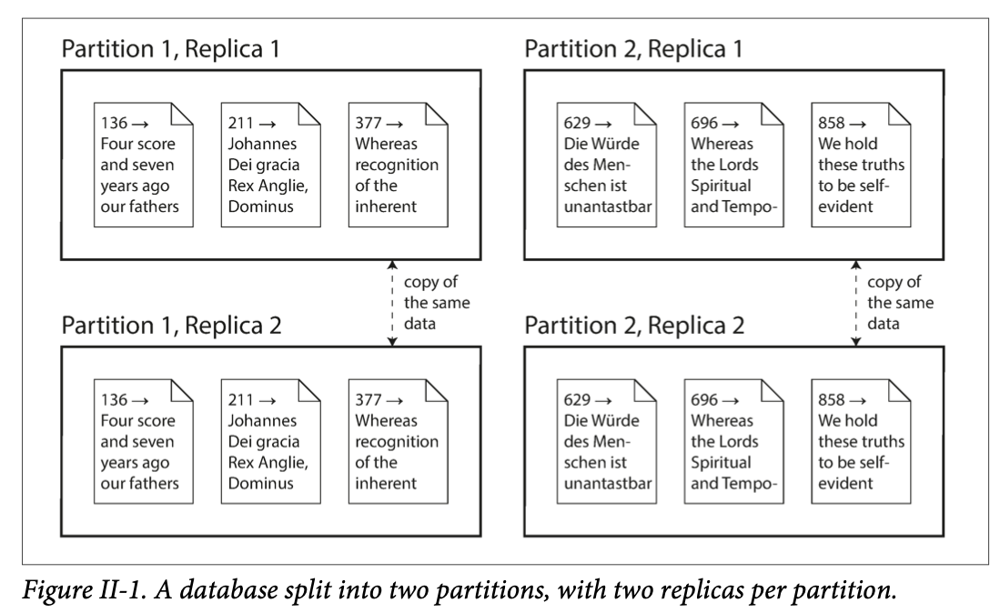
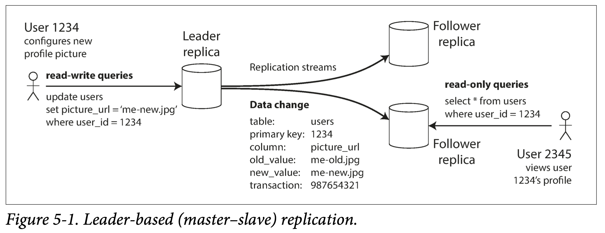
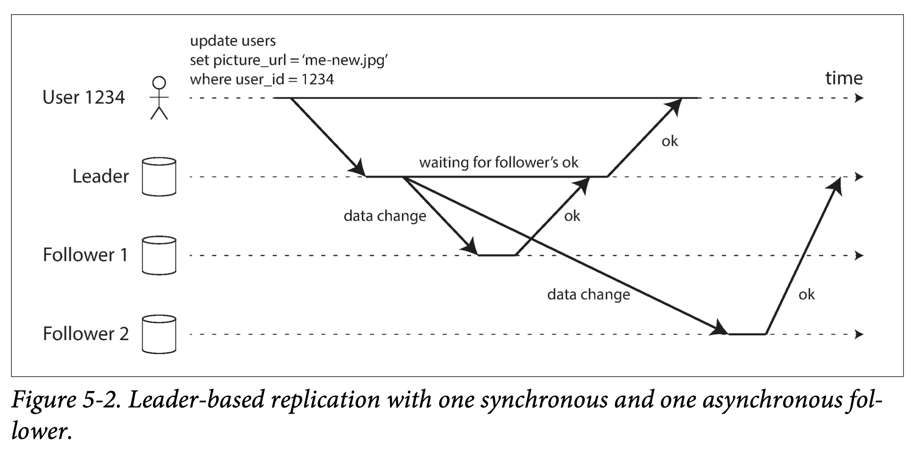

# Part 2 Chapters 5-9

There are various reasons why you might want to distribute a database across multiple machines:

Scalability

If your data volume, read load, or write load grows bigger than a single machine can handle, you can potentially spread the load across multiple machines.

Fault tolerance/high availability

If your application needs to continue working even if one machine (or several machines, or the network, or an entire datacenter) goes down, you can use multiple machines to give you redundancy. When one fails, another one can take over.

Latency

If you have users around the world, you might want to have servers at various locations worldwide so that each user can be served from a datacenter that is geographically close to them. That avoids the users having to wait for network packets to travel halfway around the world.

## II.1 Scaling to Higher Load

If all you need is to scale to higher load, the simplest approach is to buy a more powerful machine (sometimes called **vertical scaling or scaling up**). Many CPUs, many RAM chips, and many disks can be joined together under one operating system, and a fast interconnect allows any CPU to access any part of the memory or disk. In this kind of shared-memory architecture, all the components can be treated as a single machine. (In a large machine, although any CPU can access any part of memory, some banks of memory are closer to one CPU than to others (this is called nonuniform memory access, or NUMA). To make efficient use of this architecture, the processing needs to be broken down so that each CPU mostly accesses memory that is nearby—which means that **partitioning is still required**, even when ostensibly running on one machine.)

The problem with a shared-memory approach is that the cost grows faster than linearly: a machine with twice as many CPUs, twice as much RAM, and twice as much disk capacity as another typically costs significantly more than twice as much. And due to bottlenecks, a machine twice the size cannot necessarily handle twice the load.

A shared-memory architecture may offer limited fault tolerance—high-end machines have hot-swappable components (you can replace disks, memory modules, and even CPUs without shutting down the machines)—but it is definitely limited to a single geographic location.

Another approach is the shared-disk architecture, which uses several machines with independent CPUs and RAM, but stores data on an array of disks that is shared between the machines, which are connected via a fast network.(Network Attached Storage (NAS) or Storage Area Network (SAN).) This architecture is used for some data warehousing workloads, but contention and the overhead of locking limit the scalability of the shared-disk approach.

### II.1.1 Shared-Nothing Architectures

By contrast, shared-nothing architectures (sometimes called **horizontal scaling or scaling out**) have gained a lot of popularity. In this approach, each machine or virtual machine running the database software is called a node. Each node uses its CPUs, RAM, and disks independently. Any coordination between nodes is done at the software level, using a conventional network.

No special hardware is required by a shared-nothing system, so you can use whatever machines have the best price/performance ratio. You can potentially distribute data across multiple geographic regions, and thus reduce latency for users and potentially be able to survive the loss of an entire datacenter. With cloud deployments of virtual machines, you don’t need to be operating at Google scale: even for small companies, a multi-region distributed architecture is now feasible.

In this part of the book, we focus on shared-nothing architectures—not because they are necessarily the best choice for every use case, but rather because they require the most caution from you, the application developer. If your data is distributed across multiple nodes, you need to be aware of the constraints and trade-offs that occur in such a distributed system—the database cannot magically hide these from you.

While a distributed shared-nothing architecture has many advantages, it usually also incurs additional complexity for applications and sometimes limits the expressiveness of the data models you can use. In some cases, a simple single-threaded program can perform significantly better than a cluster with over 100 CPU cores. On the other hand, shared-nothing systems can be very powerful. The next few chapters go into details on the issues that arise when data is distributed.

### II.1.2 Replication Versus Partitioning

There are two common ways data is distributed across multiple nodes:

Replication

Keeping a copy of the same data on several different nodes, potentially in different locations. Replication provides redundancy: if some nodes are unavailable, the data can still be served from the remaining nodes. Replication can also help improve performance. We discuss replication in Chapter 5.

Partitioning

Splitting a big database into smaller subsets called partitions so that different partitions can be assigned to different nodes (also known as sharding). We discuss partitioning in Chapter 6.

These are separate mechanisms, but they often go hand in hand, as illustrated in Figure II-1.

With an understanding of those concepts, we can discuss the difficult trade-offs that you need to make in a distributed system. We’ll discuss transactions in Chapter 7, as that will help you understand all the many things that can go wrong in a data system, and what you can do about them. We’ll conclude this part of the book by discussing the fundamental limitations of distributed systems in Chapters 8 and 9.

Later, in Part III of this book, we will discuss how you can take several (potentially distributed) datastores and integrate them into a larger system, satisfying the needs of a complex application. But first, let’s talk about distributed data.

# Chapter 5 Replication

There are several reasons why you might want to replicate data:

1. To keep data geographically close to your users (and thus reduce latency)
1. To allow the system to continue working even if some of its parts have failed (and thus increase availability)
1. To scale out the number of machines that can serve read queries (and thus increase read throughput)

In this chapter we will assume that your dataset is so small that each machine can hold a copy of the entire dataset. In Chapter 6 we will relax that assumption and discuss partitioning (sharding) of datasets that are too big for a single machine. In later chapters we will discuss various kinds of faults that can occur in a replicated data system, and how to deal with them.

If the data that you’re replicating does not change over time, then replication is easy: you just need to copy the data to every node once, and you’re done. All of the difficulty in replication lies in handling changes to replicated data, and that’s what this chapter is about. We will discuss three popular algorithms for replicating changes between nodes: **single-leader, multi-leader, and leaderless replication**. Almost all distributed databases use one of these three approaches. They all have various pros and cons, which we will examine in detail.

There are many trade-offs to consider with replication: for example, whether to use **synchronous or asynchronous replication**, and how to handle failed replicas. Those are often configuration options in databases, and although the details vary by database, the general principles are similar across many different implementations. We will discuss the consequences of such choices in this chapter.

Replication of databases is an old topic—the principles haven’t changed much since they were studied in the 1970s, because the fundamental constraints of networks have remained the same. However, outside of research, many developers continued to assume for a long time that a database consisted of just one node. Mainstream use of distributed databases is more recent. Since many application developers are new to this area, there has been a lot of misunderstanding around issues such as **eventual consistency**. In “Problems with Replication Lag” we will get more precise about eventual consistency and discuss things like the read-your-writes and monotonic reads guarantees.

## 5.1 Leaders and Followers

Each node that stores a copy of the database is called a replica. With multiple replicas, a question inevitably arises: how do we ensure that all the data ends up on all the replicas?

Every write to the database needs to be processed by every replica; otherwise, the replicas would no longer contain the same data. The most common solution for this is called leader-based replication (also known as active/passive or master–slave replication) and is illustrated in Figure 5-1. It works as follows:

1. One of the replicas is designated the leader (also known as master or primary). When clients want to write to the database, they must send their requests to the leader, which first writes the new data to its local storage.
1. The other replicas are known as followers (read replicas, slaves, secondaries, or hot standbys).(Different people have different definitions for hot, warm, and cold standby servers. In PostgreSQL, for example, hot standby is used to refer to a replica that accepts reads from clients, whereas a warm standby processes changes from the leader but doesn’t process any queries from clients. For purposes of this book, the difference isn’t important.) Whenever the leader writes new data to its local storage, it also sends the data change to all of its followers as part of a replication log or change stream. Each follower takes the log from the leader and updates its local copy of the database accordingly, by applying all writes in the same order as they were processed on the leader.
1. When a client wants to read from the database, it can query either the leader or any of the followers. However, writes are only accepted on the leader (the followers are read-only from the client’s point of view).

This mode of replication is a built-in feature of many relational databases, such as PostgreSQL (since version 9.0), MySQL, Oracle Data Guard, and SQL Server’s AlwaysOn Availability Groups. It is also used in some nonrelational databases, including MongoDB, RethinkDB, and Espresso. Finally, leader-based replication is not restricted to only databases: distributed message brokers such as Kafka and RabbitMQ highly available queues also use it. Some network filesystems and replicated block devices such as DRBD are similar.

### 5.1.1 Synchronous Versus Asynchronous Replication

An important detail of a replicated system is whether the replication happens synchronously or asynchronously. (In relational databases, this is often a configurable option; other systems are often hardcoded to be either one or the other.)

Think about what happens in Figure 5-1, where the user of a website updates their profile image. At some point in time, the client sends the update request to the leader; shortly afterward, it is received by the leader. At some point, the leader forwards the data change to the followers. Eventually, the leader notifies the client that the update was successful.

Figure 5-2 shows the communication between various components of the system: the user’s client, the leader, and two followers. Time flows from left to right. A request or response message is shown as a thick arrow.

In the example of Figure 5-2, the replication to follower 1 is synchronous: the leader waits until follower 1 has confirmed that it received the write before reporting success to the user, and before making the write visible to other clients. The replication to follower 2 is asynchronous: the leader sends the message, but doesn’t wait for a response from the follower.

The diagram shows that there is a substantial delay before follower 2 processes the message. Normally, replication is quite fast: most database systems apply changes to followers in less than a second. However, there is no guarantee of how long it might take. There are **circumstances** when followers might fall behind the leader by several minutes or more; for example, if a follower is recovering from a failure, if the system is operating near maximum capacity, or if there are network problems between the nodes.

The advantage of synchronous replication is that the follower is guaranteed to have an up-to-date copy of the data that is consistent with the leader. If the leader suddenly fails, we can be sure that the data is still available on the follower. The disadvantage is that if the synchronous follower doesn’t respond (because it has crashed, or there is a network fault, or for any other reason), the write cannot be processed. The leader must block all writes and wait until the synchronous replica is available again.

For that reason, it is impractical for all followers to be synchronous: any one node outage would cause the whole system to grind to a halt. In practice, if you enable synchronous replication on a database, it usually means that one of the followers is synchronous, and the others are asynchronous. If the synchronous follower becomes unavailable or slow, one of the asynchronous followers is made synchronous. This guarantees that you have an up-to-date copy of the data on at least two nodes: the leader and one synchronous follower. This configuration is sometimes also called semi-synchronous.

Often, leader-based replication is configured to be completely asynchronous. In this case, if the leader fails and is not recoverable, any writes that have not yet been replicated to followers are lost. This means that a write is not guaranteed to be durable, even if it has been confirmed to the client. However, a fully asynchronous configuration has the advantage that the leader can continue processing writes, even if all of its followers have fallen behind.

Weakening durability may sound like a bad trade-off, but asynchronous replication is nevertheless widely used, especially if there are many followers or if they are geographically distributed. We will return to this issue in “Problems with Replication Lag” later.

Research on Replication

It can be a serious problem for asynchronously replicated systems to lose data if the leader fails, so researchers have continued investigating replication methods that do not lose data but still provide good performance and availability. For example, **chain replication** is a variant of synchronous replication that has been successfully implemented in a few systems such as Microsoft Azure Storage.

There is a strong connection between **consistency of replication and consensus** (getting several nodes to agree on a value), and we will explore this area of theory in more detail in Chapter 9. In this chapter we will concentrate on the simpler forms of replication that are most commonly used in databases in practice.

### 5.1.2 Setting Up New Followers

From time to time, you need to set up new followers—perhaps to increase the number of replicas, or to replace failed nodes. How do you ensure that the new follower has an accurate copy of the leader’s data?

Simply copying data files from one node to another is typically not sufficient: clients are constantly writing to the database, and the data is always in flux, so a standard file copy would see different parts of the database at different points in time. The result might not make any sense.

You could make the files on disk consistent by locking the database (making it unavailable for writes), but that would go against our goal of high availability. Fortunately, setting up a follower can usually be done without downtime. Conceptually, the process looks like this:

1. Take a consistent snapshot of the leader’s database at some point in time—if possible, **without taking a lock** on the entire database. Most databases have this feature, as it is also required for backups. In some cases, third-party tools are needed, such as innobackupex for MySQL.
1. Copy the snapshot to the new follower node.
1. The follower connects to the leader and requests all the data changes that have happened since the snapshot was taken. This requires that the snapshot is associated with an exact position in the leader’s replication log. That position has various names: for example, PostgreSQL calls it the **log sequence number**, and MySQL calls it the **binlog coordinates**.
1. When the follower has processed the backlog of data changes since the snapshot, we say it has caught up. It can now continue to process data changes from the leader as they happen.

The practical steps of setting up a follower vary significantly by database. In some systems the process is fully automated, whereas in others it can be a somewhat arcane multi-step workflow that needs to be manually performed by an administrator.

### 5.1.3 Handling Node Outages

Any node in the system can go down, perhaps unexpectedly due to a fault, but just as likely due to planned maintenance (for example, rebooting a machine to install a kernel security patch). Being able to reboot individual nodes without downtime is a big advantage for operations and maintenance. Thus, our goal is to keep the system as a whole running despite individual node failures, and to keep the impact of a node outage as small as possible.

How do you achieve high availability with leader-based replication?

#### 5.1.3.1 Follower failure: Catch-up recovery

On its local disk, each follower keeps a log of the data changes it has received from the leader. If a follower crashes and is restarted, or if the network between the leader and the follower is temporarily interrupted, the follower can recover quite easily: from its log, it knows the last transaction that was processed before the fault occurred. Thus, the follower can connect to the leader and request all the data changes that occurred during the time when the follower was disconnected. When it has applied these changes, it has caught up to the leader and can continue receiving a stream of data changes as before.

#### 5.1.3.2 Leader failure: Failover

Handling a failure of the leader is trickier: one of the followers needs to be promoted to be the new leader, clients need to be reconfigured to send their writes to the new leader, and the other followers need to start consuming data changes from the new leader. This process is called failover.

Failover can happen manually (an administrator is notified that the leader has failed and takes the necessary steps to make a new leader) or automatically. An automatic failover process usually consists of the following steps:

1. Determining that the leader has failed. There are many things that could potentially go wrong: crashes, power outages, network issues, and more. There is no foolproof way of detecting what has gone wrong, so most systems **simply use a timeout**: nodes frequently bounce messages back and forth between each other, and if a node doesn’t respond for some period of time—say, 30 seconds—it is assumed to be dead. (If the leader is deliberately taken down for planned maintenance, this doesn’t apply.)
1. Choosing a new leader. This could be done through an **election process** (where the leader is chosen by a majority of the remaining replicas), or a new leader could be appointed by a previously elected controller node. The best candidate for leadership is usually the replica with the most up-to-date data changes from the old leader (to minimize any data loss). Getting all the nodes to agree on a new leader is a **consensus problem**, discussed in detail in Chapter 9.
1. Reconfiguring the system to use the new leader. Clients now need to send their write requests to the new leader (we discuss this in “Request Routing” later). If the old leader comes back, it might still believe that it is the leader, not realizing that the other replicas have forced it to step down. The system needs to ensure that the old leader becomes a follower and recognizes the new leader.

Failover is fraught with things that can go wrong:

1. If asynchronous replication is used, the new leader may not have received all the writes from the old leader before it failed. If the former leader rejoins the cluster after a new leader has been chosen, what should happen to those writes? The new leader may have received **conflicting writes** in the meantime. The most common solution is for the old leader’s unreplicated writes to simply be discarded, which may violate clients’ durability expectations.
1. Discarding writes is especially dangerous if other storage systems outside of the database need to be coordinated with the database contents. For example, in one incident at GitHub, an out-of-date MySQL follower was promoted to leader. The database used an autoincrementing counter to assign primary keys to new rows, but because the new leader’s counter lagged behind the old leader’s, it reused some primary keys that were previously assigned by the old leader. These **primary keys were also used in a Redis store**, so the reuse of primary keys resulted in inconsistency between MySQL and Redis, which caused some private data to be disclosed to the wrong users.
1. In certain fault scenarios (see Chapter 8), it could happen that two nodes both believe that they are the leader. This situation is called **split brain**, and it is dangerous: if both leaders accept writes, and there is no process for resolving conflicts (see “Multi-Leader Replication” later), data is likely to be lost or corrupted. As a safety catch, some systems have a mechanism to shut down one node if two leaders are detected.(This approach is known as **fencing** or, more emphatically, Shoot The Other Node In The Head (STONITH). We will discuss fencing in more detail in “The leader and the lock” on page 301.) However, if this mechanism is not carefully designed, you can end up with both nodes being shut down.
1. What is the right timeout before the leader is declared dead? A longer timeout means a longer time to recovery in the case where the leader fails. However, if the timeout is too short, there could be unnecessary failovers. For example, a temporary load spike could cause a node’s response time to increase above the timeout, or a network glitch could cause delayed packets. If the system is already struggling with high load or network problems, an unnecessary failover is likely to make the situation worse, not better.
There are no easy solutions to these problems. For this reason, some operations teams **prefer to perform failovers manually**, even if the software supports automatic failover.

These issues—node failures; unreliable networks; and trade-offs around replica consistency, durability, availability, and latency—are in fact fundamental problems in distributed systems. In Chapter 8 and Chapter 9 we will discuss them in greater depth.

### 5.1.4 Implementation of Replication Logs

How does leader-based replication work under the hood? Several different replication methods are used in practice, so let’s look at each one briefly.

#### 5.1.4.1 Statement-based replication

In the simplest case, the leader logs every write request (statement) that it executes and sends that statement log to its followers. For a relational database, this means that every `INSERT`, `UPDATE`, or `DELETE` statement is forwarded to followers, and each follower parses and executes that SQL statement as if it had been received from a client.

Although this may sound reasonable, there are various ways in which this approach to replication can break down:

1. Any statement that calls a nondeterministic function, such as `NOW()` to get the current date and time or `RAND()` to get a random number, is likely to generate a different value on each replica.
1. If statements use an autoincrementing column, or if they depend on the existing data in the database (e.g., `UPDATE ... WHERE <some condition>`), they must be executed in exactly the same order on each replica, or else they may have a different effect. This can be limiting when there are multiple concurrently executing transactions.
1. Statements that have side effects (e.g., triggers, stored procedures, user-defined functions) may result in different side effects occurring on each replica, unless the side effects are absolutely deterministic.
1. It is possible to work around those issues—for example, the leader can replace any nondeterministic function calls with a fixed return value when the statement is logged so that the followers all get the same value. However, because there are so many edge cases, other replication methods are now generally preferred.

Statement-based replication was used in MySQL before version 5.1. It is still sometimes used today, as it is quite compact, but by default MySQL now switches to **row-based replication** (discussed shortly) if there is any nondeterminism in a statement. **VoltDB uses statement-based replication, and makes it safe by requiring transactions to be deterministic**.

#### 5.1.4.2 Write-ahead log (WAL) shipping

In Chapter 3 we discussed how storage engines represent data on disk, and we found that usually every write is appended to a log:

1. In the case of a log-structured storage engine (see “SSTables and LSM-Trees” in chapter 3), this log is the main place for storage. Log segments are compacted and garbage-collected in the background.
1. In the case of a B-tree, which overwrites individual disk blocks, every modification is first written to a write-ahead log so that the index can be restored to a consistent state after a crash.

In either case, the log is an append-only sequence of bytes containing all writes to the database. We can use the exact same log to build a replica on another node: besides writing the log to disk, the leader also sends it across the network to its followers. When the follower processes this log, it builds a copy of the exact same data structures as found on the leader.

This method of replication is used in PostgreSQL and Oracle, among others. The main disadvantage is that the log describes the data on a very low level: a WAL contains details of which bytes were changed in which disk blocks. **This makes replication closely coupled to the storage engine**. If the database changes its storage format from one version to another, it is typically not possible to run different versions of the database software on the leader and the followers.

That may seem like a minor implementation detail, but it can have a big operational impact. If the replication protocol allows the follower to use a newer software version than the leader, you can perform a zero-downtime upgrade of the database software by first upgrading the followers and then performing a failover to make one of the upgraded nodes the new leader. If the replication protocol does not allow this version mismatch, as is often the case with WAL shipping, such upgrades require downtime.

#### 5.1.4.3 Logical (row-based) log replication

An alternative is to use different log formats for replication and for the storage engine, which allows the replication log to be decoupled from the storage engine internals. This kind of replication log is called a logical log, to distinguish it from the storage engine’s (physical) data representation.

A logical log for a relational database is usually a sequence of records describing writes to database tables at the granularity of a row:

1. For an inserted row, the log contains the new values of all columns.
1. For a deleted row, the log contains enough information to uniquely identify the row that was deleted. Typically this would be the primary key, but if there is no primary key on the table, the old values of all columns need to be logged.
1. For an updated row, the log contains enough information to uniquely identify the updated row, and the new values of all columns (or at least the new values of all columns that changed).

A transaction that modifies several rows generates several such log records, followed by a record indicating that the transaction was committed. MySQL’s binlog (when configured to use row-based replication) uses this approach.

Since a logical log is decoupled from the storage engine internals, it can more easily be kept backward compatible, **allowing the leader and the follower to run different versions of the database software, or even different storage engines**.

A logical log format is also easier for external applications to parse. This aspect is useful if you want to send the contents of a database to an external system, such as a data warehouse for offline analysis, or for building custom indexes and caches. This technique is called **change data capture**, and we will return to it in Chapter 11.

#### 5.1.4.4 Trigger-based replication

The replication approaches described so far are implemented by the database system, without involving any application code. In many cases, that’s what you want—but there are some circumstances where more flexibility is needed. For example, if you want to only replicate a subset of the data, or want to replicate from one kind of database to another, or if you need conflict resolution logic (see “Handling Write Conflicts” later), then you may need to move replication up to the application layer.

Some tools, such as **Oracle GoldenGate**, can make data changes available to an application by reading the database log. An alternative is to use features that are available in many relational databases: **triggers and stored procedures**.

A trigger lets you register custom application code that is automatically executed when a data change (write transaction) occurs in a database system. The trigger has the opportunity to log this change into a separate table, from which it can be read by an external process. That external process can then apply any necessary application logic and replicate the data change to another system. **Databus for Oracle and Bucardo for Postgres** work like this, for example.

Trigger-based replication typically has **greater overheads** than other replication methods, and is **more prone to bugs** and limitations than the database’s built-in replication. However, it can nevertheless be useful due to its flexibility.

## 5.2 Problems with Replication Lag

Leader-based replication requires all writes to go through a single node, but read-only queries can go to any replica. For workloads that consist of mostly reads and only a small percentage of writes (a common pattern on the web), there is an attractive option: create many followers, and distribute the read requests across those followers. This removes load from the leader and allows read requests to be served by nearby replicas.

In this **read-scaling architecture**, you can increase the capacity for serving read-only requests simply by adding more followers. However, this approach only realistically works with **asynchronous replication**—if you tried to synchronously replicate to all followers, a single node failure or network outage would make the entire system unavailable for writing. And the more nodes you have, the likelier it is that one will be down, so a fully synchronous configuration would be very unreliable.

Unfortunately, if an application reads from an asynchronous follower, it may see outdated information if the follower has fallen behind. This leads to apparent inconsistencies in the database: if you run the same query on the leader and a follower at the same time, you may get different results, because not all writes have been reflected in the follower. This inconsistency is just a temporary state—if you stop writing to the database and wait a while, the followers will eventually catch up and become consistent with the leader. For that reason, this effect is known as eventual consistency. (The term **eventual consistency** was coined by Douglas Terry et al., popularized by Werner Vogels, and became the battle cry of many NoSQL projects. However, not only NoSQL databases are eventually consistent: followers in an asynchronously replicated relational database have the same characteristics.)

The term “eventually” is deliberately vague: in general, there is no limit to how far a replica can fall behind. In normal operation, the delay between a write happening on the leader and being reflected on a follower—the replication lag—may be only a fraction of a second, and not noticeable in practice. However, if the system is operating near capacity or if there is a problem in the network, the lag can easily increase to several seconds or even minutes.

When the lag is so large, the inconsistencies it introduces are not just a theoretical issue but a real problem for applications. In this section we will highlight three examples of problems that are likely to occur when there is replication lag and outline some approaches to solving them.

### 5.2.1 Reading Your Own Writes
### 5.2.2 Monotonic Reads
### 5.2.3 Consistent Prefix Reads
### 5.2.4 Solutions for Replication Lag

## 5.3 Multi-Leader Replication

### 5.3.1 Use Cases for Multi-Leader Replication
### 5.3.2 Handling Write Conflicts
### 5.3.3 Multi-Leader Replication Topologies

## 5.4 Leaderless Replication

### 5.4.1 Writing to the Database When a Node Is Down
### 5.4.2 Limitations of Quorum Consistency
### 5.4.3 Sloppy Quorums and Hinted Handoff
### 5.4.4 Detecting Concurrent Writes

## 5.5 Summary
