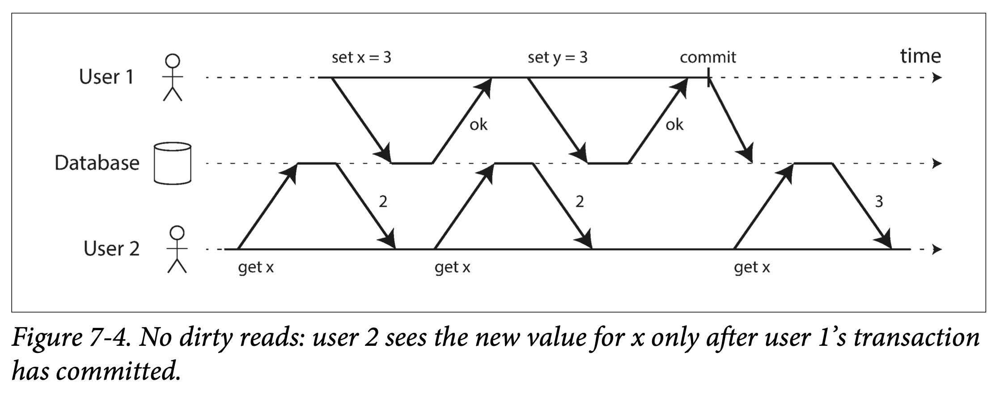

# Chapter 7 Transactions

Some authors have claimed that general two-phase commit is too expensive to support, because of the performance or availability problems that it brings. We believe it is better to have application programmers deal with performance problems due to overuse of transactions as bottlenecks arise, rather than always coding around the lack of transactions.

—James Corbett et al., Spanner: Google’s Globally-Distributed Database (2012)

In the harsh reality of data systems, many things can go wrong:

1. The database **software or hardware may fail** at any time (including in the middle of a write operation).
1. The application may **crash** at any time (including halfway through a series of operations).
1. Interruptions in the **network** can unexpectedly cut off the application from the database, or one database node from another.
1. Several clients may write to the database at the same time, **overwriting** each other’s changes.
1. A client may read data that doesn’t make sense because it has only **partially** been updated.
1. **Race** conditions between clients can cause surprising bugs.

In order to be reliable, a system has to deal with these faults and ensure that they don’t cause catastrophic failure of the entire system. However, implementing fault-tolerance mechanisms is a lot of work. It requires **a lot of careful thinking** about all the things that can go wrong, and **a lot of testing** to ensure that the solution actually works.

For decades, transactions have been the mechanism of choice for simplifying these issues. A transaction is a way for an application to group several reads and writes together into a logical unit. Conceptually, all the reads and writes in a transaction are executed as one operation: either the entire transaction succeeds (commit) or it fails (abort, rollback). If it fails, the application can safely retry. With transactions, error handling becomes much simpler for an application, because it doesn’t need to worry about **partial failure**—i.e., the case where some operations succeed and some fail (for whatever reason).

If you have spent years working with transactions, they may seem obvious, but we shouldn’t take them for granted. Transactions are not a law of nature; they were created with a purpose, namely to simplify the **programming model for applications accessing a database**. By using transactions, the application is free to ignore certain potential error scenarios and concurrency issues, because the database takes care of them instead (we call these safety guarantees).

Not every application needs transactions, and sometimes there are advantages to weakening transactional guarantees or abandoning them entirely (for example, to achieve higher performance or higher availability). Some safety properties can be achieved without transactions.

How do you figure out whether you need transactions? In order to answer that question, we first need to understand exactly what safety guarantees transactions can provide, and what costs are associated with them. Although transactions seem straightforward at first glance, there are actually many subtle but important details that come into play.

In this chapter, we will examine many examples of things that can go wrong, and explore the algorithms that databases use to guard against those issues. We will go especially deep in the area of concurrency control, discussing various kinds of race conditions that can occur and how databases implement isolation levels such as read committed, snapshot isolation, and serializability.

This chapter applies to both single-node and distributed databases; in Chapter 8 we will focus the discussion on the particular challenges that arise only in distributed systems.

## 7.1 The Slippery Concept of a Transaction

Almost all relational databases today, and some nonrelational databases, support transactions. Most of them follow the style that was introduced in 1975 by **IBM System R, the first SQL database**. Although some implementation details have changed, the general idea has remained virtually the same for 40 years: the transaction support in MySQL, PostgreSQL, Oracle, SQL Server, etc., is uncannily (in a strange or mysterious way, especially one that is unsettling) similar to that of System R.

In the late 2000s, nonrelational (NoSQL) databases started gaining popularity. They aimed to improve upon the relational status quo by offering a choice of new data models (see Chapter 2), and by including replication (Chapter 5) and partitioning (Chapter 6) by default. Transactions were the main casualty of this movement: many of this new generation of databases abandoned transactions entirely, or redefined the word to describe a much weaker set of guarantees than had previously been understood.

With the hype around this new crop of distributed databases, there emerged a popular belief that transactions were the antithesis of scalability, and that any large-scale system would have to abandon transactions in order to maintain good performance and high availability. On the other hand, transactional guarantees are sometimes presented by database vendors as an essential requirement for “serious applications” with “valuable data.” Both viewpoints are pure hyperbole (exaggerated statements or claims not meant to be taken literally).

The truth is not that simple: like every other technical design choice, transactions have advantages and limitations. In order to understand those trade-offs, let’s go into the details of the guarantees that transactions can provide—both in normal operation and in various extreme (but realistic) circumstances.

### 7.1.1 The Meaning of ACID

The safety guarantees provided by transactions are often described by the well-known acronym ACID, which stands for Atomicity, Consistency, Isolation, and Durability. It was coined in 1983 by Theo Härder and Andreas Reuter in an effort to establish precise terminology for fault-tolerance mechanisms in databases.

However, in practice, one database’s implementation of ACID does not equal another’s implementation. For example, as we shall see, there is a lot of ambiguity around the meaning of isolation. The high-level idea is sound, but the devil is in the details. Today, when a system claims to be “ACID compliant,” it’s unclear what guarantees you can actually expect. ACID has unfortunately become mostly a marketing term.

(Systems that do not meet the ACID criteria are sometimes called **BASE**, which stands for Basically Available, Soft state, and Eventual consistency. This is even more vague than the definition of ACID. It seems that the only sensible definition of BASE is “not ACID”; i.e., it can mean almost anything you want.)
Let’s dig into the definitions of atomicity, consistency, isolation, and durability, as this will let us refine our idea of transactions.

#### 7.1.1.1 Atomicity

In general, atomic refers to something that cannot be broken down into smaller parts. The word means similar but subtly different things in different branches of computing. For example, in multi-threaded programming, if one thread executes an atomic operation, that means there is no way that another thread could see the half-finished result of the operation. The system can only be in the state it was before the operation or after the operation, not something in between.

By contrast, in the context of ACID, atomicity is not about concurrency. It does not describe what happens if several processes try to access the same data at the same time, because that is covered under the letter I, for isolation (see “Isolation”).

Rather, ACID atomicity describes what happens if a client wants to make several writes, but a fault occurs after some of the writes have been processed—for example, a process crashes, a network connection is interrupted, a disk becomes full, or some integrity constraint is violated. If the writes are grouped together into an atomic transaction, and the transaction cannot be completed (committed) due to a fault, then the transaction is aborted and the database must discard or undo any writes it has made so far in that transaction.

Without atomicity, if an error occurs partway through making multiple changes, it’s difficult to know which changes have taken effect and which haven’t. The application could try again, but that risks making the same change twice, leading to duplicate or incorrect data. Atomicity simplifies this problem: if a transaction was aborted, the application can be sure that it didn’t change anything, so it can **safely be retried**.

The ability to abort a transaction on error and have all writes from that transaction discarded is the defining feature of ACID atomicity. Perhaps **abortability** would have been a better term than atomicity, but we will stick with atomicity since that’s the usual word.

#### 7.1.1.2 Consistency

The word consistency is terribly overloaded:

1. In Chapter 5 we discussed replica consistency and the issue of eventual consistency that arises in asynchronously replicated systems (see “Problems with Replication Lag”).
1. Consistent hashing is an approach to partitioning that some systems use for rebalancing (see “Consistent Hashing”).
1. In the CAP theorem (see Chapter 9), the word consistency is used to mean linearizability (see “Linearizability”).
1. In the context of ACID, consistency refers to an application-specific notion of the database being in a “good state.”

It’s unfortunate that the same word is used with at least four different meanings.

The idea of ACID consistency is that you have certain statements about your data (invariants) that must always be true—for example, in an accounting system, credits and debits across all accounts must always be balanced. If a transaction starts with a database that is valid according to these invariants, and any writes during the transaction preserve the validity, then you can be sure that the invariants are always satisfied.

However, this idea of consistency depends on the application’s notion of invariants, and it’s the application’s responsibility to define its transactions correctly so that they preserve consistency. This is **not something that the database can guarantee**: if you write bad data that violates your invariants, the database can’t stop you. (Some specific kinds of invariants can be checked by the database, for example using foreign key constraints or uniqueness constraints. However, in general, the application defines what data is valid or invalid—the database only stores it.)

Atomicity, isolation, and durability are properties of the database, whereas **consistency (in the ACID sense) is a property of the application**. The application may rely on the database’s atomicity and isolation properties in order to achieve consistency, but it’s not up to the database alone. Thus, the letter C doesn’t really belong in ACID. (Joe Hellerstein has remarked that the C in ACID was “tossed in to make the acronym work” in Härder and Reuter’s paper, and that it wasn’t considered important at the time.)

#### 7.1.1.3 Isolation

Most databases are accessed by several clients at the same time. That is no problem if they are reading and writing different parts of the database, but if they are accessing the same database records, you can run into concurrency problems (race conditions).

Figure 7-1 is a simple example of this kind of problem. Say you have two clients simultaneously incrementing a counter that is stored in a database. Each client needs to read the current value, add 1, and write the new value back (assuming there is no increment operation built into the database). In Figure 7-1 the counter should have increased from 42 to 44, because two increments happened, but it actually only went to 43 because of the race condition.

Isolation in the sense of ACID means that concurrently executing transactions are isolated from each other: they cannot step on each other’s toes. The classic database textbooks formalize isolation as serializability, which means that each transaction can pretend that it is the only transaction running on the entire database. The database ensures that when the transactions have committed, the result is the same as if they had run serially (one after another), even though in reality they may have run concurrently.


However, in practice, serializable isolation is rarely used, because it carries a **performance penalty**. Some popular databases, such as Oracle 11g, don’t even implement it. In Oracle there is an isolation level called “serializable,” but it actually implements something called snapshot isolation, which is a weaker guarantee than **serializability**. We will explore snapshot isolation and other forms of isolation in “Weak Isolation Levels”.

#### 7.1.1.4 Durability

The purpose of a database system is to provide a safe place where data can be stored without fear of losing it. Durability is the promise that once a transaction has committed successfully, any data it has written will not be forgotten, even if there is a hardware fault or the database crashes.

In a single-node database, durability typically means that the data has been written to nonvolatile storage such as a hard drive or SSD. It usually also involves a write-ahead log or similar (see “Making B-trees reliable” in chapter 3), which allows recovery in the event that the data structures on disk are corrupted. In a replicated database, durability may mean that the data has been successfully copied to some number of nodes. In order to provide a durability guarantee, a database must wait until these writes or replications are complete before reporting a transaction as successfully committed.

As discussed in “Reliability” in chapter 1, **perfect durability does not exist**: if all your hard disks and all your backups are destroyed at the same time, there’s obviously nothing your database can do to save you.

**Replication and Durability**

Historically, durability meant writing to an archive tape. Then it was understood as writing to a disk or SSD. More recently, it has been adapted to mean replication. Which implementation is better?

The truth is, nothing is perfect:

1. If you write to disk and the machine dies, even though your data isn’t lost, it is inaccessible until you either fix the machine or transfer the disk to another machine. Replicated systems can remain available.
1. A correlated fault—a power outage or a bug that crashes every node on a particular input—can knock out all replicas at once (see “Reliability”), losing any data that is only in memory. Writing to disk is therefore still relevant for inmemory databases.
1. In an asynchronously replicated system, recent writes may be lost when the leader becomes unavailable (see “Handling Node Outages”).
1. When the power is suddenly cut, SSDs in particular have been shown to sometimes violate the guarantees they are supposed to provide: even fsync isn’t guaranteed to work correctly. Disk firmware can have bugs, just like any other kind of software.
1. Subtle interactions between the storage engine and the filesystem implementation can lead to bugs that are hard to track down, and may cause files on disk to be corrupted after a crash.
1. Data on disk can gradually become corrupted without this being detected. If data has been corrupted for some time, replicas and recent backups may also be corrupted. In this case, you will need to try to restore the data from a historical backup.
1. One study of SSDs found that between 30% and 80% of drives develop at least one bad block during the first four years of operation. Magnetic hard drives have a lower rate of bad sectors, but a higher rate of complete failure than SSDs.
1. If an SSD is disconnected from power, it can start losing data within a few weeks, depending on the temperature.

In practice, there is no one technique that can provide absolute guarantees. There are only various risk-reduction techniques, including writing to disk, replicating to remote machines, and backups—and they can and should be used together. As always, it’s wise to take any theoretical “guarantees” with a healthy grain of salt.

### 7.1.2 Single-Object and Multi-Object Operations

To recap, in ACID, atomicity and isolation describe what the database should do if a client makes several writes within the same transaction:

Atomicity

If an error occurs halfway through a sequence of writes, the transaction should be aborted, and the writes made up to that point should be discarded. In other words, the database saves you from having to worry about partial failure, by giving an all-or-nothing guarantee.

Isolation

Concurrently running transactions shouldn’t interfere with each other. For example, if one transaction makes several writes, then another transaction should see either all or none of those writes, but not some subset.

These definitions assume that you want to modify several objects (rows, documents, records) at once. Such multi-object transactions are often needed if several pieces of data need to be kept in sync. Figure 7-2 shows an example from an email application. To display the number of unread messages for a user, you could query something like:

`SELECT COUNT(*) FROM emails WHERE recipient_id = 2 AND unread_flag = true`

However, you might find this query to be too slow if there are many emails, and decide to store the number of unread messages in a separate field (a kind of denormalization). Now, whenever a new message comes in, you have to increment the unread counter as well, and whenever a message is marked as read, you also have to decrement the unread counter.

In Figure 7-2, user 2 experiences an anomaly: the mailbox listing shows an unread message, but the counter shows zero unread messages because the counter increment has not yet happened. (Arguably, an incorrect counter in an email application is not a particularly critical problem. Alternatively, think of a customer account balance instead of an unread counter, and a payment transaction instead of an email.) Isolation would have prevented this issue by ensuring that user 2 sees either both the inserted email and the updated counter, or neither, but not an inconsistent halfway point.


Figure 7-3 illustrates the need for atomicity: if an error occurs somewhere over the course of the transaction, the contents of the mailbox and the unread counter might become out of sync. In an atomic transaction, if the update to the counter fails, the transaction is aborted and the inserted email is rolled back.


Multi-object transactions require some way of determining which read and write operations belong to the same transaction. In relational databases, that is typically done **based on the client’s TCP connection to the database server**: on any particular connection, everything between a BEGIN TRANSACTION and a COMMIT statement is considered to be part of the same transaction. (This is not ideal. If the TCP connection is interrupted, the transaction must be aborted. If the interruption happens after the client has requested a commit but before the server acknowledges that the commit happened, the client doesn’t know whether the transaction was committed or not. To solve this issue, a transaction manager can group operations by a unique transaction identifier that is not bound to a particular TCP connection. We will return to this topic in “The End-to-End Argument for Databases” later).

On the other hand, many nonrelational databases don’t have such a way of grouping operations together. Even if there is a multi-object API (for example, a key-value store may have a multi-put operation that updates several keys in one operation), that doesn’t necessarily mean it has **transaction semantics**: the command may succeed for some keys and fail for others, leaving the database in a partially updated state.

#### 7.1.2.1 Single-object writes

Atomicity and isolation also apply when a **single object is being changed**. For example, imagine you are writing a 20 KB JSON document to a database:

1. If the network connection is interrupted after the first 10 KB have been sent, does the database store that unparseable 10 KB fragment of JSON?
1. If the power fails while the database is in the middle of overwriting the previous value on disk, do you end up with the old and new values spliced together?
1. If another client reads that document while the write is in progress, will it see a partially updated value?

Those issues would be incredibly confusing, so storage engines almost universally aim to provide atomicity and isolation on the level of a single object (such as a key-value pair) **on one node**. Atomicity can be implemented using a log for crash recovery (see “Making B-trees reliable”), and isolation can be implemented using a lock on each object (allowing only one thread to access an object at any one time).

Some databases also provide more complex atomic operations, (Strictly speaking, the term atomic increment uses the word atomic in the sense of multi-threaded programming. In the context of ACID, it should actually be called isolated or serializable increment. But that’s getting nitpicky.) such as an increment operation, which removes the need for a **read-modify-write** cycle like that in Figure 7-1. Similarly popular is a **compare-and-set operation**, which allows a write to happen only if the value has not been concurrently changed by someone else (see “Compare-and-set” later).

These single-object operations are useful, as they can prevent lost updates when several clients try to write to the same object concurrently (see “Preventing Lost Updates” later). However, they are not transactions in the usual sense of the word. Compare-and-set and other single-object operations have been dubbed “**lightweight transactions**” or even “ACID” for marketing purposes, but that terminology is misleading. A transaction is usually understood as a mechanism for grouping multiple operations on multiple objects into one unit of execution.

#### 7.1.2.2 The need for multi-object transactions

Many distributed datastores have abandoned multi-object transactions because they are difficult to implement across partitions, and they can get in the way in some scenarios where very high availability or performance is required. However, there is nothing that fundamentally prevents transactions in a distributed database, and we will discuss implementations of distributed transactions in Chapter 9.

But do we need multi-object transactions at all? Would it be possible to implement any application with only a key-value data model and single-object operations?

There are some use cases in which single-object inserts, updates, and deletes are sufficient. However, in many other cases writes to several different objects need to be coordinated:

1. In a relational data model, a row in one table often has a foreign key reference to a row in another table. (Similarly, in a graph-like data model, a vertex has edges to other vertices.) Multi-object transactions allow you to ensure that these references remain valid: when inserting several records that refer to one another, the foreign keys have to be correct and up to date, or the data becomes nonsensical.
1. In a document data model, the fields that need to be updated together are often within the same document, which is treated as a single object—no multi-object transactions are needed when updating a single document. However, document databases lacking join functionality also encourage denormalization (see “Relational Versus Document Databases Today” in chapter 2). When denormalized information needs to be updated, like in the example of Figure 7-2, you need to update several documents in one go. Transactions are very useful in this situation to prevent denormalized data from going out of sync.
1. In databases with secondary indexes (almost everything except pure key-value stores), the indexes also need to be updated every time you change a value. **These indexes are different database objects from a transaction point of view**: for example, without transaction isolation, it’s possible for a record to appear in one index but not another, because the update to the second index hasn’t happened yet.

Such applications can still be implemented without transactions. However, error handling becomes much more complicated without atomicity, and the lack of isolation can cause concurrency problems. We will discuss those in “Weak Isolation Levels” later, and explore alternative approaches in Chapter 12.

#### 7.1.2.3 Handling errors and aborts

A key feature of a transaction is that it can be aborted and safely retried if an error occurred. ACID databases are based on this philosophy: if the database is in danger of violating its guarantee of atomicity, isolation, or durability, it would rather abandon the transaction entirely than allow it to remain half-finished.

Not all systems follow that philosophy, though. In particular, datastores with leaderless replication (see “Leaderless Replication” in chapter 5) work much more on a “best effort” basis, which could be summarized as “the database will do as much as it can, and if it runs into an error, it won’t undo something it has already done”—so it’s the application’s responsibility to recover from errors.

Errors will inevitably happen, but many software developers prefer to think only about the happy path rather than the intricacies of error handling. For example, popular object-relational mapping (ORM) frameworks such as Rails’s ActiveRecord and Django don’t retry aborted transactions—the error usually results in an exception bubbling up the stack, so any user input is thrown away and the user gets an error message. This is a shame, because **the whole point of aborts is to enable safe retries**.

Although retrying an aborted transaction is a simple and effective error handling mechanism, it isn’t perfect:

1. If the transaction actually succeeded, but the network failed while the server tried to acknowledge the successful commit to the client (so the client thinks it failed), then retrying the transaction causes it to be performed twice—unless you have an additional application-level deduplication mechanism in place.
1. If the error is due to overload, retrying the transaction will make the problem worse, not better. To avoid such feedback cycles, you can limit the number of retries, use exponential backoff, and handle overload-related errors differently from other errors (if possible).
1. It is only worth retrying after transient errors (for example due to deadlock, isolation violation, temporary network interruptions, and failover); after a permanent error (e.g., constraint violation) a retry would be pointless.
1. If the transaction also has side effects outside of the database, those side effects may happen even if the transaction is aborted. For example, if you’re sending an email, you wouldn’t want to send the email again every time you retry the transaction. If you want to make sure that several different systems either commit or abort together, **two-phase commit** can help (we will discuss this in “Atomic Commit and Two-Phase Commit (2PC)”).
1. If the client process fails while retrying, any data it was trying to write to the database is lost.

## 7.2 Weak Isolation Levels

If two transactions don’t touch the same data, they can safely be run in parallel, because neither depends on the other. Concurrency issues (race conditions) only come into play when one transaction reads data that is concurrently modified by another transaction, or when two transactions try to simultaneously modify the same data.

Concurrency bugs are hard to find by testing, because such bugs are only triggered when you get unlucky with the timing. Such timing issues might occur very rarely, and are usually difficult to reproduce. Concurrency is also very difficult to reason about, especially in a large application where you don’t necessarily know which other pieces of code are accessing the database. Application development is difficult enough if you just have one user at a time; having many concurrent users makes it much harder still, because any piece of data could unexpectedly change at any time.

For that reason, databases have long tried to hide concurrency issues from application developers by providing transaction isolation. In theory, isolation should make your life easier by letting you pretend that no concurrency is happening: **serializable isolation** means that the database guarantees that transactions have the same effect as if they ran serially (i.e., one at a time, without any concurrency).

In practice, isolation is unfortunately not that simple. Serializable isolation has a performance cost, and many databases don’t want to pay that price. It’s therefore common for systems to use weaker levels of isolation, which protect against some concurrency issues, but not all. Those levels of isolation are much harder to understand, and they can lead to subtle bugs, but they are nevertheless used in practice.

Concurrency bugs caused by weak transaction isolation are not just a theoretical problem. They have caused substantial loss of money, led to investigation by financial auditors, and caused customer data to be corrupted. A popular comment on revelations of such problems is “Use an ACID database if you’re handling financial data!”—but that misses the point. Even many popular relational database systems (which are usually considered “ACID”) use weak isolation, so they wouldn’t necessarily have prevented these bugs from occurring.

Rather than blindly relying on tools, we need to develop a good understanding of the kinds of concurrency problems that exist, and how to prevent them. Then we can build applications that are reliable and correct, using the tools at our disposal.

In this section we will look at several weak (nonserializable) isolation levels that are used in practice, and discuss in detail what kinds of race conditions can and cannot occur, so that you can decide what level is appropriate to your application. Once we’ve done that, we will discuss serializability in detail (see “Serializability”). Our discussion of isolation levels will be informal, using examples. If you want rigorous definitions and analyses of their properties, you can find them in the academic literature.

### 7.2.1 Read Committed

The most basic level of transaction isolation is **read committed**. (Some databases support an even weaker isolation level called **read uncommitted**. It prevents dirty writes, but does not prevent dirty reads.) It makes two guarantees:

1. When reading from the database, you will only see data that has been committed (no dirty reads).
2. When writing to the database, you will only overwrite data that has been committed (no dirty writes).

Imagine a transaction has written some data to the database, but the transaction has not yet committed or aborted. Can another transaction see that uncommitted data? If yes, that is called a dirty read.

Transactions running at the read committed isolation level must prevent dirty reads. This means that any writes by a transaction only become visible to others when that transaction commits (and then all of its writes become visible at once). This is illustrated in Figure 7-4, where user 1 has set x = 3, but user 2’s get x still returns the old value, 2, while user 1 has not yet committed.

#### 7.2.1.1 No dirty reads

Imagine a transaction has written some data to the database, but the transaction has not yet committed or aborted. Can another transaction see that uncommitted data? If yes, that is called a dirty read.

Transactions running at the read committed isolation level must prevent dirty reads. This means that any writes by a transaction only become visible to others when that transaction commits (and then all of its writes become visible at once). This is illustrated in Figure 7-4, where user 1 has set x = 3, but user 2’s get x still returns the old value, 2, while user 1 has not yet committed.



There are a few reasons why it’s useful to prevent dirty reads:

1. If a transaction needs to update several objects, a dirty read means that another transaction may see some of the updates but not others. For example, in Figure 7-2, the user sees the new unread email but not the updated counter. This is a dirty read of the email. Seeing the database in a partially updated state is confusing to users and may cause other transactions to take incorrect decisions.
1. If a transaction aborts, any writes it has made need to be rolled back (like in Figure 7-3). If the database allows dirty reads, that means a transaction may see data that is later rolled back—i.e., which is never actually committed to the database. Reasoning about the consequences quickly becomes mind-bending.

#### 7.2.1.2 No dirty writes

What happens if two transactions concurrently try to update the same object in a database? We don’t know in which order the writes will happen, but we normally assume that the later write overwrites the earlier write.

However, what happens if the earlier write is part of a transaction that has not yet committed, so the later write **overwrites an uncommitted value**? This is called a dirty write. Transactions running at the read committed isolation level must prevent dirty writes, usually by **delaying the second write** until the first write’s transaction has committed or aborted.

By preventing dirty writes, this isolation level avoids some kinds of concurrency problems:

1. If transactions update multiple objects, dirty writes can lead to a bad outcome. For example, consider Figure 7-5, which illustrates a used car sales website on which two people, Alice and Bob, are simultaneously trying to buy the same car. Buying a car requires two database writes: the listing on the website needs to be updated to reflect the buyer, and the sales invoice needs to be sent to the buyer. In the case of Figure 7-5, the sale is awarded to Bob (because he performs the winning update to the listings table), but the invoice is sent to Alice (because she performs the winning update to the invoices table). Read committed prevents such mishaps.
1. However, read committed **does not prevent the race condition** between two counter increments in Figure 7-1. In this case, the second write happens after the first transaction has committed, so it’s not a dirty write. It’s still incorrect, but for a different reason—in “Preventing Lost Updates” later we will discuss how to make such counter increments safe.


#### 7.2.1.3 Implementing read committed

Read committed is a very **popular** isolation level. It is the default setting in Oracle 11g, PostgreSQL, SQL Server 2012, MemSQL, and many other databases.

Most commonly, databases prevent dirty writes by using **row-level locks**: when a transaction wants to modify a particular object (row or document), it must first acquire a lock on that object. It must then hold that lock until the transaction is committed or aborted. Only one transaction can hold the lock for any given object; if another transaction wants to write to the same object, it must wait until the first transaction is committed or aborted before it can acquire the lock and continue. This locking is done automatically by databases in read committed mode (or stronger isolation levels).

How do we prevent dirty reads? **One option would be to use the same lock**, and to require any transaction that wants to read an object to briefly acquire the lock and then release it again immediately after reading. This would ensure that a read couldn’t happen while an object has a dirty, uncommitted value (because during that time the lock would be held by the transaction that has made the write).

However, the approach of requiring read locks does not work well in practice, because one long-running write transaction can force many read-only transactions to wait until the long-running transaction has completed. This harms the response time of read-only transactions and is bad for operability: a slowdown in one part of an application can have a knock-on effect in a completely different part of the application, due to waiting for locks.

For that reason, most databases (At the time of writing, the only mainstream databases that use locks for read committed isolation are IBM DB2 and Microsoft SQL Server in the read_committed_snapshot=off configuration) prevent dirty reads using the approach illustrated in Figure 7-4: for every object that is written, the database remembers **both the old committed value and the new value** set by the transaction that currently holds the write lock. While the transaction is ongoing, any other transactions that read the object are simply given the old value. Only when the new value is committed do transactions switch over to reading the new value.

### 7.2.2 Snapshot Isolation and Repeatable Read

If you look superficially at read committed isolation, you could be forgiven for thinking that it does everything that a transaction needs to do: it allows aborts (required for atomicity), it prevents reading the incomplete results of transactions, and it prevents concurrent writes from getting intermingled. Indeed, those are useful features, and much stronger guarantees than you can get from a system that has no transactions.

However, there are still plenty of ways in which you can have concurrency bugs when using this isolation level. For example, Figure 7-6 illustrates a problem that can occur with read committed.


Say Alice has $1,000 of savings at a bank, split across two accounts with $500 each. Now a transaction transfers $100 from one of her accounts to the other. If she is unlucky enough to look at her list of account balances in the same moment as that transaction is being processed, she may see one account balance at a time before the incoming payment has arrived (with a balance of $500), and the other account after the outgoing transfer has been made (the new balance being $400). To Alice it now appears as though she only has a total of $900 in her accounts—it seems that $100 has vanished into thin air.

This anomaly is called a **nonrepeatable read or read skew**: if Alice were to read the balance of account 1 again at the end of the transaction, she would see a different value ($600) than she saw in her previous query. Read skew is considered acceptable under read committed isolation: the account balances that Alice saw were indeed committed at the time when she read them.

The term skew is unfortunately overloaded: we previously used it in the sense of an unbalanced workload with hot spots (see “Skewed Workloads and Relieving Hot Spots”), whereas here it means timing anomaly.

In Alice’s case, this is not a lasting problem, because she will most likely see consistent account balances if she reloads the online banking website a few seconds later. However, some situations cannot tolerate such temporary inconsistency:

Backups

Taking a backup requires making a copy of the entire database, which may take hours on a large database. During the time that the backup process is running, writes will continue to be made to the database. Thus, you could end up with some parts of the backup containing an older version of the data, and other parts containing a newer version. If you need to restore from such a backup, the inconsistencies (such as disappearing money) become permanent.

Analytic queries and integrity checks

Sometimes, you may want to run a query that scans over large parts of the database. Such queries are common in analytics (see “Transaction Processing or Analytics?” on page 90), or may be part of a periodic integrity check that everything is in order (monitoring for data corruption). These queries are likely to return nonsensical results if they observe parts of the database at different points in time.

**Snapshot isolation** is the most common solution to this problem. The idea is that each transaction reads from a consistent snapshot of the database—that is, the transaction sees all the data that was committed in the database at the start of the transaction. Even if the data is subsequently changed by another transaction, each transaction sees only the old data from that particular point in time.

Snapshot isolation is a boon (a thing that is helpful or beneficial) for long-running, read-only queries such as backups and analytics. It is very hard to reason about the meaning of a query if the data on which it operates is changing at the same time as the query is executing. When a transaction can see a consistent snapshot of the database, frozen at a particular point in time, it is much easier to understand.

Snapshot isolation is a popular feature: it is supported by PostgreSQL, MySQL with the InnoDB storage engine, Oracle, SQL Server, and others.

#### 7.2.2.1 Implementing snapshot isolation

Like read committed isolation, implementations of snapshot isolation **typically use write locks** to prevent dirty writes (see “Implementing read committed”), which means that a transaction that makes a write can block the progress of another transaction that writes to the same object. However, reads do not require any locks. From a performance point of view, a key principle of snapshot isolation is **readers never block writers, and writers never block readers**. This allows a database to handle long-running read queries on a consistent snapshot at the same time as processing writes normally, without any lock contention between the two.

To implement snapshot isolation, databases use a generalization of the mechanism we saw for preventing dirty reads in Figure 7-4. The database must potentially keep **several different committed versions** of an object, because various in-progress transactions may need to see the state of the database at different points in time. Because it maintains several versions of an object side by side, this technique is known as **multi-version concurrency control** (MVCC).

If a database only needed to provide read committed isolation, but not snapshot isolation, it would be sufficient to keep **two versions** of an object: the committed version and the overwritten-but-not-yet-committed version. However, storage engines that support snapshot isolation typically use MVCC for their read committed isolation level as well. A typical approach is that read committed uses a separate snapshot for each query, while snapshot isolation uses the same snapshot for an entire transaction.

Figure 7-7 illustrates how MVCC-based snapshot isolation is implemented in PostgreSQL (other implementations are similar). When a transaction is started, it is given a unique, **always-increasing** (To be precise, transaction IDs are 32-bit integers, so they overflow after approximately 4 billion transactions. PostgreSQL’s vacuum process performs cleanup which ensures that overflow does not affect the data.) transaction ID (txid). Whenever a transaction writes anything to the database, the data it writes is tagged with the transaction ID of the writer.


Each row in a table has a created_by field, containing the ID of the transaction that inserted this row into the table. Moreover, each row has a deleted_by field, which is initially empty. If a transaction deletes a row, the row isn’t actually deleted from the database, but it is marked for deletion by setting the deleted_by field to the ID of the transaction that requested the deletion. At some later time, when it is certain that no transaction can any longer access the deleted data, a garbage collection process in the database removes any rows marked for deletion and frees their space.

An update is internally translated into a delete and a create. For example, in Figure 7-7, transaction 13 deducts $100 from account 2, changing the balance from $500 to $400. The accounts table now actually contains two rows for account 2: a row with a balance of $500 which was marked as deleted by transaction 13, and a row with a balance of $400 which was created by transaction 13.

#### 7.2.2.2 Visibility rules for observing a consistent snapshot

When a transaction reads from the database, transaction IDs are used to decide which objects it can see and which are invisible. By carefully defining visibility rules, the database can present a consistent snapshot of the database to the application. This works as follows:

1. At the start of each transaction, the database makes a list of all the other transactions that are in progress (not yet committed or aborted) at that time. Any writes that those transactions have made are ignored, even if the transactions subsequently commit.
1. Any writes made by aborted transactions are ignored.
1. Any writes made by transactions with a later transaction ID (i.e., which started after the current transaction started) are ignored, regardless of whether those transactions have committed.
1. All other writes are visible to the application’s queries.

These rules apply to both creation and deletion of objects. In Figure 7-7, when transaction 12 reads from account 2, it sees a balance of $500 because the deletion of the $500 balance was made by transaction 13 (according to rule 3, transaction 12 cannot see a deletion made by transaction 13), and the creation of the $400 balance is not yet visible (by the same rule).

Put another way, an object is **visible** if both of the following conditions are true:

1. At the time when the reader’s transaction started, the transaction that created the object had already committed.
1. The object is not marked for deletion, or if it is, the transaction that requested deletion had not yet committed at the time when the reader’s transaction started.

A long-running transaction may continue using a snapshot for a long time, continuing to read values that (from other transactions’ point of view) have long been overwritten or deleted. By never updating values in place but instead creating a new version every time a value is changed, the database can provide a consistent snapshot while incurring **only a small overhead**.

#### 7.2.2.3 Indexes and snapshot isolation

How do indexes work in a multi-version database? One option is to have the index simply point to all versions of an object and require an index query to filter out any object versions that are not visible to the current transaction. When garbage collection removes old object versions that are no longer visible to any transaction, the corresponding index entries can also be removed.

In practice, many implementation details determine the performance of multi-version concurrency control. For example, **PostgreSQL has optimizations for avoiding index updates if different versions of the same object can fit on the same page**.

Another approach is used in CouchDB, Datomic, and LMDB. Although they also use B-trees, they use an **append-only/copy-on-write** variant that does not overwrite pages of the tree when they are updated, but instead creates a new copy of each modified page. Parent pages, up to the root of the tree, are copied and updated to point to the new versions of their child pages. Any pages that are not affected by a write do not need to be copied, and remain **immutable**.

With append-only B-trees, **every write transactio**n (or batch of transactions) creates a new B-tree root, and a particular root is a consistent snapshot of the database at the point in time when it was created. There is no need to filter out objects based on transaction IDs because subsequent writes cannot modify an existing B-tree; they can only create new tree roots. However, this approach also requires a background process for compaction and garbage collection.

#### 7.2.2.4 Repeatable read and naming confusion

Snapshot isolation is a useful isolation level, especially for read-only transactions. However, many databases that implement it call it by different names. In Oracle it is called **serializable**, and in PostgreSQL and MySQL it is called **repeatable read**.

The reason for this naming confusion is that the SQL standard doesn’t have the concept of snapshot isolation, because the standard is based on System R’s 1975 definition of isolation levels and snapshot isolation hadn’t yet been invented then. Instead, it defines repeatable read, which looks superficially similar to snapshot isolation. PostgreSQL and MySQL call their snapshot isolation level repeatable read because it meets the requirements of the standard, and so they can claim standards compliance.

Unfortunately, the SQL standard’s definition of isolation levels is flawed—it is ambiguous, imprecise, and not as implementation-independent as a standard should be. Even though several databases implement repeatable read, there are big differences in the guarantees they actually provide, despite being ostensibly standardized. There has been a formal definition of repeatable read in the research literature, but most implementations don’t satisfy that formal definition. And to top it off, IBM DB2 uses “repeatable read” to refer to serializability.

As a result, nobody really knows what repeatable read means.

### 7.2.3 Preventing Lost Updates

The read committed and snapshot isolation levels we’ve discussed so far have been primarily about the guarantees of what a read-only transaction can see in the presence of concurrent writes. We have mostly ignored the issue of **two transactions writing concurrently**—we have only discussed dirty writes (see “No dirty writes”), one particular type of write-write conflict that can occur.

There are several other interesting kinds of conflicts that can occur between concurrently writing transactions. The best known of these is the lost update problem, illustrated in Figure 7-1 with the example of two concurrent counter increments.

The lost update problem can occur if an application reads some value from the database, modifies it, and writes back the modified value (a read-modify-write cycle). If two transactions do this concurrently, one of the modifications can be lost, because the second write does not include the first modification. (We sometimes say that the later write clobbers the earlier write.) This pattern occurs in various different scenarios:

1. Incrementing a counter or updating an account balance (requires reading the current value, calculating the new value, and writing back the updated value)
1. Making a local change to a complex value, e.g., adding an element to a list within a JSON document (requires parsing the document, making the change, and writing back the modified document)
1. Two users editing a wiki page at the same time, where each user saves their changes by sending the entire page contents to the server, overwriting whatever is currently in the database

Because this is such a common problem, a variety of solutions have been developed.

#### 7.2.3.1 Atomic write operations

Many databases provide **atomic update** operations, which remove the need to implement read-modify-write cycles in application code. They are usually the best solution if your code can be expressed in terms of those operations. For example, the following instruction is concurrency-safe in most relational databases:

`UPDATE counters SET value = value + 1 WHERE key = 'foo';`

Similarly, document databases such as **MongoDB provide atomic operations** for making local modifications to a part of a JSON document, and Redis provides atomic operations for modifying data structures such as priority queues. Not all writes can easily be expressed in terms of atomic operations—for example, updates to a wiki page involve arbitrary text editing (It is possible, albeit fairly complicated, to express the editing of a text document as a stream of atomic mutations. See “Automatic Conflict Resolution” in chapter 5 for some pointers.) —but in situations where atomic operations can be used, they are usually the best choice.
Atomic operations are usually implemented by taking an **exclusive lock on the object when it is read** so that no other transaction can read it until the update has been applied. This technique is sometimes known as **cursor stability**. Another option is to simply force all atomic operations to be executed on a single thread.

Unfortunately, **object-relational mapping** frameworks make it easy to accidentally write code that performs unsafe read-modify-write cycles instead of using atomic operations provided by the database. That’s not a problem if you know what you are doing, but it is potentially a source of subtle bugs that are difficult to find by testing.

#### 7.2.3.2 Explicit locking

Another option for preventing lost updates, if the database’s built-in atomic operations don’t provide the necessary functionality, is for the application to explicitly lock objects that are going to be updated. Then the application can perform a read-modify-write cycle, and if any other transaction tries to concurrently read the same object, it is forced to wait until the first read-modify-write cycle has completed.

For example, consider a multiplayer game in which several players can move the same figure concurrently. In this case, an atomic operation may not be sufficient, because the application also needs to ensure that a player’s move abides by the rules of the game, which **involves some logic that you cannot sensibly implement as a database query**. Instead, you may use a lock to prevent two players from concurrently moving the same piece, as illustrated in Example 7-1.

Example 7-1. Explicitly locking rows to prevent lost updates

```sql
BEGIN TRANSACTION;
SELECT * FROM figures
WHERE name = 'robot' AND game_id = 222 FOR UPDATE;
-- Check whether move is valid, then update the position
-- of the piece that was returned by the previous SELECT.
UPDATE figures SET position = 'c4' WHERE id = 1234;
COMMIT;
```

The `FOR UPDATE` clause indicates that the database should take a lock on all rows returned by this query.

This works, but to get it right, you need to carefully think about your application logic. It’s easy to forget to add a necessary lock somewhere in the code, and thus introduce a race condition.

#### 7.2.3.3 Automatically detecting lost updates

Atomic operations and locks are ways of preventing lost updates by forcing the read-modify-write cycles to happen sequentially. An alternative is to allow them to execute in parallel and, if the transaction manager detects a lost update, abort the transaction and force it to retry its read-modify-write cycle.

An advantage of this approach is that databases can perform this check efficiently in conjunction with snapshot isolation. Indeed, PostgreSQL’s repeatable read, Oracle’s serializable, and SQL Server’s snapshot isolation levels automatically detect when a lost update has occurred and abort the offending transaction. However, **MySQL/InnoDB’s repeatable read does not detect lost updates**. Some authors argue that a database must prevent lost updates in order to qualify as providing snapshot isolation, so MySQL does not provide snapshot isolation under this definition.

Lost update detection is a great feature, because it doesn’t require application code to use any special database features—you may forget to use a lock or an atomic operation and thus introduce a bug, but lost update detection happens automatically and is thus less error-prone.

#### 7.2.3.4 Compare-and-set

In databases that don’t provide transactions, you sometimes find an atomic compare-and-set operation (previously mentioned in “Single-object writes”). The purpose of this operation is to avoid lost updates by allowing an update to happen only if the value has not changed since you last read it. If the current value does not match what you previously read, the update has no effect, and the read-modify-write cycle must be retried.

For example, to prevent two users concurrently updating the same wiki page, you might try something like this, expecting the update to occur only if the content of the page hasn’t changed since the user started editing it:

```sql
    -- This may or may not be safe, depending on the database implementation
UPDATE wiki_pages SET content = 'new content'
  WHERE id = 1234 AND content = 'old content';
```

If the content has changed and no longer matches 'old content', this update will have no effect, so you need to check whether the update took effect and retry if necessary. However, if the database allows the WHERE clause to read from an old snapshot, this statement may not prevent lost updates, because the condition may be true even though another concurrent write is occurring. Check whether your database’s compare-and-set operation is safe before relying on it.

#### 7.2.3.5 Conflict resolution and replication

In replicated databases (see Chapter 5), preventing lost updates takes on another dimension: since they have copies of the data on multiple nodes, and the data can potentially be modified concurrently on different nodes, some additional steps need to be taken to prevent lost updates.

**Locks and compare-and-set operations assume that there is a single up-to-date copy** of the data. However, databases with multi-leader or leaderless replication usually allow several writes to happen concurrently and replicate them asynchronously, so they cannot guarantee that there is a single up-to-date copy of the data. Thus, techniques based on locks or compare-and-set do not apply in this context. (We will revisit this issue in more detail in “Linearizability”.)

Instead, as discussed in “Detecting Concurrent Writes”, a common approach in such replicated databases is to allow concurrent writes to create several conflicting versions of a value (also known as **siblings**), and to use application code or special data structures to resolve and merge these versions after the fact.

Atomic operations can work well in a replicated context, especially if they are **commutative** (i.e., you can apply them in a different order on different replicas, and still get the same result). For example, incrementing a counter or adding an element to a set are commutative operations. That is the idea behind **Riak 2.0** datatypes, which prevent lost updates across replicas. When a value is concurrently updated by different clients, Riak automatically merges together the updates in such a way that no updates are lost.

On the other hand, the last write wins (LWW) conflict resolution method is prone to lost updates, as discussed in “Last write wins (discarding concurrent writes)”. Unfortunately, LWW is the default in many replicated databases.

### 7.2.4 Write Skew and Phantoms

In the previous sections we saw dirty writes and lost updates, two kinds of race conditions that can occur when different transactions concurrently try to write to the same objects. In order to avoid data corruption, those race conditions need to be prevented—either automatically by the database, or by manual safeguards such as using locks or atomic write operations.

However, that is not the end of the list of potential race conditions that can occur between concurrent writes. In this section we will see some subtler examples of conflicts.

To begin, imagine this example: you are writing an application for doctors to manage their on-call shifts at a hospital. The hospital usually tries to have several doctors on call at any one time, but it absolutely must have at least one doctor on call. Doctors can give up their shifts (e.g., if they are sick themselves), provided that at least one colleague remains on call in that shift.

Now imagine that Alice and Bob are the two on-call doctors for a particular shift. Both are feeling unwell, so they both decide to request leave. Unfortunately, they happen to click the button to go off call at approximately the same time. What happens next is illustrated in Figure 7-8.


In each transaction, your application first checks that two or more doctors are currently on call; if yes, it assumes it’s safe for one doctor to go off call. Since the database is using snapshot isolation, both checks return 2, so both transactions proceed to the next stage. Alice updates her own record to take herself off call, and Bob updates his own record likewise. Both transactions commit, and now no doctor is on call. Your requirement of **having at least one doctor on call has been violated**.

#### 7.2.4.1 Characterizing write skew

This anomaly is called write skew. It is neither a dirty write nor a lost update, because the two transactions are updating two different objects (Alice’s and Bob’s on-call records, respectively). It is less obvious that a conflict occurred here, but it’s definitely a race condition: if the two transactions had run one after another, the second doctor would have been prevented from going off call. The anomalous behavior was only possible because the transactions ran concurrently.

You can think of **write skew as a generalization of the lost update problem**. Write skew can occur if two transactions read the same objects, and then update some of those objects (different transactions may update different objects). In the special case where different transactions update the same object, you get a dirty write or lost update anomaly (depending on the timing).

We saw that there are various different ways of preventing lost updates. With write skew, our options are more restricted:

1. Atomic single-object operations don’t help, as multiple objects are involved.
1. The automatic detection of lost updates that you find in some implementations of snapshot isolation unfortunately doesn’t help either: write skew is not automatically detected in PostgreSQL’s repeatable read, MySQL/InnoDB’s repeatable read, Oracle’s serializable, or SQL Server’s snapshot isolation level. Automatically preventing write skew requires true serializable isolation (see “Serializability” later).
1. Some databases allow you to configure constraints, which are then enforced by the database (e.g., uniqueness, foreign key constraints, or restrictions on a particular value). However, in order to specify that at least one doctor must be on call, you would need a constraint that involves multiple objects. Most databases do not have built-in support for such constraints, but you may be able to implement them with **triggers or materialized views**, depending on the database.
1. If you can’t use a serializable isolation level, the second-best option in this case is probably to explicitly lock the rows that the transaction depends on. In the doctors example, you could write something like the following:

```sql
BEGIN TRANSACTION;
SELECT * FROM doctors
WHERE on_call = true
AND shift_id = 1234 FOR UPDATE;
UPDATE doctors
SET on_call = false WHERE name = 'Alice' AND shift_id = 1234;
COMMIT;
```

As before, `FOR UPDATE` tells the database to lock all rows returned by this query.

#### 7.2.4.2 More examples of write skew

Write skew may seem like an esoteric (ntended for or likely to be understood by only a small number of people with a specialized knowledge or interest) issue at first, but once you’re aware of it, you may notice more situations in which it can occur. Here are some more examples:

Meeting room booking system

Say you want to enforce that there cannot be two bookings for the same meeting room at the same time. When someone wants to make a booking, you first check for any conflicting bookings (i.e., bookings for the same room with an overlapping time range), and if none are found, you create the meeting (see Example 7-2). (In PostgreSQL you can do this more elegantly using range types, but they are not widely supported in other databases.)

Example 7-2. A meeting room booking system tries to avoid double-booking (not safe under snapshot isolation)

```sql
BEGIN TRANSACTION;
    -- Check for any existing bookings that overlap with the period of noon-1pm
SELECT COUNT(*) FROM bookings WHERE room_id = 123 AND
end_time > '2015-01-01 12:00' AND start_time < '2015-01-01 13:00';
    -- If the previous query returned zero:
INSERT INTO bookings
(room_id, start_time, end_time, user_id)
VALUES (123, '2015-01-01 12:00', '2015-01-01 13:00', 666);
COMMIT;
```

Unfortunately, snapshot isolation does not prevent another user from concurrently inserting a conflicting meeting. In order to guarantee you won’t get scheduling conflicts, you once again need serializable isolation.

Multiplayer game

In Example 7-1, we used a lock to prevent lost updates (that is, making sure that two players can’t move the same figure at the same time). However, the lock doesn’t prevent players from moving two different figures to the same position on the board or potentially making some other move that violates the rules of the game. Depending on the kind of rule you are enforcing, you might be able to use a unique constraint, but otherwise you’re vulnerable to write skew.

Claiming a username

On a website where each user has a unique username, two users may try to create accounts with the same username at the same time. You may use a transaction to check whether a name is taken and, if not, create an account with that name. However, like in the previous examples, that is not safe under snapshot isolation. Fortunately, **a unique constraint is a simple solution here** (the second transaction that tries to register the username will be aborted due to violating the constraint).

Preventing double-spending

A service that allows users to spend money or points needs to check that a user doesn’t spend more than they have. You might implement this by inserting a tentative spending item into a user’s account, listing all the items in the account, and checking that the sum is positive. With write skew, it could happen that **two spending items are inserted concurrently** that together cause the balance to go negative, but that neither transaction notices the other.

#### 7.2.4.3 Phantoms causing write skew

All of these examples follow a similar pattern:

1. A `SELECT` query checks whether some requirement is satisfied by searching for rows that match some search condition (there are at least two doctors on call, there are no existing bookings for that room at that time, the position on the board doesn’t already have another figure on it, the username isn’t already taken, there is still money in the account).
1. Depending on the result of the first query, the application code decides how to continue (perhaps to go ahead with the operation, or perhaps to report an error to the user and abort).
1. If the application decides to go ahead, it makes a write (INSERT, UPDATE, or DELETE) to the database and commits the transaction.

The effect of this write changes the precondition of the decision of step 2. In other words, if you were to repeat the `SELECT` query from step 1 after commiting the write, you would get a different result, because the write changed the set of rows matching the search condition (there is now one fewer doctor on call, the meeting room is now booked for that time, the position on the board is now taken by the figure that was moved, the username is now taken, there is now less money in the account).

The steps may occur in a different order. For example, you could first make the write, then the `SELECT` query, and finally decide whether to abort or commit based on the result of the query.

In the case of the doctor on call example, the row being modified in step 3 was one of the rows returned in step 1, so we could make the transaction safe and avoid write skew by locking the rows in step 1 (`SELECT FOR UPDATE`). However, the other four examples are different: they check for the absence of rows matching some search condition, and the write adds a row matching the same condition. If the query in step 1 doesn’t return any rows, `SELECT FOR UPDATE` can’t attach locks to anything.

This effect, where a write in one transaction changes the result of a search query in another transaction, is called a **phantom**. Snapshot isolation avoids phantoms in read-only queries, but in read-write transactions like the examples we discussed, phantoms can lead to particularly tricky cases of write skew.

#### 7.2.4.4 Materializing conflicts

If the problem of phantoms is that there is no object to which we can attach the locks, perhaps we can artificially introduce a lock object into the database?

For example, in the meeting room booking case you could imagine creating a table of time slots and rooms. Each row in this table corresponds to a particular room for a particular time period (say, 15 minutes). You create rows for all possible combinations of rooms and time periods ahead of time, e.g. for the next six months.

Now a transaction that wants to create a booking can lock (`SELECT FOR UPDATE`) the rows in the table that correspond to the desired room and time period. After it has acquired the locks, it can check for overlapping bookings and insert a new booking as before. Note that the additional table isn’t used to store information about the booking—it’s purely a collection of locks which is used to prevent bookings on the same room and time range from being modified concurrently.

This approach is called **materializing conflicts**, because it takes a phantom and turns it into a lock conflict on a concrete set of rows that exist in the database. Unfortunately, it can be hard and error-prone to figure out how to materialize conflicts, and it’s ugly to let a concurrency control mechanism leak into the application data model. For those reasons, materializing conflicts should be **considered a last resort** if no alternative is possible. **A serializable isolation level** is much preferable in most cases.

## 7.3 Serializability

In this chapter we have seen several examples of transactions that are prone to race conditions. Some race conditions are prevented by the read committed and snapshot isolation levels, but others are not. We encountered some particularly tricky examples with write skew and phantoms. It’s a sad situation:

1. Isolation levels are hard to understand, and inconsistently implemented in different databases (e.g., the meaning of “repeatable read” varies significantly).
1. If you look at your application code, it’s difficult to tell whether it is safe to run at a particular isolation level—especially in a large application, where you might not be aware of all the things that may be happening concurrently.
1. There are no good tools to help us detect race conditions. In principle, static analysis may help, but research techniques have not yet found their way into practical use. Testing for concurrency issues is hard, because they are usually nondeterministic—problems only occur if you get unlucky with the timing.

This is not a new problem—it has been like this since the 1970s, when weak isolation levels were first introduced. All along, the answer from researchers has been simple: use serializable isolation!

Serializable isolation is usually regarded as the strongest isolation level. It guarantees that even though transactions may execute in parallel, the end result is the same as if they had executed one at a time, serially, without any concurrency. Thus, the database guarantees that if the transactions behave correctly when run individually, they continue to be correct when run concurrently—in other words, the database prevents all possible race conditions.

But if serializable isolation is so much better than the mess of weak isolation levels, then why isn’t everyone using it? To answer this question, we need to look at the options for implementing serializability, and how they perform. Most databases that provide serializability today use one of three techniques, which we will explore in the rest of this chapter:

1. Literally executing transactions in a serial order (see “Actual Serial Execution”)
1. Two-phase locking (see “Two-Phase Locking (2PL)”), which for several decades was the only viable option
1. Optimistic concurrency control techniques such as serializable snapshot isolation (see “Serializable Snapshot Isolation (SSI)”)

For now, we will discuss these techniques primarily in the context of single-node databases; in Chapter 9 we will examine how they can be generalized to transactions that involve multiple nodes in a distributed system.

### 7.3.1 Actual Serial Execution

The simplest way of avoiding concurrency problems is to remove the concurrency entirely: to execute only one transaction at a time, in serial order, on a single thread. By doing so, we completely sidestep the problem of detecting and preventing conflicts between transactions: the resulting isolation is by definition serializable.

Even though this seems like an obvious idea, database designers only fairly recently—around 2007—decided that a single-threaded loop for executing transactions was feasible. If multi-threaded concurrency was considered essential for getting good performance during the previous 30 years, what changed to make single-threaded execution possible?

Two developments caused this rethink:

1. RAM became cheap enough that for many use cases is now feasible to keep the entire active dataset in memory (see “Keeping everything in memory” in chapter 3). When all data that a transaction needs to access is in memory, transactions can execute much faster than if they have to wait for data to be loaded from disk.
1. Database designers realized that OLTP transactions are usually short and only make a small number of reads and writes (see “Transaction Processing or Analytics?” in chapter 3). By contrast, long-running analytic queries are typically read-only, so they can be run on a consistent snapshot (using snapshot isolation) outside of the serial execution loop.

The approach of **executing transactions serially is implemented in VoltDB/H-Store, Redis, and Datomic**. A system designed for single-threaded execution can sometimes perform better than a system that supports concurrency, because it can **avoid the coordination overhead of locking**. However, its throughput is limited to that of a single CPU core. In order to make the most of that single thread, transactions need to be structured differently from their traditional form.

#### 7.3.1.1 Encapsulating transactions in stored procedures

In the early days of databases, the intention was that a database transaction could encompass an entire flow of user activity. For example, booking an airline ticket is a multi-stage process (searching for routes, fares, and available seats; deciding on an itinerary; booking seats on each of the flights of the itinerary; entering passenger details; making payment). Database designers thought that it would be neat if that entire process was one transaction so that it could be committed atomically.

Unfortunately, humans are very slow to make up their minds and respond. If a database transaction needs to wait for input from a user, the database needs to support a potentially huge number of concurrent transactions, most of them idle. Most databases cannot do that efficiently, and so almost all OLTP applications keep transactions short by **avoiding interactively waiting for a user within a transaction**. On the web, this means that a transaction is committed within the same HTTP request—a transaction does not span multiple requests. A new HTTP request starts a new transaction.

Even though the human has been taken out of the critical path, transactions have continued to be executed in an interactive client/server style, one statement at a time. An application makes a query, reads the result, perhaps makes another query depending on the result of the first query, and so on. The queries and results are sent back and forth between the application code (running on one machine) and the database server (on another machine).

In this interactive style of transaction, a lot of time is spent in network communication between the application and the database. If you were to disallow concurrency in the database and only process one transaction at a time, the throughput would be dreadful because the database would spend most of its time waiting for the application to issue the next query for the current transaction. In this kind of database, it’s necessary to process multiple transactions concurrently in order to get reasonable performance.

For this reason, systems with single-threaded serial transaction processing don’t allow interactive multi-statement transactions. Instead, the application must submit the entire transaction code to the database ahead of time, **as a stored procedure**. The differences between these approaches is illustrated in Figure 7-9. Provided that all data required by a transaction is in memory, the stored procedure can execute very fast, without waiting for any network or disk I/O.


#### 7.3.1.2 Pros and cons of stored procedures

Stored procedures have existed for some time in relational databases, and they have been part of the SQL standard (SQL/PSM) since 1999. They have gained a **somewhat bad reputation**, for various reasons:

1. Each database vendor has its own language for stored procedures (Oracle has PL/SQL, SQL Server has T-SQL, PostgreSQL has PL/pgSQL, etc.). These languages haven’t kept up with developments in general-purpose programming languages, so they look quite ugly and archaic from today’s point of view, and they lack the ecosystem of libraries that you find with most programming languages.
1. Code running in a database is difficult to manage: compared to an application server, it’s harder to debug, more awkward to keep in version control and deploy, trickier to test, and **difficult to integrate with a metrics collection system for monitoring**.
1. A database is often much more performance-sensitive than an application server, because a single database instance is often shared by many application servers. A badly written stored procedure (e.g., using a lot of memory or CPU time) in a database can cause much more trouble than equivalent badly written code in an application server.

However, those issues can be overcome. Modern implementations of stored procedures have abandoned PL/SQL and use existing general-purpose programming languages instead: VoltDB uses Java or Groovy, Datomic uses Java or Clojure, and Redis uses Lua.

**With stored procedures and in-memory data, executing all transactions on a single thread becomes feasible**. As they don’t need to wait for I/O and they avoid the overhead of other concurrency control mechanisms, they can achieve quite good throughput on a single thread.

VoltDB also uses stored procedures for replication: instead of copying a transaction’s writes from one node to another, it executes the same stored procedure on each replica. VoltDB therefore requires that stored procedures are deterministic (when run on different nodes, they must produce the same result). If a transaction needs to use the current date and time, for example, it must do so through special deterministic APIs.

#### 7.3.1.3 Partitioning

Executing all transactions serially makes concurrency control much simpler, but limits the transaction throughput of the database to the speed of a single CPU core on a single machine. Read-only transactions may execute elsewhere, using snapshot isolation, but **for applications with high write throughput, the single-threaded transaction processor can become a serious bottleneck**.

In order to scale to multiple CPU cores, and multiple nodes, you can potentially partition your data (see Chapter 6), which is supported in VoltDB. If you can find a way of partitioning your dataset so that each transaction only needs to read and write data within a single partition, then each partition can have its own transaction processing thread running independently from the others. In this case, you can give each CPU core its own partition, which allows your transaction throughput to scale linearly with the number of CPU cores.

However, for any transaction that needs to access multiple partitions, the database must coordinate the transaction across all the partitions that it touches. The stored procedure needs to be performed in lock-step across all partitions to ensure serializability across the whole system.

Since **cross-partition transactions** have additional coordination overhead, they are vastly slower than single-partition transactions. VoltDB reports a throughput of about **1,000 cross-partition writes per second**, which is orders of magnitude below its single-partition throughput and cannot be increased by adding more machines.

Whether transactions can be single-partition depends very much on the structure of the data used by the application. Simple key-value data can often be partitioned very easily, but data with multiple secondary indexes is likely to require a lot of cross-partition coordination (see “Partitioning and Secondary Indexes” in chapter 6).

#### 7.3.1.4 Summary of serial execution

Serial execution of transactions has become a viable way of achieving serializable isolation within certain constraints:

1. **Every transaction must be small and fast**, because it takes only one slow transaction to stall all transaction processing.
1. It is limited to use cases where the **active dataset can fit in memory**. Rarely accessed data could potentially be moved to disk, but if it needed to be accessed in a single-threaded transaction, the system would get very slow. (If a transaction needs to access data that’s not in memory, the best solution may be to abort the transaction, asynchronously fetch the data into memory while continuing to process other transactions, and then restart the transaction when the data has been loaded. This approach is known as **anti-caching**, as previously mentioned in “Keeping everything in memory” in chapter 3.)
1. **Write throughput must be low enough** to be handled on a single CPU core, or else transactions need to be partitioned without requiring cross-partition coordination.
1. Cross-partition transactions are possible, but there is a hard limit to the extent to which they can be used.

### 7.3.2 Two-Phase Locking (2PL)

For around 30 years, there was only one widely used algorithm for serializability in databases: two-phase locking (2PL). (Sometimes called strong strict two-phase locking (SS2PL) to distinguish it from other variants of 2PL.)

2PL is not 2PC

Note that while two-phase locking (2PL) sounds very similar to two-phase commit (2PC), they are completely different things. We will discuss 2PC in Chapter 9.
We saw previously that locks are often used to prevent dirty writes (see “No dirty writes”): if two transactions concurrently try to write to the same object, the lock ensures that the second writer must wait until the first one has finished its transaction (aborted or committed) before it may continue.

Two-phase locking is similar, but makes the lock requirements much stronger. Several transactions are allowed to concurrently read the same object as long as nobody is writing to it. But as soon as anyone wants to write (modify or delete) an object, exclusive access is required:

1. If transaction A has read an object and transaction B wants to write to that object, B must wait until A commits or aborts before it can continue. (This ensures that B can’t change the object unexpectedly behind A’s back.)
1. If transaction A has written an object and transaction B wants to read that object, B must wait until A commits or aborts before it can continue. (Reading an old version of the object, like in Figure 7-1, is not acceptable under 2PL.)

In 2PL, writers don’t just block other writers; **they also block readers and vice versa**. Snapshot isolation has the mantra readers never block writers, and writers never block readers (see “Implementing snapshot isolation”), which captures this key difference between snapshot isolation and two-phase locking. On the other hand, because 2PL provides serializability, it protects against all the race conditions discussed earlier, including lost updates and write skew (**which snapshot isolation cannot help**).

#### 7.3.2.1 Implementation of two-phase locking

**2PL is used by the serializable isolation level in MySQL (InnoDB) and SQL Server, and the repeatable read isolation level in DB2**.

The blocking of readers and writers is implemented by a having a **lock on each object** in the database. The lock can either be in shared mode or in exclusive mode. The lock is used as follows:

1. If a transaction wants to read an object, it must first acquire the lock in **shared mode**. Several transactions are allowed to hold the lock in shared mode simultaneously, but if another transaction already has an exclusive lock on the object, these transactions must wait.
1. If a transaction wants to write to an object, it must first acquire the lock in **exclusive mode**. No other transaction may hold the lock at the same time (either in shared or in exclusive mode), so if there is any existing lock on the object, the transaction must wait.
1. If a transaction first reads and then writes an object, it may **upgrade** its shared lock to an exclusive lock. The upgrade works the same as getting an exclusive lock directly.
1. After a transaction has acquired the lock, it must continue to hold the lock until the end of the transaction (commit or abort). This is **where the name “two- phase” comes from**: the first phase (while the transaction is executing) is when the locks are acquired, and the second phase (at the end of the transaction) is when all the locks are released.

Since so many locks are in use, it can happen quite easily that transaction A is stuck waiting for transaction B to release its lock, and vice versa. This situation is called **deadlock**. The database automatically detects deadlocks between transactions and aborts one of them so that the others can make progress. The aborted transaction needs to be retried by the application.

#### 7.3.2.2 Performance of two-phase locking

The big **downside** of two-phase locking, and the reason why it hasn’t been used by everybody since the 1970s, is performance: **transaction throughput and response times** of queries are significantly worse under two-phase locking than under weak isolation.

This is partly due to the overhead of acquiring and releasing all those locks, but more importantly due to **reduced concurrency**. By design, if two concurrent transactions try to do anything that may in any way result in a race condition, one has to wait for the other to complete.

Traditional relational databases don’t limit the duration of a transaction, because they are designed for interactive applications that wait for human input. Consequently, when one transaction has to wait on another, there is no limit on how long it may have to wait. Even if you make sure that you keep all your transactions short, a queue may form if several transactions want to access the same object, so a transaction may have to wait for several others to complete before it can do anything.

For this reason, databases running 2PL can have quite unstable latencies, and they can be very slow at **high percentiles** (see “Describing Performance”) if there is contention in the workload. It may take just one slow transaction, or one transaction that accesses a lot of data and acquires many locks, to cause the rest of the system to grind to a halt. This instability is problematic when robust operation is required.

Although **deadlocks** can happen with the lock-based read committed isolation level, they occur much more frequently under 2PL serializable isolation (depending on the access patterns of your transaction). This can be an additional performance problem: when a transaction is aborted due to deadlock and is retried, it needs to do its work all over again. If deadlocks are frequent, this can mean significant wasted effort.

#### 7.3.2.2 Predicate locks

In the preceding description of locks, we glossed over a subtle but important detail. In “Phantoms causing write skew” on page 250 we discussed the problem of phan‐ toms—that is, one transaction changing the results of another transaction’s search query. A database with serializable isolation must prevent phantoms.
In the meeting room booking example this means that if one transaction has searched for existing bookings for a room within a certain time window (see Example 7-2), another transaction is not allowed to concurrently insert or update another booking for the same room and time range. (It’s okay to concurrently insert bookings for other rooms, or for the same room at a different time that doesn’t affect the proposed booking.)
How do we implement this? Conceptually, we need a predicate lock [3]. It works sim‐ ilarly to the shared/exclusive lock described earlier, but rather than belonging to a particular object (e.g., one row in a table), it belongs to all objects that match some search condition, such as:

```sql
SELECT * FROM bookings
  WHERE room_id = 123 AND end_time > '2018-01-01 12:00' AND start_time < '2018-01-01 13:00';
```
A predicate lock restricts access as follows:
1. If transaction A wants to read objects matching some condition, like in that SELECT query, it must acquire a shared-mode predicate lock on the conditions of the query. If another transaction B currently has an exclusive lock on any object matching those conditions, A must wait until B releases its lock before it is allowed to make its query.
1. If transaction A wants to insert, update, or delete any object, it must first check whether either the old or the new value matches any existing predicate lock. If there is a matching predicate lock held by transaction B, then A must wait until B has committed or aborted before it can continue.

The key idea here is that a predicate lock applies even to objects that do not yet exist in the database, but which might be added in the future (phantoms). If two-phase locking includes predicate locks, the database prevents all forms of write skew and other race conditions, and so its isolation becomes serializable.

#### 7.3.2.3 Index-range locks

### 7.3.3 Serializable Snapshot Isolation (SSI)
## 7.4 Summary
