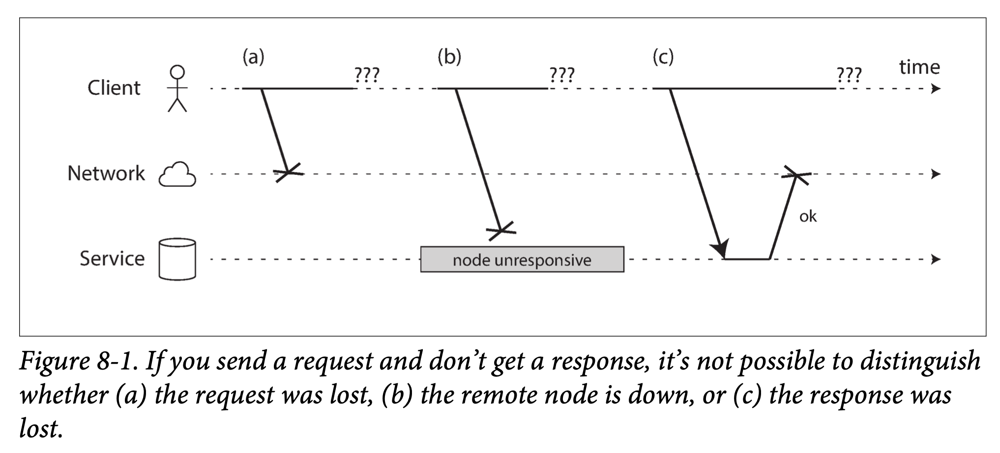
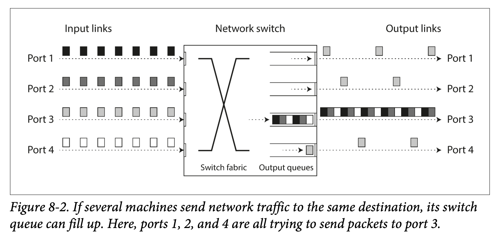
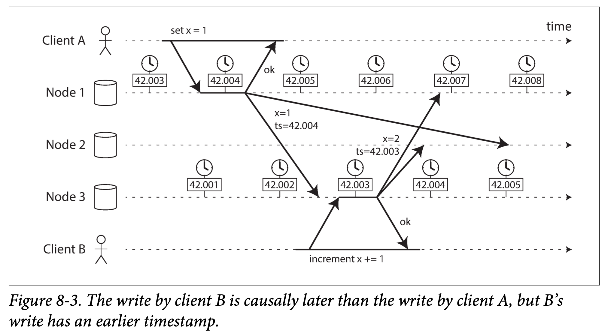
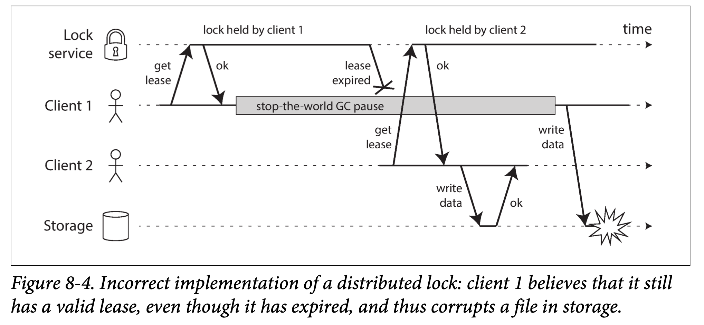
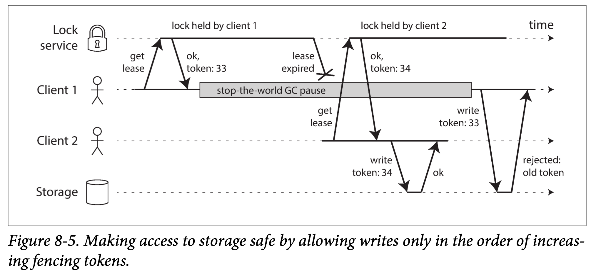

# Chatper 8 The Troubles with Distributed Systems

A recurring theme in the last few chapters has been how systems handle things going wrong. For example, we discussed replica failover (“Handling Node Outages” in chapter 5), replication lag (“Problems with Replication Lag”), and concurrency control for transactions (“Weak Isolation Levels”). As we come to understand various edge cases that can occur in real systems, we get better at handling them.

However, even though we have talked a lot about faults, the last few chapters have still been too optimistic. The reality is even darker. We will now turn our pessimism to the maximum and assume that anything that can go wrong will go wrong.(With one exception: we will assume that faults are non-Byzantine (see “Byzantine Faults” later).) (Experienced systems operators will tell you that is a reasonable assumption. If you ask nicely, they might tell you some frightening stories while nursing their scars of past battles.)

Working with distributed systems is fundamentally different from writing software on a single computer—and the main difference is that there are lots of new and exciting ways for things to go wrong. In this chapter, we will get a taste of the problems that arise in practice, and an understanding of the things we can and cannot rely on.

In the end, our task as engineers is to build systems that do their job (i.e., meet the guarantees that users are expecting), in spite of everything going wrong. In Chapter 9, we will look at some examples of algorithms that can provide such guarantees in a distributed system. But first, in this chapter, we must understand what challenges we are up against.

This chapter is a **thoroughly pessimistic** and depressing overview of things that may go wrong in a distributed system. We will look into problems with networks (“Unreliable Networks”); clocks and timing issues (“Unreliable Clocks”); and we’ll discuss to what degree they are avoidable. The consequences of all these issues are disorienting, so we’ll explore how to think about the state of a distributed system and how to reason about things that have happened (“Knowledge, Truth, and Lies”).

## 8.1 Faults and Partial Failures

When you are writing a program on a single computer, it normally behaves in a fairly predictable way: either it works or it doesn’t. Buggy software may give the appearance that the computer is sometimes “having a bad day” (a problem that is often fixed by a reboot), but that is mostly just a consequence of badly written software.

There is no fundamental reason why software on a single computer should be flaky: when the hardware is working correctly, the same operation always produces the same result (it is deterministic). If there is a hardware problem (e.g., memory corruption or a loose connector), the consequence is usually a total system failure (e.g., **kernel panic**, “blue screen of death,” failure to start up). An individual computer with good software is usually either fully functional or entirely broken, but not something in between.

This is a deliberate choice in the design of computers: if an internal fault occurs, we prefer a computer to crash completely rather than returning a wrong result, because wrong results are difficult and confusing to deal with. Thus, computers hide the fuzzy physical reality on which they are implemented and present an idealized system model that operates with mathematical perfection. A CPU instruction always does the same thing; if you write some data to memory or disk, that data remains intact and doesn’t get randomly corrupted. This design goal of **always-correct computation** goes all the way back to the very first digital computer.

When you are writing software that runs on several computers, connected by a network, the situation is fundamentally different. In distributed systems, we are no longer operating in an idealized system model—we have no choice but to confront the messy reality of the physical world. And in the physical world, a remarkably wide range of things can go wrong, as illustrated by this anecdote:

>In my limited experience I’ve dealt with long-lived network partitions in a single data center (DC), PDU [power distribution unit] failures, switch failures, accidental power cycles of whole racks, whole-DC backbone failures, whole-DC power failures, and a hypoglycemic driver smashing his Ford pickup truck into a DC’s HVAC [heating, ventilation, and air conditioning] system. And I’m not even an ops guy.
>
>—Coda Hale

In a distributed system, there may well be some parts of the system that are broken in some unpredictable way, even though other parts of the system are working fine. This is known as a partial failure. The difficulty is that partial failures are nondeterministic: if you try to do anything involving multiple nodes and the network, it may sometimes work and sometimes unpredictably fail. As we shall see, you may not even know whether something succeeded or not, as the time it takes for a message to travel across a network is also nondeterministic!

This **nondeterminism and possibility of partial failures** is what makes distributed systems hard to work with.

### 8.1.1 Cloud Computing and Supercomputing

There is a spectrum of philosophies on how to build large-scale computing systems:

1. At one end of the scale is the field of high-performance computing (HPC). Supercomputers with thousands of CPUs are typically used for computationally intensive scientific computing tasks, such as weather forecasting or molecular dynamics (simulating the movement of atoms and molecules).
1. At the other extreme is cloud computing, which is not very well defined but is often associated with multi-tenant datacenters, commodity computers connected with an IP network (often Ethernet), elastic/on-demand resource allocation, and metered billing.
1. Traditional enterprise datacenters lie somewhere between these extremes.

With these philosophies come very different approaches to handling faults. In a supercomputer, a job typically checkpoints the state of its computation to durable storage from time to time. If one node fails, a common solution is to simply stop the entire cluster workload. After the faulty node is repaired, the computation is restarted from the last checkpoint. Thus, a supercomputer is more like a single-node computer than a distributed system: it deals with partial failure by letting it escalate into total failure—if any part of the system fails, just let everything crash (like a kernel panic on a single machine).

In this book we focus on systems for implementing internet services, which usually look very different from supercomputers:

1. Many internet-related applications are online, in the sense that they need to be able to serve users with low latency at any time. Making the service unavailable—for example, stopping the cluster for repair—is not acceptable. In contrast, offline (batch) jobs like weather simulations can be stopped and restarted with fairly low impact.
1. Supercomputers are typically built from specialized hardware, where each node is quite reliable, and nodes communicate through shared memory and **remote direct memory access (RDMA)**. On the other hand, nodes in cloud services are built from commodity machines, which can provide equivalent performance at lower cost due to economies of scale, but also have higher failure rates.
1. Large datacenter networks are often based on IP and Ethernet, arranged in **Clos topologies** to provide high bisection bandwidth. Supercomputers often use **specialized network topologies**, such as multi-dimensional meshes and toruses, which yield better performance for HPC workloads with known communication patterns.
1. The bigger a system gets, the more likely it is that one of its components is broken. Over time, broken things get fixed and new things break, but in a system with thousands of nodes, it is reasonable to assume that **something is always broken**. When the error handling strategy consists of simply giving up, a large system can end up spending a lot of its time recovering from faults rather than doing useful work.
1. If the system can **tolerate failed nodes** and still keep working as a whole, that is a very useful feature for operations and maintenance: for example, you can perform a rolling upgrade (see Chapter 4), restarting one node at a time, while the service continues serving users without interruption. In cloud environments, if one virtual machine is not performing well, you can just kill it and request a new one (hoping that the new one will be faster).
1. In a geographically distributed deployment (keeping data geographically close to your users to reduce access latency), communication most likely goes over the internet, which is slow and unreliable compared to local networks. Supercomputers generally assume that all of their nodes are close together.

If we want to make distributed systems work, we must accept the possibility of partial failure and build fault-tolerance mechanisms into the software. In other words, we need to build a reliable system from unreliable components. (As discussed in “Reliability” on page 6, there is no such thing as perfect reliability, so we’ll need to understand the limits of what we can realistically promise.)
Even in smaller systems consisting of only a few nodes, it’s important to think about **partial failure**. In a small system, it’s quite likely that most of the components are working correctly most of the time. However, sooner or later, some part of the system will become faulty, and the software will have to somehow handle it. The fault handling must be part of the software design, and you (as operator of the software) need to know what behavior to expect from the software in the case of a fault.

It would be unwise to assume that faults are rare and simply hope for the best. It is important to consider a wide range of possible faults—even fairly unlikely ones—and to artificially create such situations in your testing environment to see what happens. In distributed systems, suspicion, pessimism, and paranoia pay off.

**Building a Reliable System from Unreliable Components**

You may wonder whether this makes any sense—intuitively it may seem like a system can only be as reliable as its least reliable component (its weakest link). This is not the case: in fact, it is an old idea in computing to construct a more reliable system from a less reliable underlying base. For example:

1. **Error-correcting** codes allow digital data to be transmitted accurately across a communication channel that occasionally gets some bits wrong, for example due to radio interference on a wireless network.
1. IP (the Internet Protocol) is unreliable: it may drop, delay, duplicate, or reorder packets. **TCP (the Transmission Control Protocol) provides a more reliable transport layer on top of IP**: it ensures that missing packets are retransmitted, duplicates are eliminated, and packets are reassembled into the order in which they were sent.

Although the system can be more reliable than its underlying parts, there is always **a limit to how much more reliable it can be**. For example, error-correcting codes can deal with a small number of single-bit errors, but if your signal is swamped by interference, there is a fundamental limit to how much data you can get through your communication channel. TCP can hide packet loss, duplication, and reordering from you, but it cannot magically remove delays in the network.

Although the more reliable higher-level system is not perfect, it’s still useful because it takes care of some of the tricky low-level faults, and so the remaining faults are usually easier to reason about and deal with. We will explore this matter further in “The end-to-end argument”.

## 8.2 Unreliable Networks

As discussed in the introduction to Part II, the distributed systems we focus on in this book are **shared-nothing systems**: i.e., a bunch of machines connected by a network. The network is the only way those machines can communicate—we assume that each machine has its own memory and disk, and one machine cannot access another machine’s memory or disk (except by making requests to a service over the network).

Shared-nothing is not the only way of building systems, but it has become the dominant approach for building internet services, for several reasons: it’s comparatively cheap because it requires no special hardware, it can make use of commoditized cloud computing services, and it can achieve high reliability through redundancy across multiple geographically distributed datacenters.

The internet and most internal networks in datacenters (often Ethernet) are **asynchronous packet networks**. In this kind of network, one node can send a message (a packet) to another node, but the network gives no guarantees as to when it will arrive, or whether it will arrive at all. If you send a request and expect a response, many things could go wrong (some of which are illustrated in Figure 8-1):

1. Your request may have been lost (perhaps someone unplugged a network cable).
2. Your request may be waiting in a queue and will be delivered later (perhaps the network or the recipient is overloaded).
3. The remote node may have failed (perhaps it crashed or it was powered down).
4. The remote node may have temporarily stopped responding (perhaps it is experiencing a long garbage collection pause; see “Process Pauses”), but it will start responding again later.
5. The remote node may have processed your request, but the response has been lost on the network (perhaps a network switch has been misconfigured).
6. The remote node may have processed your request, but the response has been delayed and will be delivered later (perhaps the network or your own machine is overloaded).



The sender can’t even tell whether the packet was delivered: the only option is for the recipient to send a response message, which may in turn be lost or delayed. These issues are indistinguishable in an asynchronous network: the only information you have is that you haven’t received a response yet. If you send a request to another node and don’t receive a response, **it is impossible to tell why**.

The usual way of handling this issue is a **timeout**: after some time you give up waiting and assume that the response is not going to arrive. However, when a timeout occurs, you still don’t know whether the remote node got your request or not (and if the request is still queued somewhere, it may still be delivered to the recipient, even if the sender has given up on it).

### 8.2.1 Network Faults in Practice

We have been building computer networks for decades—one might hope that by now we would have figured out how to make them reliable. However, it seems that we have not yet succeeded.

There are some systematic studies, and plenty of anecdotal evidence, showing that network problems can be surprisingly common, even in controlled environments like a datacenter operated by one company. **One study in a medium-sized datacenter found about 12 network faults per month**, of which half disconnected a single machine, and half disconnected an entire rack. Another study measured the failure rates of components like top-of-rack switches, aggregation switches, and load balancers. It found that adding redundant networking gear doesn’t reduce faults as much as you might hope, since it doesn’t guard against **human error** (e.g., misconfigured switches), which is a major cause of outages.

Public cloud services such as EC2 are notorious for having frequent transient network glitches, and well-managed private datacenter networks can be stabler environments. Nevertheless, nobody is immune from network problems: for example, a problem during a software **upgrade for a switch** could trigger a network topology reconfiguration, during which network packets could be delayed for more than a minute. Sharks might bite undersea cables and damage them. Other surprising faults include a **network interface** that sometimes drops all inbound packets but sends outbound packets successfully: just because a network link works in one direction doesn’t guarantee it’s also working in the opposite direction.

**Network partitions**

When one part of the network is cut off from the rest due to a network fault, that is sometimes called a **network partition or netsplit**. In this book we’ll generally stick with the more general term network fault, to avoid confusion with partitions (shards) of a storage system, as discussed in Chapter 6.

Even if network faults are rare in your environment, the fact that faults can occur means that your software needs to be able to handle them. Whenever any communication happens over a network, it may fail—there is no way around it.

If the error handling of network faults is not defined and tested, arbitrarily bad things could happen: for example, the cluster could become deadlocked and permanently unable to serve requests, even when the network recovers, or it could even delete all of your data. If software is put in an unanticipated situation, it may do arbitrary unexpected things.

Handling network faults doesn’t necessarily mean tolerating them: if your network is normally fairly reliable, a valid approach may be to simply show an error message to users while your network is experiencing problems. However, you do need to know how your software reacts to network problems and ensure that the system can recover from them. It may make sense to **deliberately trigger network problems and test the system’s response** (this is the idea behind **Chaos Monkey**; see “Reliability” on page 6).

### 8.2.2 Detecting Faults

Many systems need to automatically detect faulty nodes. For example:

1. A load balancer needs to stop sending requests to a node that is dead (i.e., take it out of rotation).
1. In a distributed database with single-leader replication, if the leader fails, one of the followers needs to be promoted to be the new leader (see “Handling Node Outages” in chapter 5).

Unfortunately, the uncertainty about the network makes it difficult to tell whether a node is working or not. In some specific circumstances you might get some feedback to explicitly tell you that something is not working:

1. If you can reach the machine on which the node should be running, but no process is listening on the destination port (e.g., because the process crashed), the operating system will helpfully close or refuse TCP connections by sending a **RST or FIN packet** in reply. However, if the node crashed while it was handling your request, you have no way of knowing how much data was actually processed by the remote node.
1. If a node process crashed (or was killed by an administrator) but the node’s operating system is still running, a script can notify other nodes about the crash so that another node can take over quickly without having to wait for a timeout to expire. For example, **HBase does this**.

If you have access to the management interface of the **network switches** in your datacenter, you can query them to detect link failures at a hardware level (e.g., if the remote machine is powered down). This option is ruled out if you’re connecting via the internet, or if you’re in a shared datacenter with no access to the switches themselves, or if you can’t reach the management interface due to a network problem.

1. If a router is sure that the IP address you’re trying to connect to is unreachable, it may reply to you with an **ICMP Destination Unreachable packet**. However, the router doesn’t have a magic failure detection capability either—it is subject to the same limitations as other participants of the network.
1. Rapid feedback about a remote node being down is useful, but you can’t count on it. Even if TCP acknowledges that a packet was delivered, the application may have crashed before handling it. If you want to be sure that a request was successful, you need a positive response from the application itself.

Conversely, if something has gone wrong, you may get an error response at some level of the stack, but in general you have to assume that you will get no response at all. You can retry a few times (TCP retries transparently, but you may also retry at the application level), wait for a timeout to elapse, and eventually declare the node dead if you don’t hear back within the timeout.

### 8.2.3 Timeouts and Unbounded Delays

If a timeout is the only sure way of detecting a fault, then how long should the timeout be? There is unfortunately no simple answer. A long timeout means a long wait until a node is declared dead (and during this time, users may have to wait or see error messages). A short timeout detects faults faster, but carries a higher risk of incorrectly declaring a node dead when in fact it has only suffered a **temporary slowdown (e.g., due to a load spike on the node or the network)**.

Prematurely declaring a node dead is problematic: if the node is actually alive and in the middle of performing some action (for example, sending an email), and another node takes over, **the action may end up being performed twice**. We will discuss this issue in more detail in “Knowledge, Truth, and Lies”, and in Chapters 9 and 11.

When a node is declared dead, its responsibilities need to be transferred to other nodes, which places additional load on other nodes and the network. If the system is already struggling with high load, declaring nodes dead prematurely can make the problem worse. In particular, it could happen that the node actually wasn’t dead but only slow to respond due to overload; transferring its load to other nodes can cause a **cascading failure** (in the extreme case, all nodes declare each other dead, and everything stops working).

Imagine a fictitious system with a network that guaranteed a maximum delay for packets—every packet is either delivered within some time d, or it is lost, but delivery never takes longer than d. Furthermore, assume that you can guarantee that a non-failed node always handles a request within some time r. In this case, you could guarantee that every successful request receives a response within time `2d + r` —and if you don’t receive a response within that time, you know that either the network or the remote node is not working. If this was true, `2d + r` would be a reasonable timeout to use.

Unfortunately, most systems we work with have neither of those guarantees: asynchronous networks have unbounded delays (that is, they try to deliver packets as quickly as possible, but there is no upper limit on the time it may take for a packet to arrive), and most server implementations cannot guarantee that they can handle requests within some maximum time (see “Response time guarantees”). For failure detection, it’s not sufficient for the system to be fast most of the time: if your timeout is low, it only takes a transient spike in round-trip times to throw the system off-balance.

#### 8.2.3.1 Network congestion and queueing

When driving a car, travel times on road networks often vary most due to traffic congestion. Similarly, the variability of packet delays on computer networks is most often due to queueing:

1. If several different nodes simultaneously try to send packets to the same destination, the network switch must queue them up and feed them into the destination network link one by one (as illustrated in Figure 8-2). On a busy network link, a packet may have to wait a while until it can get a slot (this is called **network congestion**). If there is so much incoming data that the switch queue fills up, the packet is dropped, so it needs to be resent—even though the network is functioning fine.
1. When a packet reaches the destination machine, if all CPU cores are currently busy, the incoming request from the network is queued by the operating system until the application is ready to handle it. Depending on the load on the machine, this may take an arbitrary length of time.
1. In virtualized environments, a running operating system is often paused for tens of milliseconds while another virtual machine uses a CPU core. During this time, the VM cannot consume any data from the network, so the incoming data is queued (buffered) by the virtual machine monitor, further increasing the variability of network delays.
1. TCP performs **flow control (also known as congestion avoidance or backpressure)**, in which a node limits its own rate of sending in order to avoid overloading a network link or the receiving node. This means additional queueing at the sender before the data even enters the network.



Moreover, TCP considers a packet to be lost if it is not acknowledged within some timeout (which is calculated from observed round-trip times), and lost packets are automatically retransmitted. Although the application does not see the packet loss and retransmission, it does see the resulting delay (waiting for the timeout to expire, and then waiting for the retransmitted packet to be acknowledged).

**TCP Versus UDP**

Some latency-sensitive applications, such as **videoconferencing and Voice over IP (VoIP), use UDP rather than TCP**. It’s a trade-off between reliability and variability of delays: as **UDP does not perform flow control and does not retransmit lost packets**, it avoids some of the reasons for variable network delays (although it is still susceptible to switch queues and scheduling delays).

UDP is a good choice in situations **where delayed data is worthless**. For example, in a VoIP phone call, there probably isn’t enough time to retransmit a lost packet before its data is due to be played over the loudspeakers. In this case, there’s no point in retransmitting the packet—the application must instead fill the missing packet’s time slot with silence (causing a brief interruption in the sound) and move on in the stream. The **retry happens at the human layer instead**. (“Could you repeat that please? The sound just cut out for a moment.”)

All of these factors contribute to the variability of network delays. Queueing delays have an especially wide range when a system is close to its maximum capacity: a system with plenty of spare capacity can easily drain queues, whereas in a highly utilized system, long queues can build up very quickly.

In public clouds and multi-tenant datacenters, resources are **shared among many customers**: the network links and switches, and even each machine’s network interface and CPUs (when running on virtual machines), are shared. Batch workloads such as MapReduce (see Chapter 10) can easily **saturate network links**. As you have no control over or insight into other customers’ usage of the shared resources, network delays can be highly variable if someone near you (a noisy neighbor) is using a lot of resources.

In such environments, you can only choose timeouts **experimentally**: measure the distribution of network round-trip times over an extended period, and over many machines, to determine the expected variability of delays. Then, taking into account your application’s characteristics, you can determine an appropriate trade-off between failure detection delay and risk of premature timeouts.

Even better, rather than using configured constant timeouts, systems can continually measure response times and their variability (jitter), and automatically adjust timeouts according to the observed response time distribution. This can be done with a **Phi Accrual failure detector**, which is used for example in Akka and Cassandra. **TCP retransmission timeouts also work similarly**.

### 8.2.4 Synchronous Versus Asynchronous Networks

Distributed systems would be a lot simpler if we could rely on the network to deliver packets with some fixed maximum delay, and not to drop packets. Why can’t we solve this at the hardware level and make the network reliable so that the software doesn’t need to worry about it?

To answer this question, it’s interesting to compare datacenter networks to the **traditional fixed-line telephone network (non-cellular, non-VoIP)**, which is extremely reliable: delayed audio frames and dropped calls are very rare. A phone call requires a constantly low end-to-end latency and enough bandwidth to transfer the audio samples of your voice. Wouldn’t it be nice to have similar reliability and predictability in computer networks?

When you make a call over the telephone network, it establishes a circuit: a fixed, **guaranteed amount of bandwidth** is allocated for the call, along the entire route between the two callers. This circuit remains in place until the call ends. For example, an ISDN network runs at a fixed rate of 4,000 frames per second. When a call is established, it is allocated 16 bits of space within each frame (in each direction). Thus, for the duration of the call, **each side is guaranteed to be able to send exactly 16 bits of audio data every 250 microseconds**.

This kind of network is synchronous: even as data passes through several routers, it does not suffer from queueing, because the 16 bits of space for the call have already been reserved in the next hop of the network. And because there is no queueing, the maximum end-to-end latency of the network is fixed. We call this a **bounded delay**.

#### 8.2.4.1 Can we not simply make network delays predictable?

Note that a circuit in a **telephone network is very different from a TCP connection**: a circuit is a fixed amount of reserved bandwidth which nobody else can use while the circuit is established, whereas the packets of a TCP connection opportunistically use whatever network bandwidth is available. You can give TCP a variable-sized block of data (e.g., an email or a web page), and it will try to transfer it in the shortest time possible. While a TCP connection is idle, it doesn’t use any bandwidth.(Except perhaps for an occasional keepalive packet, if TCP keepalive is enabled.)

If datacenter networks and the internet were circuit-switched networks, it would be possible to establish a guaranteed maximum round-trip time when a circuit was set up. However, they are not: Ethernet and IP are **packet-switched protocols**, which suffer from queueing and thus unbounded delays in the network. These protocols do not have the concept of a circuit.

Why do datacenter networks and the internet use **packet switching**? The answer is that they are **optimized for bursty traffic**. A circuit is good for an audio or video call, which needs to transfer a fairly constant number of bits per second for the duration of the call. On the other hand, requesting a web page, sending an email, or transferring a file doesn’t have any particular bandwidth requirement—we just want it to complete as quickly as possible.

If you wanted to transfer a file over a circuit, you would have to guess a bandwidth allocation. If you guess too low, the transfer is unnecessarily slow, leaving network capacity unused. If you guess too high, the circuit cannot be set up (because the network cannot allow a circuit to be created if its bandwidth allocation cannot be guaranteed). Thus, using circuits for bursty data transfers wastes network capacity and makes transfers unnecessarily slow. By contrast, **TCP dynamically adapts the rate of data transfer** to the available network capacity.

There have been some attempts to build **hybrid** networks that support both circuit switching and packet switching, such as ATM.(Asynchronous Transfer Mode (ATM) was a competitor to Ethernet in the 1980s, but it didn’t gain much adoption outside of telephone network core switches. It has nothing to do with automatic teller machines (also known as cash machines), despite sharing an acronym. Perhaps, in some parallel universe, the internet is based on something like ATM—in that universe, internet video calls are probably a lot more reliable than they are in ours, because they don’t suffer from dropped and delayed packets.) **InfiniBand** has some similarities: it implements end-to-end flow control at the link layer, which reduces the need for queueing in the network, although it can still suffer from delays due to link congestion. With careful use of quality of service (QoS, prioritization and scheduling of packets) and admission control (rate-limiting senders), it is possible to emulate circuit switching on packet networks, or provide statistically bounded delay.

**Latency and Resource Utilization**

More generally, you can think of **variable delays as a consequence of dynamic resource partitioning**.

Say you have a wire between two telephone switches that can carry up to 10,000 simultaneous calls. Each circuit that is switched over this wire occupies one of those call slots. Thus, you can think of the wire as a resource that can be shared by up to 10,000 simultaneous users. The resource is divided up in a static way: even if you’re the only call on the wire right now, and all other 9,999 slots are unused, your circuit is still allocated the same fixed amount of bandwidth as when the wire is fully utilized.

By contrast, the internet shares network bandwidth dynamically. Senders push and jostle with each other to get their packets over the wire as quickly as possible, and the network switches decide which packet to send (i.e., the bandwidth allocation) from one moment to the next. This approach has the downside of queueing, but the advantage is that it **maximizes utilization of the wire**. The wire has a fixed cost, so if you utilize it better, each byte you send over the wire is cheaper.

A similar situation arises with CPUs: if you share each CPU core dynamically between several threads, one thread sometimes has to wait in the operating system’s run queue while another thread is running, so a thread can be paused for varying lengths of time. However, this utilizes the hardware better than if you allocated a static number of CPU cycles to each thread (see “Response time guarantees”). Better hardware utilization is also a **significant motivation for using virtual machines**.

Latency guarantees are achievable in certain environments, if resources are statically partitioned (e.g., **dedicated hardware** and exclusive bandwidth allocations). However, it comes at the cost of reduced utilization—in other words, it is **more expensive**. On the other hand, multi-tenancy with dynamic resource partitioning provides better utilization, so it is cheaper, but it has the downside of variable delays.

Variable delays in networks are not a law of nature, but simply the result of a **cost/benefit trade-off**.

However, such quality of service is currently not enabled in multi-tenant datacenters and public clouds, or when communicating via the internet.(Peering agreements between internet service providers and the establishment of routes through the Border Gateway Protocol (BGP), bear closer resemblance to circuit switching than IP itself. At this level, it is possible to buy dedicated bandwidth. However, internet routing operates at the level of networks, not individual connections between hosts, and at a much longer timescale.) Currently deployed technology does not allow us to make any guarantees about delays or reliability of the network: we have to assume that network congestion, queueing, and unbounded delays will happen. Consequently, there’s no “correct” value for timeouts—they need to be determined experimentally.

## 8.3 Unreliable Clocks

Clocks and time are important. Applications depend on clocks in various ways to answer questions like the following:

1. Has this request timed out yet?
1. What’s the 99th percentile response time of this service?
1. How many queries per second did this service handle on average in the last five minutes?
1. How long did the user spend on our site?
1. When was this article published?
1. At what date and time should the reminder email be sent?
1. When does this cache entry expire?
1. What is the timestamp on this error message in the log file?

Examples 1–4 measure durations (e.g., the time interval between a request being sent and a response being received), whereas examples 5–8 describe points in time (events that occur on a particular date, at a particular time).
In a distributed system, time is a **tricky business**, because communication is not instantaneous: it takes time for a message to travel across the network from one machine to another. The time when a message is received is always later than the time when it is sent, but due to variable delays in the network, we don’t know how much later. This fact sometimes makes it difficult to determine the order in which things happened when multiple machines are involved.

Moreover, each machine on the network has its own clock, which is an actual hardware device: usually a **quartz crystal oscillator**. These devices are not perfectly accurate, so each machine has its own notion of time, which may be slightly faster or slower than on other machines. It is possible to synchronize clocks to some degree: the most commonly used mechanism is the **Network Time Protocol (NTP)**, which allows the computer clock to be adjusted according to the time reported by a group of servers. The servers in turn get their time from a more accurate time source, such as a **GPS receiver**.

### 8.3.1 Monotonic Versus Time-of-Day Clocks

Modern computers have at least two different kinds of clocks: **a time-of-day clock and a monotonic clock**. Although they both measure time, it is important to distinguish the two, since they serve different purposes.

#### 8.3.1.1 Time-of-day clocks

A time-of-day clock does what you intuitively expect of a clock: it returns the current date and time according to some calendar (also known as wall-clock time). For example, `clock_gettime(CLOCK_REALTIME)` on Linux(Although the clock is called real-time, it has nothing to do with real-time operating systems, as discussed in “Response time guarantees”.) and `System.currentTimeMillis()` in Java return the number of seconds (or milliseconds) since the epoch: midnight UTC on January 1, 1970, according to the Gregorian calendar, not counting leap seconds. Some systems use other dates as their reference point.

Time-of-day clocks are usually synchronized with NTP, which means that a timestamp from one machine (ideally) means the same as a timestamp on another machine. However, time-of-day clocks also have various oddities, as described in the next section. In particular, if the local clock is too far ahead of the NTP server, it may be forcibly reset and appear to **jump back to a previous point in time**. These jumps, as well as the fact that they often ignore leap seconds, make time-of-day clocks **unsuitable for measuring elapsed time**.

Time-of-day clocks have also historically had quite a coarse-grained resolution, e.g., moving forward in **steps of 10 ms** on older Windows systems. On recent systems, this is less of a problem.

#### 8.3.1.2 Monotonic clocks

A monotonic clock is suitable for measuring a duration (time interval), such as a timeout or a service’s response time:` clock_gettime(CLOCK_MONOTONIC)` on Linux and `System.nanoTime()` in Java are monotonic clocks, for example. The name comes from the fact that they are guaranteed to **always move forward** (whereas a time-of-day clock may jump back in time).

You can check the value of the monotonic clock at one point in time, do something, and then check the clock again at a later time. The difference between the two values tells you how much time elapsed between the two checks. However, the absolute value of the clock is meaningless: it might be the number of nanoseconds since the computer was started, or something similarly arbitrary. In particular, it makes no sense to compare monotonic clock values from two different computers, because they don’t mean the same thing.

On a server with multiple CPU sockets, there may be a **separate timer per CPU**, which is not necessarily synchronized with other CPUs. Operating systems **compensate for any discrepancy** and try to present a monotonic view of the clock to application threads, even as they are scheduled across different CPUs. However, it is wise to take this guarantee of monotonicity with a pinch of salt.

NTP may adjust the frequency at which the monotonic clock moves forward (this is known as **slewing the clock**) if it detects that the computer’s local quartz is moving faster or slower than the NTP server. By default, NTP allows the clock rate to be speeded up or slowed down by up to 0.05%, but NTP cannot cause the monotonic clock to jump forward or backward. The resolution of monotonic clocks is usually quite good: on most systems they can measure time intervals in **microseconds or less**.

In a distributed system, using a monotonic clock for measuring elapsed time (e.g., timeouts) is usually fine, because it doesn’t assume any synchronization between different nodes’ clocks and is not sensitive to slight inaccuracies of measurement.

### 8.3.2 Clock Synchronization and Accuracy

Monotonic clocks don’t need synchronization, but time-of-day clocks need to be set according to an NTP server or other external time source in order to be useful. Unfortunately, our methods for getting a clock to tell the correct time aren’t nearly as reliable or accurate as you might hope—hardware clocks and NTP can be **fickle beasts**. To give just a few examples:

1. The quartz clock in a computer is not very accurate: it drifts (runs faster or slower than it should). Clock drift varies depending on the temperature of the machine. Google assumes a clock drift of 200 ppm (parts per million) for its servers, which is equivalent to 6 ms drift for a clock that is resynchronized with a server every 30 seconds, or **17 seconds drift for a clock that is resynchronized once a day**. This drift limits the best possible accuracy you can achieve, even if everything is working correctly.
1. If a computer’s clock differs too much from an NTP server, it may refuse to synchronize, or the local clock will be forcibly reset. Any applications observing the time before and after this reset may see time go backward or suddenly jump forward.
1. If a node is accidentally firewalled off from NTP servers, the misconfiguration may go unnoticed for some time. Anecdotal evidence suggests that this does happen in practice.
1. NTP synchronization can only be as good as the network delay, so there is a limit to its accuracy when you’re on a congested network with variable packet delays. One experiment showed that a **minimum error of 35 ms** is achievable when synchronizing over the internet, though occasional spikes in network delay lead to errors of **around a second**. Depending on the configuration, large network delays can cause the NTP client to give up entirely.
1. Some NTP servers are wrong or misconfigured, reporting time that is **off by hours**. NTP clients are quite robust, because they query several servers and ignore outliers. Nevertheless, it’s somewhat worrying to bet the correctness of your systems on the time that you were told by a stranger on the internet.
1. **Leap seconds** result in a minute that is 59 seconds or 61 seconds long, which messes up timing assumptions in systems that are not designed with leap seconds in mind. The fact that leap seconds have crashed many large systems shows how easy it is for incorrect assumptions about clocks to sneak into a system. The best way of handling leap seconds may be to make NTP servers “lie,” by performing the leap second adjustment gradually over the course of a day (this is known as **smearing**), although actual NTP server behavior varies in practice.
1. In virtual machines, the **hardware clock is virtualized**, which raises additional challenges for applications that need accurate timekeeping. When a CPU core is shared between virtual machines, each VM is paused for tens of milliseconds while another VM is running. From an application’s point of view, **this pause manifests itself as the clock suddenly jumping forward**.
1. If you run software on devices that you don’t fully control (e.g., mobile or embedded devices), you probably cannot trust the device’s hardware clock at all. Some users deliberately set their hardware clock to an incorrect date and time, for example to circumvent timing limitations in games. As a result, the clock might be set to a time wildly in the past or the future.

It is possible to achieve very good clock accuracy if you care about it sufficiently to invest significant resources. For example, the MiFID II draft European regulation for financial institutions requires all high-frequency trading funds to synchronize their clocks to within **100 microseconds of UTC**, in order to help debug market anomalies such as “flash crashes” and to help detect market manipulation.

Such accuracy can be achieved using **GPS receivers, the Precision Time Protocol (PTP)**, and careful deployment and monitoring. However, it requires significant effort and expertise, and there are plenty of ways clock synchronization can go wrong. If your NTP daemon is misconfigured, or a firewall is blocking NTP traffic, the clock error due to drift can quickly become large.

### 8.3.3 Relying on Synchronized Clocks

The problem with clocks is that while they seem simple and easy to use, they have a surprising number of pitfalls: a day may not have exactly 86,400 seconds, time-of-day clocks may move backward in time, and the time on one node may be quite different from the time on another node.

Earlier in this chapter we discussed networks dropping and arbitrarily delaying packets. Even though networks are well behaved most of the time, software must be designed on the assumption that the network will occasionally be faulty, and the software must handle such faults gracefully. The same is true with clocks: although they work quite well most of the time, robust software needs to be prepared to deal with incorrect clocks.

Part of the problem is that incorrect clocks **easily go unnoticed**. If a machine’s CPU is defective or its network is misconfigured, it most likely won’t work at all, so it will quickly be noticed and fixed. On the other hand, if its quartz clock is defective or its NTP client is misconfigured, most things will seem to work fine, even though its clock gradually drifts further and further away from reality. If some piece of software is relying on an accurately synchronized clock, the result is more likely to be silent and subtle data loss than a dramatic crash.

Thus, if you use software that requires synchronized clocks, it is essential that you also carefully monitor the clock offsets between all the machines. Any node whose clock drifts too far from the others should be declared dead and removed from the cluster. Such monitoring ensures that you notice the broken clocks before they can cause too much damage.

### 8.3.3.1 Timestamps for ordering events

Let’s consider one particular situation in which it is tempting, but dangerous, to rely on clocks: ordering of events across multiple nodes. For example, if two clients write to a distributed database, who got there first? Which write is the more recent one?

Figure 8-3 illustrates a dangerous use of time-of-day clocks in a database with multi-leader replication (the example is similar to Figure 5-9). Client A writes x = 1 on node 1; the write is replicated to node 3; client B increments x on node 3 (we now have x = 2); and finally, both writes are replicated to node 2.



In Figure 8-3, when a write is replicated to other nodes, it is tagged with a timestamp according to the time-of-day clock on the node where the write originated. The clock synchronization is very good in this example: the skew between node 1 and node 3 is less than 3 ms, which is probably better than you can expect in practice.

Nevertheless, the timestamps in Figure 8-3 **fail to order the events correctly**: the write x = 1 has a timestamp of 42.004 seconds, but the write x = 2 has a timestamp of 42.003 seconds, even though x = 2 occurred unambiguously later. When node 2 receives these two events, it will incorrectly conclude that x = 1 is the more recent value and drop the write x = 2. In effect, client B’s increment operation will be lost.

This conflict resolution strategy is called **last write wins (LWW)**, and it is widely used in both multi-leader replication and leaderless databases such as Cassandra and Riak (see “Last write wins (discarding concurrent writes)”). Some implementations generate timestamps on the client rather than the server, but this doesn’t change the fundamental problems with LWW:

1. Database writes can mysteriously disappear: a node with a lagging clock is unable to overwrite values previously written by a node with a fast clock until the clock skew between the nodes has elapsed. This scenario can cause arbitrary amounts of data to be **silently dropped without any error being reported** to the application.
1. LWW cannot distinguish between writes that occurred sequentially in quick succession (in Figure 8-3, client B’s increment definitely occurs after client A’s write) and writes that were truly concurrent (neither writer was aware of the other). Additional causality tracking mechanisms, such as **version vectors**, are needed in order to prevent violations of causality (see “Detecting Concurrent Writes”).
1. It is possible for two nodes to independently generate writes with the **same timestamp**, especially when the clock only has millisecond resolution. An additional tiebreaker value (which can simply be a large random number) is required to resolve such conflicts, but this approach can also lead to violations of causality.

Thus, even though it is tempting to resolve conflicts by keeping the most “recent” value and discarding others, it’s important to be aware that the definition of “recent” depends on a local time-of-day clock, which may well be incorrect. Even with tightly NTP-synchronized clocks, you could send a packet at timestamp 100 ms (according to the sender’s clock) and have it arrive at timestamp 99 ms (according to the recipient’s clock)—so it appears as though **the packet arrived before it was sent**, which is impossible.

Could NTP synchronization be made accurate enough that such incorrect orderings cannot occur? Probably not, because NTP’s **synchronization accuracy is itself limited by the network round-trip time**, in addition to other sources of error such as quartz drift. For correct ordering, you would need the clock source to be significantly more accurate than the thing you are measuring (namely network delay).

So-called logical clocks, which are based on **incrementing counters** rather than an oscillating quartz crystal, are a safer alternative for ordering events (see “Detecting Concurrent Writes”). Logical clocks do not measure the time of day or the number of seconds elapsed, only the relative ordering of events (whether one event happened before or after another). In contrast, time-of-day and monotonic clocks, which measure actual elapsed time, are also known as physical clocks. We’ll look at ordering a bit more in “Ordering Guarantees” later.

### 8.3.3.2 Clock readings have a confidence interval

You may be able to read a machine’s time-of-day clock with microsecond or even nanosecond resolution. But even if you can get such a fine-grained measurement, that doesn’t mean the value is actually accurate to such precision. In fact, it most likely is not—as mentioned previously, the drift in an imprecise quartz clock can easily be several milliseconds, even if you synchronize with an NTP server on the local network every minute. With an NTP server on the public internet, **the best possible accuracy is probably to the tens of milliseconds**, and the error may easily spike to over 100 ms when there is network congestion.

Thus, it doesn’t make sense to think of a clock reading as a point in time—it is more like a range of times, within a confidence interval: for example, a system may be 95% confident that the time now is between 10.3 and 10.5 seconds past the minute, but it doesn’t know any more precisely than that. If we only know the time +/– 100 ms, the microsecond digits in the timestamp are essentially meaningless.

The uncertainty bound can be calculated based on your time source. If you have a GPS receiver or atomic (caesium) clock directly attached to your computer, the expected error range is reported by the manufacturer. If you’re getting the time from a server, the uncertainty is based on the expected quartz drift since your last sync with the server, plus the NTP server’s uncertainty, plus the network round-trip time to the server (to a first approximation, and assuming you trust the server).

Unfortunately, most systems don’t expose this uncertainty: for example, when you call clock_gettime(), the return value doesn’t tell you the expected error of the timestamp, so you don’t know if its confidence interval is five milliseconds or five years.
An interesting exception is **Google’s TrueTime API in Spanner**, which explicitly reports the confidence interval on the local clock. When you ask it for the current time, you get back two values: [earliest, latest], which are the earliest possible and the latest possible timestamp. Based on its uncertainty calculations, the clock knows that the actual current time is somewhere within that interval. The width of the interval depends, among other things, on how long it has been since the local quartz clock was last synchronized with a more accurate clock source.

### 8.3.3.3 Synchronized clocks for global snapshots

In “Snapshot Isolation and Repeatable Read” we discussed snapshot isolation, which is a very useful feature in databases that need to support both small, fast read-write transactions and large, long-running read-only transactions (e.g., for backups or analytics). It allows read-only transactions to see the database in a consistent state at a particular point in time, without locking and interfering with read-write transactions.

The most common implementation of snapshot isolation requires a **monotonically increasing transaction ID**. If a write happened later than the snapshot (i.e., the write has a greater transaction ID than the snapshot), that write is invisible to the snapshot transaction. On a single-node database, a simple counter is sufficient for generating transaction IDs.

However, when a database is distributed across many machines, potentially in multiple datacenters, a global, monotonically increasing transaction ID (across all partitions) is difficult to generate, because it requires coordination. The transaction ID must reflect causality: if transaction B reads a value that was written by transaction A, then B must have a higher transaction ID than A—otherwise, the snapshot would not be consistent. With lots of small, rapid transactions, creating transaction IDs in a distributed system becomes an untenable **bottleneck**.(There are distributed sequence number generators, such as **Twitter’s Snowflake**, that generate approximately monotonically increasing unique IDs in a scalable way (e.g., by allocating blocks of the ID space to different nodes). However, they typically cannot guarantee an ordering that is consistent with causality, because the timescale at which blocks of IDs are assigned is longer than the timescale of database reads and writes. See also “Ordering Guarantees” later.)

Can we use the timestamps from synchronized time-of-day clocks as transaction IDs? If we could get the synchronization good enough, they would have the right properties: later transactions have a higher timestamp. The problem, of course, is the uncertainty about clock accuracy.

Spanner implements snapshot isolation across datacenters in this way. It uses the clock’s confidence interval as reported by the TrueTime API, and is based on the following observation: if you have two confidence intervals, each consisting of an earliest and latest possible timestamp (A = [Aearliest, Alatest] and B = [Bearliest, Blatest]), and those two intervals do not overlap (i.e., Aearliest < Alatest < Bearliest < Blatest), then B definitely happened after A—there can be no doubt. Only if the intervals overlap are we unsure in which order A and B happened.

In order to ensure that transaction timestamps reflect causality, Spanner **deliberately waits for the length of the confidence interval** before committing a read-write transaction. By doing so, it ensures that any transaction that may read the data is at a sufficiently later time, so their confidence intervals do not overlap. In order to keep the wait time as short as possible, Spanner needs to keep the clock uncertainty as small as possible; for this purpose, **Google deploys a GPS receiver or atomic clock in each datacenter**, allowing clocks to be synchronized to within about **7 ms**.

Using clock synchronization for distributed transaction semantics is an area of active research. These ideas are interesting, but they have not yet been implemented in mainstream databases outside of Google.

### 8.3.4 Process Pauses

Let’s consider another example of dangerous clock use in a distributed system. Say you have a database with a single leader per partition. Only the leader is allowed to accept writes. How does a node know that it is still leader (that it hasn’t been declared dead by the others), and that it may safely accept writes?

One option is for the leader to **obtain a lease from the other nodes**, which is similar to a lock with a timeout. Only one node can hold the lease at any one time—thus, when a node obtains a lease, it knows that it is the leader for some amount of time, until the lease expires. In order to remain leader, the node must periodically renew the lease before it expires. If the node fails, it stops renewing the lease, so another node can take over when it expires.

You can imagine the request-handling loop looking something like this:

```c
while (true) {
    request = getIncomingRequest();
    // Ensure that the lease always has at least 10 seconds remaining
    if (lease.expiryTimeMillis - System.currentTimeMillis() < 10000) {
        lease = lease.renew();
    }
    if (lease.isValid()) {
        process(request);
    }
}
```

What’s wrong with this code? Firstly, it’s relying on synchronized clocks: the expiry time on the lease is set by a different machine (where the expiry may be calculated as the current time plus 30 seconds, for example), and it’s being compared to the local system clock. If the clocks are out of sync by more than a few seconds, this code will start doing strange things.

Secondly, even if we change the protocol to only use the local monotonic clock, there is another problem: the code **assumes that very little time passes between** the point that it checks the time (System.currentTimeMillis()) and the time when the request is processed (process(request)). Normally this code runs very quickly, so the 10 second buffer is more than enough to ensure that the lease doesn’t expire in the middle of processing a request.

However, what if there is an unexpected pause in the execution of the program? For example, imagine the thread stops for 15 seconds around the line lease.isValid() before finally continuing. In that case, it’s likely that the lease will have expired by the time the request is processed, and another node has already taken over as leader. However, there is nothing to tell this thread that it was paused for so long, so this code **won’t notice that the lease has expired** until the next iteration of the loop—by which time it may have already done something unsafe by processing the request.

Is it crazy to assume that a thread might be paused for so long? Unfortunately not. There are various reasons why this could happen:

1. Many programming language runtimes (such as the Java Virtual Machine) have a garbage collector (GC) that occasionally needs to stop all running threads. These “stop-the-world” GC pauses have sometimes been known to last for several minutes! Even so-called “concurrent” garbage collectors like the HotSpot JVM’s CMS cannot fully run in parallel with the application code—even they need to stop the world from time to time. Although the pauses can often be reduced by changing allocation patterns or tuning GC settings, we must assume the worst if we want to offer robust guarantees.
1. In virtualized environments, a virtual machine can be suspended (pausing the execution of all processes and saving the contents of memory to disk) and resumed (restoring the contents of memory and continuing execution). This pause can occur at any time in a process’s execution and can last for an arbitrary length of time. This feature is sometimes used for **live migration of virtual machines from one host to another without a reboot**, in which case the length of the pause depends on the rate at which processes are writing to memory.
1. On end-user devices such as laptops, execution may also be suspended and resumed arbitrarily, e.g., when the user closes the lid of their laptop.
1. When the operating system context-switches to another thread, or when the **hypervisor switches to a different virtual machine** (when running in a virtual machine), the currently running thread can be paused at any arbitrary point in the code. In the case of a virtual machine, the CPU time spent in other virtual machines is known as **steal time**. If the machine is under heavy load—i.e., if there is a long queue of threads waiting to run—it may take some time before the paused thread gets to run again.
1. If the application performs **synchronous disk access**, a thread may be paused waiting for a slow disk I/O operation to complete. In many languages, disk access can happen surprisingly, even if the code doesn’t explicitly mention file access—for example, **the Java classloader lazily loads class files when they are first used**, which could happen at any time in the program execution. I/O pauses and GC pauses may even conspire to combine their delays. If the disk is actually a network filesystem or network block device (such as Amazon’s EBS), the I/O latency is further subject to the variability of network delays.
1. If the operating system is configured to allow swapping to disk (**paging**), a simple memory access may result in a page fault that requires a page from disk to be loaded into memory. The thread is paused while this slow I/O operation takes place. If memory pressure is high, this may in turn require a different page to be swapped out to disk. In extreme circumstances, the operating system may spend most of its time swapping pages in and out of memory and getting little actual work done (this is known as **thrashing**). To avoid this problem, **paging is often disabled on server machines** (if you would rather kill a process to free up memory than risk thrashing).
1. A Unix process can be paused by sending it the SIGSTOP signal, for example by pressing Ctrl-Z in a shell. This signal immediately stops the process from getting any more CPU cycles until it is resumed with SIGCONT, at which point it continues running where it left off. Even if your environment does not normally use SIGSTOP, it might be sent accidentally by an **operations engineer**.

All of these occurrences can preempt the running thread at any point and resume it at some later time, without the thread even noticing. The problem is similar to making multi-threaded code on a single machine thread-safe: you can’t assume anything about timing, because arbitrary context switches and parallelism may occur.

When writing multi-threaded code on a single machine, we have fairly good tools for making it thread-safe: **mutexes, semaphores, atomic counters, lock-free data structures, blocking queues, and so on**. Unfortunately, these tools don’t directly translate to distributed systems, because a distributed system has no shared memory—only messages sent over an unreliable network.

A node in a distributed system must assume that its execution can be paused for a significant length of time at any point, even in the middle of a function. During the pause, the rest of the world keeps moving and may even declare the paused node dead because it’s not responding. Eventually, the paused node may continue running, without even noticing that it was asleep until it checks its clock sometime later.

#### 8.3.4.1 Response time guarantees

In many programming languages and operating systems, threads and processes may pause for an unbounded amount of time, as discussed. Those reasons for pausing can be eliminated if you **try hard enough**.

Some software runs in environments where a failure to respond within a specified time can cause serious damage: computers that control aircraft, rockets, robots, cars, and other physical objects must respond quickly and predictably to their sensor inputs. In these systems, there is a specified deadline by which the software must respond; if it doesn’t meet the deadline, that may cause a failure of the entire system. These are so-called **hard real-time systems**.

**Is real-time really real?**

In embedded systems, real-time means that a system is carefully designed and tested to meet specified timing guarantees in all circumstances. This meaning is in contrast to the more vague use of the term real-time on the web, where it describes servers pushing data to clients and stream processing without hard response time constraints (see Chapter 11).

For example, if your car’s onboard sensors detect that you are currently experiencing a crash, you wouldn’t want the release of the airbag to be delayed due to an inopportune GC pause in the airbag release system.

Providing real-time guarantees in a system requires support from all levels of the software stack: a real-time operating system (RTOS) that allows processes to be scheduled with a guaranteed allocation of CPU time in specified intervals is needed; library functions must document their worst-case execution times; **dynamic memory allocation may be restricted or disallowed entirely** (real-time garbage collectors exist, but the application must still ensure that it doesn’t give the GC too much work to do); and an enormous amount of testing and measurement must be done to ensure that guarantees are being met.

All of this requires a large amount of additional work and severely restricts the range of programming languages, libraries, and tools that can be used (since most languages and tools do not provide real-time guarantees). For these reasons, developing real-time systems is very expensive, and they are most commonly used in safety-critical embedded devices. Moreover, “real-time” is not the same as “high-performance”—in fact, real-time systems may have lower throughput, since they have to prioritize timely responses above all else (see also “Latency and Resource Utilization”).

For most server-side data processing systems, real-time guarantees are simply not economical or appropriate. Consequently, these systems must suffer the pauses and clock instability that come from operating in a non-real-time environment.

#### 8.3.4.2 Limiting the impact of garbage collection

The negative effects of process pauses can be **mitigated** without resorting to expensive real-time scheduling guarantees. Language runtimes have some flexibility around when they schedule garbage collections, because they can track the rate of object allocation and the remaining free memory over time.

An emerging idea is to treat **GC pauses like brief planned outages of a node**, and to let other nodes handle requests from clients while one node is collecting its garbage. If the runtime can warn the application that a node soon requires a GC pause, the application can stop sending new requests to that node, wait for it to finish processing outstanding requests, and then perform the GC while no requests are in progress. This trick hides GC pauses from clients and reduces the high percentiles of response time. Some latency-sensitive financial trading systems use this approach.

**A variant** of this idea is to use the garbage collector only for short-lived objects (which are fast to collect) and to restart processes periodically, before they accumulate enough long-lived objects to require a full GC of long-lived objects. One node can be restarted at a time, and traffic can be shifted away from the node before the planned restart, like in a rolling upgrade (see Chapter 4).

These measures cannot fully prevent garbage collection pauses, but they can usefully reduce their impact on the application.

## 8.4 Knowledge, Truth, and Lies

So far in this chapter we have explored the ways in which distributed systems are different from programs running on a single computer: there is no shared memory, only message passing via an unreliable network with variable delays, and the systems may suffer from partial failures, unreliable clocks, and processing pauses.

The consequences of these issues are profoundly disorienting if you’re not used to distributed systems. A node in the network cannot know anything for sure—it can only make guesses based on the messages it receives (or doesn’t receive) via the network. A node can only find out what state another node is in (what data it has stored, whether it is correctly functioning, etc.) by exchanging messages with it. If a remote node doesn’t respond, there is no way of knowing what state it is in, because problems in the network cannot reliably be distinguished from problems at a node.

Discussions of these systems border on the philosophical: What do we know to be true or false in our system? How sure can we be of that knowledge, if the mechanisms for perception and measurement are unreliable? Should software systems obey the laws that we expect of the physical world, such as cause and effect?

Fortunately, we don’t need to go as far as figuring out the meaning of life. In a distributed system, we can state the **assumptions** we are making about the behavior (the system model) and design the actual system in such a way that it meets those assumptions. Algorithms can be proved to function correctly within a certain system model. This means that reliable behavior is achievable, even if the underlying system model provides very few guarantees.

However, although it is possible to make software well behaved in an unreliable system model, it is not straightforward to do so. In the rest of this chapter we will further explore the notions of knowledge and truth in distributed systems, which will help us think about the kinds of assumptions we can make and the guarantees we may want to provide. In Chapter 9 we will proceed to look at some examples of distributed systems, algorithms that provide particular guarantees under particular assumptions.

### 8.4.1 The Truth Is Defined by the Majority

Imagine a network with an **asymmetric fault**: a node is able to receive all messages sent to it, but any outgoing messages from that node are dropped or delayed. Even though that node is working perfectly well, and is receiving requests from other nodes, the other nodes cannot hear its responses. After some timeout, the other nodes declare it dead, because they haven’t heard from the node. The situation unfolds like a nightmare: the semi-disconnected node is dragged to the graveyard, kicking and screaming “I’m not dead!”—but since nobody can hear its screaming, the funeral procession continues with stoic determination.

In a slightly less nightmarish scenario, the semi-disconnected node may notice that the messages it is sending are not being acknowledged by other nodes, and so realize that there must be a fault in the network. Nevertheless, the node is wrongly declared dead by the other nodes, and the semi-disconnected node cannot do anything about it.

As a third scenario, imagine a node that experiences a long stop-the-world garbage collection pause. All of the node’s threads are preempted by the GC and paused for one minute, and consequently, no requests are processed and no responses are sent. The other nodes wait, retry, grow impatient, and eventually declare the node dead and load it onto the hearse. Finally, the GC finishes and the node’s threads continue as if nothing had happened. The other nodes are surprised as the supposedly dead node suddenly raises its head out of the coffin, in full health, and starts cheerfully chatting with bystanders. At first, the GCing node doesn’t even realize that an entire minute has passed and that it was declared dead—from its perspective, hardly any time has passed since it was last talking to the other nodes.

The moral of these stories is that a node cannot necessarily trust its own judgment of a situation. A distributed system cannot exclusively rely on a single node, because a node may fail at any time, potentially leaving the system stuck and unable to recover. Instead, many distributed algorithms r**ely on a quorum**, that is, voting among the nodes (see “Quorums for reading and writing”): decisions require some minimum number of votes from several nodes in order to reduce the dependence on any one particular node.

That includes decisions about declaring nodes dead. If a quorum of nodes declares another node dead, then it must be considered dead, even if that node still very much feels alive. The individual node must abide by the quorum decision and step down.

Most commonly, the quorum is an absolute majority of more than half the nodes (although other kinds of quorums are possible). A majority quorum allows the system to continue working if individual nodes have failed (with three nodes, one failure can be tolerated; with five nodes, two failures can be tolerated). However, it is still safe, because there can only be only one majority in the system—there cannot be two majorities with conflicting decisions at the same time. We will discuss the use of quorums in more detail when we get to consensus algorithms in Chapter 9.

#### 8.4.1.1 The leader and the lock

Frequently, a system requires there to be only one of some thing. For example:

1. Only one node is allowed to be the leader for a database partition, to avoid split brain (see “Handling Node Outages”).
1. Only one transaction or client is allowed to hold the lock for a particular resource or object, to prevent concurrently writing to it and corrupting it.
1. Only one user is allowed to register a particular username, because a username must uniquely identify a user.

Implementing this in a distributed system requires care: even if a node believes that it is “the chosen one” (the leader of the partition, the holder of the lock, the request handler of the user who successfully grabbed the username), that doesn’t necessarily mean a quorum of nodes agrees! A node may have formerly been the leader, but if the other nodes declared it dead in the meantime (e.g., due to a network interruption or GC pause), it may have been demoted and another leader may have already been elected.

If a node continues acting as the chosen one, even though the majority of nodes have declared it dead, it could cause problems in a system that is not carefully designed. Such a node could send messages to other nodes in its self-appointed capacity, and if other nodes believe it, the system as a whole may do something incorrect.

For example, Figure 8-4 shows a data corruption bug due to an incorrect implementation of locking. (The bug is not theoretical: **HBase used to have this problem**.) Say you want to ensure that a file in a storage service can only be accessed by one client at a time, because if multiple clients tried to write to it, the file would become corrupted. You try to implement this by requiring a client to obtain a lease from a lock service before accessing the file.



The problem is an example of what we discussed in “Process Pauses”: if the client holding the lease is paused for too long, its lease expires. Another client can obtain a lease for the same file, and start writing to the file. When the paused client comes back, it believes (incorrectly) that it still has a valid lease and proceeds to also write to the file. As a result, the clients’ writes clash and corrupt the file.

#### 8.4.1.2 Fencing tokens

When using a lock or lease to protect access to some resource, such as the file storage in Figure 8-4, we need to ensure that a node that is under a false belief of being “the chosen one” cannot disrupt the rest of the system. A fairly simple technique that achieves this goal is called **fencing**, and is illustrated in Figure 8-5.



Let’s assume that every time the lock server grants a lock or lease, it also returns a fencing token, which is a number that increases every time a lock is granted (e.g., incremented by the lock service). We can then require that every time a client sends a write request to the storage service, it must include its current fencing token.

In Figure 8-5, client 1 acquires the lease with a token of 33, but then it goes into a long pause and the lease expires. Client 2 acquires the lease with a token of 34 (the number always increases) and then sends its write request to the storage service, including the token of 34. Later, client 1 comes back to life and sends its write to the storage service, including its token value 33. However, the storage server remembers that it has already processed a write with a higher token number (34), and so it rejects the request with token 33.

If ZooKeeper is used as lock service, the transaction ID `zxid` or the node version `cversion` can be used as fencing token. Since they are guaranteed to be monotonically increasing, they have the required properties.

Note that this mechanism requires the resource itself to take an active role in checking tokens by rejecting any writes with an older token than one that has already been processed—it is not sufficient to rely on clients checking their lock status themselves. For resources that do not explicitly support fencing tokens, you might still be able work around the limitation (for example, in the case of a file storage service you could include the fencing token in the filename). However, some kind of check is necessary to avoid processing requests outside of the lock’s protection.

**Checking a token on the server side** may seem like a downside, but it is arguably a good thing: it is unwise for a service to assume that its clients will always be well behaved, because the clients are often run by people whose priorities are very different from the priorities of the people running the service. Thus, it is a good idea for any service to protect itself from accidentally abusive clients.

### 8.4.2 Byzantine Faults

Fencing tokens can detect and block a node that is inadvertently acting in error (e.g., because it hasn’t yet found out that its lease has expired). However, if the node deliberately wanted to subvert the system’s guarantees, it could easily do so by sending messages with a fake fencing token.

In this book we assume that nodes are unreliable but honest: they may be slow or never respond (due to a fault), and their state may be outdated (due to a GC pause or network delays), but we assume that if a node does respond, it is telling the “truth”: to the best of its knowledge, it is playing by the rules of the protocol.

Distributed systems problems become much harder if there is a risk that **nodes may “lie”** (send arbitrary faulty or corrupted responses)—for example, if a node may claim to have received a particular message when in fact it didn’t. Such behavior is known as a Byzantine fault, and the problem of reaching consensus in this untrusting environment is known as the Byzantine Generals Problem.

**The Byzantine Generals Problem**

The Byzantine Generals Problem is a generalization of the so-called **Two Generals Problem**, which imagines a situation in which two army generals need to agree on a battle plan. As they have set up camp on two different sites, they can only communicate by messenger, and the messengers sometimes get delayed or lost (like packets in a network). We will discuss this problem of consensus in Chapter 9.
In the Byzantine version of the problem, there are n generals who need to agree, and their endeavor is hampered by the fact that there are some traitors in their midst. Most of the generals are loyal, and thus send truthful messages, but the traitors may try to deceive and confuse the others by sending fake or untrue messages (while trying to remain undiscovered). It is not known in advance who the traitors are.

Byzantium was an ancient Greek city that later became Constantinople, in the place which is now Istanbul in Turkey. There isn’t any historic evidence that the generals of Byzantium were any more prone to intrigue and conspiracy than those elsewhere. Rather, the name is derived from Byzantine in the sense of excessively complicated, bureaucratic, devious, which was used in politics long before computers. Lamport wanted to choose a nationality that would not offend any readers, and he was advised that calling it The Albanian Generals Problem was not such a good idea.

A system is Byzantine fault-tolerant if it continues to operate correctly even if some of the nodes are malfunctioning and not obeying the protocol, or if malicious attackers are interfering with the network. This concern is relevant in certain specific circumstances. For example:

1. In aerospace environments, the data in a computer’s memory or CPU register could become **corrupted by radiation**, leading it to respond to other nodes in arbitrarily unpredictable ways. Since a system failure would be very expensive (e.g., an aircraft crashing and killing everyone on board, or a rocket colliding with the International Space Station), flight control systems must tolerate Byzantine faults.
1. In a system with multiple participating organizations, some participants may attempt to cheat or defraud others. In such circumstances, it is not safe for a node to simply trust another node’s messages, since they may be sent with malicious intent. For example, peer-to-peer networks like Bitcoin and other blockchains can be considered to be a way of getting mutually untrusting parties to agree whether a transaction happened or not, without relying on a central authority.

However, in the kinds of systems we discuss in this book, we can **usually safely assume that there are no Byzantine faults**. In your datacenter, all the nodes are controlled by your organization (so they can hopefully be trusted) and radiation levels are low enough that memory corruption is not a major problem. Protocols for making systems Byzantine fault-tolerant are quite complicated, and fault-tolerant embedded systems rely on support from the hardware level. In most server-side data systems, the cost of deploying Byzantine fault-tolerant solutions makes them **impractical**.

Web applications do need to expect arbitrary and malicious behavior of clients that are under end-user control, such as web browsers. This is why input validation, sanitization, and output escaping are so important: to prevent SQL injection and cross-site scripting, for example. However, we typically don’t use Byzantine fault-tolerant protocols here, but simply make the server the authority on deciding what client behavior is and isn’t allowed. In peer-to-peer networks, where there is no such central authority, Byzantine fault tolerance is more relevant.

A bug in the software could be regarded as a Byzantine fault, but if you deploy the same software to all nodes, then a Byzantine fault-tolerant algorithm cannot save you. Most Byzantine fault-tolerant algorithms require a supermajority of more than two-thirds of the nodes to be functioning correctly (i.e., if you have four nodes, at most one may malfunction). To use this approach against bugs, you would have to have four independent implementations of the same software and hope that a bug only appears in one of the four implementations.

Similarly, it would be appealing if a protocol could protect us from vulnerabilities, security compromises, and malicious attacks. Unfortunately, this is not realistic either: in most systems, if an attacker can compromise one node, they can probably compromise all of them, because they are probably running the same software. Thus, traditional mechanisms (authentication, access control, encryption, firewalls, and so on) continue to be the main protection against attackers.

#### 8.4.2.1 Weak forms of lying

Although we assume that nodes are generally honest, it can be worth adding mechanisms to software that guard against weak forms of “lying”—for example, invalid messages due to hardware issues, software bugs, and misconfiguration. Such protection mechanisms are not full-blown Byzantine fault tolerance, as they would not withstand a determined adversary, but they are nevertheless simple and pragmatic steps toward better reliability. For example:

1. Network packets do sometimes get corrupted due to hardware issues or bugs in operating systems, drivers, routers, etc. Usually, corrupted packets are caught by the **checksums built into TCP and UDP**, but sometimes they evade detection. Simple measures are usually sufficient protection against such corruption, such as **checksums in the application-level protocol**.
1. A publicly accessible application must carefully sanitize any inputs from users, for example checking that a value is within a reasonable range and limiting the size of strings to prevent denial of service through large memory allocations. An internal service behind a firewall may be able to get away with less strict checks on inputs, but some basic **sanity-checking** of values (e.g., in protocol parsing) is a good idea.
1. NTP clients can be configured with multiple server addresses. When synchronizing, the client contacts all of them, estimates their errors, and checks that a majority of servers agree on some time range. As long as most of the servers are okay, a misconfigured NTP server that is reporting an incorrect time is **detected as an outlier** and is excluded from synchronization. The use of multiple servers makes NTP more robust than if it only uses a single server.


### 8.4.3 System Model and Reality

Many algorithms have been designed to solve distributed systems problems—for example, we will examine solutions for the consensus problem in Chapter 9. In order to be useful, these algorithms need to tolerate the various faults of distributed systems that we discussed in this chapter.

Algorithms need to be written in a way that does not depend too heavily on the details of the hardware and software configuration on which they are run. This in turn requires that we somehow formalize the kinds of faults that we expect to happen in a system. We do this by defining a system model, which is **an abstraction that describes what things an algorithm may assume**.

With regard to **timing assumptions**, three system models are in common use:

**Synchronous model**

The synchronous model assumes **bounded network delay, bounded process pauses, and bounded clock error**. This does not imply exactly synchronized clocks or zero network delay; it just means you know that network delay, pauses, and clock drift will never exceed some fixed upper bound. The synchronous model is not a realistic model of most practical systems, because (as discussed in this chapter) unbounded delays and pauses do occur.

**Partially synchronous model**

Partial synchrony means that a system behaves like a synchronous system most of the time, but it sometimes exceeds the bounds for network delay, process pauses, and clock drift. This is a **realistic** model of many systems: most of the time, networks and processes are quite well behaved—otherwise we would never be able to get anything done—but we have to reckon with the fact that any timing assumptions may be shattered occasionally. When this happens, network delay, pauses, and clock error may become arbitrarily large.

**Asynchronous model**

In this model, an algorithm is not allowed to make any timing assumptions—in fact, it does not even have a clock (so it cannot use timeouts). Some algorithms can be designed for the asynchronous model, but it is very restrictive.

Moreover, besides timing issues, we have to consider node failures. The three most common system models for nodes are:

**Crash-stop faults**

In the crash-stop model, an algorithm may assume that a node can fail in only one way, namely by crashing. This means that the node may suddenly stop responding at any moment, and thereafter that node is gone forever—it never comes back.

**Crash-recovery faults**

We assume that nodes may crash at any moment, and perhaps start responding again after some unknown time. In the crash-recovery model, nodes are assumed to have stable storage (i.e., nonvolatile disk storage) that is preserved across crashes, while the in-memory state is assumed to be lost.

**Byzantine (arbitrary) faults**

Nodes may do absolutely anything, including trying to trick and deceive other nodes, as described in the last section.

For modeling real systems, **the partially synchronous model with crash-recovery faults is generally the most useful model**. But how do distributed algorithms cope with that model?

#### 8.4.3.1 Correctness of an algorithm

To define what it means for an algorithm to be correct, we can describe its properties. For example, the output of a sorting algorithm has the property that for any two distinct elements of the output list, the element further to the left is smaller than the element further to the right. That is simply a formal way of defining what it means for a list to be sorted.

Similarly, we can write down the properties we want of a distributed algorithm to define what it means to be correct. For example, if we are generating fencing tokens for a lock (see “Fencing tokens”), we may require the algorithm to have the following properties:

1. Uniqueness. No two requests for a fencing token return the same value.
1. Monotonic sequence. If request `x` returned token $t_x$, and request y returned token $t_y$, and x completed before y began, then $t_x < t_y$.
1. Availability. A node that requests a fencing token and does not crash eventually receives a response.

An algorithm is correct in some system model if it always satisfies its properties in all situations that we assume may occur in that system model. But how does this make sense? If all nodes crash, or all network delays suddenly become infinitely long, then no algorithm will be able to get anything done.

#### 8.4.3.2 Safety and liveness

To clarify the situation, it is worth distinguishing between two different kinds of properties: safety and liveness properties. In the example just given, uniqueness and monotonic sequence are safety properties, but availability is a liveness property.

What distinguishes the two kinds of properties? A giveaway is that liveness properties often include the word “eventually” in their definition. (And yes, you guessed it—eventual consistency is a liveness property.)

**Safety is often informally defined as nothing bad happens, and liveness as something good eventually happens**. However, it’s best to not read too much into those informal definitions, because the meaning of good and bad is subjective. The actual definitions of safety and liveness are precise and mathematical:

1. If a safety property is violated, we can point at a particular point in time at which it was broken (for example, if the uniqueness property was violated, we can identify the particular operation in which a duplicate fencing token was returned). After a safety property has been violated, the violation cannot be undone—the damage is already done.
1. A liveness property works the other way round: it may not hold at some point in time (for example, a node may have sent a request but not yet received a response), but there is always hope that it may be satisfied in the future (namely by receiving a response).

An advantage of distinguishing between safety and liveness properties is that it helps us deal with difficult system models. For distributed algorithms, it is common to require that safety properties always hold, in all possible situations of a system model. That is, even if all nodes crash, or the entire network fails, the algorithm must nevertheless ensure that it does not return a wrong result (i.e., that the safety properties remain satisfied).

However, with liveness properties we are allowed to make caveats: for example, we could say that a request needs to receive a response only if a majority of nodes have not crashed, and only if the network eventually recovers from an outage. The definition of the partially synchronous model requires that eventually the system returns to a synchronous state—that is, any period of network interruption lasts only for a finite duration and is then repaired.

#### 8.4.3.3 Mapping system models to the real world

Safety and liveness properties and system models are very useful for reasoning about the correctness of a distributed algorithm. However, when implementing an algorithm in practice, **the messy facts of reality** come back to bite you again, and it becomes clear that the system model is a simplified abstraction of reality.

For example, algorithms in the crash-recovery model generally assume that data in stable storage survives crashes. However, what happens if the data on disk is corrupted, or the data is wiped out due to hardware error or misconfiguration? What happens if a server has a firmware bug and fails to recognize its hard drives on reboot, even though the drives are correctly attached to the server?

Quorum algorithms (see “Quorums for reading and writing”) rely on a node remembering the data that it claims to have stored. If a node may suffer from amnesia and forget previously stored data, that breaks the quorum condition, and thus breaks the correctness of the algorithm. Perhaps a new system model is needed, in which we assume that stable storage mostly survives crashes, but may sometimes be lost. But that model then becomes harder to reason about.

The theoretical description of an algorithm can declare that certain things are simply assumed not to happen—and in non-Byzantine systems, we do have to make some assumptions about faults that can and cannot happen. However, a real implementation may still have to include code to handle the case where something happens that was assumed to be impossible, even if that handling boils down to `printf("Sucks to be you")` and `exit(666)`—i.e., letting a human operator clean up the mess. (This is arguably the difference between computer science and software engineering.)

That is not to say that theoretical, abstract system models are worthless—quite the opposite. They are incredibly helpful for distilling down the complexity of real systems to a manageable set of faults that we can reason about, so that we can understand the problem and try to solve it systematically. We can prove algorithms correct by showing that their properties always hold in some system model.

Proving an algorithm correct does not mean its implementation on a real system will necessarily always behave correctly. But it’s a very good first step, because the theoretical analysis can uncover problems in an algorithm that might remain hidden for a long time in a real system, and that only come to bite you when your assumptions (e.g., about timing) are defeated due to unusual circumstances. **Theoretical analysis and empirical testing are equally important**.

## 8.5 Summary
                       
In this chapter we have discussed a wide range of problems that can occur in distributed systems, including:

1. Whenever you try to send a packet over the network, it may be lost or arbitrarily delayed. Likewise, the reply may be lost or delayed, so if you don’t get a reply, you have no idea whether the message got through.
1. A node’s clock may be significantly out of sync with other nodes (despite your best efforts to set up NTP), it may suddenly jump forward or back in time, and relying on it is dangerous because you most likely don’t have a good measure of your clock’s error interval.
1. A process may pause for a substantial amount of time at any point in its execution (perhaps due to a stop-the-world garbage collector), be declared dead by other nodes, and then come back to life again without realizing that it was paused.

The fact that such partial failures can occur is the defining characteristic of distributed systems. Whenever software tries to do anything involving other nodes, there is the possibility that it may occasionally fail, or randomly go slow, or not respond at all (and eventually time out). In distributed systems, we try to build tolerance of partial failures into software, so that the system as a whole may continue functioning even when some of its constituent parts are broken.

To tolerate faults, the first step is to detect them, but even that is hard. Most systems don’t have an accurate mechanism of detecting whether a node has failed, so most distributed algorithms rely on timeouts to determine whether a remote node is still available. However, timeouts can’t distinguish between network and node failures, and variable network delay sometimes causes a node to be falsely suspected of crashing. Moreover, sometimes a node can be in a degraded state: **for example, a Gigabit network interface could suddenly drop to 1 Kb/s throughput due to a driver bug**. Such a node that is “limping” but not dead can be even more difficult to deal with than a cleanly failed node.

Once a fault is detected, making a system tolerate it is not easy either: there is no global variable, no shared memory, no common knowledge or any other kind of shared state between the machines. Nodes can’t even agree on what time it is, let alone on anything more profound. The only way information can flow from one node to another is by sending it over the unreliable network. Major decisions cannot be safely made by a single node, so we require protocols that enlist help from other nodes and try to get a quorum to agree.

If you’re used to writing software in the idealized mathematical perfection of a single computer, where the same operation always deterministically returns the same result, then moving to the messy physical reality of distributed systems can be a bit of a shock. Conversely, distributed systems engineers will often regard a problem as trivial if it can be solved on a single computer, and indeed a single computer can do a lot nowadays. **If you can avoid opening Pandora’s box and simply keep things on a single machine, it is generally worth doing so.**

However, as discussed in the introduction to Part II, scalability is not the only reason for wanting to use a distributed system. **Fault tolerance and low latency** (by placing data geographically close to users) are equally important goals, and those things cannot be achieved with a single node.

In this chapter we also went on some tangents to explore whether the unreliability of networks, clocks, and processes is an inevitable law of nature. We saw that it isn’t: it is possible to give hard real-time response guarantees and bounded delays in networks, but doing so is very expensive and results in lower utilization of hardware resources. Most non-safety-critical systems choose cheap and unreliable over expensive and reliable.

We also touched on supercomputers, which assume reliable components and thus have to be stopped and restarted entirely when a component does fail. By contrast, distributed systems can run forever without being interrupted at the service level, because all faults and maintenance can be handled at the node level—at least in theory. (In practice, if a bad configuration change is rolled out to all nodes, that will still bring a distributed system to its knees.)

This chapter has been all about problems, and has given us a bleak outlook. In the next chapter we will move on to solutions, and discuss some algorithms that have been designed to cope with all the problems in distributed systems.
