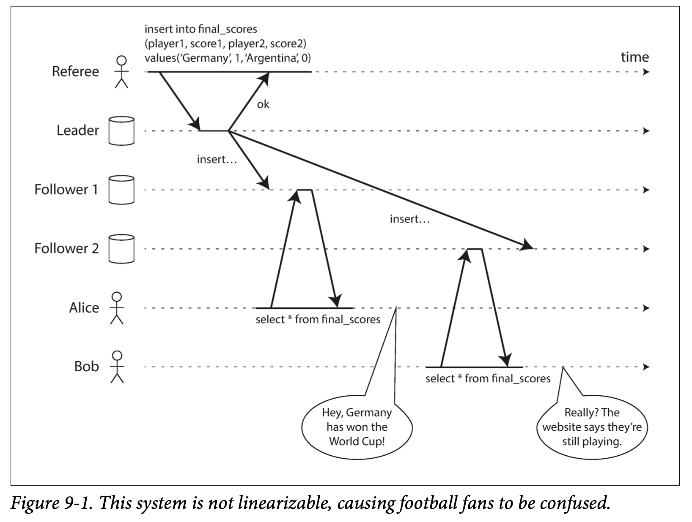
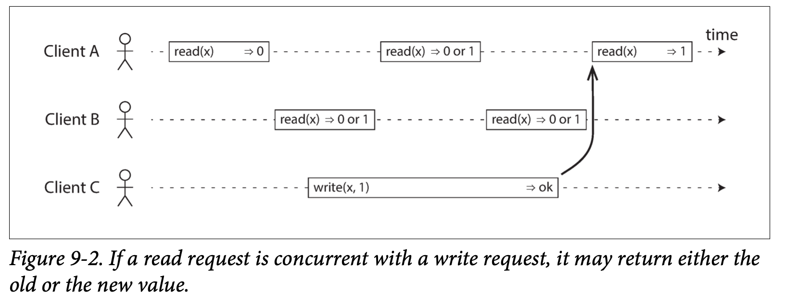
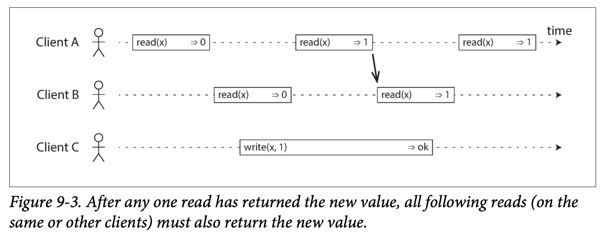
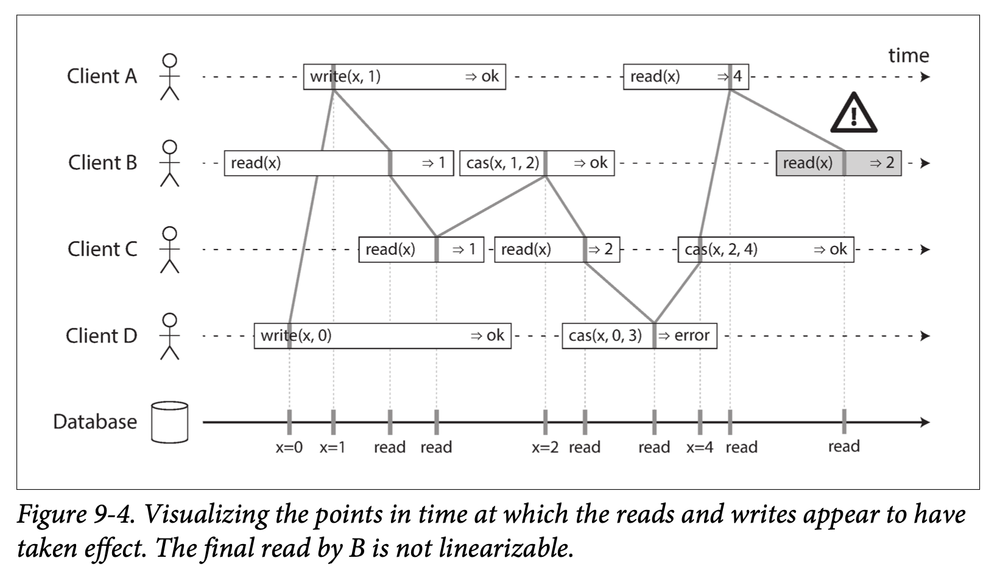
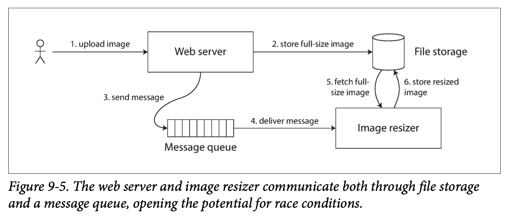
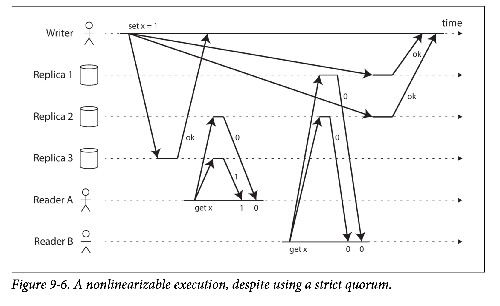
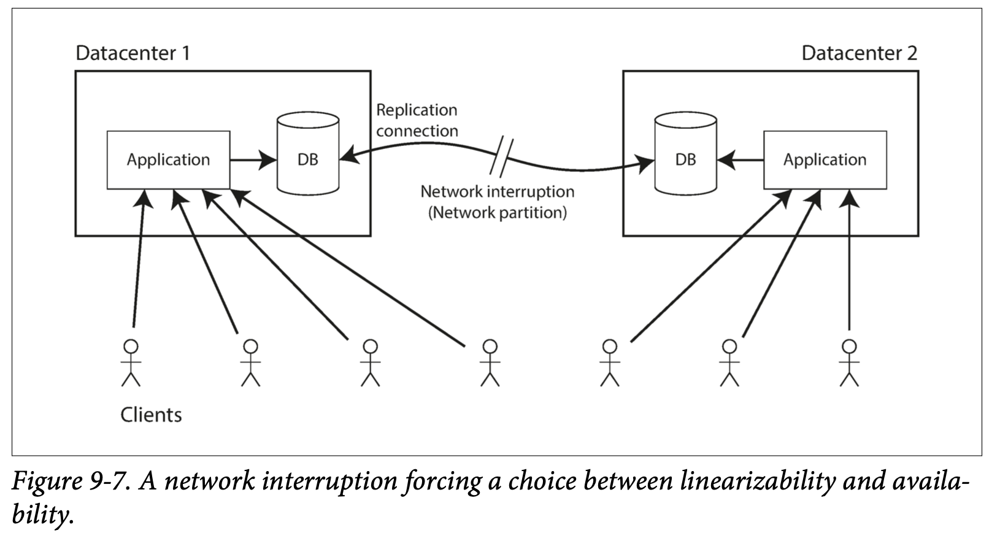
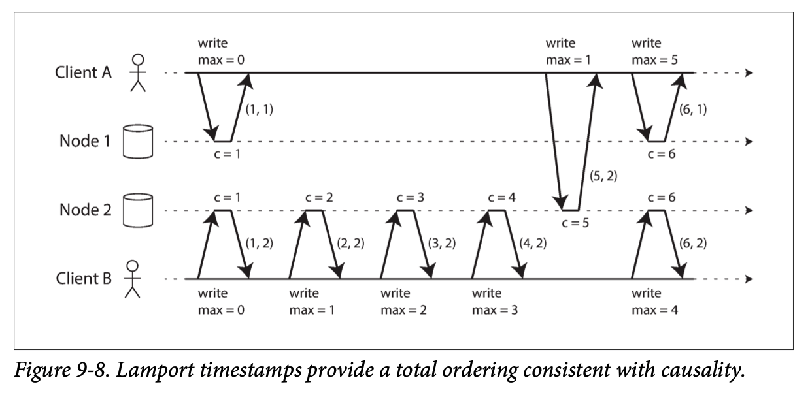
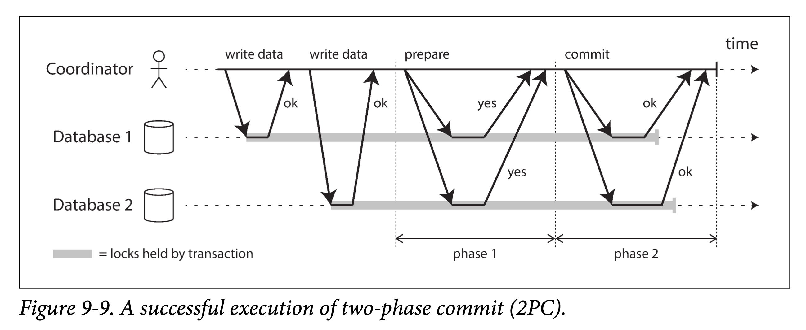

# Chapter 9 Consistency and Consensus

Lots of things can go wrong in distributed systems, as discussed in Chapter 8. The **simplest** way of handling such faults is to simply let the entire service fail, and show the user an error message. If that solution is unacceptable, we need to find ways of tolerating faults—that is, of keeping the service functioning correctly, even if some internal component is faulty.

In this chapter, we will talk about some examples of algorithms and protocols for building fault-tolerant distributed systems. We will assume that all the problems from Chapter 8 can occur: **packets** can be lost, reordered, duplicated, or arbitrarily delayed in the network; **clocks** are approximate at best; and **nodes** can pause (e.g., due to garbage collection) or crash at any time.

The best way of building fault-tolerant systems is to find some general-purpose abstractions with useful guarantees, implement them once, and then let applications rely on those guarantees. This is the same approach as we used with transactions in Chapter 7: by using a transaction, the application can pretend that there are no crashes (atomicity), that nobody else is concurrently accessing the database (isolation), and that storage devices are perfectly reliable (durability). Even though crashes, race conditions, and disk failures do occur, the transaction abstraction hides those problems so that the application doesn’t need to worry about them.

We will now continue along the same lines, and seek abstractions that can allow an application to ignore some of the problems with distributed systems. For example, one of the most important abstractions for distributed systems is **consensus**: that is, getting all of the nodes to agree on something. As we shall see in this chapter, reliably reaching consensus in spite of network faults and process failures is a surprisingly tricky problem.

Once you have an implementation of consensus, applications can use it for various purposes. For example, say you have a database with single-leader replication. If the leader dies and you need to fail over to another node, the remaining database nodes can use consensus to elect a new leader. As discussed in “Handling Node Outages”, it’s important that there is only one leader, and that all nodes agree who the leader is. If two nodes both believe that they are the leader, that situation is called **split brain**, and it often leads to data loss. Correct implementations of consensus help avoid such problems.

Later in this chapter, in “Distributed Transactions and Consensus”, we will look into algorithms to solve consensus and related problems. But first we first need to explore the range of guarantees and abstractions that can be provided in a distributed system.

We need to understand the scope of what can and cannot be done: in some situations, it’s possible for the system to tolerate faults and continue working; in other situations, that is not possible. The limits of what is and isn’t possible have been explored in depth, both in theoretical proofs and in practical implementations. We will get an overview of those fundamental limits in this chapter.

## 9.1 Consistency Guarantees

In “Problems with Replication Lag” we looked at some timing issues that occur in a replicated database. If you look at two database nodes at the same moment in time, you’re likely to see different data on the two nodes, because write requests arrive on different nodes at different times. These inconsistencies occur no matter what replication method the database uses (single-leader, multi-leader, or leaderless replication).

Most replicated databases provide at least eventual consistency, which means that if you stop writing to the database and wait for some unspecified length of time, then eventually all read requests will return the same value. In other words, the inconsistency is temporary, and it eventually resolves itself (assuming that any faults in the network are also eventually repaired). A better name for eventual consistency may be **convergence**, as we expect all replicas to eventually converge to the same value.

However, this is a very weak guarantee—it doesn’t say anything about when the replicas will converge. Until the time of convergence, reads could return anything or nothing. For example, if you write a value and then immediately read it again, there is no guarantee that you will see the value you just wrote, because the read may be routed to a different replica (see “Reading Your Own Writes”).

Eventual consistency is hard for application developers because it is so different from the behavior of variables in a normal single-threaded program. If you assign a value to a variable and then read it shortly afterward, you don’t expect to read back the old value, or for the read to fail. A database looks superficially like a variable that you can read and write, but in fact it has much more complicated semantics.

When working with a database that provides only weak guarantees, you need to be constantly aware of its limitations and not accidentally assume too much. Bugs are often subtle and hard to find by testing, because the application may work well most of the time. The edge cases of eventual consistency only become apparent when there is a fault in the system (e.g., a network interruption) or at high concurrency.

In this chapter we will explore stronger consistency models that data systems may choose to provide. They don’t come for free: systems with stronger guarantees may have worse performance or be less fault-tolerant than systems with weaker guarantees. Nevertheless, stronger guarantees can be appealing because they are easier to use correctly. Once you have seen a few different consistency models, you’ll be in a better position to decide which one best fits your needs.

There is some similarity between distributed consistency models and the hierarchy of transaction isolation levels we discussed previously (see “Weak Isolation Levels”). But while there is some overlap, they are mostly independent concerns: transaction isolation is primarily about avoiding race conditions due to concurrently executing transactions, whereas distributed consistency is mostly about coordinating the state of replicas in the face of delays and faults.

This chapter covers a broad range of topics, but as we shall see, these areas are in fact deeply linked:

1. We will start by looking at one of the strongest consistency models in common use, linearizability, and examine its pros and cons.
1. We’ll then examine the issue of ordering events in a distributed system (“Ordering Guarantees” on page 339), particularly around causality and total ordering.
1. In the third section (“Distributed Transactions and Consensus”) we will explore how to atomically commit a distributed transaction, which will finally lead us toward solutions for the consensus problem.

## 9.2 Linearizability

In an eventually consistent database, if you ask two different replicas the same question at the same time, you may get two different answers. That’s confusing. Wouldn’t it be a lot simpler if the database could give the illusion that there is only one replica (i.e., only one copy of the data)? Then every client would have the same view of the data, and you wouldn’t have to worry about replication lag.

This is the idea behind linearizability (also known as atomic consistency, strong consistency, immediate consistency, or external consistency). The exact definition of linearizability is quite subtle, and we will explore it in the rest of this section. But the basic idea is to make a system appear as if there were only one copy of the data, and all operations on it are atomic. With this guarantee, even though there may be multiple replicas in reality, the application does not need to worry about them.

In a **linearizable** system, as soon as one client successfully completes a write, all clients reading from the database must be able to see the value just written. Maintaining the illusion of a single copy of the data means guaranteeing that the value read is the most recent, up-to-date value, and doesn’t come from a stale cache or replica. In other words, linearizability is a recency guarantee. To clarify this idea, let’s look at an example of a system that is not linearizable.

Figure 9-1 shows an example of a nonlinearizable sports website. Alice and Bob are sitting in the same room, both checking their phones to see the outcome of the 2014 FIFA World Cup final. Just after the final score is announced, Alice refreshes the page, sees the winner announced, and excitedly tells Bob about it. Bob incredulously hits reload on his own phone, but his request goes to a database replica that is lagging, and so his phone shows that the game is still ongoing.

If Alice and Bob had hit reload at the same time, it would have been less surprising if they had gotten two different query results, because they wouldn’t know at exactly what time their respective requests were processed by the server. However, Bob knows that he hit the reload button (initiated his query) after he heard Alice exclaim the final score, and therefore he expects his query result to be at least as recent as Alice’s. The fact that his query returned a stale result is a violation of linearizability.

### 9.2.1 What Makes a System Linearizable?

The basic idea behind linearizability is simple: to make a system appear as if there is only a single copy of the data. However, nailing down precisely what that means actually requires some care. In order to understand linearizability better, let’s look at some more examples.

Figure 9-2 shows three clients concurrently reading and writing the same key `x` in a linearizable database. In the distributed systems literature, `x` is **called a register**—in practice, it could be one key in a key-value store, one row in a relational database, or one document in a document database, for example.

For simplicity, Figure 9-2 shows only the requests from the clients’ point of view, not the internals of the database. Each bar is a request made by a client, where the start of a bar is the time when the request was sent, and the end of a bar is when the response was received by the client. Due to variable network delays, a client doesn’t know exactly when the database processed its request—it only knows that it must have happened sometime between the client sending the request and receiving the response.(A subtle detail of this diagram is that it assumes the existence of a global clock, represented by the horizontal axis. Even though real systems typically don’t have accurate clocks (see “Unreliable Clocks”), this assumption is okay: for the purposes of analyzing a distributed algorithm, we may **pretend that an accurate global clock exists**, as long as the algorithm doesn’t have access to it. Instead, the algorithm can only see a mangled approximation of real time, as produced by a quartz oscillator and NTP.)

In this example, the register has two types of operations:

1. `read(x) ⇒ v` means the client requested to read the value of register `x`, and the
database returned the value `v`.
1. `write(x, v) ⇒ r` means the client requested to set the register `x` to value `v`, and the
database returned response `r` (which could be ok or error).

In Figure 9-2, the value of x is initially 0, and client C performs a write request to set it to 1. While this is happening, clients A and B are repeatedly polling the database to read the latest value. What are the possible responses that A and B might get for their read requests?

1. The first read operation by client A completes before the write begins, so it must definitely return the old value 0.
1. The last read by client A begins after the write has completed, so it must definitely return the new value 1 if the database is linearizable: we know that the write must have been processed sometime between the start and end of the write operation, and the read must have been processed sometime between the start and end of the read operation. If the read started after the write ended, then the read must have been processed after the write, and therefore it must see the new value that was written.
1. Any read operations that overlap in time with the write operation might return either 0 or 1, because we don’t know whether or not the write has taken effect at the time when the read operation is processed. These operations are concurrent with the write.

However, that is not yet sufficient to fully describe linearizability: if reads that are concurrent with a write can return either the old or the new value, then readers could see a value flip back and forth between the old and the new value several times while a write is going on. That is not what we expect of a system that emulates a “single copy of the data.”(A register in which reads may return either the old or the new value if they are concurrent with a write is known as a **regular register**.)

To make the system linearizable, we need to add another constraint, illustrated in Figure 9-3.

In a linearizable system we imagine that there must be some point in time (between the start and end of the write operation) at which the value of x atomically flips from 0 to 1. Thus, if one client’s read returns the new value 1, all subsequent reads must also return the new value, even if the write operation has not yet completed.

This timing dependency is illustrated with an arrow in Figure 9-3. Client A is the first to read the new value, 1. Just after A’s read returns, B begins a new read. Since B’s read occurs strictly after A’s read, it must also return 1, even though the write by C is still ongoing. (It’s the same situation as with Alice and Bob in Figure 9-1: after Alice has read the new value, Bob also expects to read the new value.)

We can further refine this timing diagram to visualize each operation taking effect atomically at some point in time. A more complex example is shown in Figure 9-4.

In Figure 9-4 we add a third type of operation besides read and write:

1. `cas(x, vold, vnew) ⇒ r` means the client requested an atomic `compare-and-set` operation (see “Compare-and-set”). If the current value of the register `x` equals $v_old$, it should be atomically set to $v_new$. If $x ≠ v_old$ then the operation should leave the register unchanged and return an error. `r` is the database’s response (ok or error).

Each operation in Figure 9-4 is marked with a vertical line (inside the bar for each operation) at the time when we think the operation was executed. Those markers are joined up in a sequential order, and the result must be a valid sequence of reads and writes for a register (every read must return the value set by the most recent write).

The requirement of linearizability is that the lines joining up the operation markers always move forward in time (from left to right), never backward. This requirement ensures the **recency guarantee** we discussed earlier: once a new value has been written or read, all subsequent reads see the value that was written, until it is overwritten again.

There are a few interesting details to point out in Figure 9-4:

1. First client B sent a request to read x, then client D sent a request to set x to 0, and then client A sent a request to set x to 1. Nevertheless, the value returned to B’s read is 1 (the value written by A). This is okay: it means that the database first processed D’s write, then A’s write, and finally B’s read. Although this is not the order in which the requests were sent, it’s an **acceptable order**, because the three requests are concurrent. Perhaps B’s read request was slightly delayed in the network, so it only reached the database after the two writes.
1. Client B’s read returned 1 before client A received its response from the database, saying that the write of the value 1 was successful. This is also okay: it doesn’t mean the value was read before it was written, it just means the ok response from the database to client A was slightly delayed in the network.
1. This model doesn’t assume any transaction isolation: another client may change a value at any time. For example, C first reads 1 and then reads 2, because the value was changed by B between the two reads. An atomic compare-and-set (cas) operation can be used to check the value hasn’t been concurrently changed by another client: B and C’s cas requests succeed, but D’s cas request fails (by the time the database processes it, the value of x is no longer 0).
1. The final read by client B (in a shaded bar) is not linearizable. The operation is concurrent with C’s cas write, which updates x from 2 to 4. In the absence of other requests, it would be okay for B’s read to return 2. However, client A has already read the new value 4 before B’s read started, so B is not allowed to read an older value than A. Again, it’s the same situation as with Alice and Bob in Figure 9-1.

That is the intuition behind linearizability; the formal definition describes it more precisely. It is possible (though computationally expensive) to test whether a system’s behavior is linearizable by recording the timings of all requests and responses, and checking whether they can be arranged into a valid sequential order.

**Linearizability Versus Serializability**

Linearizability is easily confused with serializability (see “Serializability”), as both words seem to mean something like “can be arranged in a sequential order.” However, they are two quite different guarantees, and it is important to distinguish between them:

1. Serializability. Serializability is an isolation property of transactions, where every transaction may read and write multiple objects (rows, documents, records)—see “Single-Object and Multi-Object Operations”. It guarantees that transactions behave the same as if they had executed in some serial order (each transaction running to completion before the next transaction starts). It is okay for that serial order to be different from the order in which transactions were actually run.
1. Linearizability. Linearizability is a **recency guarantee** on reads and writes of a register (an individual object). It doesn’t group operations together into transactions, so it does not prevent problems such as write skew (see “Write Skew and Phantoms”), unless you take additional measures such as materializing conflicts (see “Materializing conflicts”).

A database may provide both serializability and linearizability, and this combination is known as **strict serializability or strong one-copy serializability (strong-1SR)**. Implementations of serializability based on  (see “ (2PL)”) or actual serial execution (see “Actual Serial Execution”) are typically linearizable.

However, serializable snapshot isolation (see “Serializable Snapshot Isolation (SSI)”) is not linearizable: by design, it makes reads from a consistent snapshot, to avoid lock contention between readers and writers. The whole point of a consistent snapshot is that it does not include writes that are more recent than the snapshot, and thus reads from the snapshot are not linearizable.

### 9.2.2 Relying on Linearizability

In what circumstances is linearizability useful? Viewing the final score of a sporting match is perhaps a frivolous example: a result that is outdated by a few seconds is unlikely to cause any real harm in this situation. However, there a few areas in which linearizability is an important requirement for making a system work correctly.

#### 9.2.2.1 Locking and leader election

A system that uses single-leader replication needs to ensure that there is indeed only one leader, not several (split brain). **One way of electing a leader is to use a lock**: every node that starts up tries to acquire the lock, and the one that succeeds becomes the leader. No matter how this lock is implemented, it must be linearizable: all nodes must agree which node owns the lock; otherwise it is useless.

Coordination services like **Apache ZooKeeper and etcd are often used to implement distributed locks** and leader election. They use **consensus algorithms** to implement linearizable operations in a fault-tolerant way (we discuss such algorithms later in this chapter, in “Fault-Tolerant Consensus”).(Strictly speaking, **ZooKeeper and etcd provide linearizable writes**, but reads may be stale, since by default they can be served by any one of the replicas. You can optionally request a linearizable read: etcd calls this a **quorum read**, and in ZooKeeper you need to call sync() before the read; see “Implementing linearizable storage using total order broadcast”.) There are still many subtle details to implementing locks and leader election correctly (see for example the fencing issue in “The leader and the lock”), and libraries like **Apache Curator** help by providing higher-level recipes on top of ZooKeeper. However, a linearizable storage service is the basic foundation for these coordination tasks.

Distributed locking is also used at a much more granular level in some distributed databases, such as Oracle Real Application Clusters (RAC). RAC **uses a lock per disk page**, with multiple nodes sharing access to the same disk storage system. Since these linearizable locks are on the critical path of transaction execution, RAC deployments usually have a dedicated cluster interconnect network for communication between database nodes.

#### 9.2.2.2 Constraints and uniqueness guarantees

Uniqueness constraints are common in databases: for example, a username or email address must uniquely identify one user, and in a file storage service there cannot be two files with the same path and filename. If you want to enforce this constraint as the data is written (such that if two people try to concurrently create a user or a file with the same name, one of them will be returned an error), you need linearizability. This situation is actually similar to a lock: when a user registers for your service, you can think of them **acquiring a “lock” on their chosen username**. The operation is also very similar to an atomic compare-and-set, setting the username to the ID of the user who claimed it, provided that the username is not already taken.

Similar issues arise if you want to ensure that a bank account balance never goes negative, or that you don’t sell more items than you have in stock in the warehouse, or that two people don’t concurrently book the same seat on a flight or in a theater. These constraints all require there to be a single up-to-date value (the account balance, the stock level, the seat occupancy) that all nodes agree on.

In real applications, it is sometimes acceptable to treat such constraints loosely (for example, if a flight is overbooked, you can move customers to a different flight and offer them compensation for the inconvenience). In such cases, linearizability may not be needed, and we will discuss such loosely interpreted constraints in “Timeliness and Integrity”.

However, **a hard uniqueness constraint**, such as the one you typically find in relational databases, **requires linearizability**. Other kinds of constraints, such as foreign key or attribute constraints, can be implemented without requiring linearizability.

#### 9.2.2.3 Cross-channel timing dependencies

Notice a detail in Figure 9-1: if Alice hadn’t exclaimed the score, Bob wouldn’t have known that the result of his query was stale. He would have just refreshed the page again a few seconds later, and eventually seen the final score. The linearizability violation was only noticed because there was an additional communication channel in the system (Alice’s voice to Bob’s ears).

Similar situations can arise in computer systems. For example, say you have a website where users can upload a photo, and a background process resizes the photos to lower resolution for faster download (thumbnails). The architecture and dataflow of this system is illustrated in Figure 9-5.

The image resizer needs to be explicitly instructed to perform a resizing job, and this instruction is sent from the web server to the resizer via a message queue (see Chapter 11). The web server doesn’t place the entire photo on the queue, since most message brokers are designed for small messages, and a photo may be several megabytes in size. Instead, the photo is first written to a file storage service, and once the write is complete, the instruction to the resizer is placed on the queue.

If the file storage service is linearizable, then this system should work fine. If it is not linearizable, there is the risk of a race condition: the message queue (steps 3 and 4 in Figure 9-5) might be faster than the internal replication inside the storage service. In this case, when the resizer fetches the image (step 5), it **might see an old version of the image**, or nothing at all. If it processes an old version of the image, the full-size and resized images in the file storage become permanently inconsistent.
This problem arises because there are **two different communication channels** between the web server and the resizer: the file storage and the message queue. Without the recency guarantee of linearizability, race conditions between these two channels are possible. This situation is analogous to Figure 9-1, where there was also a race condition between two communication channels: the database replication and the real-life audio channel between Alice’s mouth and Bob’s ears.

Linearizability is not the only way of avoiding this race condition, but it’s the simplest to understand. If you control the additional communication channel (like in the case of the message queue, but not in the case of Alice and Bob), you can use alternative approaches similar to what we discussed in “Reading Your Own Writes”, at the cost of additional complexity.

### 9.2.3 Implementing Linearizable Systems

Now that we’ve looked at a few examples in which linearizability is useful, let’s think about how we might implement a system that offers linearizable semantics.

Since linearizability essentially means “behave as though there is only a single copy of the data, and all operations on it are atomic,” the **simplest answer** would be to really only use a single copy of the data. However, that approach would not be able to tolerate faults: if the node holding that one copy failed, the data would be lost, or at least inaccessible until the node was brought up again.

The most common approach to making a system fault-tolerant is to use replication. Let’s revisit the replication methods from Chapter 5, and compare whether they can be made linearizable:

1. Single-leader replication (**potentially linearizable**). In a system with single-leader replication (see “Leaders and Followers”), the leader has the primary copy of the data that is used for writes, and the followers maintain backup copies of the data on other nodes. If you make reads from the leader, or from synchronously updated followers, they have the potential to be linearizable.(Partitioning (sharding) a single-leader database, so that there is a separate leader per partition, does not affect linearizability, since it is only a single-object guarantee. Cross-partition transactions are a different matter (see “Distributed Transactions and Consensus”).) However, **not every single-leader database is actually linearizable**, either by design (e.g., because it uses snapshot isolation) or due to concurrency bugs. Using the leader for reads relies on the assumption that you know for sure who the leader is. As discussed in “The Truth Is Defined by the Majority”, it is quite possible for a node to think that it is the leader, when in fact it is not—and if the delusional leader continues to serve requests, it is likely to violate linearizability. With asynchronous replication, failover may even lose committed writes (see “Handling Node Outages”), which violates both durability and linearizability.
1. Consensus algorithms (**linearizable**). Some consensus algorithms, which we will discuss later in this chapter, bear a resemblance to single-leader replication. However, consensus protocols contain measures to prevent split brain and stale replicas. Thanks to these details, consensus algorithms can implement linearizable storage safely. This is how ZooKeeper and etcd work.
1. Multi-leader replication (**not linearizable**). Systems with multi-leader replication are generally not linearizable, because they concurrently process writes on multiple nodes and asynchronously replicate them to other nodes. For this reason, they can produce conflicting writes that require resolution (see “Handling Write Conflicts”). Such conflicts are an artifact of the lack of a single copy of the data.
1. Leaderless replication (**probably not linearizable**). For systems with leaderless replication (Dynamo-style; see “Leaderless Replication”), people sometimes claim that you can obtain “strong consistency” by requiring quorum reads and writes (w + r > n). Depending on the exact configuration of the quorums, and depending on how you define strong consistency, this is not quite true.
“Last write wins” conflict resolution methods based on time-of-day clocks (e.g., in Cassandra; see “Relying on Synchronized Clocks”) are **almost certainly nonlinearizable**, because clock timestamps cannot be guaranteed to be consistent with actual event ordering due to clock skew. Sloppy quorums (“Sloppy Quorums and Hinted Handoff”) also ruin any chance of linearizability. Even with strict quorums, nonlinearizable behavior is possible, as demonstrated in the next section.

#### 9.2.3.1 Linearizability and quorums

Intuitively, it seems as though strict quorum reads and writes should be linearizable in a Dynamo-style model. However, when we have variable network delays, it is possible to have race conditions, as demonstrated in Figure 9-6.

In Figure 9-6, the initial value of x is 0, and a writer client is updating x to 1 by sending the write to all three replicas (n = 3, w = 3). Concurrently, client A reads from a quorum of two nodes (r = 2) and sees the new value 1 on one of the nodes. Also concurrently with the write, client B reads from a different quorum of two nodes, and gets back the old value 0 from both.
The quorum condition is met (w + r > n), but this execution is nevertheless not linearizable: B’s request begins after A’s request completes, but B returns the old value while A returns the new value. (It’s once again the Alice and Bob situation from Figure 9-1.)

Interestingly, it is possible to make Dynamo-style quorums linearizable at **the cost of reduced performance**: a reader must perform read repair (see “Read repair and anti-entropy”) synchronously, before returning results to the application, and a writer must read the latest state of a quorum of nodes before sending its writes. However, Riak does not perform synchronous read repair due to the performance penalty. Cassandra does wait for read repair to complete on quorum reads, but it loses linearizability if there are multiple concurrent writes to the same key, due to its use of last-write-wins conflict resolution.

Moreover, only linearizable read and write operations can be implemented in this way; a linearizable compare-and-set operation cannot, because it requires a consensus algorithm.

In summary, it is safest to assume that a leaderless system with Dynamo-style replication does not provide linearizability.

### 9.2.4 The Cost of Linearizability

As some replication methods can provide linearizability and others cannot, it is interesting to explore the pros and cons of linearizability in more depth.

We already discussed some use cases for different replication methods in Chapter 5; for example, we saw that multi-leader replication is often a good choice for multi-datacenter replication (see “Multi-datacenter operation”). An example of such a deployment is illustrated in Figure 9-7.

Consider what happens if there is a network interruption between the two datacenters. Let’s assume that the network within each datacenter is working, and clients can reach the datacenters, but the datacenters cannot connect to each other.

With a multi-leader database, each datacenter can continue operating normally: since writes from one datacenter are asynchronously replicated to the other, the writes are simply queued up and exchanged when network connectivity is restored.

On the other hand, if single-leader replication is used, then the leader must be in one of the datacenters. **Any writes and any linearizable reads must be sent to the leader**—thus, for any clients connected to a follower datacenter, those read and write requests must be sent synchronously over the network to the leader datacenter.

If the network between datacenters is interrupted in a single-leader setup, clients connected to follower datacenters cannot contact the leader, so they cannot make any writes to the database, nor any linearizable reads. They can still make reads from the follower, but they might be **stale (nonlinearizable)**. If the application requires linearizable reads and writes, the network interruption causes the application to become unavailable in the datacenters that cannot contact the leader.

If clients can connect directly to the leader datacenter, this is not a problem, since the application continues to work normally there. But clients that can only reach a follower datacenter will experience an outage until the network link is repaired.

#### 9.2.4.1 The CAP theorem

This issue is not just a consequence of single-leader and multi-leader replication: any linearizable database has this problem, no matter how it is implemented. The issue also isn’t specific to multi-datacenter deployments, but can occur on any unreliable network, even within one datacenter. The trade-off is as follows: (These two choices are sometimes known as **CP** (consistent but not available under network partitions) and **AP** (available but not consistent under network partitions), respectively. However, this classification scheme has several flaws, so it is best avoided.)

1. If your application requires linearizability, and some replicas are disconnected from the other replicas due to a network problem, then some replicas cannot process requests while they are disconnected: they must either wait until the network problem is fixed, or return an error (either way, they become unavailable).
1. If your application does not require linearizability, then it can be written in a way that each replica can process requests independently, even if it is disconnected from other replicas (e.g., multi-leader). In this case, the application can remain available in the face of a network problem, but its behavior is not linearizable.

Thus, applications that don’t require linearizability can be more tolerant of network problems. This insight is popularly known as the CAP theorem, named by Eric Brewer in 2000, although the trade-off has been known to designers of distributed databases since the 1970s.

CAP was originally proposed as a rule of thumb, without precise definitions, with the goal of starting a discussion about trade-offs in databases. At the time, many distributed databases focused on providing linearizable semantics on a cluster of machines with shared storage, and CAP encouraged database engineers to explore a wider design space of distributed shared-nothing systems, which were more suitable for implementing large-scale web services. CAP deserves credit for this culture shift—witness the explosion of new database technologies since the mid-2000s (known as NoSQL).

**The Unhelpful CAP Theorem**

CAP is sometimes presented as Consistency, Availability, Partition tolerance: pick 2 out of 3. Unfortunately, putting it this way is misleading because **network partitions are a kind of fault**, so they aren’t something about which you have a choice: they will happen whether you like it or not.

At times when the network is working correctly, a system can provide both consistency (linearizability) and total availability. When a network fault occurs, you have to choose between either linearizability or total availability. Thus, a better way of phrasing CAP would be either **Consistent or Available when Partitioned**. A more reliable network needs to make this choice less often, but at some point the choice is inevitable.

In discussions of CAP there are several **contradictory definitions** of the term availability, and the formalization as a theorem does not match its usual meaning. Many so-called “highly available” (fault-tolerant) systems actually do not meet CAP’s idiosyncratic definition of availability. All in all, there is a lot of misunderstanding and confusion around CAP, and it does not help us understand systems better, so CAP is best avoided.

The CAP theorem as formally defined is of very narrow scope: it only considers **one consistency model (namely linearizability) and one kind of fault** (network partitions,(As discussed in “Network Faults in Practice”, this book uses **partitioning** to refer to deliberately breaking down a large dataset into smaller ones (**sharding**; see Chapter 6). By contrast, a network partition is a particular type of network fault, which we normally don’t consider separately from other kinds of faults. However, since it’s the P in CAP, we can’t avoid the confusion in this case.) or nodes that are alive but disconnected from each other). It doesn’t say anything about network delays, dead nodes, or other trade-offs. Thus, although CAP has been historically influential, it has little practical value for designing systems.

There are many more interesting impossibility results in distributed systems, and CAP has now been superseded by more precise results, so it is of mostly historical interest today.

#### 9.2.4.2 Linearizability and network delays

Although linearizability is a useful guarantee, **surprisingly few systems are actually linearizable in practice**. For example, even RAM on a modern multi-core CPU is not linearizable: if a thread running on one CPU core writes to a memory address, and a thread on another CPU core reads the same address shortly afterward, it is **not guaranteed** to read the value written by the first thread (unless a memory barrier or fence is used).

The reason for this behavior is that every CPU core has its own memory cache and store buffer. Memory access first goes to the cache by default, and **any changes are asynchronously written out to main memory**. Since accessing data in the cache is much faster than going to main memory, this feature is essential for good performance on modern CPUs. However, there are now several copies of the data (one in main memory, and perhaps several more in various caches), and these copies are **asynchronously updated, so linearizability is lost**.

Why make this trade-off? It makes no sense to use the CAP theorem to justify the multi-core memory consistency model: within one computer we usually assume reliable communication, and we don’t expect one CPU core to be able to continue operating normally if it is disconnected from the rest of the computer. The reason for dropping linearizability is **performance**, not fault tolerance.

The same is true of many distributed databases that choose not to provide linearizable guarantees: they do so primarily to increase performance, not so much for fault tolerance. **Linearizability is slow**—and this is true all the time, not only during a network fault.

Can’t we maybe find a more efficient implementation of linearizable storage? It seems the answer is no: Attiya and Welch prove that if you want linearizability, the response time of read and write requests is at least proportional to the uncertainty of delays in the network. In a network with highly variable delays, like most computer networks (see “Timeouts and Unbounded Delays”), the response time of linearizable reads and writes is inevitably going to be high. A faster algorithm for linearizability does not exist, but weaker consistency models can be much faster, so this trade-off is important for latency-sensitive systems. In Chapter 12 we will discuss some approaches for avoiding linearizability without sacrificing correctness.

## 9.3 Ordering Guarantees

We said previously that a linearizable register behaves as if there is only a single copy of the data, and that every operation appears to take effect atomically at one point in time. This definition implies that operations are executed in some well-defined order. We illustrated the ordering in Figure 9-4 by joining up the operations in the order in which they seem to have executed.
Ordering has been a recurring theme in this book, which suggests that it might be an important fundamental idea. Let’s briefly recap some of the other contexts in which we have discussed ordering:
• In Chapter 5 we saw that the main purpose of the leader in single-leader replication is to determine the order of writes in the replication log—that is, the order in which followers apply those writes. If there is no single leader, conflicts can occur due to concurrent operations (see “Handling Write Conflicts” on page 171).
• Serializability, which we discussed in Chapter 7, is about ensuring that transactions behave as if they were executed in some sequential order. It can be achieved by literally executing transactions in that serial order, or by allowing concurrent execution while preventing serialization conflicts (by locking or aborting).
• The use of timestamps and clocks in distributed systems that we discussed in Chapter 8 (see “Relying on Synchronized Clocks” on page 291) is another attempt to introduce order into a disorderly world, for example to determine which one of two writes happened later.
It turns out that there are deep connections between ordering, linearizability, and consensus. Although this notion is a bit more theoretical and abstract than the rest of this book, it is very helpful for clarifying our understanding of what systems can and cannot do. We will explore this topic in the next few sections。

### 9.3.1 Ordering and Causality

There are several reasons why ordering keeps coming up, and one of the reasons is that it helps **preserve causality**. We have already seen several examples over the course of this book where causality has been important:

1. In “Consistent Prefix Reads” (Figure 5-5) we saw an example where the observer of a conversation saw first the answer to a question, and then the question being answered. This is confusing because it violates our intuition of cause and effect: if a question is answered, then clearly the question had to be there first, because the person giving the answer must have seen the question (assuming they are not psychic and cannot see into the future). We say that there is a causal dependency between the question and the answer.
1. A similar pattern appeared in Figure 5-9, where we looked at the replication between three leaders and noticed that some writes could “overtake” others due to network delays. From the perspective of one of the replicas it would look as though there was an update to a row that did not exist. Causality here means that a row must first be created before it can be updated.
1. In “Detecting Concurrent Writes” we observed that if you have two operations A and B, there are three possibilities: either A happened before B, or B happened before A, or A and B are concurrent. This happened before relationship is another expression of causality: if A happened before B, that means B might have known about A, or built upon A, or depended on A. If A and B are concurrent, there is no causal link between them; in other words, we are sure that neither knew about the other.
1. In the context of snapshot isolation for transactions (“Snapshot Isolation and Repeatable Read”), we said that a transaction reads from a consistent snapshot. But what does “consistent” mean in this context? It means consistent with causality: if the snapshot contains an answer, it must also contain the question being answered. Observing the entire database at a single point in time makes it consistent with causality: the effects of all operations that happened causally before that point in time are visible, but no operations that happened causally afterward can be seen. Read skew (non-repeatable reads, as illustrated in Figure 7-6) means reading data in a state that violates causality.
1. Our examples of write skew between transactions (see “Write Skew and Phantoms”) also demonstrated causal dependencies: in Figure 7-8, Alice was allowed to go off call because the transaction thought that Bob was still on call, and vice versa. In this case, the action of going off call is causally dependent on the observation of who is currently on call. Serializable snapshot isolation (see “Serializable Snapshot Isolation (SSI)”) detects write skew by tracking the causal dependencies between transactions.
1. In the example of Alice and Bob watching football (Figure 9-1), the fact that Bob got a stale result from the server after hearing Alice exclaim the result is a causality violation: Alice’s exclamation is causally dependent on the announcement of the score, so Bob should also be able to see the score after hearing Alice. The same pattern appeared again in “Cross-channel timing dependencies” in the guise of an image resizing service.

Causality imposes an ordering on events: cause comes before effect; a message is sent before that message is received; the question comes before the answer. And, like in real life, one thing leads to another: one node reads some data and then writes something as a result, another node reads the thing that was written and writes something else in turn, and so on. These chains of causally dependent operations define the causal order in the system—i.e., what happened before what.

If a system obeys the ordering imposed by causality, we say that it is **causally consistent**. For example, snapshot isolation provides causal consistency: when you read from the database, and you see some piece of data, then you must also be able to see any data that causally precedes it (assuming it has not been deleted in the meantime).

#### 9.3.1.1 The causal order is not a total order

A total order allows any two elements to be compared, so if you have two elements, you can always say which one is greater and which one is smaller. For example, natural numbers are totally ordered: if I give you any two numbers, say 5 and 13, you can tell me that 13 is greater than 5.

However, mathematical sets are not totally ordered: is {a, b} greater than {b, c}? Well, you can’t really compare them, because neither is a subset of the other. We say they are incomparable, and therefore mathematical sets are partially ordered: in some cases one set is greater than another (if one set contains all the elements of another), but in other cases they are incomparable.
The difference between **a total order and a partial order** is reflected in different database consistency models:

1. Linearizability: In a linearizable system, we have a total order of operations: if the system behaves as if there is only a single copy of the data, and every operation is atomic, this means that for any two operations we can always say which one happened first. This total ordering is illustrated as a timeline in Figure 9-4.
1. Causality: We said that two operations are concurrent if neither happened before the other (see “The “happens-before” relationship and concurrency”). Put another way, two events are ordered if they are causally related (one happened before the other), but they are incomparable if they are concurrent. This means that **causality defines a partial order, not a total order**: some operations are ordered with respect to each other, but some are incomparable.

Therefore, according to this definition, there are no concurrent operations in a linearizable datastore: there must be a single timeline along which all operations are totally ordered. There might be several requests waiting to be handled, but the datastore ensures that every request is handled atomically at a single point in time, acting on a single copy of the data, along a single timeline, without any concurrency.

Concurrency would mean that the timeline branches and merges again—and in this case, **operations on different branches are incomparable (i.e., concurrent)**. We saw this phenomenon in Chapter 5: for example, Figure 5-14 is not a straight-line total order, but rather a jumble of different operations going on concurrently. The arrows in the diagram indicate causal dependencies—the partial ordering of operations.

If you are familiar with distributed version control systems such as Git, their version histories are very much like the graph of causal dependencies. Often one commit happens after another, in a straight line, but sometimes you get branches (when several people concurrently work on a project), and merges are created when those concurrently created commits are combined.

#### 9.3.1.2 Linearizability is stronger than causal consistency

So what is the relationship between the causal order and linearizability? The answer is that **linearizability implies causality**: any system that is linearizable will preserve causality correctly. In particular, if there are multiple communication channels in a system (such as the message queue and the file storage service in Figure 9-5), linearizability ensures that causality is automatically preserved without the system having to do anything special (such as passing around timestamps between different components).

The fact that linearizability ensures causality is what makes linearizable systems simple to understand and appealing. However, as discussed in “The Cost of Linearizability”, making a system linearizable can **harm its performance and availability**, especially if the system has significant network delays (for example, if it’s geographically distributed). For this reason, some distributed data systems have abandoned linearizability, which allows them to achieve better performance but can make them difficult to work with.

The good news is that **a middle ground is possible**. Linearizability is not the only way of preserving causality—there are other ways too. A system can be causally consistent without incurring the performance hit of making it linearizable (in particular, the CAP theorem does not apply). In fact, **causal consistency is the strongest possible consistency model** that does not slow down due to network delays, and remains available in the face of network failures.

In many cases, systems that appear to require linearizability in fact only really require causal consistency, which can be implemented more efficiently. Based on this observation, researchers are exploring new kinds of databases that preserve causality, with performance and availability characteristics that are similar to those of eventually consistent systems.

As this research is quite recent, not much of it has yet made its way into production systems, and there are still challenges to be overcome. However, it is a promising direction for future systems.

#### 9.3.1.3 Capturing causal dependencies

We won’t go into all the nitty-gritty details of how nonlinearizable systems can maintain causal consistency here, but just briefly explore some of the key ideas.

In order to maintain causality, you need to know which operation happened before which other operation. This is a partial order: concurrent operations may be processed in any order, but if one operation happened before another, then they must be processed in that order on every replica. Thus, when a replica processes an operation, it must ensure that all causally preceding operations (all operations that happened before) have already been processed; if some preceding operation is missing, the later operation must wait until the preceding operation has been processed.

In order to determine causal dependencies, we need some way of describing the “knowledge” of a node in the system. If a node had already seen the value X when it issued the write Y, then X and Y may be causally related. The analysis uses the kinds of questions you would expect in a criminal investigation of fraud charges: did the CEO know about X at the time when they made decision Y?
The techniques for determining which operation happened before which other operation are similar to what we discussed in “Detecting Concurrent Writes”. That section discussed causality in a leaderless datastore, where we need to detect concurrent writes to the same key in order to prevent lost updates. **Causal consistency goes further**: it needs to track causal dependencies across the entire database, not just for a single key. **Version vectors can be generalized to do this**.

In order to determine the causal ordering, the database needs to know which version of the data was read by the application. This is why, in Figure 5-13, the version number from the prior operation is passed back to the database on a write. A similar idea appears in the conflict detection of SSI, as discussed in “Serializable Snapshot Isolation (SSI)”: when a transaction wants to commit, the database checks whether the version of the data that it read is still up to date. To this end, the database keeps track of which data has been read by which transaction.

### 9.3.2 Sequence Number Ordering

Although causality is an important theoretical concept, actually **keeping track of all causal dependencies can become impractical**. In many applications, clients read lots of data before writing something, and then it is not clear whether the write is causally dependent on all or only some of those prior reads. Explicitly tracking all the data that has been read would mean a large overhead.
However, there is a better way: we can use sequence numbers or timestamps to order events. A timestamp need not come from a time-of-day clock (or physical clock, which have many problems, as discussed in “Unreliable Clocks”). It can instead come from a **logical clock**, which is an algorithm to generate a sequence of numbers to identify operations, typically using **counters** that are incremented for every operation.

Such sequence numbers or timestamps are **compact** (only a few bytes in size), and they provide a **total order**: that is, every operation has a unique sequence number, and you can always compare two sequence numbers to determine which is greater (i.e., which operation happened later).

In particular, we can create sequence numbers in **a total order that is consistent with causality**: (A total order that is inconsistent with causality is easy to create, but not very useful. For example, you can generate a random UUID for each operation, and compare UUIDs lexicographically to define the total ordering of operations. This is a valid total order, but the random UUIDs tell you nothing about which operation actually happened first, or whether the operations were concurrent.) we promise that if operation A causally happened before B, then A occurs before B in the total order (A has a lower sequence number than B). Concurrent operations may be ordered arbitrarily. Such a total order captures all the causality information, but also imposes more ordering than strictly required by causality.

In a database with single-leader replication (see “Leaders and Followers”), the **replication log** defines a total order of write operations that is consistent with causality. The leader can simply increment a counter for each operation, and thus assign a monotonically increasing sequence number to each operation in the replication log. If a follower applies the writes in the order they appear in the replication log, the state of the follower is always causally consistent (even if it is lagging behind the leader).

#### 9.3.2.1 Noncausal sequence number generators

If there is not a single leader (perhaps because you are using a multi-leader or leaderless database, or because the database is partitioned), it is less clear how to generate sequence numbers for operations. Various methods are used in practice:

1. Each node can generate its own independent set of sequence numbers. For example, if you have two nodes, one node can generate only odd numbers and the other only even numbers. In general, you could **reserve some bits** in the binary representation of the sequence number to contain a unique node identifier, and this would ensure that two different nodes can never generate the same sequence number.
1. You can attach a timestamp from a time-of-day clock (physical clock) to each operation. Such timestamps are not sequential, but if they have sufficiently high resolution, they might be sufficient to totally order operations. This fact is used in the last write wins conflict resolution method (see “Timestamps for ordering events”).
1. You can **preallocate** blocks of sequence numbers. For example, node A might claim the block of sequence numbers from 1 to 1,000, and node B might claim the block from 1,001 to 2,000. Then each node can independently assign sequence numbers from its block, and allocate a new block when its supply of sequence numbers begins to run low.

These three options all perform better and are more scalable than pushing all operations through a single leader that increments a counter. They generate a unique, approximately increasing sequence number for each operation. However, they all have a problem: the sequence numbers they generate are not consistent with causality.

The causality problems occur because these sequence number generators do not correctly capture the ordering of operations across different nodes:

1. Each node may process a different number of operations per second. Thus, if one node generates even numbers and the other generates odd numbers, the counter for even numbers may lag behind the counter for odd numbers, or vice versa. If you have an odd-numbered operation and an even-numbered operation, you cannot accurately tell which one causally happened first.
1. Timestamps from physical clocks are subject to clock skew, which can make them inconsistent with causality. For example, see Figure 8-3, which shows a scenario in which an operation that happened causally later was actually assigned a lower timestamp.(It is possible to make physical clock timestamps consistent with causality: in “Synchronized clocks for global snapshots” we discussed Google’s Spanner, which estimates the expected clock skew and waits out the uncertainty interval before committing a write. This method ensures that a causally later transaction is given a greater timestamp. However, most clocks cannot provide the required uncertainty metric.)
1. In the case of the block allocator, one operation may be given a sequence number in the range from 1,001 to 2,000, and a causally later operation may be given a number in the range from 1 to 1,000. Here, again, the sequence number is inconsistent with causality.

#### 9.3.2.2 Lamport timestamps

Although the three sequence number generators just described are inconsistent with causality, there is actually a simple method for generating sequence numbers that is consistent with causality. It is called a Lamport timestamp, proposed in 1978 by Leslie Lamport, in what is now one of the most-cited papers in the field of distributed systems.

The use of Lamport timestamps is illustrated in Figure 9-8. Each node has a unique identifier, and each node keeps a counter of the number of operations it has processed. The **Lamport timestamp** is then simply a pair of (counter, node ID). Two nodes may sometimes have the same counter value, but by including the node ID in the timestamp, each timestamp is made unique.

A Lamport timestamp bears no relationship to a physical time-of-day clock, but it provides **total ordering**: if you have two timestamps, the one with a greater counter value is the greater timestamp; if the counter values are the same, the one with the greater node ID is the greater timestamp.

So far this description is essentially the same as the even/odd counters described in the last section. The key idea about Lamport timestamps, which makes them consistent with causality, is the following: **every node and every client keeps track of the maximum counter value it has seen so far, and includes that maximum on every request**. When a node receives a request or response with a maximum counter value greater than its own counter value, it immediately increases its own counter to that maximum.

This is shown in Figure 9-8, where client A receives a counter value of 5 from node 2, and then sends that maximum of 5 to node 1. At that time, node 1’s counter was only 1, but it was immediately moved forward to 5, so the next operation had an incremented counter value of 6.

As long as the maximum counter value is carried along with every operation, this scheme ensures that the ordering from the Lamport timestamps is consistent with causality, because every causal dependency results in an increased timestamp.

Lamport timestamps are sometimes confused with version vectors, which we saw in “Detecting Concurrent Writes”. Although there are some similarities, they have a different purpose: version vectors can distinguish whether two operations are concurrent or whether one is causally dependent on the other, whereas Lamport timestamps always enforce a total ordering. From the total ordering of Lamport timestamps, you cannot tell whether two operations are concurrent or whether they are causally dependent. The advantage of Lamport timestamps over version vectors is that they are more **compact**.

#### 9.3.2.3 Timestamp ordering is not sufficient

Although Lamport timestamps define a total order of operations that is consistent with causality, they are **not quite sufficient** to solve many common problems in distributed systems.

For example, consider a system that needs to ensure that a username uniquely identifies a user account. If two users concurrently try to create an account with the same username, one of the two should succeed and the other should fail. (We touched on this problem previously in “The leader and the lock”.)

At first glance, it seems as though a total ordering of operations (e.g., using Lamport timestamps) should be sufficient to solve this problem: if two accounts with the same username are created, pick the one with the lower timestamp as the winner (the one who grabbed the username first), and let the one with the greater timestamp fail. Since timestamps are totally ordered, this comparison is always valid.

This approach works for determining the winner after the fact: once you have collected all the username creation operations in the system, you can compare their timestamps. However, it is **not sufficient when a node has just received a request** from a user to create a username, and needs to decide right now whether the request should succeed or fail. At that moment, the node does not know whether another node is concurrently in the process of creating an account with the same username, and what timestamp that other node may assign to the operation.

In order to be sure that no other node is in the process of concurrently creating an account with the same username and a lower timestamp, you would have to check with every other node to see what it is doing. If one of the other nodes has failed or cannot be reached due to a network problem, this system would grind to a halt. This is not the kind of fault-tolerant system that we need.

The problem here is that the total order of operations only emerges after you have collected all of the operations. If another node has generated some operations, but you don’t yet know what they are, you cannot construct the final ordering of operations: the unknown operations from the other node may need to be inserted at various positions in the total order.

To conclude: in order to implement something like a uniqueness constraint for usernames, it’s not sufficient to have a total ordering of operations—you also need to know when that order is finalized. If you have an operation to create a username, and you are sure that no other node can insert a claim for the same username ahead of your operation in the total order, then you can safely declare the operation successful.

This idea of knowing when your total order is finalized is captured in the topic of total order broadcast.

### 9.3.3 Total Order Broadcast

If your program runs only on a single CPU core, it is easy to define a total ordering of operations: it is simply the order in which they were executed by the CPU. However, in a distributed system, getting all nodes to agree on the same total ordering of operations is tricky. In the last section we discussed ordering by timestamps or sequence numbers, but found that it is not as powerful as single-leader replication (if you use timestamp ordering to implement a uniqueness constraint, you cannot tolerate any faults).

As discussed, single-leader replication determines a total order of operations by choosing one node as the leader and sequencing all operations on a single CPU core on the leader. The challenge then is how to scale the system if the throughput is greater than a single leader can handle, and also how to handle failover if the leader fails (see “Handling Node Outages”). In the distributed systems literature, this problem is known as **total order broadcast or atomic broadcast**.(The term atomic broadcast is traditional, but it is very confusing as it’s inconsistent with other uses of the word atomic: it has nothing to do with atomicity in ACID transactions and is only indirectly related to atomic operations (in the sense of multi-threaded programming) or **atomic registers (linearizable storage)**. The term total order multicast is another synonym.)

**Scope of ordering guarantee**

Partitioned databases with a single leader per partition often maintain **ordering only per partition**, which means they cannot offer consistency guarantees (e.g., consistent snapshots, foreign key references) across partitions. Total ordering across all partitions is possible, but requires additional coordination.

Total order broadcast is usually described as a protocol for exchanging messages between nodes. Informally, it requires that two safety **properties** always be satisfied:

1. Reliable delivery. No messages are lost: if a message is delivered to one node, it is delivered to all nodes.
1. Totally ordered delivery. Messages are delivered to every node in the same order.

A correct algorithm for total order broadcast must ensure that the reliability and ordering properties are always satisfied, even if a node or the network is faulty. Of course, messages will not be delivered while the network is interrupted, but an algorithm can keep retrying so that the messages get through when the network is eventually repaired (and then they must still be delivered in the correct order).

#### 9.3.3.1 Using total order broadcast

Consensus services such as **ZooKeeper and etcd** actually implement total order broadcast. This fact is a hint that there is a strong connection between total order broadcast and **consensus**, which we will explore later in this chapter.

Total order broadcast is exactly what you need for database replication: if every message represents a write to the database, and every replica processes the same writes in the same order, then the replicas will remain consistent with each other (aside from any temporary replication lag). This principle is known as **state machine replication**, and we will return to it in Chapter 11.

Similarly, total order broadcast can be used to implement serializable transactions: as discussed in “Actual Serial Execution”, if every message represents a deterministic transaction to be executed as a stored procedure, and if every node processes those messages in the same order, then the partitions and replicas of the database are kept consistent with each other.

An important aspect of total order broadcast is that **the order is fixed at the time the messages are delivered**: a node is not allowed to retroactively insert a message into an earlier position in the order if subsequent messages have already been delivered. This fact makes total order broadcast stronger than timestamp ordering.

Another way of looking at total order broadcast is that it is **a way of creating a log** (as in a replication log, transaction log, or write-ahead log): delivering a message is like appending to the log. Since all nodes must deliver the same messages in the same order, all nodes can read the log and see the same sequence of messages.

Total order broadcast is also useful for implementing a **lock service** that provides fencing tokens (see “Fencing tokens”). Every request to acquire the lock is appended as a message to the log, and all messages are sequentially numbered in the order they appear in the log. The sequence number can then serve as a fencing token, because it is monotonically increasing. In ZooKeeper, this sequence number is called zxid.

As illustrated in Figure 9-4, in a linearizable system there is a total order of operations. Does that mean linearizability is the same as total order broadcast? Not quite, but there are close links between the two.(In a formal sense, a linearizable read-write register is an “easier” problem. Total order broadcast is equivalent to consensus, which has no deterministic solution in the asynchronous crash-stop model, whereas a linearizable read-write register can be implemented in the same system model. However, supporting atomic operations such as compare-and-set or increment-and-get in a register makes it equivalent to consensus. Thus, the problems of consensus and a linearizable register are closely related.)

Total order broadcast is **asynchronous**: messages are guaranteed to be delivered reliably in a fixed order, but there is no guarantee about when a message will be delivered (so one recipient may lag behind the others). By contrast, linearizability is a **recency guarantee**: a read is guaranteed to see the latest value written.

However, if you have total order broadcast, you can build linearizable storage on top of it. For example, you can ensure that usernames uniquely identify user accounts.

Imagine that for every possible username, you can have a linearizable register with an atomic compare-and-set operation. Every register initially has the value `null` (indicating that the username is not taken). When a user wants to create a username, you execute a compare-and-set operation on the register for that username, setting it to the user account ID, under the condition that the previous register value is `null`. If multiple users try to concurrently grab the same username, only one of the compare-and-set operations will succeed, because the others will see a value other than `null` (due to linearizability).

You can implement such a linearizable compare-and-set operation as follows by using total order broadcast as an append-only log:

1. Append a message to the log, tentatively indicating the username you want to claim.
2. Read the log, and **wait for the message you appended to be delivered back to you**.(If you don’t wait, but acknowledge the write immediately after it has been enqueued, you get something similar to the memory consistency model of multi-core x86 processors. That model is neither linearizable nor sequentially consistent.)
3. Check for any messages claiming the username that you want. If the first message for your desired username is your own message, then you are successful: you can commit the username claim (perhaps by appending another message to the log) and acknowledge it to the client. If the first message for your desired username is from another user, you abort the operation.

#### 9.3.3.1 Implementing linearizable storage using total order broadcast

Because log entries are delivered to all nodes in the same order, if there are several concurrent writes, all nodes will agree on which one came first. Choosing the first of the conflicting writes as the winner and aborting later ones ensures that all nodes agree on whether a write was committed or aborted. A similar approach can be used to implement serializable multi-object transactions on top of a log.

While this procedure ensures linearizable writes, it doesn’t guarantee linearizable reads—if you read from a store that is asynchronously updated from the log, it may be stale. (To be precise, the procedure described here provides sequential consistency, sometimes also known as **timeline consistency**, a slightly weaker guarantee than linearizability.) To make reads linearizable, there are a few options:

1. You can sequence reads through the log by appending a message, reading the log, and performing the actual read when the message is delivered back to you. The message’s position in the log thus defines the point in time at which the read happens. (Quorum reads in `etcd` work somewhat like this.)
1. If the log allows you to fetch the position of the latest log message in a linearizable way, you can query that position, wait for all entries up to that position to be delivered to you, and then perform the read. (This is the idea behind ZooKeeper’s `sync()` operation.)
1. You can make your read from a replica that is synchronously updated on writes, and is thus sure to be up to date. (This technique is used in chain replication; see also “Research on Replication”.)

#### 9.3.3.1 Implementing total order broadcast using linearizable storage

The last section showed how to build a linearizable compare-and-set operation from total order broadcast. We can also turn it around, assume that we have linearizable storage, and show how to build total order broadcast from it.

The easiest way is to assume you have a linearizable register that stores an integer and that has an atomic increment-and-get operation. Alternatively, an atomic compare-and-set operation would also do the job.

The algorithm is simple: for every message you want to send through total order broadcast, you increment-and-get the linearizable integer, and then attach the value you got from the register as a sequence number to the message. You can then send the message to all nodes (resending any lost messages), and the recipients will deliver the messages consecutively by sequence number.

Note that unlike Lamport timestamps, the numbers you get from incrementing the **linearizable register form a sequence with no gaps**. Thus, if a node has delivered message 4 and receives an incoming message with a sequence number of 6, it knows that it must wait for message 5 before it can deliver message 6. The same is not the case with Lamport timestamps—in fact, **this is the key difference between total order broadcast and timestamp ordering**.

How hard could it be to make a linearizable integer with an atomic increment-and-get operation? As usual, if things never failed, it would be easy: you could just keep it in a variable on one node. The problem lies in handling the situation when network connections to that node are interrupted, and restoring the value when that node fails. In general, if you think hard enough about **linearizable sequence number generators, you inevitably end up with a consensus algorithm**.

This is no coincidence: it can be proved that a linearizable compare-and-set (or increment-and-get) register and total order broadcast are both equivalent to **consensus**. That is, if you can solve one of these problems, you can transform it into a solution for the others. This is quite a profound and surprising insight!

It is time to finally tackle the consensus problem head-on, which we will do in the rest of this chapter.

## 9.4 Distributed Transactions and Consensus

Consensus is one of the most important and fundamental problems in distributed computing. On the surface, it seems simple: informally, the goal is simply to get several nodes to agree on something. You might think that this shouldn’t be too hard. Unfortunately, many broken systems have been built in the mistaken belief that this problem is easy to solve.

Although consensus is very important, the section about it appears late in this book because the topic is quite subtle, and appreciating the subtleties requires some prerequisite knowledge. Even in the academic research community, the understanding of consensus only gradually crystallized over the course of decades, with many misunderstandings along the way. Now that we have discussed replication (Chapter 5), transactions (Chapter 7), system models (Chapter 8), linearizability, and total order broadcast (this chapter), we are finally ready to tackle the consensus problem.

There are a number of situations in which it is important for nodes to agree. For example:

1. Leader election. In a database with single-leader replication, all nodes need to agree on which node is the leader. The leadership position might become contested if some nodes can’t communicate with others due to a network fault. In this case, consensus is important to avoid a bad failover, resulting in a split brain situation in which two nodes both believe themselves to be the leader (see “Handling Node Outages”). If there were two leaders, they would both accept writes and their data would diverge, leading to inconsistency and data loss.
1. Atomic commit. In a database that supports transactions spanning several nodes or partitions, we have the problem that a transaction may fail on some nodes but succeed on others. If we want to maintain transaction atomicity (in the sense of ACID; see “Atomicity” on page 223), we have to get all nodes to agree on the outcome of the transaction: either they all abort/roll back (if anything goes wrong) or they all commit (if nothing goes wrong). This instance of consensus is known as the atomic commit problem.(Atomic commit is formalized slightly differently from consensus: an atomic transaction can commit only if all participants vote to commit, and must abort if any participant needs to abort. Consensus is allowed to decide on any value that is proposed by one of the participants. However, atomic commit and consensus are reducible to each other. Nonblocking atomic commit is harder than consensus—see “Three-phase commit”.)

**The Impossibility of Consensus**

You may have heard about the **FLP result**—named after the authors Fischer, Lynch, and Paterson—which proves that there is no algorithm that is always able to reach consensus if there is a risk that a node may crash. In a distributed system, we must assume that nodes may crash, so reliable consensus is impossible. Yet, here we are, discussing algorithms for achieving consensus. What is going on here?

The answer is that the FLP result is proved in the asynchronous system model (see “System Model and Reality”), a very restrictive model that assumes a deterministic algorithm that cannot use any clocks or timeouts. If the algorithm is **allowed to use timeouts, or some other way** of identifying suspected crashed nodes (even if the suspicion is sometimes wrong), then consensus becomes solvable. Even just **allowing the algorithm to use random numbers** is sufficient to get around the impossibility result.

Thus, although the FLP result about the impossibility of consensus is of great theoretical importance, distributed systems can usually **achieve consensus in practice**.

In this section we will first examine the atomic commit problem in more detail. In particular, we will discuss the two-phase commit (2PC) algorithm, which is the most common way of solving atomic commit and which is implemented in various databases, messaging systems, and application servers. It turns out that **2PC is a kind of consensus algorithm—but not a very good one**.
By learning from 2PC we will then work our way toward better consensus algorithms, such as those used in ZooKeeper (Zab) and etcd (Raft).

### 9.4.1 Atomic Commit and Two-Phase Commit (2PC)

In Chapter 7 we learned that the purpose of transaction atomicity is to provide simple semantics in the case where something goes wrong in the middle of making several writes. The outcome of a transaction is either a successful commit, in which case all of the transaction’s writes are made durable, or an abort, in which case all of the transaction’s writes are rolled back (i.e., undone or discarded).

Atomicity prevents failed transactions from littering the database with half-finished results and half-updated state. This is especially important for multi-object transactions (see “Single-Object and Multi-Object Operations”) and databases that maintain secondary indexes. Each secondary index is a separate data structure from the primary data—thus, if you modify some data, the corresponding change needs to also be made in the secondary index. Atomicity ensures that the secondary index stays consistent with the primary data (if the index became inconsistent with the primary data, it would not be very useful).

#### 9.4.1.1 From single-node to distributed atomic commit

For transactions that execute at a single database node, atomicity is commonly implemented by the **storage engine**. When the client asks the database node to commit the transaction, the database makes the transaction’s writes durable (typically in a write-ahead log; see “Making B-trees reliable”) and then appends a commit record to the log on disk. If the database crashes in the middle of this process, the transaction is recovered from the log when the node restarts: if the commit record was successfully written to disk before the crash, the transaction is considered committed; if not, any writes from that transaction are rolled back.

Thus, on a single node, transaction commitment crucially depends on the order in which data is durably written to disk: **first the data, then the commit record**. The key deciding moment for whether the transaction commits or aborts is the moment at which the disk finishes writing the commit record: before that moment, it is still possible to abort (due to a crash), but after that moment, the transaction is committed (even if the database crashes). Thus, it is a single device (the controller of one particular disk drive, attached to one particular node) that makes the commit atomic.

However, what if multiple nodes are involved in a transaction? For example, perhaps you have a multi-object transaction in a partitioned database, or a term-partitioned secondary index (in which the index entry may be on a different node from the primary data; see “Partitioning and Secondary Indexes”). Most “NoSQL” distributed datastores do not support such distributed transactions, but various clustered relational systems do (see “Distributed Transactions in Practice”).

In these cases, it is not sufficient to simply send a commit request to all of the nodes and independently commit the transaction on each one. In doing so, it could easily happen that the commit succeeds on some nodes and fails on other nodes, which would violate the atomicity guarantee:

1. Some nodes may detect a constraint violation or conflict, making an abort necessary, while other nodes are successfully able to commit.
1. Some of the commit requests might be lost in the network, eventually aborting due to a timeout, while other commit requests get through.
1. Some nodes may crash before the commit record is fully written and roll back on recovery, while others successfully commit.

If some nodes commit the transaction but others abort it, the nodes become inconsistent with each other (like in Figure 7-3). And once a transaction has been committed on one node, it cannot be retracted again if it later turns out that it was aborted on another node. For this reason, a node must only commit once it is certain that all other nodes in the transaction are also going to commit.

A transaction commit must be **irrevocable**—you are not allowed to change your mind and retroactively abort a transaction after it has been committed. The reason for this rule is that once data has been committed, it becomes visible to other transactions, and thus other clients may start relying on that data; this principle forms the basis of read committed isolation, discussed in “Read Committed”. If a transaction was allowed to abort after committing, any transactions that read the committed data would be based on data that was retroactively declared not to have existed—so they would have to be reverted as well.

(It is possible for the effects of a committed transaction to later be undone by another, compensating transaction. However, from the database’s point of view this is a separate transaction, and thus any cross-transaction correctness requirements are the application’s problem.)

#### 9.4.1.2 Introduction to two-phase commit

Two-phase commit is an algorithm for achieving atomic transaction commit across multiple nodes—i.e., to ensure that either all nodes commit or all nodes abort. It is a classic algorithm in distributed databases. 2PC is used internally in some databases and also made available to applications in the form of XA transactions (which are supported by the Java Transaction API, for example) or via WS- AtomicTransaction for SOAP web services.

The basic flow of 2PC is illustrated in Figure 9-9. Instead of a single commit request, as with a single-node transaction, the commit/abort process in 2PC is split into two phases (hence the name).

**Don’t confuse 2PC and 2PL**

Two-phase commit (2PC) and  (see “(2PL)”) are **two very different things**. 2PC provides atomic commit in a distributed database, whereas 2PL provides serializable isolation. To avoid confusion, it’s best to think of them as entirely separate concepts and to ignore the unfortunate similarity in the names.

2PC uses a new component that does not normally appear in single-node transactions: **a coordinator (also known as transaction manager)**. The coordinator is often implemented as a library within the same application process that is requesting the transaction (e.g., embedded in a Java EE container), but it can also be a separate process or service. Examples of such coordinators include Narayana, JOTM, BTM, or MSDTC.

A 2PC transaction begins with the application reading and writing data on multiple database nodes, as normal. We call these database nodes participants in the transaction. When the application is ready to commit, the coordinator begins phase 1: it sends a prepare request to each of the nodes, asking them whether they are able to commit. The coordinator then tracks the responses from the participants:

1. If all participants reply “yes,” indicating they are ready to commit, then the coordinator sends out a commit request in phase 2, and the commit actually takes place.
1. If any of the participants replies “no,” the coordinator sends an abort request to all nodes in phase 2.

This process is somewhat like the traditional marriage ceremony in Western cultures: the minister asks the bride and groom individually whether each wants to marry the other, and typically receives the answer “I do” from both. After receiving both acknowledgments, the minister pronounces the couple husband and wife: the transaction is committed, and the happy fact is broadcast to all attendees. If either bride or groom does not say “yes,” the ceremony is aborted.

#### 9.4.1.3 A system of promises

From this short description it might not be clear why two-phase commit ensures atomicity, while one-phase commit across several nodes does not. Surely the prepare and commit requests can just as easily be lost in the two-phase case. What makes 2PC different?

To understand why it works, we have to break down the process in a bit more detail:

1. When the application wants to begin a distributed transaction, it requests a transaction ID from the coordinator. This transaction ID is globally unique.
2. The application begins a single-node transaction on each of the participants, and attaches the globally unique transaction ID to the single-node transaction. All reads and writes are done in one of these single-node transactions. If anything goes wrong at this stage (for example, a node crashes or a request times out), the coordinator or any of the participants can abort.
3. When the application is ready to commit, the coordinator sends a prepare request to all participants, tagged with the global transaction ID. If any of these requests fails or times out, the coordinator sends an abort request for that transaction ID to all participants.
4. When a participant receives the prepare request, it makes sure that it can definitely commit the transaction under all circumstances. This includes writing all transaction data to disk (a crash, a power failure, or running out of disk space is not an acceptable excuse for refusing to commit later), and checking for any conflicts or constraint violations. By replying “yes” to the coordinator, the node promises to commit the transaction without error if requested. In other words, the participant surrenders the right to abort the transaction, but without actually committing it.
5. When the coordinator has received responses to all prepare requests, it makes a definitive decision on whether to commit or abort the transaction (committing only if all participants voted “yes”). The coordinator must write that decision to its transaction log on disk so that it knows which way it decided in case it subsequently crashes. This is called the commit point.
6. Once the coordinator’s decision has been written to disk, the commit or abort request is sent to all participants. If this request fails or times out, the coordinator must retry forever until it succeeds. There is **no more going back**: if the decision was to commit, that decision must be enforced, no matter how many retries it takes. If a participant has crashed in the meantime, the transaction will be committed when it recovers—since the participant voted “yes,” it cannot refuse to commit when it recovers.

Thus, the protocol contains **two crucial “points of no return”**: when a participant votes “yes,” it promises that it will definitely be able to commit later (although the coordinator may still choose to abort); and once the coordinator decides, that decision is irrevocable. Those promises ensure the atomicity of 2PC. (Single-node atomic commit lumps these two events into one: writing the commit record to the transaction log.)

Returning to the marriage analogy, before saying “I do,” you and your bride/groom have the freedom to abort the transaction by saying “No way!” (or something to that effect). However, after saying “I do,” you cannot retract that statement. If you faint after saying “I do” and you don’t hear the minister speak the words “You are now husband and wife,” that doesn’t change the fact that the transaction was committed. When you recover consciousness later, you can find out whether you are married or not by querying the minister for the status of your global transaction ID, or you can wait for the minister’s next retry of the commit request (since the retries will have continued throughout your period of unconsciousness).

#### 9.4.1.4 Coordinator failure

We have discussed what happens if one of the participants or the network fails during 2PC: if any of the prepare requests fail or time out, the coordinator aborts the transaction; if any of the commit or abort requests fail, the coordinator **retries them indefinitely**. However, it is less clear what happens if the coordinator crashes.

If the coordinator fails before sending the prepare requests, a participant can safely abort the transaction. But once the participant has received a prepare request and voted “yes,” it can no longer abort unilaterally—it must wait to hear back from the coordinator whether the transaction was committed or aborted. If the coordinator crashes or the network fails at this point, the participant can do nothing but wait. A participant’s transaction in this state is called **in doubt or uncertain**.

The situation is illustrated in Figure 9-10. In this particular example, the coordinator actually decided to commit, and database 2 received the commit request. However, the coordinator crashed before it could send the commit request to database 1, and so database 1 does not know whether to commit or abort. Even a timeout does not help here: if database 1 unilaterally aborts after a timeout, it will end up inconsistent with database 2, which has committed. Similarly, it is not safe to unilaterally commit, because another participant may have aborted.

Without hearing from the coordinator, the participant has no way of knowing whether to commit or abort. In principle, the participants could communicate among themselves to find out how each participant voted and come to some agreement, but that is not part of the 2PC protocol.

The only way 2PC can complete is by waiting for the coordinator to recover. This is why the coordinator **must write its commit or abort decision to a transaction log on disk** before sending commit or abort requests to participants: when the coordinator recovers, it determines the status of all in-doubt transactions by reading its transaction log. Any transactions that don’t have a commit record in the coordinator’s log are aborted. Thus, the commit point of 2PC comes down to a regular single-node atomic commit on the coordinator.

#### 9.4.1.5 Three-phase commit

Two-phase commit is called a **blocking atomic commit protocol** due to the fact that 2PC can become stuck waiting for the coordinator to recover. In theory, it is possible to make an atomic commit protocol nonblocking, so that it does not get stuck if a node fails. However, making this work in practice is not so straightforward.

As an alternative to 2PC, an algorithm called three-phase commit (3PC) has been proposed. However, 3PC assumes a network with bounded delay and nodes with bounded response times; in most practical systems with unbounded network delay and process pauses (see Chapter 8), it **cannot guarantee atomicity**.

In general, nonblocking atomic commit requires a **perfect failure detector**— i.e., a reliable mechanism for telling whether a node has crashed or not. In a network with unbounded delay a timeout is not a reliable failure detector, because a request may time out due to a network problem even if no node has crashed. For this reason, 2PC continues to be used, despite the known problem with coordinator failure.

### 9.4.2 Distributed Transactions in Practice

Distributed transactions, especially those implemented with two-phase commit, have **a mixed reputation**. On the one hand, they are seen as providing an important safety guarantee that would be hard to achieve otherwise; on the other hand, they are criticized for causing operational problems, killing performance, and promising more than they can deliver. **Many cloud services choose not to implement distributed transactions due to the operational problems they engender**.

Some implementations of distributed transactions carry a heavy performance penalty—for example, distributed transactions in MySQL are reported to be **over 10 times slower** than single-node transactions, so it is not surprising when people advise against using them. Much of the performance cost inherent in two-phase commit is due to the additional disk forcing (`fsync`) that is required for crash recovery, and the additional network round-trips.

However, rather than dismissing distributed transactions outright, we should examine them in some more detail, because there are important lessons to be learned from them. To begin, we should be precise about what we mean by “distributed transactions.” Two quite different types of distributed transactions are often conflated:

1. Database-internal distributed transactions. Some distributed databases (i.e., databases that use replication and partitioning in their standard configuration) support internal transactions among the nodes of that database. For example, VoltDB and MySQL Cluster’s NDB storage engine have such internal transaction support. In this case, all the nodes participating in the transaction are running the same database software.
1. **Heterogeneous** distributed transactions. In a heterogeneous transaction, the participants are two or more different technologies: for example, two databases from different vendors, or even non-database systems such as message brokers. A distributed transaction across these systems must ensure atomic commit, even though the systems may be entirely different under the hood.

Database-internal transactions do not have to be compatible with any other system, so they can use any protocol and apply optimizations specific to that particular technology. For that reason, **database-internal distributed transactions can often work quite well**. On the other hand, transactions spanning heterogeneous technologies are a lot more challenging.

#### 9.4.2.1 Exactly-once message processing

Heterogeneous distributed transactions allow diverse systems to be integrated in powerful ways. For example, a message from a message queue can be acknowledged as processed if and only if the database transaction for processing the message was successfully committed. This is implemented by atomically committing the message acknowledgment and the database writes in a single transaction. With distributed transaction support, this is possible, even if the message broker and the database are two unrelated technologies running on different machines.

If either the message delivery or the database transaction fails, both are aborted, and so the message broker may safely redeliver the message later. Thus, by atomically committing the message and the side effects of its processing, **we can ensure that the message is effectively processed exactly once**, even if it required a few retries before it succeeded. The abort discards any side effects of the partially completed transaction.

Such a distributed transaction is only possible if all systems affected by the transaction are able to use **the same atomic commit protocol**, however. For example, say a side effect of processing a message is to send an email, and the email server does not support two-phase commit: it could happen that the email is sent two or more times if message processing fails and is retried. But if all side effects of processing a message are rolled back on transaction abort, then the processing step can safely be retried as if nothing had happened.

We will return to the topic of exactly-once message processing in Chapter 11. Let’s look first at the atomic commit protocol that allows such heterogeneous distributed transactions.

#### 9.4.2.2 XA transactions

X/Open XA (short for **eXtended Architecture**) is a standard for implementing two-phase commit across heterogeneous technologies. It was introduced in 1991 and has been widely implemented: XA is supported by many traditional relational databases (including PostgreSQL, MySQL, DB2, SQL Server, and Oracle) and message brokers (including ActiveMQ, HornetQ, MSMQ, and IBM MQ).

XA is not a network protocol—it is merely a **C API** for **interfacing with a transaction coordinator**. Bindings for this API exist in other languages; for example, in the world of Java EE applications, XA transactions are implemented using the **Java Transaction API (JTA)**, which in turn is supported by many drivers for databases using Java Database Connectivity (JDBC) and drivers for message brokers using the Java Message Service (JMS) APIs.

XA assumes that your application uses a network driver or client library to communicate with the participant databases or messaging services. If the driver supports XA, that means it calls the XA API to find out whether an operation should be part of a distributed transaction—and if so, it sends the necessary information to the database server. The driver also exposes **callbacks** through which the coordinator can ask the participant to prepare, commit, or abort.

The transaction coordinator implements the XA API. The standard does not specify how it should be implemented, but in practice the coordinator is often simply a library that is loaded into the same process as the application issuing the transaction (not a separate service). It keeps track of the participants in a transaction, collects partipants’ responses after asking them to prepare (via a callback into the driver), and uses a log on the local disk to keep track of the commit/abort decision for each transaction.

If the application process crashes, or the machine on which the application is running dies, the coordinator goes with it. Any participants with prepared but uncommitted transactions are then stuck in doubt. Since the coordinator’s log is on the application server’s local disk, that server must be restarted, and the coordinator library must read the log to recover the commit/abort outcome of each transaction. Only then can the coordinator use the database driver’s XA callbacks to ask participants to commit or abort, as appropriate. **The database server cannot contact the coordinator directly**, since all communication must go via its client library.

#### 9.4.2.2 Holding locks while in doubt

Why do we care so much about a transaction being stuck in doubt? Can’t the rest of the system just get on with its work, and ignore the in-doubt transaction that will be cleaned up eventually?

The problem is with **locking**. As discussed in “Read Committed”, database transactions usually take a row-level exclusive lock on any rows they modify, to prevent dirty writes. In addition, if you want serializable isolation, a database using two-phase locking would also have to take a shared lock on any rows read by the transaction (see “Two-Phase Locking (2PL)”).

The database cannot release those locks until the transaction commits or aborts (illustrated as a shaded area in Figure 9-9). Therefore, when using two-phase commit, a transaction must hold onto the locks throughout the time it is in doubt. If the coordinator has crashed and takes 20 minutes to start up again, those locks will be held for 20 minutes. If the coordinator’s log is entirely lost for some reason, those locks will be held **forever—or** at least until the situation is manually resolved by an administrator.

While those locks are held, no other transaction can modify those rows. Depending on the database, other transactions may even be blocked from reading those rows. Thus, other transactions cannot simply continue with their business—if they want to access that same data, they will be blocked. This can cause large parts of your application to become unavailable until the in-doubt transaction is resolved.

#### 9.4.2.3 Recovering from coordinator failure

In theory, if the coordinator crashes and is restarted, it should cleanly recover its state from the log and resolve any in-doubt transactions. However, **in practice, orphaned in-doubt transactions do occur**—that is, transactions for which the coordinator cannot decide the outcome for whatever reason (e.g., because the transaction log has been lost or corrupted due to a software bug). These transactions cannot be resolved automatically, so they sit forever in the database, holding locks and blocking other transactions.

Even rebooting your database servers will not fix this problem, since a correct implementation of 2PC must preserve the locks of an in-doubt transaction even across restarts (otherwise it would risk violating the atomicity guarantee). It’s a **sticky** situation.

The only way out is for an administrator to manually decide whether to commit or roll back the transactions. The administrator must examine the participants of each in-doubt transaction, determine whether any participant has committed or aborted already, and then apply the same outcome to the other participants. Resolving the problem potentially requires a lot of manual effort, and most likely needs to be done under high stress and time pressure during a serious production outage (otherwise, why would the coordinator be in such a bad state?).

Many XA implementations have an **emergency escape hatch** called heuristic decisions: allowing a participant to unilaterally decide to abort or commit an in-doubt transaction without a definitive decision from the coordinator. To be clear, heuristic here is a euphemism for probably breaking atomicity, since it violates the system of promises in two-phase commit. Thus, heuristic decisions are intended only for getting out of catastrophic situations, and not for regular use.

#### 9.4.2.3 Limitations of distributed transactions

XA transactions solve the real and important problem of keeping several participant data systems consistent with each other, but as we have seen, they also introduce **major operational problems**. In particular, the key realization is that the **transaction coordinator is itself a kind of database** (in which transaction outcomes are stored), and so it needs to be approached with the same care as any other important database:

1. If the coordinator is not replicated but runs only on a single machine, it is a single point of failure for the entire system (since its failure causes other application servers to block on locks held by in-doubt transactions). Surprisingly, many coordinator implementations are **not highly available by default**, or have only rudimentary replication support.
1. Many server-side applications are developed in a stateless model (as favored by HTTP), with all persistent state stored in a database, which has the advantage that application servers can be added and removed at will. However, when the coordinator is part of the application server, it changes the nature of the deployment. Suddenly, the coordinator’s logs become a crucial part of the durable system state—as important as the databases themselves, since the **coordinator logs** are required in order to recover in-doubt transactions after a crash. Such application servers are **no longer stateless**.
1. Since XA needs to be compatible with a wide range of data systems, it is necessarily a lowest common denominator. For example, it **cannot detect deadlocks** across different systems (since that would require a standardized protocol for systems to exchange information on the locks that each transaction is waiting for), and it does not work with SSI (see “Serializable Snapshot Isolation (SSI)”), since that would require a protocol for identifying conflicts across different systems.
1. For database-internal distributed transactions (not XA), the limitations are not so great—for example, a distributed version of SSI is possible. However, there remains the problem that for 2PC to successfully commit a transaction, all participants must respond. Consequently, if any part of the system is broken, the transaction also fails. Distributed transactions thus have a **tendency of amplifying failures**, which runs counter to our goal of building fault-tolerant systems.

Do these facts mean we should give up all hope of keeping several systems consistent with each other? Not quite—there are alternative methods that allow us to achieve the same thing without the pain of heterogeneous distributed transactions. We will return to these in Chapters 11 and 12. But first, we should wrap up the topic of consensus.

### 9.4.3 Fault-Tolerant Consensus

Informally, consensus means getting several nodes to agree on something. For example, if several people concurrently try to book the last seat on an airplane, or the same seat in a theater, or try to register an account with the same username, then a consensus algorithm could be used to determine which one of these mutually incompatible operations should be the winner.

The consensus problem is normally formalized as follows: **one or more nodes may propose values, and the consensus algorithm decides on one of those values**. In the seat-booking example, when several customers are concurrently trying to buy the last seat, each node handling a customer request may propose the ID of the customer it is serving, and the decision indicates which one of those customers got the seat.

In this formalism, a consensus algorithm must satisfy the following properties:(This particular variant of consensus is called uniform consensus, which is equivalent to regular consensus in asynchronous systems with unreliable failure detectors. The academic literature usually refers to processes rather than nodes, but we use nodes here for consistency with the rest of this book.)

1. Uniform **agreement**: No two nodes decide differently.
1. **Integrity**: No node decides twice.
1. **Validity**: If a node decides value v, then v was proposed by some node.
1. **Termination**: Every node that does not crash eventually decides some value.

The uniform agreement and integrity properties define the **core idea of consensus**: everyone decides on the same outcome, and once you have decided, you cannot change your mind. The validity property exists mostly to rule out trivial solutions: for example, you could have an algorithm that always decides null, no matter what was proposed; this algorithm would satisfy the agreement and integrity properties, but not the validity property.

If you don’t care about fault tolerance, then satisfying the first three properties is easy: you can just hardcode one node to be the “dictator,” and let that node make all of the decisions. However, if that one node fails, then the system can no longer make any decisions. This is, in fact, what we saw in the case of two-phase commit: if the coordinator fails, in-doubt participants cannot decide whether to commit or abort.

The termination property formalizes the idea of fault tolerance. It essentially says that a consensus algorithm cannot simply sit around and do nothing forever—in other words, **it must make progress**. Even if some nodes fail, the other nodes must still reach a decision. (Termination is a liveness property, whereas the other three are safety properties—see “Safety and liveness”.)

The system model of consensus assumes that when a node “crashes,” it suddenly disappears and never comes back. (Instead of a software crash, imagine that there is an earthquake, and the datacenter containing your node is destroyed by a landslide. You must assume that your node is buried under 30 feet of mud and is never going to come back online.) In this system model, any algorithm that has to wait for a node to recover is not going to be able to satisfy the termination property. In particular, 2PC does not meet the requirements for termination.

Of course, if all nodes crash and none of them are running, then it is not possible for any algorithm to decide anything. There is a limit to the number of failures that an algorithm can tolerate: in fact, it can be proved that any consensus algorithm requires at least a majority of nodes to be functioning correctly in order to assure termination. That majority can safely form a quorum (see “Quorums for reading and writing”).

Thus, the termination property is subject to the **assumption that fewer than half of the nodes are crashed or unreachable**. However, most implementations of consensus ensure that the safety properties—agreement, integrity, and validity—are always met, even if a majority of nodes fail or there is a severe network problem. Thus, a large-scale outage can stop the system from being able to process requests, but it cannot corrupt the consensus system by causing it to make invalid decisions.

Most consensus algorithms assume that there are no Byzantine faults, as discussed in “Byzantine Faults”. That is, if a node does not correctly follow the protocol (for example, if it sends contradictory messages to different nodes), it may break the safety properties of the protocol. It is possible to make consensus robust against Byzantine faults as long as fewer than one-third of the nodes are Byzantine-faulty, but we don’t have space to discuss those algorithms in detail in this book.

#### 9.4.3.1 Consensus algorithms and total order broadcast

The best-known fault-tolerant consensus algorithms are **Viewstamped Replication (VSR), Paxos, Raft, and Zab**. There are quite a few similarities between these algorithms, but they are not the same. In this book we won’t go into full details of the different algorithms: it’s sufficient to be aware of some of the high-level ideas that they have in common, unless you’re implementing a consensus system yourself (which is probably not advisable—it’s hard).

Most of these algorithms actually don’t directly use the formal model described here (proposing and deciding on a single value, while satisfying the agreement, integrity, validity, and termination properties). Instead, they **decide on a sequence of values**, which makes them total order broadcast algorithms, as discussed previously in this chapter (see “Total Order Broadcast”).

Remember that total order broadcast requires messages to be delivered exactly once, in the same order, to all nodes. If you think about it, this is equivalent to performing **several rounds of consensus**: in each round, nodes propose the message that they want to send next, and then decide on the next message to be delivered in the total order.

So, **total order broadcast is equivalent to repeated rounds of consensus** (each consensus decision corresponding to one message delivery):

1. Due to the agreement property of consensus, all nodes decide to deliver the same messages in the same order.
1. Due to the integrity property, messages are not duplicated.
1. Due to the validity property, messages are not corrupted and not fabricated out of thin air.
1. Due to the termination property, messages are not lost.

Viewstamped Replication, Raft, and Zab implement total order broadcast directly, because that is **more efficient** than doing repeated rounds of one-value-at-a-time consensus. In the case of Paxos, this optimization is known as **Multi-Paxos**.

#### 9.4.3.2 Single-leader replication and consensus

In Chapter 5 we discussed single-leader replication (see “Leaders and Followers”), which takes all the writes to the leader and applies them to the followers in the same order, thus keeping replicas up to date. Isn’t this essentially total order broadcast? How come we didn’t have to worry about consensus in Chapter 5?

The answer comes down to **how the leader is chosen**. If the leader is manually chosen and configured by the humans in your operations team, you essentially have a “consensus algorithm” of the dictatorial variety: only one node is allowed to accept writes (i.e., make decisions about the order of writes in the replication log), and if that node goes down, the system becomes unavailable for writes until the operators manually configure a different node to be the leader. Such a system can work well in practice, **but it does not satisfy the termination property of consensus because it requires human intervention in order to make progress**.

Some databases perform automatic leader election and failover, promoting a follower to be the new leader if the old leader fails (see “Handling Node Outages”). This brings us closer to fault-tolerant total order broadcast, and thus to solving consensus.

However, there is a problem. We previously discussed the problem of split brain, and said that all nodes need to agree who the leader is—otherwise two different nodes could each believe themselves to be the leader, and consequently get the database into an inconsistent state. Thus, we need consensus in order to elect a leader. But if the consensus algorithms described here are actually total order broadcast algorithms, and total order broadcast is like single-leader replication, and single-leader replication requires a leader, then...

It seems that in order to elect a leader, we first need a leader. In order to solve consensus, we must first solve consensus. How do we break out of this conundrum?

#### 9.4.3.3 Epoch numbering and quorums

All of the consensus protocols discussed so far internally use a leader in some form or another, but they don’t guarantee that the leader is unique. Instead, they can make a weaker guarantee: the protocols define an epoch number (called the ballot number in Paxos, view number in Viewstamped Replication, and term number in Raft) and guarantee that **within each epoch, the leader is unique**.

Every time the current leader is thought to be dead, a vote is started among the nodes to elect a new leader. This election is given an incremented epoch number, and thus **epoch numbers are totally ordered and monotonically increasing**. If there is a conflict between two different leaders in two different epochs (perhaps because the previous leader actually wasn’t dead after all), then the leader with the higher epoch number prevails.

Before a leader is allowed to decide anything, it must first check that there isn’t some other leader with a higher epoch number which might take a conflicting decision. How does a leader know that it hasn’t been ousted by another node? Recall “The Truth Is Defined by the Majority”: a node cannot necessarily trust its own judgment—just because a node thinks that it is the leader, that does not necessarily mean the other nodes accept it as their leader.

Instead, it must collect votes from **a quorum of nodes** (see “Quorums for reading and writing”). For every decision that a leader wants to make, it must send the proposed value to the other nodes and wait for a quorum of nodes to respond in favor of the proposal. The quorum typically, but not always, consists of a majority of nodes. A node votes in favor of a proposal only if it is not aware of any other leader with a higher epoch.

Thus, we have **two rounds of voting**: once to choose a leader, and a second time to vote on a leader’s proposal. The key insight is that the quorums for those two votes must overlap: if a vote on a proposal succeeds, at least one of the nodes that voted for it must have also participated in the most recent leader election. Thus, if the vote on a proposal does not reveal any higher-numbered epoch, the current leader can conclude that no leader election with a higher epoch number has happened, and therefore be sure that it still holds the leadership. It can then safely decide the proposed value.

This voting process looks superficially similar to two-phase commit. The biggest differences are that in 2PC the **coordinator is not elected**, and that fault-tolerant consensus algorithms only require votes from a majority of nodes, **whereas 2PC requires a “yes” vote from every participant**. Moreover, consensus algorithms define a **recovery process** by which nodes can get into a consistent state after a new leader is elected, ensuring that the safety properties are always met. **These differences are key** to the correctness and fault tolerance of a consensus algorithm.

#### 9.4.3.4 Limitations of consensus

Consensus algorithms are a huge breakthrough for distributed systems: they bring concrete safety properties (agreement, integrity, and validity) to systems where everything else is uncertain, and they nevertheless remain fault-tolerant (able to make progress as long as a majority of nodes are working and reachable). They provide total order broadcast, and therefore they can also implement **linearizable atomic operations in a fault-tolerant way** (see “Implementing linearizable storage using total order broadcast”).

Nevertheless, they are not used everywhere, because the benefits come at a cost.

The process by which nodes vote on proposals before they are decided is a kind of **synchronous replication**. As discussed in “Synchronous Versus Asynchronous Replication”, databases are often configured to use asynchronous replication. In this configuration, some committed data can potentially be lost on failover—but many people choose to accept this risk for the sake of better performance.

Consensus systems always require a strict majority to operate. This means you need a minimum of three nodes in order to tolerate one failure (the remaining two out of three form a majority), or a minimum of five nodes to tolerate two failures (the remaining three out of five form a majority). If a network failure cuts off some nodes from the rest, only the majority portion of the network can make progress, and the rest is blocked (see also “The Cost of Linearizability”).

Most consensus algorithms **assume a fixed set of nodes** that participate in voting, which means that you can’t just add or remove nodes in the cluster. Dynamic membership extensions to consensus algorithms allow the set of nodes in the cluster to change over time, but they are much less well understood than static membership algorithms.

Consensus systems generally rely on timeouts to detect failed nodes. In environments with highly variable network delays, especially geographically distributed systems, it often happens that a node falsely believes the leader to have failed due to a transient network issue. Although this error does not harm the safety properties, **frequent leader elections result in terrible performance** because the system can end up spending more time choosing a leader than doing any useful work.

Sometimes, consensus algorithms are particularly sensitive to network problems. For example, **Raft has been shown to have unpleasant edge cases**: if the entire network is working correctly except for one particular network link that is consistently unreliable, Raft can get into situations where leadership continually bounces between two nodes, or the current leader is continually forced to resign, so the system effectively never makes progress. Other consensus algorithms have similar problems, and designing algorithms that are more robust to unreliable networks is still an open research problem.

### 9.4.4 Membership and Coordination Services

**Projects like ZooKeeper or etcd are often described as “distributed key-value stores” or “coordination and configuration services.”** The API of such a service looks pretty much like that of a database: you can read and write the value for a given key, and iterate over keys. So if they’re basically databases, why do they go to all the effort of implementing a consensus algorithm? What makes them different from any other kind of database?

To understand this, it is helpful to briefly explore how a service like ZooKeeper is used. As an application developer, you will rarely need to use ZooKeeper directly, because it is actually not well suited as a general-purpose database. It is more likely that you will end up relying on it indirectly via some other project: for example, **HBase, Hadoop YARN, OpenStack Nova, and Kafka all rely on ZooKeeper** running in the background. What is it that these projects get from it?

ZooKeeper and etcd are designed to hold small amounts of data that can fit entirely in memory (although they still write to disk for **durability**)—so you wouldn’t want to store all of your application’s data here. That small amount of data is replicated across all the nodes using a fault-tolerant total order broadcast algorithm. As discussed previously, total order broadcast is just what you need for database replication: if each message represents a write to the database, applying the same writes in the same order keeps replicas consistent with each other.

ZooKeeper is modeled after **Google’s Chubby lock service**, implementing not only total order broadcast (and hence consensus), but also an interesting set of other features that turn out to be particularly useful when building distributed systems:

1. Linearizable atomic operations. Using an atomic compare-and-set operation, you can implement a lock: if several nodes concurrently try to perform the same operation, only one of them will succeed. The consensus protocol guarantees that the operation will be atomic and linearizable, even if a node fails or the network is interrupted at any point. **A distributed lock is usually implemented as a lease**, which has an expiry time so that it is eventually released in case the client fails (see “Process Pauses”).
1. Total ordering of operations. As discussed in “The leader and the lock”, when some resource is protected by a lock or lease, you need a fencing token to prevent clients from conflicting with each other in the case of a process pause. The fencing token is some number that monotonically increases every time the lock is acquired. ZooKeeper provides this by totally ordering all operations and giving each operation a monotonically increasing transaction ID (`zxid`) and version number (`cversion`).
1. Failure detection. Clients maintain a long-lived session on ZooKeeper servers, and the client and server periodically exchange heartbeats to check that the other node is still alive. Even if the connection is temporarily interrupted, or a ZooKeeper node fails, the session remains active. However, if the heartbeats cease for a duration that is longer than the session timeout, ZooKeeper declares the session to be dead. Any locks held by a session can be configured to be automatically released when the session times out (ZooKeeper calls these **ephemeral nodes**).
1. Change notifications. Not only can one client read locks and values that were created by another client, but it can also watch them for changes. Thus, a client can find out when another client joins the cluster (based on the value it writes to ZooKeeper), or if another client fails (because its session times out and its ephemeral nodes disappear). By subscribing to notifications, a client avoids having to frequently poll to find out about changes.

Of these features, only the linearizable atomic operations really require consensus. However, it is the combination of these features that makes systems like ZooKeeper so useful for distributed coordination.

#### 9.4.4.1 Allocating work to nodes

One example in which the ZooKeeper/Chubby model works well is if you have several instances of a process or service, and one of them needs to be chosen as leader or primary. If the leader fails, one of the other nodes should take over. This is of course useful for single-leader databases, but it’s also **useful for job schedulers and similar stateful systems**.

Another example arises when you have some partitioned resource (database, message streams, file storage, distributed actor system, etc.) and need to decide which partition to assign to which node. As new nodes join the cluster, some of the partitions need to be moved from existing nodes to the new nodes in order to rebalance the load (see “Rebalancing Partitions”). As nodes are removed or fail, other nodes need to take over the failed nodes’ work.

These kinds of tasks can be achieved by judicious use of **atomic operations, ephemeral nodes, and notifications in ZooKeeper**. If done correctly, this approach allows the application to automatically recover from faults without human intervention. It’s not easy, despite the appearance of libraries such as **Apache Curator** that have sprung up to provide higher-level tools on top of the ZooKeeper client API—but it is still much better than attempting to implement the necessary consensus algorithms from scratch, which has a poor success record.

An application may initially run only on a single node, but eventually may grow to thousands of nodes. Trying to perform majority votes over so many nodes would be terribly inefficient. Instead, ZooKeeper runs on a fixed number of nodes (usually three or five) and performs its majority votes among those nodes while supporting a potentially large number of clients. Thus, ZooKeeper provides a way of “outsourcing” some of the work of coordinating nodes (consensus, operation ordering, and failure detection) to an external service.
Normally, the kind of data managed by ZooKeeper is quite **slow-changing**: it represents information like “the node running on 10.1.1.23 is the leader for partition 7,” which may change on a timescale of minutes or hours. It is not intended for storing the runtime state of the application, which may change thousands or even millions of times per second. If application state needs to be replicated from one node to another, other tools (such as Apache BookKeeper) can be used.

#### 9.4.4.2 Service discovery

ZooKeeper and friends can be seen as part of a long history of research into membership services, which goes back to the 1980s and has been important for building highly reliable systems, e.g., for air traffic control.

**A membership service determines which nodes are currently active and live members of a cluster**. As we saw throughout Chapter 8, due to unbounded network delays it’s not possible to reliably detect whether another node has failed. However, if you couple failure detection with consensus, nodes can come to an agreement about which nodes should be considered alive or not.

It could still happen that a node is incorrectly declared dead by consensus, even though it is actually alive. But it is nevertheless very useful for a system to have agreement on which nodes constitute the current membership. For example, choosing a leader could mean simply choosing the lowest-numbered among the current members, but this approach would not work if different nodes have divergent opinions on who the current members are.

## 9.5 Summary

In this chapter we examined the topics of consistency and consensus from several different angles. We looked in depth at linearizability, a popular consistency model: **its goal is to make replicated data appear as though there were only a single copy, and to make all operations act on it atomically**. Although linearizability is appealing because it is easy to understand—it makes a database behave like a variable in a single-threaded program—it has the downside of being slow, especially in environments with large network delays.

We also explored causality, which imposes an ordering on events in a system (what happened before what, based on cause and effect). Unlike linearizability, which puts all operations in a single, totally ordered timeline, **causality provides us with a weaker consistency model**: some things can be concurrent, so the version history is like a timeline with branching and merging. Causal consistency does not have the coordination overhead of linearizability and is much less sensitive to network problems.

However, even if we capture the causal ordering (for example using Lamport timestamps), we saw that some things cannot be implemented this way: in “Timestamp ordering is not sufficient” we considered the example of ensuring that a username is unique and rejecting concurrent registrations for the same username. If one node is going to accept a registration, it needs to somehow know that another node isn’t concurrently in the process of registering the same name. This problem led us toward consensus.

We saw that achieving consensus means deciding something in such a way that all nodes agree on what was decided, and such that the decision is irrevocable. With some digging, it turns out that a wide range of problems are actually reducible to consensus and are equivalent to each other (in the sense that if you have a solution for one of them, you can easily transform it into a solution for one of the others). Such **equivalent problems** include:

1. Linearizable compare-and-set registers. The register needs to atomically decide whether to set its value, based on whether its current value equals the parameter given in the operation.
1. Atomic transaction commit. A database must decide whether to commit or abort a distributed transaction.
1. Total order broadcast. The messaging system must decide on the order in which to deliver messages.
1. Locks and leases. When several clients are racing to grab a lock or lease, the lock decides which one successfully acquired it.
1. Membership/coordination service.  Given a failure detector (e.g., timeouts), the system must decide which nodes are alive, and which should be considered dead because their sessions timed out.
1. Uniqueness constraint. When several transactions concurrently try to create conflicting records with the same key, the constraint must decide which one to allow and which should fail with a constraint violation.

All of these are straightforward if you only have a single node, or if you are willing to assign the decision-making capability to a single node. This is what happens in a single-leader database: all the power to make decisions is vested in the leader, which is why such databases are able to provide linearizable operations, uniqueness constraints, a totally ordered replication log, and more.
However, if that single leader fails, or if a network interruption makes the leader unreachable, such a system becomes unable to make any progress. There are three ways of handling that situation:

1. Wait for the leader to recover, and accept that the system will be blocked in the meantime. Many XA/JTA transaction coordinators choose this option. This approach does not fully solve consensus because it does not satisfy the termination property: if the leader does not recover, the system can be blocked forever.
2. Manually fail over by getting humans to choose a new leader node and reconfigure the system to use it. Many relational databases take this approach. It is a kind of consensus by “act of God”—the human operator, outside of the computer system, makes the decision. The speed of failover is limited by the speed at which humans can act, which is generally slower than computers.
3. Use an algorithm to automatically choose a new leader. This approach requires a consensus algorithm, and it is advisable to use a proven algorithm that correctly handles adverse network conditions.

Although a single-leader database can provide linearizability without executing a consensus algorithm on every write, it still requires consensus to maintain its leadership and for leadership changes. Thus, in some sense, having a leader only “kicks the can down the road”: consensus is still required, only in a different place, and less frequently. The good news is that fault-tolerant algorithms and systems for consensus exist, and we briefly discussed them in this chapter.

Tools like ZooKeeper play an important role in providing an “outsourced” consensus, failure detection, and membership service that applications can use. It’s not easy to use, but it is much better than trying to develop your own algorithms that can withstand all the problems discussed in Chapter 8. If you find yourself wanting to do one of those things that is reducible to consensus, and you want it to be fault-tolerant, then it is advisable to use something like ZooKeeper.

Nevertheless, not every system necessarily requires consensus: for example, leaderless and multi-leader replication systems typically **do not use global consensus**. The conflicts that occur in these systems (see “Handling Write Conflicts”) are a consequence of not having consensus across different leaders, but maybe that’s okay: maybe we simply need to cope without linearizability and learn to work better with data that has branching and merging version histories.

This chapter referenced a large body of research on the theory of distributed systems. Although the theoretical papers and proofs are not always easy to understand, and sometimes make unrealistic assumptions, they are incredibly valuable for informing practical work in this field: they help us reason about what can and cannot be done, and help us find the counterintuitive ways in which distributed systems are often flawed. If you have the time, the references are well worth exploring.

This brings us to the end of Part II of this book, in which we covered replication (Chapter 5), partitioning (Chapter 6), transactions (Chapter 7), distributed system failure models (Chapter 8), and finally consistency and consensus (Chapter 9). Now that we have laid a firm foundation of theory, in Part III we will turn once again to more practical systems, and discuss how to build powerful applications from heterogeneous building blocks.
