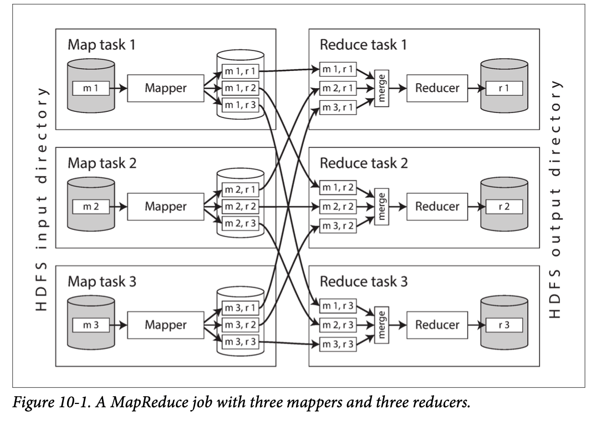
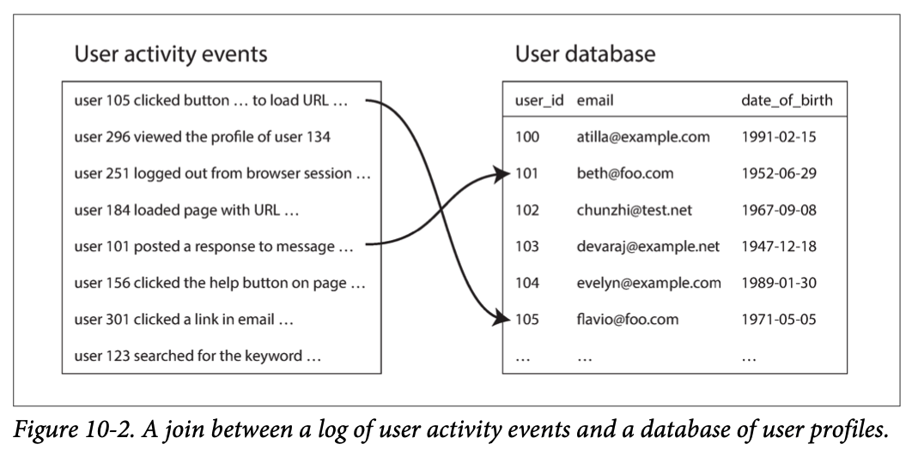
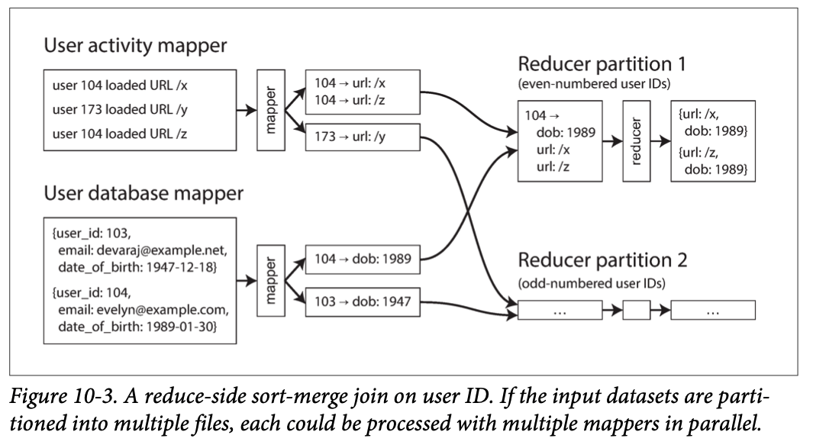

# Chapter 10 Batch Processing

In the first two parts of this book we talked a lot about requests and queries, and the corresponding responses or results. This style of data processing is assumed in many modern data systems: you ask for something, or you send an instruction, and some time later the system (hopefully) gives you an answer. Databases, caches, search indexes, web servers, and many other systems work this way.

In such **online systems**, whether it’s a web browser requesting a page or a service calling a remote API, we generally assume that the request is triggered by a human user, and that the user is waiting for the response. They shouldn’t have to wait too long, so we pay a lot of attention to the response time of these systems (see “Describing Performance”).

The web, and increasing numbers of HTTP/REST-based APIs, has made the request/ response style of interaction so common that it’s easy to take it for granted. But we should remember that it’s not the only way of building systems, and that other approaches have their merits too. Let’s distinguish three different types of systems:

1. Services (online systems). A service waits for a request or instruction from a client to arrive. When one is received, the service tries to handle it as quickly as possible and sends a response back. **Response time** is usually the primary measure of performance of a service, and **availability** is often very important (if the client can’t reach the service, the user will probably get an error message).
1. Batch processing systems (offline systems). A batch processing system takes a large amount of input data, runs a job to process it, and produces some output data. Jobs often take a while (from a few minutes to several days), so there normally isn’t a user waiting for the job to finish. Instead, batch jobs are often scheduled to run periodically (for example, once a day). The primary performance measure of a batch job is usually **throughput** (the time it takes to crunch through an input dataset of a certain size). We discuss batch processing in this chapter.
1. Stream processing systems (near-real-time systems). Stream processing is somewhere between online and offline/batch processing (so it is sometimes called near-real-time or nearline processing). Like a batch processing system, a stream processor consumes inputs and produces outputs (rather than responding to requests). However, a stream job operates on events shortly after they happen, whereas a batch job operates on a fixed set of input data. This difference allows stream processing systems to have lower latency than the equivalent batch systems. As stream processing builds upon batch processing, we discuss it in Chapter 11.

As we shall see in this chapter, batch processing is an important building block in our quest to build reliable, scalable, and maintainable applications. For example, MapReduce, a batch processing algorithm published in 2004, was (perhaps over-enthusiastically) called “the algorithm that makes Google so massively scalable”. It was subsequently implemented in various open source data systems, including **Hadoop, CouchDB, and MongoDB**.

MapReduce is a fairly low-level programming model compared to the parallel processing systems that were developed for data warehouses many years previously, but it was a major step forward in terms of the scale of processing that could be achieved on commodity hardware. Although the importance of MapReduce is now declining, it is still worth understanding, because it provides a clear picture of why and how batch processing is useful.

In fact, batch processing is a very old form of computing. Long before programmable digital computers were invented, **punch card** tabulating machines—such as the Hollerith machines used in the 1890 US Census—implemented a semi-mechanized form of batch processing to compute aggregate statistics from large inputs. And MapReduce bears an uncanny resemblance to the electromechanical IBM card-sorting machines that were widely used for business data processing in the 1940s and 1950s. As usual, history has a tendency of repeating itself.

In this chapter, we will look at MapReduce and several other batch processing algorithms and frameworks, and explore how they are used in modern data systems. But first, to get started, we will look at data processing using standard Unix tools. Even if you are already familiar with them, a reminder about the Unix philosophy is worth‐while because the ideas and lessons from Unix carry over to large-scale, heterogeneous distributed data systems.

## 10.1 Batch Processing with Unix Tools

Let’s start with a simple example. Say you have a web server that appends a line to a log file every time it serves a request. For example, using the nginx default access log format, one line of the log might look like this:

```log
216.58.210.78 - - [27/Feb/2015:17:55:11 +0000] "GET /css/typography.css HTTP/1.1"
200 3377 "http://martin.kleppmann.com/" "Mozilla/5.0 (Macintosh; Intel Mac OS X
10_9_5) AppleWebKit/537.36 (KHTML, like Gecko) Chrome/40.0.2214.115
Safari/537.36"
```

(That is actually one line; it’s only broken onto multiple lines here for readability.) There’s a lot of information in that line. In order to interpret it, you need to look at the definition of the log format, which is as follows:

```log
$remote_addr - $remote_user [$time_local] "$request"
$status $body_bytes_sent "$http_referer" "$http_user_agent"
```

So, this one line of the log indicates that on February 27, 2015, at 17:55:11 UTC, the server received a request for the file /css/typography.css from the client IP address 216.58.210.78. The user was not authenticated, so **$remote_user is set to a hyphen (-)**. The response status was 200 (i.e., the request was successful), and the response was 3,377 bytes in size. The web browser was Chrome 40, and it loaded the file because it was referenced in the page at the URL http://martin.kleppmann.com/.

### 10.1.1 Simple Log Analysis

Various tools can take these log files and produce pretty reports about your website traffic, but for the sake of exercise, let’s build our own, using basic Unix tools. For example, say you want to find the five most popular pages on your website. You can do this in a Unix shell as follows: (Some people love to point out that `cat` is unnecessary here, as the input file could be given directly as an argument to `awk`. However, the linear pipeline is more apparent when written like this.)

```bash
    cat /var/log/nginx/access.log | #1
      awk '{print $7}' | #2
      sort             | #3
      uniq -c          | #4
      sort -r -n       | #5
      head -n 5          #6
```

#1 Read the log file.

#2 Split each line into fields by whitespace, and output only the seventh such field from each line, which happens to be the requested URL. In our example line, this request URL is `/css/typography.css`.

#3 Alphabetically sort the list of requested URLs. If some URL has been requested n times, then after sorting, the file contains the same URL repeated n times in a row.

#4 The `uniq` command filters out repeated lines in its input by checking whether two adjacent lines are the same. The `-c` option tells it to also output a counter: for every distinct URL, it reports how many times that URL appeared in the input.

#5 The second `sort` sorts by the number (`-n`) at the start of each line, which is the number of times the URL was requested. It then returns the results in reverse (`-r`) order, i.e. with the largest number first.

#6 Finally, `head` outputs just the first five lines (`-n 5`) of input, and discards the rest. The output of that series of commands looks something like this:

```log
    4189 /favicon.ico
    3631 /2013/05/24/improving-security-of-ssh-private-keys.html
    2124 /2012/12/05/schema-evolution-in-avro-protocol-buffers-thrift.html
    1369 /
     915 /css/typography.css
```

Although the preceding command line likely looks a bit obscure if you’re unfamiliar with Unix tools, it is incredibly powerful. It will process gigabytes of log files in a matter of seconds, and you can easily modify the analysis to suit your needs. For example, if you want to omit CSS files from the report, change the `awk` argument to `'$7 !~ /\.css$/ {print $7}'`. If you want to count top client IP addresses instead of top pages, change the `awk` argument to `'{print $1}'`. And so on.

We don’t have space in this book to explore Unix tools in detail, but they are very much worth learning about. Surprisingly many data analyses can be done in a few minutes using some combination of `awk`, `sed`, `grep`, `sort`, `uniq`, and `xargs`, and they perform surprisingly well.

#### 10.1.1.1 Chain of commands versus custom program

Instead of the chain of Unix commands, you could write a simple program to do the same thing. For example, in Ruby, it might look something like this:

```ruby
counts = Hash.new(0) #1
File.open('/var/log/nginx/access.log') do |file|
    file.each do |line|
        url = line.split[6] #2
        counts[url] += 1 #3
    end 
end
    top5 = counts.map{|url, count| [count, url] }.sort.reverse[0...5]
    top5.each{|count, url| puts "#{count} #{url}" }
```

#1 counts is a hash table that keeps a counter for the number of times we’ve seen each URL. A counter is zero by default.

#2 From each line of the log, we take the URL to be the seventh whitespace-separated field (the array index here is 6 because Ruby’s arrays are zero-indexed).

#3 Increment the counter for the URL in the current line of the log.

#4 Sort the hash table contents by counter value (descending), and take the top five entries.

#5 Print out those top five entries.

This program is not as concise as the chain of Unix pipes, but it’s fairly readable, and which of the two you prefer is partly a matter of taste. However, besides the superficial syntactic differences between the two, there is a **big difference in the execution flow**, which becomes apparent if you run this analysis on a large file.

#### 10.1.1.2 Sorting versus in-memory aggregation

The Ruby script keeps an in-memory hash table of URLs, where each URL is mapped to the number of times it has been seen. The Unix pipeline example does not have such a hash table, but instead relies on sorting a list of URLs in which multiple occurrences of the same URL are simply repeated.

Which approach is better? It depends how many different URLs you have. For most small to mid-sized websites, you can probably fit all distinct URLs, and a counter for each URL, in (say) 1 GB of memory. In this example, the **working set** of the job (the amount of memory to which the job needs random access) depends only on the number of distinct URLs: if there are a million log entries for a single URL, the space required in the hash table is still just one URL plus the size of the counter. If this working set is small enough, an in-memory hash table works fine—even on a laptop.

On the other hand, if the job’s working set is larger than the available memory, the sorting approach has the advantage that it can make efficient use of disks. It’s the same principle as we discussed in “SSTables and LSM-Trees”: **chunks of data can be sorted in memory and written out to disk as segment files**, and then multiple sorted segments can be merged into a larger sorted file. Mergesort has sequential access patterns that perform well on disks. (Remember that optimizing for sequential I/O was a recurring theme in Chapter 3. The same pattern reappears here.)

The sort utility in GNU Coreutils (Linux) automatically handles larger-than-memory datasets by **spilling to disk**, and **automatically parallelizes** sorting across multiple CPU cores. This means that the simple chain of Unix commands we saw earlier easily scales to large datasets, without running out of memory. The bottleneck is likely to be the rate at which the input file can be read from disk.

### 10.1.2 The Unix Philosophy

It’s no coincidence that we were able to analyze a log file quite easily, using a chain of commands like in the previous example: this was in fact one of **the key design ideas of Unix**, and it remains astonishingly relevant today. Let’s look at it in some more depth so that we can borrow some ideas from Unix.

Doug McIlroy, the inventor of Unix pipes, first described them like this in 1964: “We should have some ways of connecting programs like [a] garden hose—screw in another segment when it becomes necessary to massage data in another way. This is the way of I/O also.” The plumbing analogy stuck, and the idea of connecting programs with pipes became part of what is now known as the Unix philosophy—a set of design principles that became popular among the developers and users of Unix. The philosophy was described in 1978 as follows:

1. Make each program do one thing well. To do a new job, build afresh rather than complicate old programs by adding new “features”.
2. Expect the output of every program to become the input to another, as yet unknown, program. Don’t clutter output with extraneous information. Avoid stringently columnar or binary input formats. **Don’t insist on interactive input**.
3. Design and build software, even operating systems, to be tried early, ideally within weeks. Don’t hesitate to throw away the clumsy parts and rebuild them.
4. Use tools in preference to unskilled help to lighten a programming task, even if you have to detour to build the tools and expect to throw some of them out after you’ve finished using them.

This approach—automation, rapid prototyping, incremental iteration, being friendly to experimentation, and breaking down large projects into manageable chunks—sounds remarkably like the **Agile and DevOps movements** of today. Surprisingly little has changed in four decades.

The sort tool is a great example of a program that does one thing well. It is arguably a better sorting implementation than most programming languages have in their standard libraries (which do not spill to disk and do not use multiple threads, even when that would be beneficial). And yet, sort is barely useful in isolation. It only becomes powerful in combination with the other Unix tools, such as `uniq`.

A Unix shell like bash lets us easily compose these small programs into surprisingly powerful data processing jobs. Even though many of these programs are written by different groups of people, they can be joined together in flexible ways. What does Unix do to enable this composability?

#### 10.1.2.1 A uniform interface

If you expect the output of one program to become the input to another program, that means those programs must use the same data format—in other words, a compatible interface. If you want to be able to connect any program’s output to any program’s input, that means that all programs must use the same **input/output interface**.

In Unix, that interface is a file (or, more precisely, a **file descriptor**). A file is just an ordered sequence of bytes. Because that is such a simple interface, many different things can be represented using the same interface: an actual file on the filesystem, a communication channel to another process (Unix socket, `stdin`, `stdout`), a device driver (say `/dev/audio` or `/dev/lp0`), a socket representing a TCP connection, and so on. It’s easy to take this for granted, but it’s actually quite remarkable that these very different things can share a uniform interface, so they can easily be plugged together. (Another example of a uniform interface is URLs and HTTP, the foundations of the web. A URL identifies a particular thing (resource) on a website, and you can link to any URL from any other website. A user with a web browser can thus seamlessly jump between websites by following links, even though the servers may be operated by entirely unrelated organizations. This principle seems obvious today, but it was a key insight in making the web the success that it is today. Prior systems were not so uniform: for example, in the era of bulletin board systems (BBSs), each system had its own phone number and baud rate configuration. A reference from one BBS to another would have to be in the form of a phone number and modem settings; the user would have to hang up, dial the other BBS, and then manually find the information they were looking for. It wasn’t possible to link directly to some piece of content inside another BBS.)

By convention, many (but not all) Unix programs treat this sequence of bytes as **ASCII text**. Our log analysis example used this fact: awk, sort, uniq, and head all treat their input file as a list of records separated by the \n (newline, ASCII `0x0A`) character. The choice of \n is arbitrary—arguably, the ASCII record separator `0x1E` would have been a better choice, since it’s intended for this purpose—but in any case, the fact that all these programs have standardized on using the same record separator allows them to interoperate.

The parsing of each record (i.e., a line of input) is more vague. Unix tools commonly split a line into fields by whitespace or tab characters, but CSV (comma-separated), pipe-separated, and other encodings are also used. Even a fairly simple tool like `xargs` has half a dozen command-line options for specifying how its input should be parsed.

The uniform interface of ASCII text mostly works, but it’s not exactly beautiful: our log analysis example used `{print $7}` to extract the URL, which is not very readable. In an ideal world this could have perhaps been {print $request_url} or something of that sort. We will return to this idea later.

Although it’s not perfect, even decades later, the uniform interface of Unix is still something remarkable. Not many pieces of software interoperate and compose as well as Unix tools do: you can’t easily pipe the contents of your email account and your online shopping history through a custom analysis tool into a spreadsheet and post the results to a social network or a wiki. Today it’s an exception, not the norm, to have programs that work together as smoothly as Unix tools do.

Even databases with the same data model often don’t make it easy to get data out of one and into the other. **This lack of integration leads to Balkanization of data**.

#### 10.1.2.2 Separation of logic and wiring

Another characteristic feature of Unix tools is their use of standard input (`stdin`) and standard output (`stdout`). If you run a program and don’t specify anything else, `stdin` comes from the keyboard and `stdout` goes to the screen. However, you can also take input from a file and/or redirect output to a file. Pipes let you attach the `stdout` of one process to the `stdin` of another process (with a small in-memory buffer, and without writing the entire intermediate data stream to disk).

A program can still read and write files directly if it needs to, but the Unix approach works best if a program doesn’t worry about particular file paths and simply uses stdin and stdout. This allows a shell user to wire up the input and output in whatever way they want; the program doesn’t know or care where the input is coming from and where the output is going to. (One could say this is a form of loose coupling, late binding, or **inversion of control**.) Separating the input/output wiring from the program logic makes it easier to compose small tools into bigger systems.

You can even write your own programs and combine them with the tools provided by the operating system. Your program just needs to read input from stdin and write output to stdout, and it can participate in data processing pipelines. In the log analysis example, you could write a tool that translates user-agent strings into more sensible browser identifiers, or a tool that translates IP addresses into country codes, and simply plug it into the pipeline. The sort program doesn’t care whether it’s communicating with another part of the operating system or with a program written by you.

However, there are limits to what you can do with stdin and stdout. Programs that need multiple inputs or outputs are possible but tricky. You can’t pipe a program’s output into a network connection.(Except by using a separate tool, such as `netcat` or `curl`. Unix started out trying to represent everything as files, but the BSD sockets API deviated from that convention. The research operating systems Plan 9 and Inferno are more consistent in their use of files: they represent a TCP connection as a file in /net/tcp.) If a program directly opens files for reading and writing, or starts another program as a subprocess, or opens a network connection, then that I/O is **wired up by the program itself**. It can still be configurable (through command-line options, for example), but the flexibility of wiring up inputs and outputs in a shell is reduced.

#### 10.1.2.3 Transparency and experimentation

Part of what makes Unix tools so successful is that they make it quite easy to see what is going on:

1. The input files to Unix commands are normally treated as immutable. This means you can run the commands as often as you want, trying various command-line options, without damaging the input files.
1. You can end the pipeline at any point, pipe the output into `less`, and look at it to see if it has the expected form. This ability to inspect is great for debugging.
1. You can write the output of one pipeline stage to a file and use that file as input to the next stage. This allows you to restart the later stage without rerunning the entire pipeline.

Thus, even though Unix tools are quite blunt, simple tools compared to a query optimizer of a relational database, they remain amazingly useful, especially for experimentation.

However, the biggest limitation of Unix tools is that they **run only on a single machine**—and that’s where tools like Hadoop come in.

## 10.2 MapReduce and Distributed Filesystems

MapReduce is a bit like Unix tools, but distributed across potentially thousands of machines. Like Unix tools, it is a fairly blunt, brute-force, but surprisingly effective tool. **A single MapReduce job is comparable to a single Unix process**: it takes one or more inputs and produces one or more outputs.

As with most Unix tools, running a MapReduce job normally does not modify the input and does not have any side effects other than producing the output. The output files are written once, in a sequential fashion (not modifying any existing part of a file once it has been written).

While Unix tools use `stdin` and `stdout` as input and output, MapReduce jobs read and write files on a distributed filesystem. In Hadoop’s implementation of MapReduce, that filesystem is called HDFS (Hadoop Distributed File System), an open source reimplementation of the Google File System (GFS).

Various other distributed filesystems besides HDFS exist, such as GlusterFS and the Quantcast File System (QFS). **Object storage services such as Amazon S3, Azure Blob Storage, and OpenStack Swift are similar in many ways**.(One difference is that with HDFS, computing tasks can be scheduled to run on the machine that stores a copy of a particular file, whereas object stores usually keep storage and computation separate. Reading from a local disk has a performance advantage if network bandwidth is a bottleneck. Note however that **if erasure coding is used, the locality advantage is lost**, because the data from several machines must be combined in order to reconstitute the original file.) In this chapter we will mostly use HDFS as a running example, but the principles apply to any distributed filesystem.

**HDFS is based on the shared-nothing principle** (see the introduction to Part II), in contrast to the shared-disk approach of Network Attached Storage (NAS) and Storage Area Network (SAN) architectures. **Shared-disk storage** is implemented by a centralized storage appliance, often using custom hardware and special network infrastructure such as Fibre Channel. On the other hand, the shared-nothing approach requires no special hardware, only computers connected by a conventional datacenter network.

HDFS consists of a daemon process running on each machine, exposing a network service that allows other nodes to access files stored on that machine (assuming that every general-purpose machine in a datacenter has some disks attached to it). A central server called the **NameNode** keeps track of which file blocks are stored on which machine. Thus, HDFS conceptually creates one big filesystem that can use the space on the disks of all machines running the daemon.

In order to tolerate machine and disk failures, file blocks are **replicated on multiple machines**. Replication may mean simply several copies of the same data on multiple machines, as in Chapter 5, or an erasure coding scheme such as Reed–Solomon codes, which allows lost data to be recovered with lower storage overhead than full replication. The techniques are similar to RAID, which provides redundancy across several disks attached to the same machine; the difference is that in a distributed filesystem, file access and replication are done over a conventional datacenter network without special hardware.

HDFS has scaled well: at the time of writing, the biggest HDFS deployments run on **tens of thousands of machines**, with combined storage capacity of hundreds of petabytes. Such large scale has become viable because the cost of data storage and access on HDFS, using commodity hardware and open source software, is much lower than that of the equivalent capacity on a dedicated storage appliance.

### 10.2.1 MapReduce Job Execution

MapReduce is a programming framework with which you can write code to process large datasets in a distributed filesystem like HDFS. The easiest way of understanding it is by referring back to the web server log analysis example in “Simple Log Analysis”. The pattern of data processing in MapReduce is very similar to this example:

1. Read a set of input files, and break it up into records. In the web server log example, each record is one line in the log (that is, `\n` is the record separator).
2. Call the mapper function to extract a key and value from each input record. In the preceding example, the mapper function is `awk '{print $7}'`: it extracts the URL ($7) as the key, and leaves the value empty.
3. Sort all of the key-value pairs by key. In the log example, this is done by the first sort command.
4. Call the reducer function to iterate over the sorted key-value pairs. If there are multiple occurrences of the same key, the sorting has made them adjacent in the list, so it is easy to combine those values without having to keep a lot of state in memory. In the preceding example, the reducer is implemented by the command `uniq -c`, which counts the number of adjacent records with the same key.

Those four steps can be performed by one MapReduce job. Steps 2 (map) and 4 (reduce) are where you write your custom data processing code. Step 1 (breaking files into records) is handled by the input format parser. Step 3, the sort step, is implicit in MapReduce—you don’t have to write it, because the output from the mapper is always sorted before it is given to the reducer.

To create a MapReduce job, you need to implement two callback functions, the mapper and reducer, which behave as follows (see also “MapReduce Querying”):

1. Mapper. The mapper is called once for every input record, and its job is to extract the key and value from the input record. For each input, it may generate any number of key-value pairs (including none). It **does not keep any state** from one input record to the next, so each record is handled independently.
1. Reducer. The MapReduce framework takes the key-value pairs produced by the mappers, collects all the values belonging to the same key, and calls the reducer with an iterator over that collection of values. The reducer can produce output records (such as the number of occurrences of the same URL).

In the web server log example, we had a second sort command in step 5, which ranked URLs by number of requests. In MapReduce, if you need a second sorting stage, you can implement it by writing a **second MapReduce job** and using the output of the first job as input to the second job. Viewed like this, the role of the mapper is to prepare the data by putting it into a form that is suitable for sorting, and the role of the reducer is to process the data that has been sorted.

#### 10.2.1.1 Distributed execution of MapReduce

The main difference from pipelines of Unix commands is that MapReduce can parallelize a computation across many machines, without you having to write code to explicitly handle the parallelism. The mapper and reducer only operate on one record at a time; they don’t need to know where their input is coming from or their output is going to, so the framework can handle the complexities of moving data between machines.

It is possible to use standard Unix tools as mappers and reducers in a distributed computation, but more commonly they are implemented as functions in **a conventional programming language**. In Hadoop MapReduce, the mapper and reducer are each a Java class that implements a particular interface. In MongoDB and CouchDB, mappers and reducers are JavaScript functions (see “MapReduce Querying”).

Figure 10-1 shows the dataflow in a Hadoop MapReduce job. Its **parallelization is based on partitioning** (see Chapter 6): the input to a job is typically a directory in HDFS, and each file or file block within the input directory is considered to be a separate partition that can be processed by a separate map task (marked by m 1, m 2, and m 3 in Figure 10-1).

Each input file is typically hundreds of megabytes in size. The MapReduce scheduler (not shown in the diagram) tries to run each mapper on one of the machines that stores a replica of the input file, provided that machine has enough spare RAM and CPU resources to run the map task. This principle is known as putting the computation near the data: it saves copying the input file over the network, **reducing network load and increasing locality**.



In most cases, the application code that should run in the map task is not yet present on the machine that is assigned the task of running it, so the MapReduce framework first copies the code (e.g., JAR files in the case of a Java program) to the appropriate machines. It then starts the map task and begins reading the input file, passing one record at a time to the mapper callback. The output of the mapper consists of key-value pairs.

The reduce side of the computation is also partitioned. While the number of map tasks is determined by the number of input file blocks, the number of reduce tasks is configured by the job author (it can be different from the number of map tasks). To ensure that all key-value pairs with the same key end up at the same reducer, the framework uses a hash of the key to determine which reduce task should receive a particular key-value pair (see “Partitioning by Hash of Key”).

The key-value pairs must be sorted, but the dataset is likely too large to be sorted with a conventional sorting algorithm on a single machine. Instead, the sorting is performed in stages. First, each map task partitions its output by reducer, based on the hash of the key. Each of these partitions is written to a sorted file on the mapper’s local disk, using a technique similar to what we discussed in “SSTables and LSM-Trees”.

Whenever a mapper finishes reading its input file and writing its sorted output files, the MapReduce scheduler notifies the reducers that they can start fetching the output files from that mapper. The reducers connect to each of the mappers and download the files of sorted key-value pairs for their partition. The process of partitioning by reducer, sorting, and copying data partitions from mappers to reducers is known as the shuffle (a confusing term—unlike shuffling a deck of cards, there is **no randomness in MapReduce**).

The reduce task takes the files from the mappers and merges them together, preserving the sort order. Thus, if different mappers produced records with the same key, they will be adjacent in the merged reducer input.

The reducer is called with a key and an iterator that incrementally scans over all records with the same key (which may in some cases not all fit in memory). The reducer can use arbitrary logic to process these records, and can generate any number of output records. These output records are written to a file on the distributed filesystem (usually, one copy on the local disk of the machine running the reducer, with replicas on other machines).

#### 10.2.1.2 MapReduce workflows

The range of problems you can solve with a single MapReduce job is limited. Referring back to the log analysis example, a single MapReduce job could determine the number of page views per URL, but not the most popular URLs, since that requires a second round of sorting.

Thus, **it is very common for MapReduce jobs to be chained together into workflows**, such that the output of one job becomes the input to the next job. The Hadoop MapReduce framework does not have any particular support for workflows, so this chaining is done implicitly by directory name: the first job must be configured to write its output to a designated directory in HDFS, and the second job must be configured to read that same directory name as its input. From the MapReduce framework’s point of view, they are two independent jobs.

Chained MapReduce jobs are therefore less like pipelines of Unix commands (which pass the output of one process as input to another process directly, **using only a small in-memory buffer**) and more like a sequence of commands where each command’s output is written to a temporary file, and the next command reads from the temporary file. This design has advantages and disadvantages, which we will discuss in “Materialization of Intermediate State”.

A batch job’s output is only considered valid when the job has completed successfully (MapReduce discards the partial output of a failed job). Therefore, one job in a workflow can only start when the prior jobs—that is, the jobs that produce its input directories—have completed successfully. To handle these dependencies between job executions, various workflow schedulers for Hadoop have been developed, including Oozie, Azkaban, Luigi, **Airflow**, and Pinball.

These schedulers also have management features that are useful when maintaining a large collection of batch jobs. Workflows consisting of 50 to 100 MapReduce jobs are common when building recommendation systems, and in a large organization, many different teams may be running different jobs that read each other’s output. Tool support is important for managing such complex dataflows.

Various higher-level tools for Hadoop, such as Pig, Hive, Cascading, Crunch, and FlumeJava, also set up workflows of multiple MapReduce stages that are automatically wired together appropriately.

### 10.2.2 Reduce-Side Joins and Grouping

We discussed joins in Chapter 2 in the context of data models and query languages, but we have not delved into how joins are actually implemented. It is time that we pick up that thread again.

In many datasets it is common for one record to have an association with another record: a foreign key in a relational model, a document reference in a document model, or an edge in a graph model. A join is necessary whenever you have some code that needs to access records on both sides of that association (both the record that holds the reference and the record being referenced). As discussed in Chapter 2, **denormalization can reduce the need for joins but generally not remove it entirely**.(The joins we talk about in this book are generally equi-joins, the most common type of join, in which a record is associated with other records that have an identical value in a particular field (such as an ID). Some databases support more general types of joins, for example using a less-than operator instead of an equality operator, but we do not have space to cover them here.)

In a database, if you execute a query that involves only a small number of records, the database will typically use an index to quickly locate the records of interest (see Chapter 3). If the query involves joins, it may require multiple index lookups. However, **MapReduce has no concept of indexes—at least not in the usual sense**.

When a MapReduce job is given a set of files as input, it reads the entire content of all of those files; a database would call this operation a full table scan. If you only want to read a small number of records, a full table scan is outrageously expensive compared to an index lookup. However, in **analytic queries** (see “Transaction Processing or Analytics?”) it is common to want to calculate aggregates over a large number of records. In this case, scanning the entire input might be quite a reasonable thing to do, especially if you can parallelize the processing across multiple machines.

When we talk about joins in the context of batch processing, we mean resolving all occurrences of some association within a dataset. For example, we assume that a job is processing the data for all users simultaneously, not merely looking up the data for one particular user (which would be done far more efficiently with an index).

#### 10.2.2.1 Example: analysis of user activity events

A typical example of a join in a batch job is illustrated in Figure 10-2. On the left is a log of events describing the things that logged-in users did on a website (known as activity events or clickstream data), and on the right is a database of users. You can think of this example as being part of a **star schema** (see “Stars and Snowflakes: Schemas for Analytics”): the log of events is the fact table, and the user database is **one of the dimensions**.



An analytics task may need to correlate user activity with user profile information: for example, if the profile contains the user’s age or date of birth, the system could determine which pages are most popular with which age groups. However, the activity events contain only the user ID, not the full user profile information. Embedding that profile information in every single activity event would most likely be too wasteful. Therefore, the activity events need to be joined with the user profile database.

The simplest implementation of this join would go over the activity events one by one and query the user database (on a remote server) for every user ID it encounters. This is possible, but it would most likely suffer from very poor performance: the processing throughput would be **limited by the round-trip time** to the database server, the effectiveness of a local cache would depend very much on the distribution of data, and running a large number of queries in parallel could easily overwhelm the database.

In order to achieve good throughput in a batch process, the computation must be (as much as possible) local to one machine. **Making random-access requests over the network for every record you want to process is too slow.** Moreover, querying a remote database would mean that the batch job becomes nondeterministic, because the data in the remote database **might change**.

Thus, a better approach would be to take a copy of the user database (for example, extracted from a database backup using an ETL process—see “Data Warehousing”) and to put it in the same distributed filesystem as the log of user activity events. You would then have the user database in one set of files in HDFS and the user activity records in another set of files, and could use MapReduce to bring together all of the relevant records in the same place and process them efficiently.

#### 10.2.2.2 Sort-merge joins

Recall that the purpose of the mapper is to extract a key and value from each input record. In the case of Figure 10-2, this key would be the user ID: one set of mappers would go over the activity events (extracting the user ID as the key and the activity event as the value), while another set of mappers would go over the user database (extracting the user ID as the key and the user’s date of birth as the value). This process is illustrated in Figure 10-3.



When the MapReduce framework partitions the mapper output by key and then sorts the key-value pairs, the effect is that all the activity events and the user record with the same user ID become adjacent to each other in the reducer input. The MapReduce job can even arrange the records to be sorted such that the reducer always sees the record from the user database first, followed by the activity events in timestamp order—this technique is known as a **secondary sort**.

The reducer can then perform the actual join logic easily: the reducer function is called once for every user ID, and thanks to the secondary sort, the first value is expected to be the date-of-birth record from the user database. The reducer stores the date of birth in a local variable and then iterates over the activity events with the same user ID, outputting pairs of viewed-url and viewer-age-in-years. Subsequent MapReduce jobs could then calculate the distribution of viewer ages for each URL, and cluster by age group.

Since the reducer processes all of the records for a particular user ID in one go, it only needs to keep one user record in memory at any one time, and it never needs to make any requests over the network. This algorithm is known as a sort-merge join, since mapper output is sorted by key, and the reducers then merge together the sorted lists of records from both sides of the join.

#### 10.2.2.3 Bringing related data together in the same place

In a sort-merge join, the mappers and the sorting process make sure that all the necessary data to perform the join operation for a particular user ID is brought together in the same place: a single call to the reducer. Having lined up all the required data in advance, the reducer can be a fairly simple, single-threaded piece of code that can churn through records with high throughput and low memory overhead.

One way of looking at this architecture is that mappers “send messages” to the reducers. When a mapper emits a key-value pair, the key acts like the destination address to which the value should be delivered. Even though the key is just an arbitrary string (not an actual network address like an IP address and port number), it behaves like an address: all key-value pairs with the same key will be delivered to the same destination (a call to the reducer).

Using the MapReduce programming model has separated the physical network communication aspects of the computation (getting the data to the right machine) from the application logic (processing the data once you have it). This separation contrasts with the typical use of databases, where a request to fetch data from a database often occurs somewhere deep inside a piece of application code. Since MapReduce handles all network communication, it also **shields the application code** from having to worry about partial failures, such as the crash of another node: MapReduce transparently retries failed tasks without affecting the application logic.

#### 10.2.2.4 GROUP BY

Besides joins, another common use of the “bringing related data to the same place” pattern is grouping records by some key (as in the `GROUP BY` clause in SQL). All records with the same key form a group, and the next step is often to perform some kind of aggregation within each group—for example:

1. Counting the number of records in each group (like in our example of counting page views, which you would express as a `COUNT(*)` aggregation in SQL)
1. Adding up the values in one particular field `(SUM(fieldname))` in SQL
1. Picking the top k records according to some ranking function

The simplest way of implementing such a grouping operation with MapReduce is to set up the mappers so that the key-value pairs they produce use the desired grouping key. The partitioning and sorting process then brings together all the records with the same key in the same reducer. Thus, grouping and joining look quite similar when implemented on top of MapReduce.

Another common use for grouping is collating all the activity events for a particular user session, in order to find out the sequence of actions that the user took—a process called **sessionization**. For example, such analysis could be used to work out whether users who were shown a new version of your website are more likely to make a purchase than those who were shown the old version (A/B testing), or to calculate whether some marketing activity is worthwhile.

If you have multiple web servers handling user requests, the activity events for a particular user are most likely scattered across various different servers’ log files. You can implement sessionization by using **a session cookie, user ID, or similar identifier** as the grouping key and bringing all the activity events for a particular user together in one place, while distributing different users’ events across different partitions.

#### 10.2.2.5 Handling skew

The pattern of “bringing all records with the same key to the same place” breaks down if there is a very large amount of data related to a single key. For example, in a social network, most users might be connected to a few hundred people, but a small number of **celebrities** may have many millions of followers. Such disproportionately active database records are known as **linchpin objects or hot keys**.

Collecting all activity related to a celebrity (e.g., replies to something they posted) in a single reducer can lead to significant skew (also known as hot spots)—that is, one reducer that must process significantly more records than the others (see “Skewed Workloads and Relieving Hot Spots”). Since a MapReduce job is only complete when all of its mappers and reducers have completed, any subsequent jobs must wait for the slowest reducer to complete before they can start.

If a join input has hot keys, there are a few algorithms you can use to compensate. For example, **the skewed join method in Pig** first runs a sampling job to determine which keys are hot. When performing the actual join, the mappers send any records relating to a hot key to one of several reducers, **chosen at random** (in contrast to conventional MapReduce, which chooses a reducer deterministically based on a hash of the key). For the other input to the join, records relating to the hot key need to be replicated to all reducers handling that key.

This technique spreads the work of handling the hot key over several reducers, which allows it to be parallelized better, at the cost of having to replicate the other join input to multiple reducers. **The sharded join method in Crunch** is similar, but requires the hot keys to be specified explicitly rather than using a sampling job. This technique is also very similar to one we discussed in “Skewed Workloads and Relieving Hot Spots”, using randomization to alleviate hot spots in a partitioned database.

**Hive’s skewed join optimization** takes an alternative approach. It requires hot keys to be specified explicitly in the table metadata, and it stores records related to those keys in separate files from the rest. When performing a join on that table, it uses a map-side join (see the next section) for the hot keys.

When grouping records by a hot key and aggregating them, you can perform the grouping in **two stages**. The first MapReduce stage sends records to a random reducer, so that each reducer performs the grouping on a subset of records for the hot key and outputs a more compact aggregated value per key. The second MapReduce job then combines the values from all of the first-stage reducers into a single value per key.

### 10.2.3 Map-Side Joins

The join algorithms described in the last section perform the actual join logic in the reducers, and are hence known as **reduce-side joins**. The mappers take the role of preparing the input data: extracting the key and value from each input record, assigning the key-value pairs to a reducer partition, and sorting by key.

The reduce-side approach has the advantage that you do not need to make any assumptions about the input data: whatever its properties and structure, the mappers can prepare the data to be ready for joining. However, the downside is that all that sorting, copying to reducers, and merging of reducer inputs **can be quite expensive**. Depending on the available memory buffers, data may be written to disk several times as it passes through the stages of MapReduce.

On the other hand, if you can make certain assumptions about your input data, it is possible to make joins faster by using a so-called map-side join. This approach uses a cut-down MapReduce job in which there are no reducers and no sorting. Instead, each mapper simply reads one input file block from the distributed filesystem and writes one output file to the filesystem—that is all.

#### 10.2.3.1 Broadcast hash joins

The simplest way of performing a map-side join applies in the case where a large dataset is joined with a small dataset. In particular, the small dataset needs to be small enough that it can be **loaded entirely into memory in each of the mappers**.

For example, imagine in the case of Figure 10-2 that the user database is small enough to fit in memory. In this case, when a mapper starts up, it can first read the user database from the distributed filesystem into an in-memory hash table. Once this is done, the mapper can scan over the user activity events and simply look up the user ID for each event in the hash table.(This example assumes that there is exactly one entry for each key in the hash table, which is probably true with a user database (a user ID uniquely identifies a user). In general, the hash table **may need to contain several entries with the same key**, and the join operator will output all matches for a key.)

There can still be several map tasks: one for each file block of the large input to the join (in the example of Figure 10-2, the activity events are the large input). Each of these mappers loads the small input entirely into memory.

This simple but effective algorithm is called a broadcast hash join: the word broadcast reflects the fact that each mapper for a partition of the large input reads the entirety of the small input (so the small input is effectively “broadcast” to all partitions of the large input), and the word hash reflects its use of a hash table. This join method is supported by **Pig (under the name “replicated join”), Hive (“MapJoin”), Cascading, and Crunch**. It is also used in data warehouse query engines such as Impala.

Instead of loading the small join input into an in-memory hash table, an alternative is to store the small join input in a **read-only index on the local disk**. The frequently used parts of this index will remain in the operating system’s **page cache**, so this approach can provide random-access lookups almost as fast as an in-memory hash table, but without actually requiring the dataset to fit in memory.

#### 10.2.3.2 Partitioned hash joins

If the inputs to the map-side join are partitioned in the same way, then the hash join approach can be applied to each partition independently. In the case of Figure 10-2, you might arrange for the activity events and the user database to each be **partitioned based on the last decimal digit of the user ID** (so there are 10 partitions on either side). For example, mapper 3 first loads all users with an ID ending in 3 into a hash table, and then scans over all the activity events for each user whose ID ends in 3.

If the partitioning is done correctly, you can be sure that all the records you might want to join are located in the same numbered partition, and so it is sufficient for each mapper to only read one partition from each of the input datasets. This has the advantage that each mapper can load a smaller amount of data into its hash table.

This approach only works if both of the join’s inputs have the same number of partitions, with records assigned to partitions based on the same key and the same hash function. If the inputs are generated by prior MapReduce jobs that already perform this grouping, then this can be a reasonable assumption to make.

Partitioned hash joins are known as **bucketed map joins in Hive**.

#### 10.2.3.3 Map-side merge joins

Another variant of a map-side join applies if the input datasets are **not only partitioned in the same way, but also sorted based on the same key**. In this case, it does not matter whether the inputs are small enough to fit in memory, because a mapper can perform the same merging operation that would normally be done by a reducer: reading both input files incrementally, in order of ascending key, and matching records with the same key.

If a map-side merge join is possible, it probably means that prior MapReduce jobs brought the input datasets into this partitioned and sorted form in the first place. In principle, this join could have been performed in the reduce stage of the prior job. However, it may still be appropriate to perform the merge join in a separate map-only job, for example **if the partitioned and sorted datasets are also needed for other purposes besides this particular join**.

#### 10.2.3.4 MapReduce workflows with map-side joins

When the output of a MapReduce join is consumed by downstream jobs, the choice of map-side or reduce-side join affects the structure of the output. **The output of a reduce-side join is partitioned and sorted by the join key, whereas the output of a map-side join is partitioned and sorted in the same way as the large input** (since one map task is started for each file block of the join’s large input, regardless of whether a partitioned or broadcast join is used).

As discussed, map-side joins also make more assumptions about **the size, sorting, and partitioning** of their input datasets. Knowing about the physical layout of datasets in the distributed filesystem becomes important when optimizing join strategies: it is not sufficient to just know the encoding format and the name of the directory in which the data is stored; you must also know the number of partitions and the keys by which the data is partitioned and sorted.

In the Hadoop ecosystem, this kind of metadata about the partitioning of datasets is often maintained in **HCatalog and the Hive metastore**.

### 10.2.4 The Output of Batch Workflows

We have talked a lot about the various algorithms for implementing workflows of MapReduce jobs, but we neglected an important question: what is the result of all of that processing, once it is done? Why are we running all these jobs in the first place?

In the case of database queries, we distinguished transaction processing (OLTP) purposes from analytic purposes (see “Transaction Processing or Analytics?” on page 90). We saw that OLTP queries generally look up a small number of records by key, using indexes, in order to present them to a user (for example, on a web page). On the other hand, analytic queries often scan over a large number of records, performing groupings and aggregations, and the output often has the form of a report: a graph showing the change in a metric over time, or the top 10 items according to some ranking, or a breakdown of some quantity into subcategories. The consumer of such a report is often an analyst or a manager who needs to make business decisions.

Where does batch processing fit in? It is not transaction processing, nor is it analytics. It is closer to analytics, in that a batch process typically scans over large portions of an input dataset. However, a workflow of MapReduce jobs is not the same as a SQL query used for analytic purposes (see “Comparing Hadoop to Distributed Databases” on page 414). The output of a batch process is often not a report, but some other kind of structure.

#### 10.2.4.1 Building search indexes

**Google’s original use of MapReduce was to build indexes for its search engine**, which was implemented as a workflow of 5 to 10 MapReduce jobs. Although Google later moved away from using MapReduce for this purpose, it helps to understand MapReduce if you look at it through the lens of building a search index. (Even today, Hadoop MapReduce remains a good way of building indexes for Lucene/Solr.)

We saw briefly in “Full-text search and fuzzy indexes” how a full-text search index such as Lucene works: it is a file (the term dictionary) in which you can efficiently look up a particular keyword and find the list of all the document IDs containing that keyword (the postings list). This is a very simplified view of a search index—in reality it requires various additional data, in order to rank search results by relevance, correct misspellings, resolve synonyms, and so on—but the principle holds.

If you need to perform a full-text search over a fixed set of documents, then a batch process is a very effective way of building the indexes: the mappers partition the set of documents as needed, each reducer builds the index for its partition, and the index files are written to the distributed filesystem. Building such document-partitioned indexes (see “Partitioning and Secondary Indexes”) parallelizes very well.

Since querying a search index by keyword is a read-only operation, these index files are **immutable** once they have been created.

If the indexed set of documents changes, one option is to periodically rerun the entire indexing workflow for the entire set of documents, and replace the previous index files wholesale with the new index files when it is done. This approach can be computationally expensive if only a small number of documents have changed, but it has the advantage that the indexing process is very easy to reason about: documents in, indexes out.

Alternatively, it is possible to build indexes **incrementally**. As discussed in Chapter 3, if you want to add, remove, or update documents in an index, Lucene writes out new segment files and asynchronously merges and compacts segment files in the background. We will see more on such incremental processing in Chapter 11.

#### 10.2.4.2 Key-value stores as batch process output

Search indexes are just one example of the possible outputs of a batch processing workflow. Another common use for batch processing is to **build machine learning systems such as classifiers** (e.g., spam filters, anomaly detection, image recognition) and recommendation systems (e.g., people you may know, products you may be interested in, or related searches).

The output of those batch jobs is often some kind of database: for example, a database that can be queried by user ID to obtain suggested friends for that user, or a database that can be queried by product ID to get a list of related products.

These databases need to be queried from the web application that handles user requests, which is usually separate from the Hadoop infrastructure. So how does the output from the batch process get back into a database where the web application can query it?

The most obvious choice might be to use the client library for your favorite database directly within a mapper or reducer, and to write from the batch job directly to the database server, one record at a time. This will work (assuming your firewall rules allow direct access from your Hadoop environment to your production databases), but it is a bad idea for several reasons:

1. As discussed previously in the context of joins, making a network request for every single record is orders of magnitude slower than the normal throughput of a batch task. Even if the client library supports batching, performance is likely to be poor.
1. MapReduce jobs often run many tasks in parallel. If all the mappers or reducers concurrently write to the same output database, with a rate expected of a batch process, that database can easily be overwhelmed, and its performance for queries is likely to suffer. This can in turn cause operational problems in other parts of the system.
1. Normally, MapReduce provides a clean all-or-nothing guarantee for job output: if a job succeeds, the result is the output of running every task exactly once, even if some tasks failed and had to be retried along the way; if the entire job fails, no output is produced. However, writing to an external system from inside a job produces externally visible side effects that cannot be hidden in this way. Thus, you have to worry about the results from partially completed jobs being visible to other systems, and the complexities of Hadoop task attempts and speculative execution.

A much better solution is to build a brand-new database inside the batch job and write it as files to the job’s output directory in the distributed filesystem, just like the search indexes in the last section. Those data files are then immutable once written, and can be **loaded in bulk into servers that handle read-only queries**. Various key-value stores support building database files in MapReduce jobs, including **Voldemort, Terrapin, ElephantDB, and HBase bulk loading**.

Building these database files is a good use of MapReduce: using a mapper to extract a key and then sorting by that key is already a lot of the work required to build an index. Since most of these key-value stores are read-only (the files can only be written once by a batch job and are then immutable), the data structures are quite simple. For example, they do not require a WAL (see “Making B-trees reliable”).

When loading data into Voldemort, the server continues serving requests to the old data files while the new data files are copied from the distributed filesystem to the server’s local disk. Once the copying is complete, the server atomically switches over to querying the new files. If anything goes wrong in this process, it can easily switch back to the old files again, since they are still there and immutable.

#### 10.2.4.3 Philosophy of batch process outputs

The Unix philosophy that we discussed earlier in this chapter (“The Unix Philosophy”) encourages experimentation by being very explicit about dataflow: a program reads its input and writes its output. In the process, the input is left unchanged, any previous output is completely replaced with the new output, and there are no other side effects. This means that you can rerun a command as often as you like, tweaking or debugging it, without messing up the state of your system.

The handling of output from MapReduce jobs follows the same philosophy. By **treating inputs as immutable and avoiding side effects** (such as writing to external databases), batch jobs not only achieve good performance but also become much easier to maintain:

1. If you introduce a bug into the code and the output is wrong or corrupted, you can simply roll back to a previous version of the code and rerun the job, and the output will be correct again. Or, even simpler, you can keep the old output in a different directory and simply switch back to it. Databases with read-write transactions do not have this property: if you deploy buggy code that writes bad data to the database, then rolling back the code will do nothing to fix the data in the database. (The idea of being able to recover from buggy code has been called **human fault tolerance**.)
1. As a consequence of this ease of rolling back, feature development can proceed more quickly than in an environment where mistakes could mean irreversible damage. This principle of minimizing irreversibility is beneficial for Agile software development.
1. If a map or reduce task fails, the MapReduce framework automatically re-schedules it and runs it again on the same input. If the failure is due to a bug in the code, it will keep crashing and eventually cause the job to fail after a few attempts; but if the failure is due to a transient issue, the fault is tolerated. This automatic retry is only safe because inputs are immutable and outputs from failed tasks are discarded by the MapReduce framework.
1. The same set of files can be used as input for various different jobs, including monitoring jobs that calculate metrics and evaluate whether a job’s output has the expected characteristics (for example, by comparing it to the output from the previous run and measuring discrepancies).
1. Like Unix tools, MapReduce jobs separate logic from wiring (configuring the input and output directories), which provides a separation of concerns and enables potential reuse of code: one team can focus on implementing a job that does one thing well, while other teams can decide where and when to run that job.

In these areas, the design principles that worked well for Unix also seem to be working well for Hadoop—but Unix and Hadoop also differ in some ways. For example, because most Unix tools assume untyped text files, they have to do a lot of input parsing (our log analysis example at the beginning of the chapter used `{print $7}` to extract the URL). On Hadoop, some of those low-value syntactic conversions are eliminated by using more structured file formats: Avro (see “Avro”) and **Parquet** (see “Column-Oriented Storage”) are often used, as they provide efficient schema-based encoding and allow evolution of their schemas over time (see Chapter 4).

### 10.2.5 Comparing Hadoop to Distributed Databases

As we have seen, Hadoop is somewhat like a distributed version of Unix, where HDFS is the filesystem and **MapReduce is a quirky implementation of a Unix process** (which happens to always run the sort utility between the map phase and the reduce phase). We saw how you can implement various join and grouping operations on top of these primitives.

When the MapReduce paper was published, it was—in some sense—not at all new. All of the processing and parallel join algorithms that we discussed in the last few sections had already been implemented in so-called **massively parallel processing (MPP) databases** more than a decade previously. For example, the Gamma database machine, Teradata, and Tandem NonStop SQL were pioneers in this area.

The biggest difference is that MPP databases focus on parallel execution of analytic SQL queries on a cluster of machines, while the combination of MapReduce and a distributed filesystem provides something much more like a general-purpose operating system that can run arbitrary programs.

#### 10.2.5.1 Diversity of storage

Databases require you to structure data according to a particular model (e.g., relational or documents), whereas files in a distributed filesystem are just byte sequences, which can be written using any data model and encoding. They might be collections of database records, but they can equally well be text, images, videos, sensor readings, sparse matrices, feature vectors, genome sequences, or any other kind of data.

To put it bluntly, Hadoop opened up the possibility of indiscriminately dumping data into HDFS, and only later figuring out how to process it further. By contrast, MPP databases typically require careful up-front modeling of the data and query patterns before importing the data into the database’s proprietary storage format.

From a purist’s point of view, it may seem that this careful modeling and import is desirable, because it means users of the database have better-quality data to work with. However, in practice, it appears that **simply making data available quickly**—even if it is in a quirky, difficult-to-use, raw format—is often more valuable than trying to decide on the ideal data model up front.

The idea is similar to a data warehouse (see “Data Warehousing” on page 91): simply bringing data from various parts of a large organization together in one place is valuable, because it enables joins across datasets that were previously disparate. The careful schema design required by an MPP database slows down that centralized data collection; **collecting data in its raw form**, and worrying about schema design later, allows the data collection to be speeded up (a concept sometimes known as a **“data lake” or “enterprise data hub”**).

Indiscriminate data dumping shifts the burden of interpreting the data: instead of forcing the producer of a dataset to bring it into a standardized format, the interpretation of the data becomes the consumer’s problem (the schema-on-read approach; see “Schema flexibility in the document model” on page 39). This can be an advantage if the producer and consumers are different teams with different priorities. There may not even be one ideal data model, but rather different views onto the data that are suitable for different purposes. Simply dumping data in its raw form allows for several such transformations. This approach has been dubbed the sushi principle: “raw data is better”.

Thus, Hadoop has often been used for implementing ETL processes (see “Data Warehousing” on page 91): data from transaction processing systems is dumped into the distributed filesystem in some raw form, and then MapReduce jobs are written to clean up that data, transform it into a relational form, and import it into an MPP data warehouse for analytic purposes. Data modeling still happens, but it is in a separate step, decoupled from the data collection. This decoupling is possible because a distributed filesystem supports data encoded in any format.

#### 10.2.5.2 Diversity of processing models

MPP databases are monolithic, tightly integrated pieces of software that take care of storage layout on disk, query planning, scheduling, and execution. Since these components can all be tuned and optimized for the specific needs of the database, the system as a whole can achieve very good performance on the types of queries for which it is designed. Moreover, the SQL query language allows expressive queries and elegant semantics without the need to write code, making it accessible to graphical tools used by business analysts (such as Tableau).

On the other hand, **not all kinds of processing can be sensibly expressed as SQL queries**. For example, if you are building machine learning and recommendation systems, or full-text search indexes with relevance ranking models, or performing image analysis, you most likely need a more general model of data processing. These kinds of processing are often very specific to a particular application (e.g., feature engineering for machine learning, natural language models for machine translation, risk estimation functions for fraud prediction), so they inevitably require writing code, not just queries.

MapReduce gave engineers the ability to easily **run their own code over large datasets**. If you have HDFS and MapReduce, you can build a SQL query execution engine on top of it, and indeed this is what the Hive project did. However, you can also write many other forms of batch processes that do not lend themselves to being expressed as a SQL query.

Subsequently, people found that MapReduce was too limiting and performed too badly for some types of processing, so various other processing models were developed on top of Hadoop (we will see some of them in “Beyond MapReduce”). Having two processing models, SQL and MapReduce, was not enough: even more different models were needed! And due to the openness of the Hadoop platform, it was feasible to implement a whole range of approaches, which would not have been possible within the confines of a monolithic MPP database.

Crucially, those various processing models can all be run on a single shared-use cluster of machines, all accessing the same files on the distributed filesystem. In the Hadoop approach, there is no need to import the data into several different specialized systems for different kinds of processing: the system is flexible enough to support a diverse set of workloads within the same cluster. **Not having to move data around** makes it a lot easier to derive value from the data, and a lot easier to experiment with new processing models.

The Hadoop ecosystem includes both random-access OLTP databases such as HBase (see “SSTables and LSM-Trees”) and MPP-style analytic databases such as Impala. **Neither HBase nor Impala uses MapReduce**, but both use HDFS for storage. They are very different approaches to accessing and processing data, but they can nevertheless coexist and be integrated in the same system.

#### 10.2.5.3 Designing for frequent faults

When comparing MapReduce to MPP databases, two more differences in design approach stand out: the handling of faults and the use of memory and disk. **Batch processes are less sensitive to faults than online systems**, because they do not immediately affect users if they fail and they can always be run again.

If a node crashes while a query is executing, most MPP databases abort the entire query, and either let the user resubmit the query or automatically run it again. As queries normally run for a few seconds or a few minutes at most, this way of handling errors is acceptable, since the cost of retrying is not too great. **MPP databases also prefer to keep as much data as possible in memory** (e.g., using hash joins) to avoid the cost of reading from disk.

On the other hand, MapReduce can tolerate the failure of a map or reduce task without it affecting the job as a whole by retrying work at the granularity of an individual task. It is also very eager to **write data to disk**, partly for fault tolerance, and partly on the assumption that the dataset will be too big to fit in memory anyway.

The MapReduce approach is more appropriate for **larger jobs**: jobs that process so much data and run for such a long time that they are likely to experience at least one task failure along the way. In that case, rerunning the entire job due to a single task failure would be wasteful. Even if recovery at the granularity of an individual task introduces overheads that make fault-free processing slower, it can still be a reasonable trade-off if the rate of task failures is high enough.

But how realistic are these assumptions? In most clusters, machine failures do occur, but they are not very frequent—probably rare enough that most jobs will not experience a machine failure. Is it really worth incurring significant overheads for the sake of fault tolerance?

To understand the reasons for MapReduce’s sparing use of memory and task-level recovery, it is helpful to look at the environment for which MapReduce was originally designed. Google has **mixed-use datacenters**, in which online production services and offline batch jobs run on the same machines. Every task has a resource allocation (CPU cores, RAM, disk space, etc.) that is enforced using containers. Every task also has a priority, and if a higher-priority task needs more resources, lower-priority tasks on the same machine can be **terminated (preempted)** in order to free up resources. Priority also determines pricing of the computing resources: teams must pay for the resources they use, and higher-priority processes cost more.

This architecture allows non-production (low-priority) computing resources to be **overcommitted**, because the system knows that it can reclaim the resources if necessary. Overcommitting resources in turn allows better utilization of machines and greater efficiency compared to systems that segregate production and non-production tasks. However, as MapReduce jobs run at low priority, they run the risk of being preempted at any time because a higher-priority process requires their resources. Batch jobs effectively “pick up the scraps under the table,” using any computing resources that remain after the high-priority processes have taken what they need.

At Google, a MapReduce task that runs for an hour has an approximately **5% risk** of being terminated to make space for a higher-priority process. This rate is more than an order of magnitude higher than the rate of failures due to hardware issues, machine reboot, or other reasons. At this rate of preemptions, if a job has 100 tasks that each run for 10 minutes, there is a risk greater than 50% that at least one task will be terminated before it is finished.

And this is why MapReduce is designed to tolerate frequent unexpected task termination: it’s not because the hardware is particularly unreliable, it’s because the freedom to arbitrarily terminate processes enables better resource utilization in a computing cluster.

Among open source cluster schedulers, preemption is less widely used. YARN’s CapacityScheduler supports preemption for balancing the resource allocation of different queues, but **general priority preemption is not supported in YARN, Mesos, or Kubernetes** at the time of writing. In an environment where tasks are not so often terminated, the design decisions of MapReduce make less sense. In the next section, we will look at some alternatives to MapReduce that make different design decisions.

## 10.3 Beyond MapReduce

Although MapReduce became very popular and received a lot of hype in the late 2000s, it is just one among many possible programming models for distributed systems. **Depending on** the volume of data, the structure of the data, and the type of processing being done with it, other tools may be more appropriate for expressing a computation.

We nevertheless spent a lot of time in this chapter discussing MapReduce because it is a useful learning tool, as it is a fairly clear and simple abstraction on top of a distributed filesystem. That is, **simple in the sense of being able to understand** what it is doing, not in the sense of being easy to use. Quite the opposite: implementing a complex processing job using the raw MapReduce APIs is actually quite hard and laborious—for instance, you would need to implement any join algorithms from scratch.

In response to the difficulty of using MapReduce directly, various **higher-level programming models (Pig, Hive, Cascading, Crunch) were created as abstractions on top of MapReduce**. If you understand how MapReduce works, they are fairly easy to learn, and their higher-level constructs make many common batch processing tasks significantly easier to implement.

However, there are also problems with the MapReduce execution model itself, which are not fixed by adding another level of abstraction and which manifest themselves as poor performance for some kinds of processing. On the one hand, MapReduce is very **robust**: you can use it to process almost arbitrarily large quantities of data on an unreliable multi-tenant system with frequent task terminations, and it will still get the job done (albeit slowly). On the other hand, other tools are sometimes orders of magnitude faster for some kinds of processing.

In the rest of this chapter, we will look at some of those alternatives for batch processing. In Chapter 11 we will move to stream processing, which can be regarded as another way of speeding up batch processing.

### 10.3.1 Materialization of Intermediate State

As discussed previously, every MapReduce job is **independent** from every other job. The main contact points of a job with the rest of the world are its input and output directories on the distributed filesystem. If you want the output of one job to become the input to a second job, you need to configure the second job’s input directory to be the same as the first job’s output directory, and an external workflow scheduler must start the second job only once the first job has completed.

This setup is reasonable if the output from the first job is a dataset that you want to publish widely within your organization. In that case, you need to be able to refer to it by name and reuse it as input to several different jobs (including jobs developed by other teams). Publishing data to a well-known location in the distributed filesystem allows loose coupling so that jobs don’t need to know who is producing their input or consuming their output (see “Separation of logic and wiring”).

However, in many cases, you know that the output of one job is only ever used as input to one other job, which is maintained by the same team. In this case, the files on the distributed filesystem are simply **intermediate state**: a means of passing data from one job to the next. In the complex workflows used to build recommendation systems consisting of 50 or 100 MapReduce jobs, there is a lot of such intermediate state.

The process of writing out this intermediate state to files is called **materialization**. (We came across the term previously in the context of materialized views, in “Aggregation: Data Cubes and Materialized Views”. It means to eagerly compute the result of some operation and write it out, rather than computing it on demand when requested.)

By contrast, the log analysis example at the beginning of the chapter used Unix pipes to connect the output of one command with the input of another. Pipes **do not fully** materialize the intermediate state, but instead stream the output to the input incrementally, using only a **small in-memory buffer**.

MapReduce’s approach of fully materializing intermediate state has downsides compared to Unix pipes:

1. A MapReduce job can only start when all tasks in the preceding jobs (that generate its inputs) have completed, whereas processes connected by a Unix pipe are started at the same time, with output being consumed as soon as it is produced. Skew or varying load on different machines means that a job often has a few straggler tasks that take much longer to complete than the others. Having to wait until all of the preceding job’s tasks have completed slows down the execution of the workflow as a whole.
1. Mappers are often redundant: they just read back the same file that was just written by a reducer, and prepare it for the next stage of partitioning and sorting. In many cases, the mapper code could be part of the previous reducer: if the reducer output was partitioned and sorted in the same way as mapper output, then reducers could be chained together directly, without interleaving with mapper stages.
1. Storing intermediate state in a distributed filesystem means those files are replicated across several nodes, which is often overkill for such temporary data.

#### 10.3.1.1 Dataflow engines

In order to fix these problems with MapReduce, several new execution engines for distributed batch computations were developed, the most well known of which are **Spark, Tez, and Flink**. There are various differences in the way they are designed, but they have one thing in common: they handle an entire workflow as one job, rather than breaking it up into independent subjobs.

Since they explicitly model the flow of data through several processing stages, these systems are known as dataflow engines. Like MapReduce, they work by repeatedly calling a user-defined function to process one record at a time on a single thread. They parallelize work by partitioning inputs, and they copy the output of one function over the network to become the input to another function.

Unlike in MapReduce, these functions **need not take the strict roles of alternating map and reduce**, but instead can be assembled in more flexible ways. We call these functions operators, and the dataflow engine provides several different options for connecting one operator’s output to another’s input:

1. One option is to repartition and sort records by key, like in the shuffle stage of MapReduce (see “Distributed execution of MapReduce”). This feature enables sort-merge joins and grouping in the same way as in MapReduce.
1. Another possibility is to take several inputs and to partition them in the same way, but skip the sorting. This saves effort on partitioned hash joins, where the partitioning of records is important but the order is irrelevant because building the hash table randomizes the order anyway.
1. For broadcast hash joins, the same output from one operator can be sent to all partitions of the join operator.

This style of processing engine is based on research systems like **Dryad and Nephele**, and it offers several advantages compared to the MapReduce model:

1. Expensive work such as sorting need only be performed in places where it is actually required, rather than always happening by default between every map and reduce stage.
1. There are no unnecessary map tasks, since the work done by a mapper can often be incorporated into the preceding reduce operator (because a mapper does not change the partitioning of a dataset).
1. Because all joins and data dependencies in a workflow are explicitly declared, the scheduler has an overview of what data is required where, so it can make locality optimizations. For example, it can try to place the task that consumes some data on the same machine as the task that produces it, so that the data can be exchanged through a shared memory buffer rather than having to copy it over the network.
1. It is usually sufficient for intermediate state between operators to be kept in memory or written to local disk, which requires less I/O than writing it to HDFS (where it must be replicated to several machines and written to disk on each replica). MapReduce already uses this optimization for mapper output, but dataflow engines generalize the idea to all intermediate state.
1. Operators can start executing as soon as their input is ready; there is no need to wait for the entire preceding stage to finish before the next one starts.
1. Existing Java Virtual Machine (JVM) processes can be reused to run new operators, reducing startup overheads compared to MapReduce (which launches a new JVM for each task).

You can use dataflow engines to implement the same computations as MapReduce workflows, and they usually execute **significantly faster due to the optimizations described here**. Since operators are a generalization of map and reduce, the same processing code can run on either execution engine: workflows implemented in Pig, Hive, or Cascading can be switched from MapReduce to Tez or Spark with a simple configuration change, without modifying code.

Tez is a fairly thin library that relies on the YARN shuffle service for the actual copying of data between nodes, whereas Spark and Flink are big frameworks that include their own network communication layer, scheduler, and user-facing APIs. We will discuss those high-level APIs shortly.

#### 10.3.1.2 Fault tolerance

An advantage of fully materializing intermediate state to a distributed filesystem is that it is **durable**, which makes fault tolerance fairly easy in MapReduce: if a task fails, it can just be restarted on another machine and read the same input again from the filesystem.

Spark, Flink, and Tez avoid writing intermediate state to HDFS, so they take a different approach to tolerating faults: if a machine fails and the intermediate state on that machine is lost, it is **recomputed from other data that is still available** (a prior intermediary stage if possible, or otherwise the original input data, which is normally on HDFS).

To enable this recomputation, the framework must keep track of how a given piece of data was computed—which input partitions it used, and which operators were applied to it. Spark uses the **resilient distributed dataset** (RDD) abstraction for tracking the ancestry of data, while Flink **checkpoints** operator state, allowing it to resume running an operator that ran into a fault during its execution.

When recomputing data, it is important to know whether the computation is deterministic: that is, given the same input data, do the operators always produce the same output? This question matters if some of the lost data has already been sent to downstream operators. If the operator is restarted and the recomputed data is not the same as the original lost data, it becomes very hard for downstream operators to resolve the contradictions between the old and new data. The solution in the case of nondeterministic operators is normally to kill the downstream operators as well, and run them again on the new data.

In order to avoid such cascading faults, it is better to make operators **deterministic**. Note however that it is easy for nondeterministic behavior to accidentally creep in: for example, many programming languages do not guarantee any particular order when iterating over elements of a hash table, many probabilistic and statistical algorithms explicitly rely on using random numbers, and any use of the system clock or external data sources is nondeterministic. Such causes of nondeterminism need to be removed in order to reliably recover from faults, for example by generating pseudorandom numbers using a fixed seed.

Recovering from faults by recomputing data is **not always** the right answer: if the intermediate data is much smaller than the source data, or if the computation is very CPU-intensive, it is probably cheaper to materialize the intermediate data to files than to recompute it.

#### 10.3.1.3 Discussion of materialization

Returning to the Unix analogy, we saw that MapReduce is like writing the output of each command to a temporary file, whereas dataflow engines look much more like Unix pipes. Flink especially is built around the idea of pipelined execution: that is, **incrementally** passing the output of an operator to other operators, and not waiting for the input to be complete before starting to process it.

A sorting operation inevitably needs to consume its entire input before it can produce any output, because it’s possible that the very last input record is the one with the lowest key and thus needs to be the very first output record. Any operator that requires sorting will thus need to accumulate state, at least temporarily. But many other parts of a workflow can be executed in a pipelined manner.

When the job completes, its output needs to go somewhere durable so that users can find it and use it—most likely, it is written to the distributed filesystem again. Thus, when using a dataflow engine, materialized datasets on HDFS are still usually the inputs and the final outputs of a job. Like with MapReduce, the inputs are immutable and the output is completely replaced. The improvement over MapReduce is that you save yourself writing all the intermediate state to the filesystem as well.

### 10.3.2 Graphs and Iterative Processing

In “Graph-Like Data Models” we discussed using graphs for modeling data, and using graph query languages to traverse the edges and vertices in a graph. The discussion in Chapter 2 was focused around OLTP-style use: quickly executing queries to find a small number of vertices matching certain criteria.

It is also interesting to look at graphs in a batch processing context, where the goal is to perform some kind of offline processing or analysis on an entire graph. This need often arises in machine learning applications such as recommendation engines, or in ranking systems. For example, one of the most famous graph analysis algorithms is **PageRank**, which tries to estimate the popularity of a web page based on what other web pages link to it. It is used as part of the formula that determines the order in which web search engines present their results.

Dataflow engines like Spark, Flink, and Tez (see “Materialization of Intermediate State”) typically arrange the operators in a job as a **directed acyclic graph (DAG)**. This is not the same as graph processing: in dataflow engines, the flow of data from one operator to another is structured as a graph, while the data itself typically consists of **relational-style tuples**. In graph processing, the data itself has the form of a graph. Another unfortunate naming confusion!

Many graph algorithms are expressed by traversing one edge at a time, joining one vertex with an adjacent vertex in order to propagate some information, and repeating until some condition is met—for example, until there are no more edges to follow, or until some metric converges. We saw an example in Figure 2-6, which made a list of all the locations in North America contained in a database by repeatedly following edges indicating which location is within which other location (this kind of algorithm is called a transitive closure).

It is possible to store a graph in a distributed filesystem (in files containing lists of vertices and edges), but this idea of “repeating until done” cannot be expressed in plain MapReduce, since it only performs a single pass over the data. This kind of algorithm is thus often implemented in an iterative style:

1. An external scheduler runs a batch process to calculate one step of the algorithm.
2. When the batch process completes, the scheduler checks whether it has finished (based on the completion condition—e.g., there are no more edges to follow, or the change compared to the last iteration is below some threshold).
3. If it has not yet finished, the scheduler goes back to step 1 and runs another round of the batch process.

This approach works, but implementing it with MapReduce is often very inefficient, because MapReduce does not account for the iterative nature of the algorithm: it will always read the entire input dataset and produce a completely new output dataset, even if only a small part of the graph has changed compared to the last iteration.

#### 10.3.2.1 The Pregel processing model

As an optimization for batch processing graphs, the **bulk synchronous parallel (BSP) model** of computation has become popular. Among others, it is implemented by Apache Giraph, Spark’s GraphX API, and Flink’s Gelly API. It is also known as the **Pregel model**, as Google’s Pregel paper popularized this approach for processing graphs.

Recall that in MapReduce, mappers conceptually “send a message” to a particular call of the reducer because the framework collects together all the mapper outputs with the same key. A similar idea is behind Pregel: one vertex can “send a message” to another vertex, and typically those messages are sent along the edges in a graph.

In each iteration, a function is called for each vertex, passing it all the messages that were sent to it—much like a call to the reducer. The difference from MapReduce is that in the Pregel model, **a vertex remembers its state in memory** from one iteration to the next, so the function only needs to process new incoming messages. If no messages are being sent in some part of the graph, no work needs to be done.

It’s a bit similar to the actor model (see “Distributed actor frameworks”), if you think of each vertex as an actor, except that vertex state and messages between vertices are fault-tolerant and durable, and communication proceeds in fixed rounds: at every iteration, the framework delivers all messages sent in the previous iteration. Actors normally have no such timing guarantee.

#### 10.3.2.2 Fault tolerance

The fact that vertices can only communicate by message passing (not by querying each other directly) helps improve the performance of Pregel jobs, since messages can be batched and there is less waiting for communication. The only waiting is between iterations: since the Pregel model guarantees that all messages sent in one iteration are delivered in the next iteration, **the prior iteration must completely finish**, and all of its messages must be copied over the network, before the next one can start.

Even though the underlying network may drop, duplicate, or arbitrarily delay messages (see “Unreliable Networks”), Pregel implementations guarantee that messages are processed exactly once at their destination vertex in the following iteration. Like MapReduce, the framework transparently recovers from faults in order to simplify the programming model for algorithms on top of Pregel.

This fault tolerance is achieved by **periodically checkpointing the state of all vertices** at the end of an iteration—i.e., writing their full state to durable storage. If a node fails and its in-memory state is lost, the simplest solution is to roll back the entire graph computation to the last checkpoint and restart the computation. If the algorithm is deterministic and messages are logged, it is also possible to selectively recover only the partition that was lost (like we previously discussed for dataflow engines).

#### 10.3.2.3 Parallel execution

A vertex does not need to know on which physical machine it is executing; when it sends messages to other vertices, it simply sends them to a vertex ID. It is up to the framework to partition the graph—i.e., to decide which vertex runs on which machine, and how to route messages over the network so that they end up in the right place.

Because the programming model deals with just one vertex at a time (sometimes called “thinking like a vertex”), the framework may partition the graph in arbitrary ways. Ideally it would be partitioned such that vertices are colocated on the same machine if they need to communicate a lot. However, finding such an optimized partitioning **is hard—in practice**, the graph is often simply partitioned by an arbitrarily assigned vertex ID, making no attempt to group related vertices together.

As a result, graph algorithms often have a lot of cross-machine communication overhead, and the intermediate state (messages sent between nodes) is often bigger than the original graph. The overhead of sending messages over the network can significantly slow down distributed graph algorithms.

For this reason, if your graph can fit in memory on a single computer, it’s quite likely that a single-machine (maybe even single-threaded) algorithm will outperform a distributed batch process. Even if the graph is bigger than memory, it can fit on the disks of a single computer, single-machine processing using a framework such as **GraphChi** is a viable option. If the graph is too big to fit on a single machine, a distributed approach such as **Pregel** is unavoidable; efficiently parallelizing graph algorithms is an area of ongoing research.

### 10.3.1 High-Level APIs and Languages

Over the years since MapReduce first became popular, the execution engines for distributed batch processing have matured. By now, the infrastructure has become robust enough to store and process many **petabytes** of data on clusters of over **10,000** machines. As the problem of physically operating batch processes at such scale has been considered more or less solved, attention has turned to other areas: improving the programming model, improving the efficiency of processing, and broadening the set of problems that these technologies can solve.

As discussed previously, higher-level languages and APIs such as **Hive, Pig, Cascading, and Crunch** became popular because programming MapReduce jobs by hand is quite laborious. As **Tez** emerged, these high-level languages had the additional benefit of being able to move to the new dataflow execution engine without the need to rewrite job code. **Spark and Flink** also include their own high-level dataflow APIs, often taking inspiration from **FlumeJava**.

These dataflow APIs generally use **relational-style** building blocks to express a computation: joining datasets on the value of some field; grouping tuples by key; filtering by some condition; and aggregating tuples by counting, summing, or other functions.

Internally, these operations are implemented using the various join and grouping algorithms that we discussed earlier in this chapter.
Besides the obvious advantage of requiring less code, these high-level interfaces also allow **interactive use**, in which you write analysis code incrementally in a shell and run it frequently to observe what it is doing. This style of development is very helpful when exploring a dataset and experimenting with approaches for processing it. It is also reminiscent of the Unix philosophy, which we discussed in “The Unix Philosophy”.

Moreover, these high-level interfaces not only make the humans using the system more productive, but they also improve the job execution efficiency at a machine level.

#### 10.3.1.1 The move toward declarative query languages

An advantage of specifying joins as relational operators, compared to spelling out the code that performs the join, is that the framework can analyze the properties of the join inputs and automatically decide which of the aforementioned join algorithms would be most suitable for the task at hand. Hive, Spark, and Flink have **cost-based query optimizers** that can do this, and even change the order of joins so that the amount of intermediate state is minimized.

The choice of join algorithm can make a big difference to the performance of a batch job, and it is nice not to have to understand and remember all the various join algorithms we discussed in this chapter. This is possible if joins are specified in a **declarative** way: the application simply states which joins are required, and the query optimizer decides how they can best be executed. We previously came across this idea in “Query Languages for Data”.

However, in other ways, MapReduce and its dataflow successors are very **different** from the fully declarative query model of SQL. MapReduce was built around the idea of **function callbacks**: for each record or group of records, a user-defined function (the mapper or reducer) is called, and that function is free to call arbitrary code in order to decide what to output. This approach has the **advantage** that you can draw upon a large ecosystem of existing libraries to do things like parsing, natural language analysis, image analysis, and running numerical or statistical algorithms.

The **freedom to easily run arbitrary code** is what has long distinguished batch processing systems of MapReduce heritage from MPP databases (see “Comparing Hadoop to Distributed Databases”); although databases have facilities for writing user-defined functions, they are often cumbersome to use and not well integrated with the package managers and dependency management systems that are widely used in most programming languages (such as Maven for Java, npm for JavaScript, and Rubygems for Ruby).

However, dataflow engines have found that there are also advantages to incorporating more declarative features in areas besides joins. For example, if a callback function contains only a simple filtering condition, or it just selects some fields from a record, then there is significant CPU overhead in calling the function on every record. If such simple filtering and mapping operations are expressed in a declarative way, the query optimizer can take advantage of column-oriented storage layouts (see “Column-Oriented Storage”) and **read only the required columns** from disk. Hive, Spark DataFrames, and Impala also use **vectorized execution** (see “Memory bandwidth and vectorized processing”): iterating over data in a **tight inner loop** that is friendly to CPU caches, and avoiding function calls. Spark generates JVM bytecode and Impala uses LLVM to generate native code for these inner loops.

By incorporating declarative aspects in their high-level APIs, and having query optimizers that can take advantage of them during execution, batch processing frameworks begin to look more like MPP databases (and can achieve comparable performance). At the same time, by having the extensibility of being able to run arbitrary code and read data in arbitrary formats, they retain their flexibility advantage.

#### 10.3.1.2 Specialization for different domains

While the extensibility of being able to run arbitrary code is useful, there are also many common cases where standard processing patterns keep reoccurring, and so it is worth having reusable implementations of the common building blocks. Traditionally, MPP databases have served the needs of business intelligence analysts and business reporting, but that is just one among many domains in which batch processing is used.

Another domain of increasing importance is **statistical and numerical algorithms**, which are needed for machine learning applications such as classification and recommendation systems. Reusable implementations are emerging: for example, **Mahout** implements various algorithms for machine learning on top of MapReduce, Spark, and Flink, while **MADlib** implements similar functionality inside a relational MPP database (Apache HAWQ).

Also useful are spatial algorithms such as k-nearest neighbors, which searches for items that are close to a given item in some multi-dimensional space—a kind of similarity search. **Approximate search** is also important for genome analysis algorithms, which need to find strings that are similar but not identical.

Batch processing engines are being used for distributed execution of algorithms from an increasingly wide range of domains. As batch processing systems gain built-in functionality and high-level declarative operators, and as MPP databases become more programmable and flexible, the two are beginning to look more alike: in the end, they are all just systems for storing and processing data.

## 10.4 Summary

In this chapter we explored the topic of batch processing. We started by looking at Unix tools such as awk, grep, and sort, and we saw how the design philosophy of those tools is carried forward into MapReduce and more recent dataflow engines. Some of those design **principles** are that inputs are immutable, outputs are intended to become the input to another (as yet unknown) program, and complex problems are solved by composing small tools that “do one thing well.”

In the Unix world, the **uniform interface** that allows one program to be composed with another is files and pipes; in MapReduce, that interface is a distributed filesystem. We saw that dataflow engines add their own pipe-like data transport mechanisms to avoid materializing intermediate state to the distributed filesystem, but the initial input and final output of a job is still usually HDFS.
The two main problems that distributed batch processing frameworks need to solve are:

1. Partitioning. In MapReduce, mappers are partitioned according to input file blocks. The output of mappers is repartitioned, sorted, and merged into a configurable number of reducer partitions. The purpose of this process is to bring all the related data—e.g., all the records with the same key—together in the same place. Post-MapReduce dataflow engines try to avoid sorting unless it is required, but they otherwise take a broadly similar approach to partitioning.
1. Fault tolerance. MapReduce frequently writes to disk, which makes it easy to recover from an individual failed task without restarting the entire job but slows down execution in the failure-free case. Dataflow engines perform less materialization of intermediate state and keep more in memory, which means that they need to recompute more data if a node fails. Deterministic operators reduce the amount of data that needs to be recomputed.

We discussed several join algorithms for MapReduce, most of which are also internally used in MPP databases and dataflow engines. They also provide a good illustration of how partitioned algorithms work:

1. Sort-merge joins. Each of the inputs being joined goes through a mapper that extracts the join key. By partitioning, sorting, and merging, all the records with the same key end up going to the same call of the reducer. This function can then output the joined records.
1. Broadcast hash joins. One of the two join inputs is small, so it is not partitioned and it can be entirely loaded into a hash table. Thus, you can start a mapper for each partition of the large join input, load the hash table for the small input into each mapper, and then scan over the large input one record at a time, querying the hash table for each record.
1. Partitioned hash joins. If the two join inputs are partitioned in the same way (using the same key, same hash function, and same number of partitions), then the hash table approach can be used independently for each partition.

Distributed batch processing engines have a deliberately restricted programming model: callback functions (such as mappers and reducers) are assumed to be **stateless** and to have no externally visible side effects besides their designated output. This restriction allows the framework to hide some of the hard distributed systems problems behind its abstraction: in the face of crashes and network issues, tasks can be retried safely, and the output from any failed tasks is discarded. If several tasks for a partition succeed, only one of them actually makes its output visible.

Thanks to the framework, your code in a batch processing job does not need to worry about implementing fault-tolerance mechanisms: the framework can guarantee that the final output of a job is the same as if no faults had occurred, even though in reality various tasks perhaps had to be retried. These reliable semantics are much stronger than what you usually have in online services that handle user requests and that write to databases as a side effect of processing a request.

The distinguishing feature of a batch processing job is that it reads some input data and produces some output data, without modifying the input—in other words, the output is derived from the input. Crucially, the input data is **bounded**: it has a known, fixed size (for example, it consists of a set of log files at some point in time, or a snapshot of a database’s contents). Because it is bounded, a job knows when it has finished reading the entire input, and so a job eventually completes when it is done.

In the next chapter, we will turn to stream processing, in which the input is unbounded—that is, you still have a job, but its inputs are never-ending streams of data. In this case, a job is never complete, because at any time there may still be more work coming in. We shall see that stream and batch processing are similar in some respects, but the assumption of unbounded streams also changes a lot about how we build systems.
