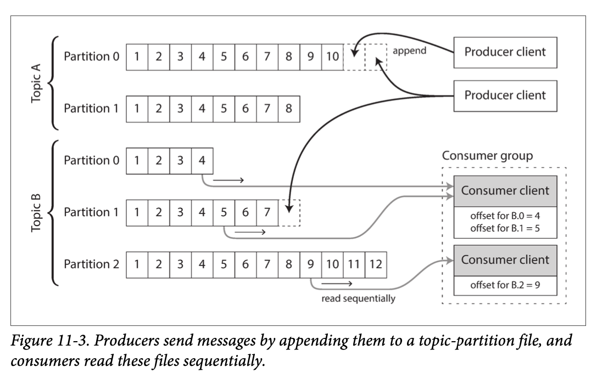
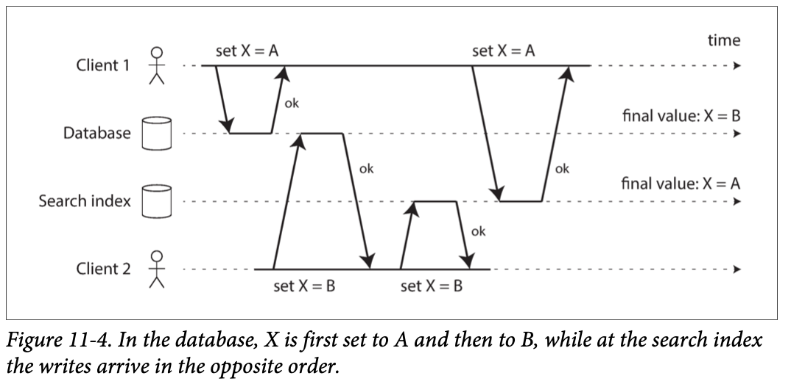

# Stream Processing

Assumption for batch processing: the input is bounded, i.e., of a known and finite size, so the batch process knows when finished reading input. For example, sorting that is central to MapReduce. It could happen that the last input record is the lowest key and needs to be the very first output record. Starting the output early is not an option.

In reality, a lot of data is unbounded because it arrives gradually over time. Thus, batch processors must artificially divide the data into chunks of fixed duration: for example, processing a day’s worth of data at the end of every day.

To reduce the delay for daily batch processing, we can run processing more frequently--say, every second--or even continuously. This is the idea befind stream processing.

In general, a “stream” refers to data that is incrementally made available over time. The concept appears in many places: in the stdin and stdout of Unix, programming languages (lazy lists: infinite streaming, lazy evaluation, e.g. Haskell `is.tl` and `is.take`, Python `generators`(`yield`)), filesystem APIs (such as Java’s FileInputStream), TCP con‐ nections, delivering audio and video over the internet, and so on.

## 11.1 Transmitting Event Streams

In both streaming and batch processing worlds, input data essentially is a small, self contained, immutable object containing the details of something that happened at some point in time. The input data could be a file for batch processing and an event for streaming.

In a filesystem, a filename identifies a set of related records; in a streaming system, related events are usually grouped together into a topic or stream.

Moving toward continual processing with low delays, polling becomes expensive if datastore is not designed for this kind of usage. The more often you poll, the lower the percentage of  new events, and thus the higher overheads. Instead, it is better for consumers to be notified when new events appear.

Databases have traditionally not supported notification mechanism well: relational databases commonly have triggers, which can react to a change (e.g., a row being inserted into a table), but they are very limited in what they can do and have been an afterthought in database design. Instead, specialized tools have been developed for event notifications.

## 11.1.1 Messaging Systems

A simple way to implement could be a Unix pipe or TCP connection between producer and consumer. That connects one sender with one recipient. Most messaging systems expand on this basic model. To differentiate, following two questions can be asked:

1. What happens if the producers send messages faster than the consumer can process?
    1. drop
    1. buffer in a queue. What happens as the queue grows?
        1. system crash if out of memory
        1. write messages to disk. How does disk access affect the performance?
    1. apply backpressure(flow control, blocking producer from sending). Unix pipes and TCS use backpressure.
1. What happens if nodes crash or temporarily go offline-are any messages lost? Durability may require some combination of disk writing and/or replication. If can afford to sometimes lose messages, can get higher throughput and lower latency on the same hardware.

Whether message loss is acceptable depends on application. Periodic metrics might be ok to miss afew data points, but counter will be off.

Batch processing system provide a strong reliability with retry and discarding partial failures. Output is same as if no failures occured, which simplify the programming model.

**Direct messaging from producers to consumers**

- UDP multicast is widely used in the financial industry for streaming stock feeds, where low latency is important. Application level protocols can recover lost packets (producer remember packets so that it can retransmit).
- Brokerless libraries such as ZeroMQ and nanomsg pub/sub over TCP/IP multicast.
- StatsD and Brubeck use UDP messaging for collecting metrics. (In StatsD, counter metrics are only correct if all messages are received. Using UDP makes the metrics at best approximate.)
- If the consumer exposes a service on the network, producers can make a direct HTTP or RPC request, which is the idea behidn webhooks, a pattern in which a callback URL of one service is registered with another service.

Require application code to be aware of message loss. Can tolerate limited faults. Generally assume producers and consumers are constantly online.

**Message Broker (Queue)**

Essentially a kind of database optimized for handling message streams. More easily tolerate clients that come and go (connect, disconnct, and crash). Some only keep messages in memory, others write to disk. They generally allow unbounded queueing as opposed to dropping message or backpressure.

Consumers are generally asynchronous considering that the producer does not wait for messaging processing.

**Message Brokers compared to databases**

Some message brokers can even participate in two-phase commit protocols using XA (eXtended Architecture) or JTA (Java Transaction API).

Important practical differences:

- Message broker automatically delete a message, thus not suitable for long-term storage. Databases keep until explicitly deleted.
- Message brokers assume the working set is small. If broker buffer a lot of messages, perhaps spilling messages to disk if they no longer fit in memory, each individual message takes longer to process and the overall throughput may degrade.
- Databases often support secondary indexes and various of searching, while message brokers often support subscribing to a subset of topics matching some pattern. Both are essentially ways for a client to select portion of the data.
- Database query result is based on a point-in-time snapshot of the data. Message brokers do not support arbitrary quries, but notify clients when data changes.

The above traditional view of message brokers are in standards like JMS (JSR-343 Java Message Service 2.0 specification) and AMQP (Advanced Message Queuing Protocol Specification) and implemented in software like RabbitMQ, ActiveMQ, HornetQ, Qpid, TIBCO enterprise message service, IBM MQ, Azure service bugs, and google cloud pub/sub.

**Multiple consumers**

When multiple consumers read messages in the same topic, two main patterns are used.

1. Load balancing. Each message is delivered to one of the consumers. The broker may assign messages to consumers arbitrarily. Useful when processing is expensive and can add consumers to parallelize. In AMQP, you can implement load balancing by having multi‐ ple clients consuming from the same queue, and in JMS it is called a shared subscription.
1. Fan out. Each message is delivered to all of the consumers. This feature is provided by topic subscriptions in JMS, and exchange bindings in AMQP.

The two patterns can be combined. Two separate groups, each group collectively receives all messages but within each group only one node receives each message.

**Acknowledgements and redelivery**

Broker can use ack to avoid processing failures or partial processing.

It is possible that the message was fully processed but the ack was lost in the network. Handling this requires an atomic commit protocol.

The combination of load balancing and redelivery leads to messages being reordered. To avoid, you can use a separate queue per consumer.

## 11.1.2 Partitioned Logs

Why can we not have a hybrid, combining the durable storage approach of databases with the low-latency notification facilities of messaging? This is the idea behind log- based message brokers.

**Using logs for message storage**

The Unix tool `tail -f`, which watches a file for data being appended, essentially works like this.

The log can be partitioned. Different partitions can then be hosted on different machines, making each partition a separate log that can be read and written independently from other partitions. A topic can then be defined as a group of partitions that all carry messages of the same type.

Within each partition, the broker assigns a monotonically increasing sequence number, or offset, to every message. Such a sequence number makes sense because a partition is append-only, so the messages within a partition are totally ordered. There is no ordering guarantee across different partitions.

Apache Kafka, Amazon Kinesis Streams, and Twitter’s DistributedLog are log-based message brokers. Google Cloud Pub/Sub is architecturally similar but exposes a JMS-style API rather than a log abstraction. Even though these message brokers write all messages to disk, they are able to achieve throughput of millions of messages per second by partitioning across multiple machines, and fault tolerance by replicating messages.

**Logs compared to traditional messaging**

The log-based approach trivially supports fan-out messaging, because several consumers can independently read the log without affecting each other—reading a message does not delete it from the log. To achieve load balancing across a group of consumers, instead of assigning individual messages to consumer clients, the broker can assign entire partitions to nodes in the consumer group.

Each client then consumes all the messages in the partitions it has been assigned. Typically, when a consumer has been assigned a log partition, it reads the messages in the partition sequentially, in a straightforward single-threaded manner. This coarse grained load balancing approach has some downsides:

- The number of nodes sharing the work of consuming a topic can be at most the number of log partitions in that topic, because messages within the same partition are delivered to the same node.[1]
- If a single message is slow to process, it holds up the processing of subsequent messages in that partition (a form of head-of-line blocking).

Thus, in situations where messages may be expensive to process and you want to parallelize processing on a message-by-message basis, and where message ordering is not so important, the JMS/AMQP style of message broker is preferable (SQS no order). On the other hand, in situations with high message throughput, where each message is fast to process and where message ordering is important (SQS FIFO?), the log-based approach works very well.

[1]: In general, single-threaded processing of a partition is preferable, and parallelism can be increased by using more partitions.)

**Consumer offsets**

With periodically marking an offset while consuming a partition sequentially, the broker does not need to track acknowledgments for every single message. The reduced bookkeeping, opportunities for batching and pipelining help increase the throughput for log-based systems.

This offset is similar to the log sequence number that is commonly found in single-leader database replication. In database replication, the log sequence number allows a follower to reconnect and resume replication without skipping any writes. Exactly the same principle is used here: the message broker behaves like a leader database, and the consumer like a follower.

If a consumer node fails, another node in the consumer group is assigned the failed consumer’s partitions, and it starts consuming messages at the last recorded offset. If the consumer had processed subsequent messages but not yet recorded their offset, those messages will be processed a second time upon restart.

**Disk space usage**

Log is divided into segments and deleted or moved to archive from time to time to reclaim disk space.

A slow consumer may fall far behind that the offset points to a deleted segment and may miss some messages. Effectively, the log implement a bounded-szie buffer when it gets full, a circular buffer or ring buffer. The buffer is on disk and can be very large.

A typical large hard drive has a capacity of 6 TB and a sequential write throughput of 150 Mb/s. It takes about 11 hours to fill. Thus, the disk can buffer 11 hours' worth of messages. This ratio remains the same even if you use many drives and machines. In practice, deployments rarely use the full write bandwidth, so the log can typically keep a buffer of several days or weeks.

The throughput of a log remains more or less constant, since every message is written to disk anyway. In contrast to keeping messages in memory by default: such systems are fast when queues are short and much slower when they start writing to disk.

**When consumers cannot keep up with producers**

We discussed three choices previously. The log-based approach is a form of buffering with a large fixed-size buffer (available disk space).

If a consumer falls so far behind, the broker effectively drops old messages that go back further than buffer size can accomodate. You can mointor how far behind and raise an alert. As the buffer is large, there is enough time for a human operator to fix the slow consumer.

Even if a consumer does fall too far behind, only that consumer is affected; it does not disrupt other consumers. This fact is a big operational advantage: you can experimentally consume a production log for development, testing, or debugging purposes, without having to worry much about disrupting production services. When a consumer is shut down or crashes, it stops consuming resources—the only thing that remains is its consumer offset.

This behavior also contrasts with traditional message brokers, where you need to be careful to delete any queues whose consumers have been shut down—otherwise they continue unnecessarily accumulating messages and taking away memory from consumers that are still active.

**Replaying old messages**

Processing and acknowledging messages
- is a destructive operation for AMQP- and JMS-style message brokers, since it causes the messages to be deleted on the broker.
- in a log-based message broker, consuming messages is more like reading from a file: it is a read-only operation that does not change the log.

The offset is under the consumer’s control, so it can easily be manipulated if necessary: for example, you can start a copy of a consumer with yesterday’s offsets and write the output to a different location, in order to reprocess the last day’s worth of messages. You can repeat this any number of times, varying the processing code.

This aspect makes log-based messaging more like the batch processes. It allows more experimentation and easier recovery from errors and bugs, making it a good tool for integrating dataflows within an organization.

## 11.2 Databases and Streams

The connection between databases and streams run deeper than just the physical storage of logs on disk--it is quite fundamental.

A replication log is a stream of databse writes, produced by the leader as it processes transactions. The followers apply the stream to their own copy and end up with an accurate copy.

### 11.2.1 Keeping Systems in Sync

There is no single system satisfying all data storage, querying, and processing needs. For example, using an OLTP (online transaction processing) DB to serve user requests, a cache to speed up common requests, a full-text index to handle search queries, and a data warehouse for analytics. Each has its own copy of data stored in its own representation that is optimized for its own purposes.

Data need to be kept in sync. With data warehouses this is performed by ETL processes, a batch process.

If periodic full dump is too slow, an alternative is dual writes, in which application code explicitly writes to each, e.g., first writing to DB, then updating the search index, then invalidating the cache (or write concurrently).

Dual writes have some problems, one of which is race condition. client 1 wants to set the value to A, and client 2 wants to set it to B.

Another possibility is that one write may fail and the other succeeds. This is a fault-tolerance problem but two systems are inconsistent. Atomic commit is expensive to solve. The database has a leader and the search index has a leader as well. Neither follows the other so conflicts can occur.

### 11.2.2 Change Data Capture

Databases' replication logs are considered internal implementation and not a public API, thus not intended to be parsed by external clients.

**Implementing change data capture**

Change data capture is a mechanism for ensuring that all changes made to the system of record are also reflected in the derived data systems so that the derived systems have an accurate copy of the data. A log-based message broker is well suited since it preserves the ordering of messages.

Database triggers can be used to implement change data capture by registering triggers that observe all changes to data tables and add corresponding entries to a changelog table. However, they tend to be fragile and have significant performance overheads. Parsing the replication log can be a more robust approach, although it also comes with challenges, such as handling schema changes.

LinkedIn’s [Databus](https://engineering.linkedin.com/distributed-systems/log-what-every-software-engineer-should-know-about-real-time-datas-unifying), Facebook’s [Wormhole](https://www.usenix.org/system/files/conference/nsdi15/nsdi15-paper-sharma.pdf), and Yahoo!’s [Sherpa](http://web.archive.org/web/20160801221400/https://developer.yahoo.com/blogs/ydn/sherpa-7992.html) use this idea at large scale. [Bottled Water](https://github.com/confluentinc/bottledwater-pg) implements CDC for PostgreSQL using an [API](https://martin.kleppmann.com/2015/04/23/bottled-water-real-time-postgresql-kafka.html) that decodes the write-ahead log, [Maxwell](https://maxwells-daemon.io/) and [Debezium](https://debezium.io/) do something similar for MySQL by parsing the binlog, [Mongoriver](https://github.com/stripe-archive/mongoriver) reads the MongoDB [oplog](https://www.slideshare.net/danharvey/change-data-capture-with-mongodb-and-kafka), and GoldenGate provides similar facilities for Oracle.

Like message brokers, change data capture is usually asynchronous: the system of record database does not wait for the change to be applied to consumers before committing it. This design has the operational advantage that adding a slow consumer does not affect the system of record too much, but it has the downside that all the issues of replication lag apply.

**Initial snapshot**

The snapshot of the database must correspond to a known position or offset in the change log, so that you know at which point to start applying changes after the snapshot has been processed. Some CDC tools integrate this snapshot facility, while others leave it as a manual operation.

**Log compaction**

If you can only keep a limited amount of log history, you need to go through the snapshot process every time you want to add a new derived data system. However, log compaction provides a good alternative.

The principle is simple: the storage engine periodically looks for log records with the same key, throws away any duplicates, and keeps only the most recent update for each key. This compaction and merging process runs in the background.

In a log-structured storage engine, an update with a special null value (a tombstone) indicates that a key was deleted, and causes it to be removed during log compaction.

The same idea works in the context of log-based message brokers and change data capture. If the CDC system is set up such that every change has a primary key, and every update for a key replaces the previous value for that key, then it’s sufficient to keep just the most recent write for a particular key.

Now, whenever you want to rebuild a derived data system such as a search index, you can start a new consumer from offset 0 of the log-compacted topic, and sequentially scan over all messages in the log. The log is guaranteed to contain the most recent value for every key in the database (and maybe some older values)—in other words, you can use it to obtain a full copy of the database contents without having to take another snapshot of the CDC source database.

This log compaction feature is supported by Apache Kafka. As we shall see later in this chapter, it allows the message broker to be used for durable storage, not just for transient messaging.

**API support for change streams**

Databases are beginning to support change streams as first-class interface, e.g., RethinkDB allows notification subscription [when query result change, 36](), [Firebase]() and CouchDB() provide data sync based on a change feed also available to applications, and [Meteor]() uses the MongoDB oplog to subscribe to data changes and update UI.

VoltDB represents an output stream in the relational data model as a table into which transactions can insert tuples, but cannot be queried. The stream consists of the log of tuples of the committed transactions, in the order they were committed. External consumers can asynchronously consume this log and use it to update derived data systems.

Kafka Connect [41] is an effort to integrate change data capture tools for a wide range of database systems with Kafka.

### 11.2.3 Event Sourcing

There are some parallels between CDC and event sourcing, which was developed in the domain-driven design (DDD) community [42-44]. Simlarly event sourcing also stores changes as a log of change events.

The biggest difference is that event sourcing applies the idea at a different level of abstraction:
- In CDC, application uses DB in a mutable way. The log of changes is stracted from DB at a low level (e.g., parsing the replication log) to ensure the order of writes and avoid race condition. The pplication does not need to be aware of CDC.
- In event sourcing, application logic is built on immutable events written to an event log. The event store is append-only. Updates or deletes are discouraged or prohibited. Events are designed to reflect things happened at the application level, rather than state changes.

Event sourcing makes it easier to evolve applications over time, to understand why something happended, and guards against application bugs.

Event sourcing is similar to the chronicle data model [45]. Event log is similar to the fact table in a [star schema](p93 stars and snowflakes).

Specialized DB such as Event Store [46] have been developed to support applications using event sourcing. A conventional DB or a log-based message broker can be used to build applications in this style.

**Deriving current state from the event log**

Applications that use event sourcing can take the log of events and transform into application state. The transformation logic can be arbitrary but deterministic.

Like CDC, replaying event log reconstruct teh current state of the system. However, log compaction needs to be handled differently:

- A CDC event for update contains the entire new version of the record and log compaction can discard previous events for the same key.
- With event sourcing, events are modeled at a higher level: an event expresses user intention not mechanics of the state update. Later events typically do not override prior events. Log compaction is not possible in the same way.

**Commands and events**

With event sourcing, a user issues a command which may fail. The application must validate synchronously. If the validation succeeds, the command becomes an event, which is durable and immutable. For example, if a user tries to reserve a seat.

A consumer of the event stream is not allowed to reject an event: it is immutable part of the log and may have been seen by other consumers.

Alternatively the reservation could be split into two events: first a tentative reservation, and then a seprate confirmation event once the reservation has been validated. The aplit allows the validation process asynchronous.

### 11.2.4 State, Streams, and Immutability

From Pat Helland [52],

>Transaction logs record all the changes made to the database. High-speed appends are the only way to change the log. From this perspective, the contents of the database hold a caching of the latest record values in the logs. The truth is the log. The database is a cache of a subset of the log. That cached subset happens to be the latest value of each record and index value from the log.

Log compaction is one way of bridging the distinction between log and DB state: it retains only the latest version of each record.

**Advantages of immutable events**

Immutability in databases is an old idea. For example, accountants have been using immutability for centuries in financial bookkeeping. When a transaction occurs, it is recorded in an append-only ledger, which is essentially a log of events describing money, goods, or services that have changed hands. The accounts, such as profit and loss or the balance sheet, are derived from the transactions in the ledger by adding them up [53].

The incorrect transaction still remains in the ledger forever, because it might be important for auditing reasons.

Immutable events also capture more information than just the current state. Customer adds to card and remove later. The information might be useful for analytics. Perhaps the customer foudn a substitute.

**Deriving several views from the same event log**

One can derive several different read-oriented representations from the same log of events, just like having multiple consumers of a stream. For example, Druid ingests directly from Kafka [55], Pistachio is a distributed key-value store using kafka as a commit log [56], Kafka Connect sinks exports to various databases and indexes [41].

Having an explicit translation step from an event log helps application evolution over time. If you want to introduce a new feature, you can build a separate read-optimized view of the new feature and run alongside existing systems. It is much easier than schema migration.

Schema design, indexing, and storage engines are aimed to support certain query and access patterns. Storing data is straightforward without the worry about how it is going to be queried. The idea is sometimes known as command query responsibility segregation (CQRS) [42],[58],[59].

On page 11, for twitter's home timelines, a cache of recently written tweets by people that a user follows. This is another example of read-optimized state: home timelines are highly denormalized, since your tweets are duplicated in all the timelines of the people following you. However, the fan-out service keeps the duplicated state in sync with new tweets and new following relationships, which keeps the duplication manageable.

**Concurrency control**

The biggest downside of event sourcing and change data capture is that the consumers of the event log are usually async, we discussed previously "Reading Your Own Writes" on page 162.

One solution is to perform the updates synchronously with appending the event to the log. This requries a transaction to combine the writes into an atomci unit. So either you keep the event log and the read view in the same storage system, or use a distributed transaction across different systems.

On the other hand, much of the need for multi-object transactions stem from a single user action requiring data changes in different places. With event sourcing, the event can be self-contained requiring a single write--appending log, which is easy to make atomic.

if processing an event in partition 3 only requires updating partition 3 of teh application state, a straightforward single-threaded consumer needs no concurrency control for writes. The log removes the non‐ determinism of concurrency by defining a serial order of events in a partition [24].

**Limitations of immutability**

Various databases internally use immutables or multi-version data to support point-in-time snapshots. Version control systems such as Git, Mercurial, and Fossile also rely on immutable data.

To what extent is it feasible to keep an immutable history forever? The answer depends on the amout of churn in the dataset.

1. Workloads mostly add data and rarely update or delete. They ae easy to make immutable.
1. Workloads hav a high rate of updates and deletes on a small dataset. The immutable history may grow prohibitiely large, fragmentation may become an issue, and compaction and grbage collection becomes crucial [60], [61].

Data may need to be deleted for admin reasons, e.g., privacy regulations may require deleting user's personal info after account closing, data protection legislation may require erroneous info to be removed, or an accidental leak of sesitive info may need to be contained. In these cases, you acctually want to rewrite history and pretend the data was never written. Datomic calls this feature excision [62] and Fossil has a similar concept called shunning [63].

Truly deleting is surprisingly hard [64], e.g., storage engines, file systems, and SSDs often write to a new location rather than overriting in place [52], and backups are often deliberately immutable to prevent accidental deletion or corruption.

## 11.3 Processing Streams

Streams come from (user activity events, sensors, and writes to DBs) and are transported through direct messaging, via message brokers, and in event logs.

<!-- References -->

