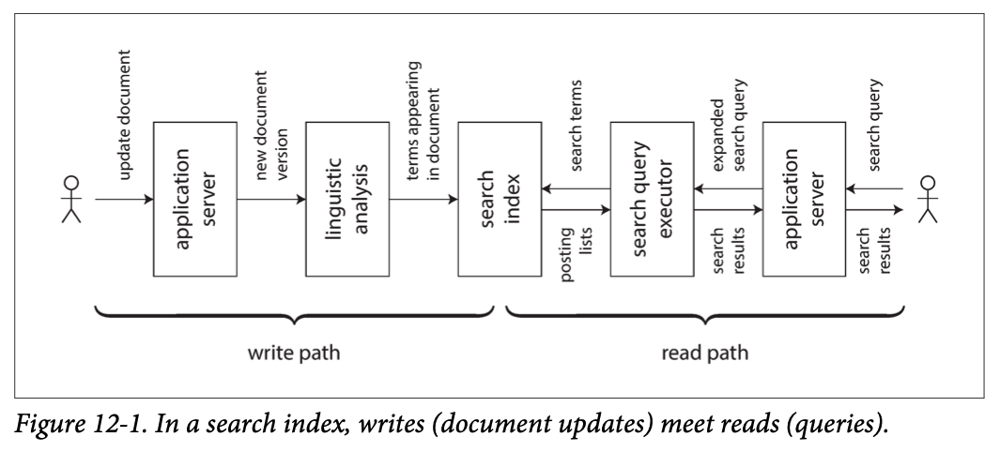

# Chapter 12 The Future of Data systems

So far, this book has been mostly about describing things as they are at present. In this final chapter, we will shift our perspective toward the future and discuss how things should be: I will propose some ideas and approaches that, I believe, may fundamentally improve the ways we design and build applications.

Opinions and speculation about the future are of course subjective, and so I will use the first person in this chapter when writing about my personal opinions. You are welcome to disagree with them and form your own opinions, but I hope that the ideas in this chapter will at least be a starting point for a productive discussion and bring some clarity to concepts that are often confused.

The goal of this book was outlined in Chapter 1: to explore how to create applications and systems that are **reliable, scalable, and maintainable**. These themes have run through all of the chapters: for example, we discussed many fault-tolerance algorithms that help improve reliability, partitioning to improve scalability, and mechanisms for evolution and abstraction that improve maintainability. In this chapter we will bring all of these ideas together, and build on them to envisage the future. Our goal is to discover how to design applications that are better than the ones of today—robust, correct, evolvable, and ultimately beneficial to humanity.

## 12.1 Data Integration

A recurring theme in this book has been that for any given problem, there are several solutions, all of which have different pros, cons, and trade-offs. For example, when discussing storage engines in Chapter 3, we saw log-structured storage, B-trees, and column-oriented storage. When discussing replication in Chapter 5, we saw single-leader, multi-leader, and leaderless approaches.

If you have a problem such as “I want to store some data and look it up again later,” there is no one right solution, but many different approaches that are each appropriate in different circumstances. A software implementation typically has to pick one particular approach. It’s hard enough to get one code path robust and performing well—trying to do everything in one piece of software almost guarantees that the implementation will be poor.

Thus, the most appropriate choice of software tool also depends on the circumstances. Every piece of software, even a so-called “general-purpose” database, is designed for **a particular usage pattern**.

Faced with this profusion of alternatives, the first challenge is then to figure out the mapping between the software products and the circumstances in which they are a good fit. Vendors are understandably reluctant to tell you about the kinds of workloads for which their software is poorly suited, but hopefully the previous chapters have equipped you with some questions to ask in order to read between the lines and better understand the trade-offs.

However, even if you perfectly understand the mapping between tools and circumstances for their use, there is another challenge: in complex applications, data is often **used in several different ways**. There is unlikely to be one piece of software that is suitable for all the different circumstances in which the data is used, so you inevitably end up having to cobble together several different pieces of software in order to provide your application’s functionality.

### 12.1.1 Combining Specialized Tools by Deriving Data

For example, **it is common to need to integrate an OLTP database with a full-text search index** in order to handle queries for arbitrary keywords. Although some databases (such as PostgreSQL) include a full-text indexing feature, which can be sufficient for simple applications, more sophisticated search facilities require specialist information retrieval tools. Conversely, search indexes are generally not very suitable as a durable system of record, and so many applications need to combine two different tools in order to satisfy all of the requirements.

We touched on the issue of integrating data systems in “Keeping Systems in Sync”. As the **number of different representations** of the data increases, the integration problem becomes harder. Besides the database and the search index, perhaps you need to keep copies of the data in analytics systems (data warehouses, or batch and stream processing systems); maintain caches or denormalized versions of objects that were derived from the original data; pass the data through machine learning, classification, ranking, or recommendation systems; or send notifications based on changes to the data.

Surprisingly often I see software engineers make statements like, “In my experience, 99% of people only need X” or “...don’t need X” (for various values of X). I think that such statements say more about the experience of the speaker than about the actual usefulness of a technology. The range of different things you might want to do with data is dizzyingly wide. What one person considers to be an obscure and pointless feature may well be a central requirement for someone else. The need for data integration often only becomes apparent if you zoom out and consider the dataflows across an entire organization.

#### 12.1.1.1 Reasoning about dataflows

When copies of the same data need to be maintained in several storage systems in order to satisfy different access patterns, you need to be very clear about the **inputs and outputs**: where is data written first, and which representations are derived from which sources? How do you get data into all the right places, in the right formats?

For example, you might arrange for data to first be written to a system of record database, capturing the changes made to that database (see “Change Data Capture” on page 454) and then applying the changes to the search index in the same order. If change data capture (CDC) is the only way of updating the index, you can be confident that the index is entirely derived from the system of record, and therefore consistent with it (barring bugs in the software). Writing to the database is the only way of supplying new input into this system.

Allowing the application to directly write to both the search index and the database introduces the problem shown in Figure 11-4, in which two clients concurrently send conflicting writes, and the two storage systems process them in a different order. In this case, neither the database nor the search index is “in charge” of determining the order of writes, and so they may make contradictory decisions and become permanently inconsistent with each other.

If it is possible for you to funnel all user input through a single system that decides on an ordering for all writes, it becomes much easier to derive other representations of the data by processing the writes in the same order. This is an application of the **state machine replication approach** that we saw in “Total Order Broadcast” on page 348. Whether you use change data capture or an event sourcing log is less important than simply the principle of deciding on a total order.

Updating a derived data system based on an event log can often be made deterministic and idempotent (see “Idempotence” on page 478), making it quite easy to recover from faults.

#### 12.1.1.2 Derived data versus distributed transactions

The classic approach for keeping different data systems consistent with each other involves distributed transactions, as discussed in “Atomic Commit and Two-Phase Commit (2PC)” on page 354. How does the approach of using derived data systems fare in comparison to distributed transactions?

At an abstract level, they achieve a similar goal by different means. Distributed transactions decide on an ordering of writes by using locks for mutual exclusion (see “Two-Phase Locking (2PL)” on page 257), while CDC and event sourcing use a log for ordering. Distributed transactions use atomic commit to ensure that changes take effect exactly once, while log-based systems are often based on deterministic retry and idempotence.

The **biggest difference** is that transaction systems usually provide linearizability (see “Linearizability” on page 324), which implies useful guarantees such as reading your own writes (see “Reading Your Own Writes” on page 162). On the other hand, derived data systems are often updated asynchronously, and so they do not by default offer the same **timing guarantees**.

Within limited environments that are willing to pay the cost of distributed transactions, they have been used successfully. However, I think that XA has **poor fault tolerance and performance characteristics** (see “Distributed Transactions in Practice” on page 360), which severely limit its usefulness. I believe that it might be possible to create a better protocol for distributed transactions, but getting such a protocol widely adopted and integrated with existing tools would be challenging, and unlikely to happen soon.

In the absence of widespread support for a good distributed transaction protocol, I believe that log-based derived data is the most promising approach for integrating different data systems. However, guarantees such as **reading your own writes** are useful, and I don’t think that it is productive to tell everyone “eventual consistency is inevitable—suck it up and learn to deal with it” (at least not without good guidance on how to deal with it).

In “Aiming for Correctness” on page 515 we will discuss some approaches for implementing stronger guarantees on top of asynchronously derived systems, and work toward a middle ground between distributed transactions and asynchronous log-based systems.

#### 12.1.1.3 The limits of total ordering

With systems that are small enough, constructing a totally ordered event log is entirely feasible (as demonstrated by the popularity of databases with single-leader replication, which construct precisely such a log). However, as systems are scaled toward bigger and more complex workloads, limitations begin to emerge:

1. In most cases, constructing a totally ordered log requires all events to pass through a single leader node that decides on the ordering. If the throughput of events is greater than a single machine can handle, you need to partition it across multiple machines (see “Partitioned Logs” on page 446). The order of events in two different partitions is then ambiguous.
1. If the servers are spread across multiple geographically distributed datacenters, for example in order to tolerate an entire datacenter going offline, you typically have a separate leader in each datacenter, because network delays make synchronous cross-datacenter coordination inefficient (see “Multi-Leader Replication” on page 168). This implies an undefined ordering of events that originate in two different datacenters.
1. When applications are deployed as microservices (see “Dataflow Through Services: REST and RPC” on page 131), a common design choice is to deploy each service and its durable state as an independent unit, with no durable state shared between services. When two events originate in different services, there is no defined order for those events.
1. Some applications maintain client-side state that is updated immediately on user input (without waiting for confirmation from a server), and even continue to work offline (see “Clients with offline operation” on page 170). With such applications, clients and servers are very likely to see events in different orders.

In formal terms, deciding on a total order of events is known as total order broadcast, which is equivalent to consensus (see “Consensus algorithms and total order broadcast” on page 366). **Most consensus algorithms are designed for situations in which the throughput of a single node is sufficient to process the entire stream of events**, and these algorithms do not provide a mechanism for multiple nodes to share the work of ordering the events. It is still an open research problem to design consensus algorithms that can scale beyond the throughput of a single node and that work well in a geographically distributed setting.

#### 12.1.1.4 Ordering events to capture causality

In cases where there is no causal link between events, the lack of a total order is not a big problem, since concurrent events can be ordered arbitrarily. Some other cases are easy to handle: for example, when there are **multiple updates of the same object**, they can be totally ordered by routing all updates for a particular object ID to the same log partition. However, causal dependencies sometimes arise in more subtle ways (see also “Ordering and Causality” on page 339).

For example, consider a social networking service, and two users who were in a relationship but have just broken up. One of the users removes the other as a friend, and then sends a message to their remaining friends complaining about their ex-partner. The user’s intention is that their ex-partner should not see the rude message, since the message was sent after the friend status was revoked.

However, in a system that stores friendship status in one place and messages in another place, that ordering dependency between the unfriend event and the message-send event may be lost. If the causal dependency is not captured, a service that sends notifications about new messages may process the message-send event before the unfriend event, and thus incorrectly send a notification to the ex-partner.

In this example, the notifications are effectively a join between the messages and the friend list, making it related to the timing issues of joins that we discussed previously (see “Time-dependence of joins” on page 475). Unfortunately, there does not seem to be a simple answer to this problem. Starting points include:

1. Logical timestamps can provide total ordering without coordination (see “Sequence Number Ordering” on page 343), so they may help in cases where total order broadcast is not feasible. However, they still require recipients to handle events that are delivered out of order, and they require additional metadata to be passed around.
1. If you can log an event to record the state of the system that the user saw before making a decision, and give that event a unique identifier, then any later events can reference that event identifier in order to record the causal dependency. We will return to this idea in “Reads are events too” on page 513.
1. Conflict resolution algorithms (see “Automatic Conflict Resolution” on page 174) help with processing events that are delivered in an unexpected order. They are useful for maintaining state, but they do not help if actions have external side effects (such as sending a notification to a user).

Perhaps, over time, patterns for application development will emerge that allow causal dependencies to be captured efficiently, and derived state to be maintained correctly, without forcing all events to go through the **bottleneck of total order broadcast**.

### 12.1.2 Batch and Stream Processing

I would say that the goal of data integration is to make sure that data ends up in the right form in all the right places. Doing so requires consuming inputs, transforming, joining, filtering, aggregating, training models, evaluating, and eventually writing to the appropriate outputs. Batch and stream processors are the tools for achieving this goal.

The outputs of batch and stream processes are derived datasets such as search indexes, materialized views, recommendations to show to users, aggregate metrics, and so on (see “The Output of Batch Workflows” on page 411 and “Uses of Stream Processing” on page 465).

As we saw in Chapter 10 and Chapter 11, batch and stream processing have a lot of principles in common, and the main fundamental difference is that stream processors operate on unbounded datasets whereas batch process inputs are of a known, finite size. There are also many detailed differences in the ways the processing engines are implemented, but these distinctions are beginning to blur.
Spark performs stream processing on top of a **batch processing engine** by breaking the stream into microbatches, whereas Apache Flink performs batch processing on top of a **stream processing engine**. In principle, one type of processing can be emulated on top of the other, although the performance characteristics vary: for example, **microbatching** may perform poorly on hopping or sliding windows.

#### 12.1.2.1 Maintaining derived state

Batch processing has a quite strong **functional flavor** (even if the code is not written in a functional programming language): it encourages deterministic, pure functions whose output depends only on the input and which have no side effects other than the explicit outputs, treating inputs as immutable and outputs as append-only. Stream processing is similar, but it extends operators to allow managed, fault-tolerant state (see “Rebuilding state after a failure” on page 478).

The principle of deterministic functions with well-defined inputs and outputs is not only good for fault tolerance (see “Idempotence” on page 478), but also simplifies reasoning about the dataflows in an organization. No matter whether the derived data is a search index, a statistical model, or a cache, it is helpful to think in terms of data pipelines that derive one thing from another, pushing state changes in one system through functional application code and applying the effects to derived systems.

In principle, derived data systems could be maintained synchronously, just like a relational database updates secondary indexes synchronously within the same transaction as writes to the table being indexed. However, **asynchrony** is what makes systems based on event logs robust: it allows a fault in one part of the system to be contained locally, whereas distributed transactions abort if any one participant fails, so they tend to amplify failures by spreading them to the rest of the system (see “Limitations of distributed transactions” on page 363).

We saw in “Partitioning and Secondary Indexes” on page 206 that secondary indexes often cross partition boundaries. A partitioned system with secondary indexes either needs to send writes to multiple partitions (if the index is term-partitioned) or send reads to all partitions (if the index is document-partitioned). Such **cross-partition communication is also most reliable and scalable if the index is maintained asynchronously** (see also “Multi-partition data processing” on page 514).

#### 12.1.2.2 Reprocessing data for application evolution

When maintaining derived data, batch and stream processing are both useful. Stream processing allows changes in the input to be reflected in derived views with low delay, whereas batch processing allows large amounts of accumulated historical data to be reprocessed in order to derive new views onto an existing dataset.

In particular, reprocessing existing data provides a good mechanism for maintaining a system, evolving it to support new features and changed requirements (see Chapter 4). Without reprocessing, schema evolution is limited to simple changes like adding a new optional field to a record, or adding a new type of record. This is the case both in a schema-on-write and in a schema-on-read context (see “Schema flexibility in the document model” on page 39). On the other hand, **with reprocessing it is possible to restructure a dataset into a completely different model in order to better serve new requirements**.

**Schema Migrations on Railways**

Large-scale “schema migrations” occur in noncomputer systems as well. For example, in the early days of railway building in 19th-century England there were various competing standards for the gauge (the distance between the two rails). Trains built for one gauge couldn’t run on tracks of another gauge, which restricted the possible interconnections in the train network.

After a single standard gauge was finally decided upon in 1846, tracks with other gauges had to be converted—but how do you do this without shutting down the train line for months or years? The solution is to first convert the track to dual gauge or mixed gauge by adding a third rail. This conversion can be done gradually, and when it is done, trains of both gauges can run on the line, using two of the three rails. Eventually, once all trains have been converted to the standard gauge, the rail providing the nonstandard gauge can be removed.

“Reprocessing” the existing tracks in this way, and allowing the old and new versions to exist side by side, makes it possible to change the gauge gradually over the course of years. Nevertheless, it is an expensive undertaking, which is why nonstandard gauges still exist today. For example, the BART system in the San Francisco Bay Area uses a different gauge from the majority of the US.

Derived views allow **gradual evolution**. If you want to restructure a dataset, you do not need to perform the migration as a sudden switch. Instead, you can maintain the old schema and the new schema side by side as two independently derived views onto the same underlying data. You can then start shifting a small number of users to the new view in order to test its performance and find any bugs, while most users continue to be routed to the old view. Gradually, you can increase the proportion of users accessing the new view, and eventually you can drop the old view.

The beauty of such a gradual migration is that every stage of the process is easily reversible if something goes wrong: you always have a working system to go back to. By reducing the risk of irreversible damage, you can be more confident about going ahead, and thus move faster to improve your system.

#### 12.1.2.3 The lambda architecture

If batch processing is used to reprocess historical data, and stream processing is used to process recent updates, then how do you combine the two? The lambda architecture is a proposal in this area that has gained a lot of attention.

The core idea of the lambda architecture is that incoming data should be recorded by appending immutable events to an always-growing dataset, similarly to event sourcing (see “Event Sourcing” on page 457). From these events, read-optimized views are derived. **The lambda architecture proposes running two different systems in parallel**: a batch processing system such as Hadoop MapReduce, and a separate stream-processing system such as Storm.

In the lambda approach, the stream processor consumes the events and quickly produces an approximate update to the view; the batch processor later consumes the same set of events and produces a corrected version of the derived view. The reasoning behind this design is that batch processing is simpler and thus less prone to bugs, while stream processors are thought to be less reliable and harder to make fault-tolerant (see “Fault Tolerance” on page 476). Moreover, **the stream process can use fast approximate algorithms while the batch process uses slower exact algorithms**.

The lambda architecture was an influential idea that shaped the design of data systems for the better, particularly by popularizing the principle of deriving views onto streams of immutable events and reprocessing events when needed. However, I also think that it has a number of practical problems:

1. Having to maintain the same logic to run both in a batch and in a stream processing framework is significant additional effort. Although libraries such as **Summingbird** provide an abstraction for computations that can be run in either a batch or a streaming context, the operational complexity of debugging, tuning, and maintaining two different systems remains.
1. Since the stream pipeline and the batch pipeline produce separate outputs, they need to be merged in order to respond to user requests. This merge is fairly easy if the computation is a simple aggregation over a tumbling window, but it becomes significantly harder if the view is derived using more complex operations such as joins and sessionization, or if the output is not a time series.
1. Although it is great to have the ability to reprocess the entire historical dataset, doing so frequently is expensive on large datasets. Thus, the batch pipeline often needs to be set up to process incremental batches (e.g., an hour’s worth of data at the end of every hour) rather than reprocessing everything. This raises the problems discussed in “Reasoning About Time” on page 468, such as handling stragglers and handling windows that cross boundaries between batches. **Incrementalizing a batch computation adds complexity**, making it more akin to the streaming layer, which runs counter to the goal of keeping the batch layer as simple as possible.

#### 12.1.2.4 Unifying batch and stream processing

More recent work has enabled the benefits of the lambda architecture to be enjoyed without its downsides, by allowing both batch computations (reprocessing historical data) and stream computations (processing events as they arrive) to be implemented in the same system.

Unifying batch and stream processing in one system requires the following features, which are becoming increasingly widely available:

1. The ability to replay historical events through the same processing engine that handles the stream of recent events. For example, **log-based message brokers have the ability to replay messages** (see “Replaying old messages” on page 451), and some stream processors can read input from a distributed filesystem like HDFS.
1. Exactly-once semantics for stream processors—that is, ensuring that the output is the same as if no faults had occurred, even if faults did in fact occur (see “Fault Tolerance” on page 476). Like with batch processing, this requires discarding the partial output of any failed tasks.
1. Tools for **windowing by event time**, not by processing time, since processing time is meaningless when reprocessing historical events (see “Reasoning About Time” on page 468). For example, Apache Beam provides an API for expressing such computations, which can then be run using Apache Flink or Google Cloud Dataflow.

## 12.2 Unbundling Databases

At a most abstract level, databases, Hadoop, and operating systems all perform the same functions: they store some data, and they allow you to process and query that data. A database stores data in records of some data model (rows in tables, documents, vertices in a graph, etc.) while an operating system’s filesystem stores data in files—but at their core, both are “information management” systems. As we saw in Chapter 10, the Hadoop ecosystem is somewhat like **a distributed version of Unix**.

Of course, there are many practical differences. For example, many filesystems do not cope very well with a directory containing 10 million small files, whereas a database containing 10 million small records is completely normal and unremarkable. Nevertheless, the similarities and differences between operating systems and databases are worth exploring.

Unix and relational databases have approached the information management problem with very different philosophies. Unix viewed its purpose as presenting programmers with a logical but fairly low-level hardware abstraction, whereas relational databases wanted to give application programmers a high-level abstraction that would hide the complexities of data structures on disk, concurrency, crash recovery, and so on. Unix developed pipes and files that are just sequences of bytes, whereas databases developed SQL and transactions.

Which approach is better? Of course, it depends what you want. Unix is “simpler” in the sense that it is a fairly thin wrapper around hardware resources; relational databases are “simpler” in the sense that a short declarative query can draw on a lot of powerful infrastructure (query optimization, indexes, join methods, concurrency control, replication, etc.) without the author of the query needing to understand the implementation details.

The tension between these philosophies has lasted for decades (both Unix and the relational model emerged in the early 1970s) and still isn’t resolved. For example, I would interpret the NoSQL movement as wanting to apply a Unix-esque approach of low-level abstractions to the domain of distributed OLTP data storage.

In this section I will attempt to reconcile the two philosophies, in the hope that we can combine the best of both worlds.

### 12.2.1 Composing Data Storage Technologies

Over the course of this book we have discussed various features provided by databases and how they work, including:

1. Secondary indexes, which allow you to efficiently search for records based on the value of a field (see “Other Indexing Structures” on page 85)
1. Materialized views, which are a kind of precomputed cache of query results (see “Aggregation: Data Cubes and Materialized Views” on page 101)
1. Replication logs, which keep copies of the data on other nodes up to date (see “Implementation of Replication Logs” on page 158)
1. Full-text search indexes, which allow keyword search in text (see “Full-text search and fuzzy indexes” on page 88) and which are built into some relational databases

In Chapters 10 and 11, similar themes emerged. We talked about building full-text search indexes (see “The Output of Batch Workflows” on page 411), about materialized view maintenance (see “Maintaining materialized views” on page 467), and about replicating changes from a database to derived data systems (see “Change Data Capture” on page 454).

It seems that there are parallels between the features that are built into databases and the derived data systems that people are building with batch and stream processors.

#### 12.2.1.1 Creating an index

Think about what happens when you run `CREATE INDEX` to create a new index in a relational database. The database has to scan over a consistent snapshot of a table, pick out all of the field values being indexed, sort them, and write out the index. Then it must process the backlog of writes that have been made since the consistent snapshot was taken (assuming the table was not locked while creating the index, so writes could continue). Once that is done, the database must continue to keep the index up to date whenever a transaction writes to the table.

This process is remarkably similar to setting up a new follower replica (see “Setting Up New Followers” on page 155), and also very similar to bootstrapping change data capture in a streaming system (see “Initial snapshot” on page 455).

Whenever you run `CREATE INDEX`, the database **essentially reprocesses** the existing dataset (as discussed in “Reprocessing data for application evolution” on page 496) and derives the index as a new view onto the existing data. The existing data may be a snapshot of the state rather than a log of all changes that ever happened, but the two are closely related (see “State, Streams, and Immutability” on page 459).

#### 12.2.1.2 The meta-database of everything

In this light, I think that the **dataflow across an entire organization starts looking like one huge database**. Whenever a batch, stream, or ETL process transports data from one place and form to another place and form, it is acting like the database subsystem that keeps indexes or materialized views up to date.

Viewed like this, batch and stream processors are like elaborate implementations of triggers, stored procedures, and materialized view maintenance routines. The derived data systems they maintain are like different index types. For example, a relational database may support **B-tree indexes, hash indexes, spatial indexes** (see “Multi-column indexes” on page 87), and other types of indexes. In the emerging architecture of derived data systems, instead of implementing those facilities as features of a single integrated database product, they are provided by various different pieces of software, running on different machines, administered by different teams.

Where will these developments take us in the future? If we start from the premise that there is no single data model or storage format that is suitable for all access patterns, I speculate that there are two avenues by which different storage and processing tools can nevertheless be composed into a cohesive system:

**Avenue one: Federated databases: unifying reads**

It is possible to provide a unified query interface to a wide variety of underlying storage engines and processing methods—an approach known as a federated database or polystore. For example, **PostgreSQL’s foreign data wrapper feature fits this pattern**. Applications that need a specialized data model or query interface can still access the underlying storage engines directly, while users who want to combine data from disparate places can do so easily through the federated interface.

A federated query interface follows the relational tradition of a single integrated system with a high-level query language and elegant semantics, but a complicated implementation.

**Avenue two:Unbundled databases: unifying writes**

While federation addresses read-only querying across several different systems, it does not have a good answer to synchronizing writes across those systems. We said that within a single database, creating a consistent index is a built-in feature. When we compose several storage systems, we similarly need to ensure that all data changes end up in all the right places, even in the face of faults. Making it easier to reliably plug together storage systems (e.g., through change data capture and event logs) is like **unbundling a database’s index-maintenance features in a way that can synchronize writes across disparate technologies**.

The unbundled approach **follows the Unix tradition** of small tools that do one thing well, that communicate through a uniform low-level API (pipes), and that can be composed using a higher-level language (the shell).

#### 12.2.1.3 Making unbundling work

Federation and unbundling are two sides of the same coin: composing a reliable, scalable, and maintainable system out of diverse components. Federated read-only querying requires mapping one data model into another, which takes some thought but is ultimately quite a manageable problem. I think that keeping the writes to several storage systems in sync is the harder engineering problem, and so I will focus on it.

The traditional approach to synchronizing writes requires distributed transactions across heterogeneous storage systems, which I think is the wrong solution (see “Derived data versus distributed transactions” on page 492). Transactions within a single storage or stream processing system are feasible, but when data crosses the boundary between different technologies, **I believe that an asynchronous event log with idempotent writes is a much more robust and practical approach**.

For example, distributed transactions are used within some stream processors to achieve exactly-once semantics (see “Atomic commit revisited” on page 477), and this can work quite well. However, when a transaction would need to involve systems written by different groups of people (e.g., when data is written from a stream processor to a distributed key-value store or search index), the lack of a standardized transaction protocol makes integration much harder. An ordered log of events with idempotent consumers (see “Idempotence” on page 478) is a much simpler abstraction, and thus much more feasible to implement across heterogeneous systems.

The big advantage of log-based integration is loose coupling between the various components, which manifests itself in two ways:

1. At a system level, asynchronous event streams make the system as a whole more robust to outages or performance degradation of individual components. If a consumer runs slow or fails, the event log can buffer messages (see “Disk space usage” on page 450), allowing the producer and any other consumers to continue running unaffected. The faulty consumer can catch up when it is fixed, so it doesn’t miss any data, and the fault is contained. By contrast, the synchronous interaction of distributed transactions tends to escalate local faults into large-scale failures (see “Limitations of distributed transactions” on page 363).
2. At a human level, unbundling data systems allows different software components and services to be developed, improved, and maintained independently from each other by different teams. **Specialization** allows each team to focus on doing one thing well, with well-defined interfaces to other teams’ systems. Event logs provide an interface that is powerful enough to capture fairly strong consistency properties (due to durability and ordering of events), but also general enough to be applicable to almost any kind of data.

#### 12.2.1.4 Unbundled versus integrated systems

If unbundling does indeed become the way of the future, it will not replace databases in their current form—they will still be needed as much as ever. Databases are still required for maintaining state in stream processors, and in order to serve queries for the output of batch and stream processors (see “The Output of Batch Workflows” on page 411 and “Processing Streams” on page 464). **Specialized query engines will continue to be important for particular workloads**: for example, query engines in MPP data warehouses are optimized for exploratory analytic queries and handle this kind of workload very well (see “Comparing Hadoop to Distributed Databases” on page 414).

The complexity of running several different pieces of infrastructure can be a problem: each piece of software has a learning curve, configuration issues, and operational quirks, and so it is worth deploying as few moving parts as possible. A single integrated software product may also be able to achieve better and more predictable performance on the kinds of workloads for which it is designed, compared to a system consisting of several tools that you have composed with application code. As I said in the Preface, building for scale that you don’t need is wasted effort and may lock you into an inflexible design. In effect, it is a form of **premature optimization**.

The goal of unbundling is not to compete with individual databases on performance for particular workloads; the goal is to allow you to combine several different databases in order to achieve good performance for a much wider range of workloads than is possible with a single piece of software. **It’s about breadth, not depth**—in the same vein as the diversity of storage and processing models that we discussed in “Comparing Hadoop to Distributed Databases” on page 414.

Thus, if there is a single technology that does everything you need, you’re most likely best off simply using that product rather than trying to reimplement it yourself from lower-level components. The advantages of unbundling and composition only come into the picture when there is no single piece of software that satisfies all your requirements.

#### 12.2.1.5 What’s missing?

The tools for composing data systems are getting better, but I think one major part is missing: **we don’t yet have the unbundled-database equivalent of the Unix shell** (i.e., a high-level language for composing storage and processing systems in a simple and declarative way).

For example, I would love it if we could simply declare mysql | elasticsearch, by analogy to Unix pipes, which would be the unbundled equivalent of `CREATE INDEX`: it would take all the documents in a MySQL database and index them in an Elasticsearch cluster. It would then continually capture all the changes made to the database and automatically apply them to the search index, without us having to write custom application code. This kind of integration should be possible with almost any kind of storage or indexing system.

Similarly, it would be great to be able to precompute and update caches more easily. Recall that a materialized view is essentially a precomputed cache, so you could imagine creating a cache by declaratively specifying materialized views for complex queries, including recursive queries on graphs (see “Graph-Like Data Models” on page 49) and application logic. There is interesting early-stage research in this area, such as **differential dataflow**, and I hope that these ideas will find their way into production systems.

### 12.2.2 Designing Applications Around Dataflow

The approach of unbundling databases by composing specialized storage and processing systems with application code is also becoming known as the **“database inside-out” approach**, after the title of a conference talk I gave in 2014. However, calling it a “new architecture” is too grandiose. I see it more as a design pattern, a starting point for discussion, and we give it a name simply so that we can better talk about it.

These ideas are not mine; they are simply an amalgamation of other people’s ideas from which I think we should learn. In particular, there is a lot of overlap with dataflow languages such as Oz and Juttle, **functional reactive programming (FRP)** languages such as Elm, and logic programming languages such as Bloom. The term unbundling in this context was proposed by Jay Kreps.

Even **spreadsheets** have dataflow programming capabilities that are miles ahead of most mainstream programming languages. In a spreadsheet, you can put a formula in one cell (for example, the sum of cells in another column), and whenever any input to the formula changes, the result of the formula is automatically recalculated. This is exactly what we want at a data system level: when a record in a database changes, we want any index for that record to be automatically updated, and any cached views or aggregations that depend on the record to be automatically refreshed. You should not have to worry about the technical details of how this refresh happens, but be able to simply trust that it works correctly.

Thus, I think that most data systems still have something to learn from the features that **VisiCalc** already had in 1979. The difference from spreadsheets is that today’s data systems need to be fault-tolerant, scalable, and store data durably. They also need to be able to integrate disparate technologies written by different groups of people over time, and reuse existing libraries and services: it is unrealistic to expect all software to be developed using one particular language, framework, or tool.

In this section I will expand on these ideas and explore some ways of building applications around the ideas of unbundled databases and dataflow.

#### 12.2.2.1 Application code as a derivation function

When one dataset is derived from another, it goes through some kind of transformation function. For example:

1. A secondary index is a kind of derived dataset with a straightforward transformation function: for each row or document in the base table, it picks out the values in the columns or fields being indexed, and sorts by those values (assuming a B-tree or SSTable index, which are sorted by key, as discussed in Chapter 3).
1. A full-text search index is created by applying various natural language processing functions such as language detection, word segmentation, stemming or lemmatization, spelling correction, and synonym identification, followed by building a data structure for efficient lookups (such as an inverted index).
1. In a machine learning system, we can consider the model as being derived from the training data by applying various feature extraction and statistical analysis functions. When the model is applied to new input data, the output of the model is derived from the input and the model (and hence, indirectly, from the training data).
1. A cache often contains an aggregation of data in the form in which it is going to be displayed in a user interface (UI). Populating the cache thus requires knowledge of what fields are referenced in the UI; changes in the UI may require updating the definition of how the cache is populated and rebuilding the cache.

The derivation function for a secondary index is so commonly required that it is built into many databases as a core feature, and you can invoke it by merely saying CREATE INDEX. For full-text indexing, basic linguistic features for common languages may be built into a database, but the more sophisticated features often require domain-specific tuning. In machine learning, feature engineering is notoriously application-specific, and often has to incorporate detailed knowledge about the user interaction and deployment of an application.

When the function that creates a derived dataset is not a standard cookie-cutter function like creating a secondary index, custom code is required to handle the application-specific aspects. And this **custom code is where many databases struggle**. Although relational databases commonly support triggers, stored procedures, and user-defined functions, which can be used to execute application code within the database, they have been somewhat of an afterthought in database design (see “Transmitting Event Streams” on page 440).

#### 12.2.2.2 Separation of application code and state

In theory, databases could be deployment environments for arbitrary application code, like an operating system. However, in practice they have turned out to be poorly suited for this purpose. They do not fit well with the requirements of modern application development, such as dependency and package management, version control, rolling upgrades, evolvability, monitoring, metrics, calls to network services, and integration with external systems.

On the other hand, **deployment and cluster management tools such as Mesos, YARN, Docker, Kubernetes**, and others are designed specifically for the purpose of running application code. By focusing on doing one thing well, they are able to do it much better than a database that provides execution of user-defined functions as one of its many features.

I think it makes sense to have some parts of a system that specialize in durable data storage, and other parts that specialize in running application code. The two can interact while still remaining independent.

Most web applications today are deployed as stateless services, in which any user request can be routed to any application server, and the server forgets everything about the request once it has sent the response. This style of deployment is convenient, as servers can be added or removed at will, but the state has to go somewhere: typically, a database. The trend has been to keep stateless application logic separate from state management (databases): not putting application logic in the database and not putting persistent state in the application. As people in the functional programming community like to joke, “We believe in the **separation of Church and state**”.(Explaining a joke rarely improves it, but I don’t want anyone to feel left out. Here, Church is a reference to the mathematician Alonzo Church, who created the lambda calculus, an early form of computation that is the basis for most functional programming languages. The lambda calculus has no mutable state (i.e., no variables that can be overwritten), so one could say that mutable state is separate from Church’s work.)

In this typical web application model, the database acts as a kind of mutable shared variable that can be accessed synchronously over the network. The application can read and update the variable, and the database takes care of making it durable, providing some concurrency control and fault tolerance.

However, in most programming languages you cannot subscribe to changes in a mutable variable—you can only read it periodically. Unlike in a spreadsheet, readers of the variable don’t get notified if the value of the variable changes. (You can implement such notifications in your own code—this is known as the **observer pattern**—but most languages do not have this pattern as a built-in feature.)

Databases have inherited this passive approach to mutable data: if you want to find out whether the content of the database has changed, often your only option is to poll (i.e., to repeat your query periodically). Subscribing to changes is only just beginning to emerge as a feature (see “API support for change streams” on page 456).

#### 12.2.2.3 Dataflow: Interplay between state changes and application code

Thinking about applications in terms of dataflow implies renegotiating the relationship between application code and state management. Instead of treating a database as a passive variable that is manipulated by the application, we think much more about the interplay and collaboration between state, state changes, and code that processes them. Application code responds to state changes in one place by triggering state changes in another place.

We saw this line of thinking in “Databases and Streams” on page 451, where we discussed treating the log of changes to a database as a stream of events that we can subscribe to. Message-passing systems such as actors (see “Message-Passing Dataflow” on page 136) also have this concept of responding to events. Already in the 1980s, the tuple spaces model explored expressing distributed computations in terms of processes that observe state changes and react to them.

As discussed, similar things happen inside a database when a trigger fires due to a data change, or when a secondary index is updated to reflect a change in the table being indexed. Unbundling the database means taking this idea and applying it to the creation of derived datasets outside of the primary database: caches, full-text search indexes, machine learning, or analytics systems. We can use stream processing and messaging systems for this purpose.

The important thing to keep in mind is that maintaining derived data is not the same as asynchronous job execution, for which messaging systems are traditionally designed (see “Logs compared to traditional messaging” on page 448):

1. When maintaining derived data, the order of state changes is often important (if several views are derived from an event log, they need to process the events in the **same order** so that they remain consistent with each other). As discussed in “Acknowledgments and redelivery” on page 445, many message brokers do not have this property when redelivering unacknowledged messages. Dual writes are also ruled out (see “Keeping Systems in Sync” on page 452).
1. Fault tolerance is key for derived data: losing just a single message causes the derived dataset to go permanently out of sync with its data source. Both message delivery and derived state updates must be reliable. For example, many actor systems by default maintain actor state and messages in memory, so they are lost if the machine running the actor crashes.

Stable message ordering and fault-tolerant message processing are quite stringent demands, but they are much less expensive and more operationally robust than distributed transactions. Modern stream processors can provide these ordering and reliability guarantees at scale, and they **allow application code to be run as stream operators**.

This application code can do the arbitrary processing that built-in derivation functions in databases generally don’t provide. Like Unix tools chained by pipes, stream operators can be composed to build large systems around dataflow. Each operator takes streams of state changes as input, and produces other streams of state changes as output.

#### 12.2.2.3 Stream processors and services

The currently trendy style of application development involves breaking down functionality into a set of services that communicate via synchronous network requests such as REST APIs (see “Dataflow Through Services: REST and RPC” on page 131). The advantage of such a service-oriented architecture over a single monolithic application is **primarily organizational scalability** through loose coupling: different teams can work on different services, which reduces coordination effort between teams (as long as the services can be deployed and updated independently).

Composing stream operators into dataflow systems has a lot of similar characteristics to the microservices approach. However, the underlying communication mechanism is very different: one-directional, asynchronous message streams rather than synchronous request/response interactions.

Besides the advantages listed in “Message-Passing Dataflow” on page 136, such as better fault tolerance, dataflow systems can also achieve **better performance**. For example, say a customer is purchasing an item that is priced in one currency but paid for in another currency. In order to perform the currency conversion, you need to know the current exchange rate. This operation could be implemented in two ways:

1. In the microservices approach, the code that processes the purchase would probably query an exchange-rate service or database in order to obtain the current rate for a particular currency.
2. In the **dataflow** approach, the code that processes purchases would **subscribe** to a stream of exchange rate updates ahead of time, and record the current rate in a local database whenever it changes. When it comes to processing the purchase, it only needs to query the **local database**.

The second approach has replaced a synchronous network request to another service with a query to a local database (which may be on the same machine, even in the same process).(In the microservices approach, you could avoid the synchronous network request by caching the exchange rate locally in the service that processes the purchase. However, in order to keep that cache fresh, you would need to periodically poll for updated exchange rates, or subscribe to a stream of changes—which is exactly what happens in the dataflow approach.) Not only is the dataflow approach faster, but it is also more robust to the failure of another service. The fastest and most reliable network request is no network request at all! Instead of RPC, we now have a **stream join** between purchase events and exchange rate update events (see “Stream-table join (stream enrichment)” on page 473).

The join is time-dependent: if the purchase events are reprocessed at a later point in time, the exchange rate will have changed. If you want to reconstruct the original output, you will need to obtain the historical exchange rate at the original time of purchase. No matter whether you query a service or subscribe to a stream of exchange rate updates, you will need to handle this time dependence (see “Time-dependence of joins” on page 475).

Subscribing to a stream of changes, rather than querying the current state when needed, brings us closer to a spreadsheet-like model of computation: when some piece of data changes, any derived data that depends on it can swiftly be updated. There are still many open questions, for example around issues like time-dependent joins, but I believe that building applications around dataflow ideas is a very promising direction to go in.

### 12.2.3 Observing Derived State

At an abstract level, the dataflow systems discussed in the last section give you a process for creating derived datasets (such as search indexes, materialized views, and predictive models) and keeping them up to date. Let’s call that process **the write path**: whenever some piece of information is written to the system, it may go through multiple stages of batch and stream processing, and eventually every derived dataset is updated to incorporate the data that was written. Figure 12-1 shows an example of updating a search index.

But why do you create the derived dataset in the first place? Most likely because you want to query it again at a later time. This is the read path: when serving a user request you read from the derived dataset, perhaps perform some more processing on the results, and construct the response to the user.

Taken together, the write path and the read path encompass the whole journey of the data, from the point where it is collected to the point where it is consumed (probably by another human). The write path is the portion of the journey that is precomputed —i.e., that is done eagerly as soon as the data comes in, regardless of whether anyone has asked to see it. The read path is the portion of the journey that only happens when someone asks for it. **If you are familiar with functional programming languages, you might notice that the write path is similar to eager evaluation, and the read path is similar to lazy evaluation**.

The derived dataset is the place where the write path and the read path meet, as illustrated in Figure 12-1. It represents a trade-off between the amount of work that needs to be done at write time and the amount that needs to be done at read time.

#### 12.2.3.1 Materialized views and caching

A full-text search index is a good example: the write path updates the index, and the read path searches the index for keywords. Both reads and writes need to do some work. Writes need to update the index entries for all terms that appear in the document. Reads need to search for each of the words in the query, and apply Boolean logic to find documents that contain all of the words in the query (an AND operator), or any synonym of each of the words (an OR operator).

If you didn’t have an index, a search query would have to scan over all documents (like grep), which would get very expensive if you had a large number of documents. No index means less work on the write path (no index to update), but a lot more work on the read path.
On the other hand, you could imagine precomputing the search results for all possible queries. In that case, you would have less work to do on the read path: no Boolean logic, just find the results for your query and return them. However, the write path would be a lot more expensive: the set of possible search queries that could be asked is infinite, and thus precomputing all possible search results would require infinite time and storage space. That wouldn’t work so well.(Less facetiously, the set of distinct search queries with nonempty search results is finite, assuming a finite corpus. However, it would be **exponential** in the number of terms in the corpus, which is still pretty bad news.)

Another option would be to precompute the search results for only a fixed set of the most common queries, so that they can be served quickly without having to go to the index. The uncommon queries can still be served from the index. This would generally be called a cache of common queries, although we could also call it a materialized view, as it would need to be updated when new documents appear that should be included in the results of one of the common queries.

From this example we can see that an index is not the only possible boundary between the write path and the read path. Caching of common search results is possible, and grep-like scanning without the index is also possible on a small number of documents. Viewed like this, the role of caches, indexes, and materialized views is simple: they **shift the boundary between** the read path and the write path. They allow us to do more work on the write path, by precomputing results, in order to save effort on the read path.

Shifting the boundary between work done on the write path and the read path was in fact the topic of the Twitter example at the beginning of this book, in “Describing Load” on page 11. In that example, we also saw how the boundary between write path and read path might be drawn differently for celebrities compared to ordinary users. After 500 pages we have come full circle!

#### 12.2.3.2 Stateful, offline-capable clients

I find the idea of a boundary between write and read paths interesting because we can discuss shifting that boundary and explore what that shift means in practical terms. Let’s look at the idea in a different context.

The huge popularity of web applications in the last two decades has led us to certain assumptions about application development that are easy to take for granted. In particular, the **client/server model**—in which clients are largely stateless and servers have the authority over data—is so common that we almost forget that anything else exists. However, technology keeps moving on, and I think it is important to question the status quo from time to time.

Traditionally, web browsers have been stateless clients that can only do useful things when you have an internet connection (just about the only thing you could do offline was to scroll up and down in a page that you had previously loaded while online). However, recent “single-page” JavaScript web apps have gained a lot of stateful capabilities, including client-side user interface interaction and **persistent local storage in the web browser**. **Mobile apps can similarly store a lot of state on the device** and don’t require a round-trip to the server for most user interactions.

These changing capabilities have led to a renewed interest in **offline-first applications** that do as much as possible using a local database on the same device, without requiring an internet connection, and sync with remote servers in the background when a network connection is available. Since mobile devices often have slow and unreliable cellular internet connections, it’s a big advantage for users if their user interface does not have to wait for synchronous network requests, and if apps mostly work offline (see “Clients with offline operation” on page 170).

When we move away from the assumption of stateless clients talking to a central database and toward state that is maintained on end-user devices, a world of new opportunities opens up. In particular, we can think of the **on-device state as a cache** of state on the server. The pixels on the screen are a materialized view onto model objects in the client app; the model objects are a local replica of state in a remote datacenter.

#### 12.2.3.3 Pushing state changes to clients

In a typical web page, if you load the page in a web browser and the data subsequently changes on the server, the browser does not find out about the change until you reload the page. The browser only reads the data at one point in time, assuming that it is static—it does not subscribe to updates from the server. Thus, the state on the device is a stale cache that is not updated unless you explicitly poll for changes. (HTTP-based feed subscription protocols like RSS are really just a basic form of polling.)

More recent protocols have moved beyond the basic request/response pattern of HTTP: **server-sent events (the EventSource API) and WebSockets** provide communication channels by which a web browser can keep an open TCP connection to a server, and the server can actively push messages to the browser as long as it remains connected. This provides an opportunity for the server to actively inform the end-user client about any changes to the state it has stored locally, reducing the staleness of the client-side state.

In terms of our model of write path and read path, actively pushing state changes all the way to client devices means extending the write path all the way to the end user. When a client is first initialized, it would still need to use a read path to get its initial state, but thereafter it could rely on a stream of state changes sent by the server. The ideas we discussed around stream processing and messaging are not restricted to running only in a datacenter: we can take the ideas further, and extend them all the way to end-user devices.

The devices will be offline some of the time, and unable to receive any notifications of state changes from the server during that time. But we already solved that problem: in “Consumer offsets” on page 449 we discussed how a consumer of a log-based message broker can **reconnect** after failing or becoming disconnected, and ensure that it doesn’t miss any messages that arrived while it was disconnected. The same technique works for individual users, where each device is a small subscriber to a small stream of events.

#### 12.2.3.4 End-to-end event streams

Recent tools for developing stateful clients and user interfaces, such as **the Elm language and Facebook’s toolchain of React, Flux, and Redux, already manage internal client-side state** by subscribing to a stream of events representing user input or responses from a server, structured similarly to event sourcing (see “Event Sourcing” on page 457).

It would be very natural to extend this programming model to also allow a server to push state-change events into this client-side event pipeline. Thus, state changes could flow through an end-to-end write path: from the interaction on one device that triggers a state change, via event logs and through several derived data systems and stream processors, all the way to the user interface of a person observing the state on another device. These state changes could be propagated with fairly low delay—say, **under one second end to end**.

Some applications, such as instant messaging and online games, already have such a “real-time” architecture (in the sense of **interactions with low delay**, not in the sense of “Response time guarantees” on page 298). But why don’t we build all applications this way?

The challenge is that the assumption of stateless clients and request/response interactions is very deeply ingrained in our databases, libraries, frameworks, and protocols. Many datastores support read and write operations where a request returns one response, but **much fewer provide an ability to subscribe to changes**—i.e., a request that returns a stream of responses over time (see “API support for change streams” on page 456).

In order to extend the write path all the way to the end user, we would need to fundamentally rethink the way we build many of these systems: moving away from request/response interaction and toward **publish/subscribe dataflow**. I think that the advantages of more responsive user interfaces and better offline support would make it worth the effort. If you are designing data systems, I hope that you will keep in mind the option of subscribing to changes, not just querying the current state.

#### 12.2.3.5 Reads are events too

We discussed that when a stream processor writes derived data to a store (database, cache, or index), and when user requests query that store, the store acts as the boundary between the write path and the read path. The store allows random-access read queries to the data that would otherwise require scanning the whole event log.

In many cases, the data storage is separate from the streaming system. But recall that stream processors also need to maintain state to perform aggregations and joins (see “Stream Joins” on page 472). This state is normally hidden inside the stream processor, but some frameworks allow it to also be queried by outside clients, **turning the stream processor itself into a kind of simple database**.

I would like to take that idea further. As discussed so far, the writes to the store go through an event log, while reads are transient network requests that go directly to the nodes that store the data being queried. This is a reasonable design, but not the only possible one. It is also possible to represent **read requests as streams of events**, and send both the read events and the write events through a stream processor; the processor responds to read events by emitting the result of the read to an output stream.

When both the writes and the reads are represented as events, and routed to the same stream operator in order to be handled, we are in fact performing a **stream-table join** between the stream of read queries and the database. The read event needs to be sent to the database partition holding the data (see “Request Routing” on page 214), just like batch and stream processors need to copartition inputs on the same key when joining (see “Reduce-Side Joins and Grouping” on page 403).

This correspondence between serving requests and performing joins is quite fundamental. A one-off read request just passes the request through the join operator and then immediately forgets it; **a subscribe request is a persistent join** with past and future events on the other side of the join.

Recording a log of read events potentially also has benefits with regard to tracking causal dependencies and data provenance across a system: it would allow you to reconstruct what the user saw before they made a particular decision. For example, in an online shop, it is likely that the predicted shipping date and the inventory status shown to a customer affect whether they choose to buy an item. To analyze this connection, you need to record the result of the user’s query of the shipping and inventory status.

Writing read events to durable storage thus enables better tracking of causal dependencies (see “Ordering events to capture causality” on page 493), but it incurs additional storage and I/O cost. Optimizing such systems to reduce the overhead is still an open research problem. But if you already log read requests for operational purposes, as a side effect of request processing, it is not such a great change to make the log the source of the requests instead.

#### 12.2.3.6 Multi-partition data processing

For queries that only touch a single partition, the effort of sending queries through a stream and collecting a stream of responses is perhaps overkill. However, this idea opens the possibility of distributed execution of complex queries that need to combine data from several partitions, taking advantage of the infrastructure for message routing, partitioning, and joining that is already provided by stream processors.

**Storm’s distributed RPC feature** supports this usage pattern (see “Message passing and RPC” on page 468). For example, it has been used to compute the number of people who have seen a URL on Twitter—i.e., the union of the follower sets of everyone who has tweeted that URL. As the set of Twitter users is partitioned, this computation requires combining results from many partitions.

Another example of this pattern occurs in fraud prevention: in order to assess the risk of whether a particular purchase event is fraudulent, you can examine the reputation scores of the user’s IP address, email address, billing address, shipping address, and so on. Each of these reputation databases is itself partitioned, and so collecting the scores for a particular purchase event requires a sequence of joins with differently partitioned datasets.

The internal query execution graphs of MPP databases have similar characteristics (see “Comparing Hadoop to Distributed Databases” on page 414). If you need to perform this kind of multi-partition join, it is probably simpler to use a database that provides this feature than to implement it using a stream processor. However, **treating queries as streams** provides an option for implementing large-scale applications that run against the limits of conventional off-the-shelf solutions.

## 12.3 Aiming for Correctness
### 12.3.1 The End-to-End Argument for Databases
### 12.3.2 Enforcing Constraints
### 12.3.3 Timeliness and Integrity
### 12.3.4 Trust, but Verify

## 12.4 Doing the Right Thing
### 12.4.1 Predictive Analytics
### 12.4.2 Privacy and Tracking

## 12.5 Summary
