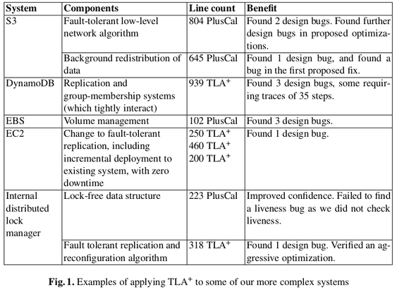

## Formal Methods

Formal methods, in software and hardware engineering are mathematically rigorous techniques for the specification, development, and verification of software and hardware systems.

$TLA^+$ is a high-level language for modeling programs and systems, based on the idea that the best way to describe things precisely is with pure mathematics. PlusCal is a lanuage for writing algorithms, mostly concurrent and distributed ones. Any mathematical formula can be used as a pluscal expression. More expressive than any programming language. PlusCal cannot structure complex modesl as TLA+ can.

### History

TLC is used to check other specifications written in TLA+ directly or that are translated from PlusCal.

[1]: "The Temporal Logic of Actions", 1994
[2]: "Specifying Concurrent Systems with TLA+", 1999

AWS has been using TLA+ since 2011. https://lamport.azurewebsites.net/tla/amazon-excerpt.html

- formal methods find bus in system designs that cannot be found through any other technique so far or know of
- formal methods are suprisingly feasible for mainstream software development and give a good return on investment
- At amazon, formal methods are routinely applied, including public cloud services

[3]: James Hamilton blog post https://perspectives.mvdirona.com/2014/07/challenges-in-designing-at-scale-formal-methods-in-building-robust-distributed-systems/

[4]: Tim Rath lecture https://www.infoq.com/presentations/aws-testing-tla. DynamoDB work, comparison to the generative testing (different name on property-based testing) or process clusters technique (similar to Jepsen).

[5]: Chris Newcombe https://groups.google.com/forum/#!searchin/tlaplus/professional%2420career/tlaplus/ZJCi-UF31fc/Mawvwi6U1CYJ

### AWS TLA+ use cases

TLA+ and the rest of the tools (property-based testing, Coq, or Jepsen).

1. Handle very large, complex, or subtle problems. The model checker is very stable and performant - evaluating model with 31 billion states took in 2014 approximately 5 weeks on a single EC2 16 vcpu, 60Gb ram, 2Tb local ssd.
1. minimize congnitive burden
    a. needed a small lanugage understandable yet expressive, e.g., operators that allow you to express the examined system's liveness properties
    b. yet, many alternatives impose many new and esoteric requirements on writers, e.g., Coq type system. TLA+ is untyped as the type system is another external constraint that needs to be aligned and checked
1. high return on investment. 2-3 weeks to start using. improve time to market and easily focus on real issues.

Tim Rath two significant observations:

1. test adequacy criteria. most projects use code coverage but it is based on weak criteria. If you want to perform more exhastive testing, it requires time and experience yet still focuses more or less on happy path scenarios. And you are not testign the design, which is the essential part of TLA+.
1. testing and quality is often not prioritized.

[6]: why amazon chose TLA+ https://link.springer.com/chapter/10.1007/978-3-662-43652-3_3

[7]: how AWS uses formal methods https://www.cslab.pepperdine.edu/warford/math221/How-Amazon-Web-Services-Uses-Formal-Methods.pdf

[8]: Lamport, use of formal methods at AWS https://lamport.azurewebsites.net/tla/formal-methods-amazon.pdf

[9]: TLA conf https://conf.tlapl.us/program/

[10]: lamport book https://lamport.azurewebsites.net/tla/book.html

[11]: Hillel Wayne's book https://www.apress.com/gp/book/9781484238288

## References

1. https://bitesizedserverless.com/bite/serverless-messaging-latency-compared/?utm_source=twitter&utm_medium=social
1. AWS dashboards https://aws.amazon.com/builders-library/building-dashboards-for-operational-visibility/
1. Formal methods https://awsmaniac.com/how-formal-methods-helped-aws-to-design-amazing-services/
