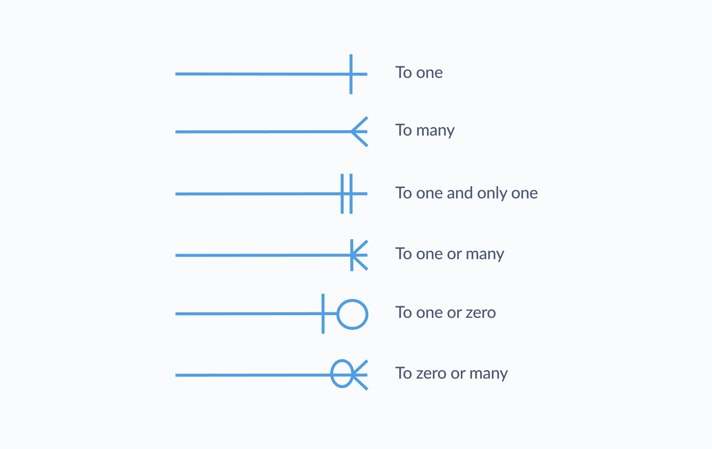

https://en.wikipedia.org/wiki/Entity%E2%80%93relationship_model#Crow%27s_foot_notation

1. ring and dash → minimum zero, maximum one (optional)
2. dash and dash → minimum one, maximum one (mandatory)
3. ring and crow's foot → minimum zero, maximum many (optional)
4. dash and crow's foot → minimum one, maximum many (mandatory)

