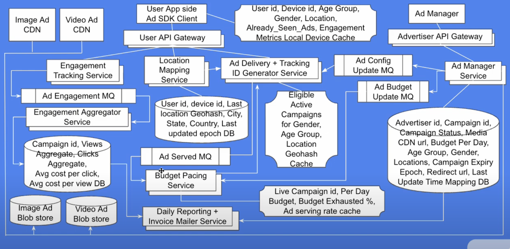

## Companies asked this

Pinterest

## Requirements

Design ads targeting system

1. an ad can query targeting customers with 'gender=male && location=us||mexico'
2. the input are customers features (key value pairs)

### Youtube

Functional

1. ad campaign CRUD
2. ad config: ad campaign target users, creative, budget per day, expiry, redirect url
3. serve ads to target users based on gender, age, location
4. engagement tracking: ad impressions (views and clicks)
5. budget planning: control serving rate to avoid over delivery
6. campaign state: active, expired, paused or removed
7. reporting: campaign report and invoice with total amount to pay

Non-Functional: Low latency and high availability.

## High Level Design

### Youtube

## References

1. https://www.youtube.com/watch?v=lqEhFBL6Le0&t=313s