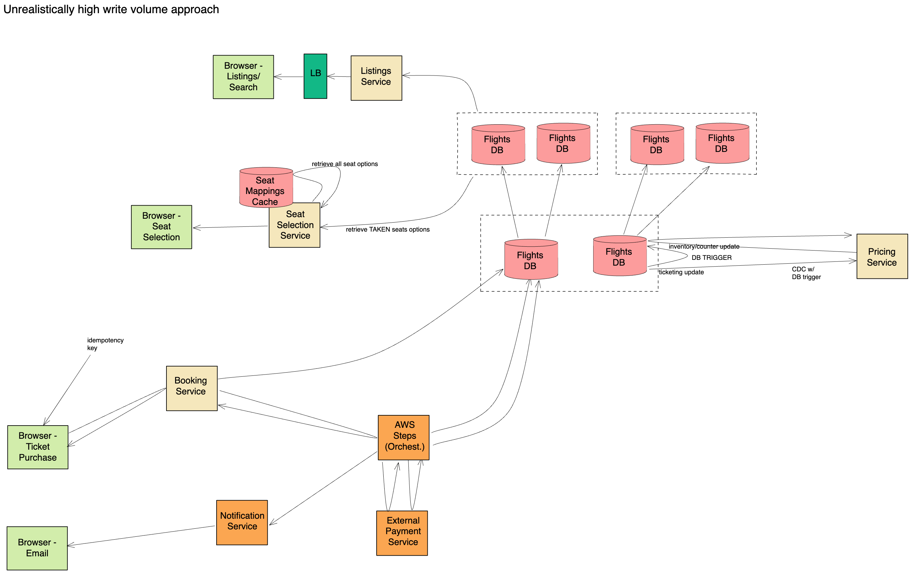

# Airline Flight Ticketing

## Companies

Circle, Microsoft

## Requirements

Functional

1. Browse available flights, book flight, select seat while booking
2. out of scope (logistics). only handle single source single destination

Iterations

1. no payment gateway
2. add payment gateway
3. orchestration approaches: websocket, polling (async with short polling), and email notification (async with SNS/SQS)
4. 1k TPS for write scale up

Non-Functional

1. 1 k TPS for read, 10 TPS for write.

## High Level Design



Flights DB: leader and followers, 1000 TPS per node, n+1 (failover).

Browser ticket purchase: idempotency key to dedupe (avoid double charge), booking service transaction to flights db. 

Each table in separate db. Donne Martin system design primer - federation.

SeatMapping cache: range query planeTypeId in local cache, range query to flights table to determine which seats are taken.

Algorithm to generate idempotency key: twitter snowflake. (timestamp, machine id, random number, ip). Client generated, a risk of conflicts.

Allowed to overbook for flights: decrement available seat count.

Pricing service: CDC with db trigger, update price when tickets reduced.

Auth-Capture workflow: Stripe/Square (has great doc) Paypal

More like sagas: no two-phase commit.

Steps:

1. check idempotency key, status
2. optional: create ticket record with requested status
3. record authId from external payment service in ticket record and update status to authorized
4. run payment against the payment service (dedupe), avoid double charging
5. update status to payment success

To scale up the write traffic to 1k TPS.

Shard with flightId with PostgreSQL. Each leader has its own read replica set. 

## Data Schema

```shell
Flight {
  flightId:1637UA  # primary, shard key. transactions in single node
  planeTypeId: boeing787
  from:SFO (gate)
  to:SEA
  price: '$200.00'
  depart: timestamp(167_000_5000)
  arrival: timestamp
  seatsCount: 10 (count up or down)
  available: true/false (updated by db trigger)
}
# maybe both string and double for price
Ticket {  # key:flightId+name
  autoincrementId+shardId
  string userId;
  string flightId;
  string idempotency_key (defacb-123-asad)
  string seat; # 37A/unassigned
  enum status; # requested,authorized
  bool payment_status;
  paymentInfo info;
}
SeatMapping {
  string planeTypeId;  # boeing787 80 seat options
  [seatId]: [37A, 37B];
  enum type;  # economy,business,first-class
}
user {
  string userid
  string name
}
```

## Database

1. DynamoDB: trigger, no 2D index support, 25 GSI
2. PostgreSQL: trigger, r-trees, support secondary index
3. redis: geohash, no secondary index support
4. ElasticSearch: no triggers, quad-trees, no limit on secondary index

## References

1. Microsoft https://www.youtube.com/watch?v=ckkbxPE-5wc