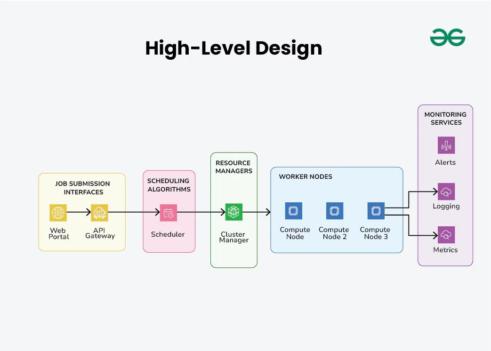
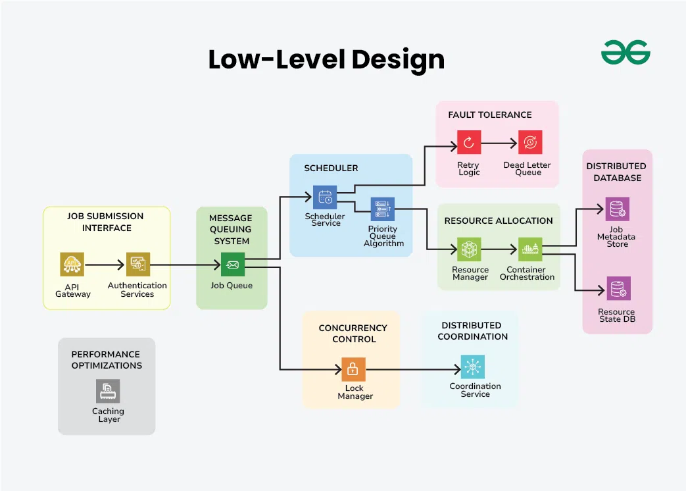
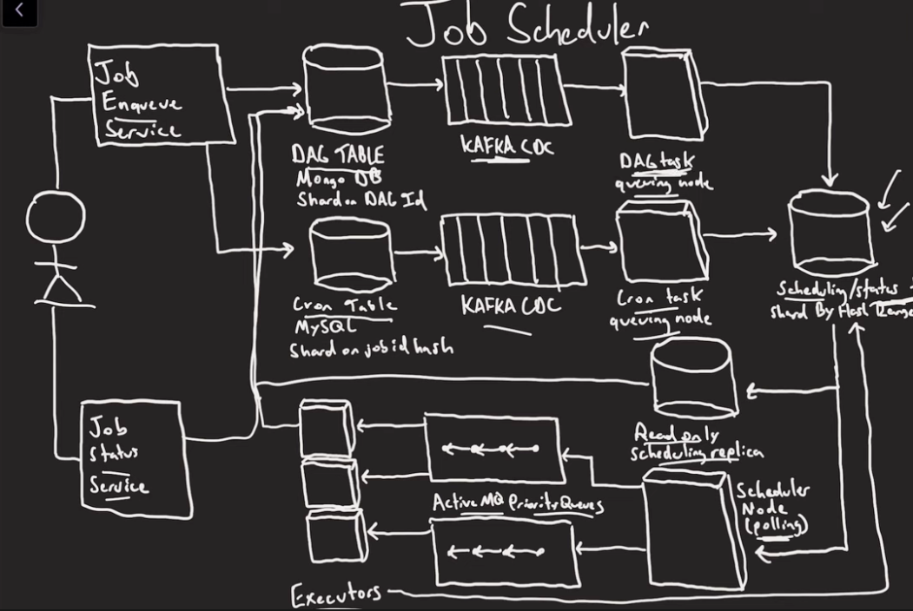

## Companies asked this

Pinterest

## Requirements

### GFG

Functional Requirements for Distributed Job Scheduler

1. Job Scheduling: Enable users to submit jobs to the system for execution at specified times or intervals.
2. Distributed Execution: Distribute jobs across multiple worker nodes in a distributed environment for parallel execution.
3. Monitoring and Reporting: Provide monitoring capabilities to track job execution status, system health, and resource utilization.

Non-Functional Requirements for Distributed Job Scheduler

1. Reliability: Jobs should be executed accurately and on time, ensuring high reliability of the system.
2. Performance: Jobs should be executed efficiently with minimal latency and overhead to meet performance requirements.
3. Scalability: The system should be able to scale horizontally to handle a large number of concurrent jobs effectively.
4. Fault Tolerance: Implement mechanisms to handle node failures and job retries to ensure fault tolerance and high availability.
5. Security: Ensure data confidentiality and integrity by implementing security measures to prevent unauthorized access to the system.

### Medium

Retrieve Operations

1. Given a user_id, retrieve all jobs created by that user
2. Retrieve all scheduled tasks that are scheduled to be executed right now (by scheduling service)
3. Retrieve all or the latest execution histories and their status related to a specific job_id 

Modification Operations

1. Allow users to create or delete their job schedules
2. Update the Job’s next execution timestamp by job_id
3. Update task status (Scheduled, Completed, Failed)

50 million jobs each day. 34722/minute.

### Youtube

1. allow uploading binaries, store in S3
2. each job must be run at least (ideally) once
3. users can check job status
4. job can be one-off, cron schedule or via a DAG

## Capacity Estimations

1. QPS job submission, e.g. 1M/hour(278/s).
2. Job metadata, 1kb * 1M = 1GB.
3. Logs and configuration, based on usage patterns and retention policies.
4. Bandwidth: 1kb per message, 1000 exchanges per second, 1MB/s.
5. Job queue memory: 100 bytes * 10,000 = 1Mb
6. Execution Context: Estimate memory for storing execution contexts and system state based on the complexity of job execution and concurrency levels.

## High Level Design



Scheduling decisions are made based on factors such as job priority, resource requirements, and current system load.

Additionally, specific Resource Managers may handle the allocation of individual resource types, such as CPU, memory, and storage.

## Low Level Design



- It utilizes a Lock Manager for concurrency control, ensuring that jobs are processed safely in a multi-threaded environment.
- The Coordination Service, part of Distributed Coordination, facilitates communication and synchronization between distributed components. It ensures consistency and coherence in the distributed system’s operation.



## Database

### GFG

```
JobDefinition:
+jobId:string
+userId:string
+jobname:string
+status:enum
+timestamps:string  //create,schedule,complete

User:
+userId:string
+userName:string
+password:string

Node:
+nodeId:string
+nodeStatus:enum
```

### Medium

As you can see we have both read and write operations. If you pay special attention we have we don’t have complex transactional operations, therefore we are not tightly coupled to use a relational database.

In our design we will choose Cassandra, as it is an open-source, distributed NoSQL database system designed to handle large amounts of data across multiple commodity servers, ensuring high availability and fault tolerance. If you are considering using cloud services also Amazon DynamoDB (AWS), and Bigtable (GCP) are recommended options for use.

As each user will retrieve all their jobs using their `user_id`, it would be beneficial to partition the table by `user_id` to enhance data locality, optimize query performance, and streamline the retrieval of job information specific to individual users. In each partition, utilize the `job_id` as a sorted key for efficient organization and retrieval of job-related data.

Task_Schedule table design: In the above, we designed a job table and we mentioned the job execution interval there. For example, job with id-123456 is scheduled to execute every 3 hours (PT3H- means Period Time 3 Hours). But we need another table to store the next execution time for each job. By doing this it will be easy for us to query all scheduled tasks for the current minute(as we execute our tasks in each minute).

`select * from task_schedule where next_execution_time = '21/01/2024:00:01'` will scan whole table.

We converted `next_execution_time` to a UNIX timestamp with minute-level granularity and marked it as a partition key. `job_id` field also marked as sort key. These changes will significantly enhance performance. With this modification, tasks scheduled to execute in the current minute will be located in the same partition, allowing the query to scan only one partition to retrieve the list of tasks to be executed.

Task_Execution_History table design: We need one more table to store task’s execution whenever a scheduled task is executed. That table will also store the task’s status, retry count etc. As a result, users will have the capability to access the execution history of any job. We will access the job’s execution history by job_id , therefore it is better to partition this table by job_id to be able to access all history for the same job in the same partition. Also, we will define execution_time as a sort key, to keep job history as sorted by execution time.

### Youtube

1. Cron job table
2. Scheduled task table
3. DAG table (partition by DAG id, index by job id)

```
DAG Job
+job id
+cron
+[children]
+[dependencies]
```

Need atomicity, update multiple rows at the same time (transaction). MySQL -> MongoDB for schema flexibility (children, dependencies). Want updates on a single node to avoid distributed transaction (two-phase commit).

```
job_id
s3_url
run_timestamp (index)
status (compount index + timestamp)
```

Keep schedule task table in memory (replicate for fault tolerance). Many partitions of the scheduler table. Write to leader, read from replica.

## Service APIs

1. Job Management Service
   1. GET /jobs/{id}
   2. POST /jobs, create job
2. Execution Node Service
   1. POST /nodes 
   2. GET /nodes
   3. PUT /nodes/{id}, update status
3. Resource Management Service
   1. POST /resources, allocate resource for job execution
   2. PUT /resources/{id}, release or update allocated resource
   3. GET /resource/{id}

## Scalability

1. horizontal scaling: more compute nodes
2. vertical scaling

## Job Allocation

Executors are being used as much as possible.

1. A load balancer, not ideal (consistent hashing, super long job). LB needs to know the state of all the executors.
2. Message broker
   1. Kafka, log based. one consumer per partition. stuck behind long running ones.
   2. In memory message broker, better, consumers take tasks when idle.

We can use multiple levels of queues as in operating system. Retry can try a higher level.

## Running Jobs Once

Retry policies and scheduler replication + broker replication should ensure everything runs at least once.

1. completion message from the executor lost
2. scheduler retry, wait time too long
3. an executor goes down, job retried
4. message queue goes down

A distributed lock (zookeeper, consensus) to avoid running the same job at once. Need a TTL on this lock.

Run each job exactly once?

1. a job always runs on the same executor, dumb
2. all nodes must always check scheduling status table, races
3. make jos idempotent or deal with consequences, most realistic

## References

1. https://www.geeksforgeeks.org/design-distributed-job-scheduler-system-design/
2. https://medium.com/@mayilb77/design-a-distributed-job-scheduler-for-millions-of-tasks-in-daily-operations-4132dc6d645f#:~:text=In%20this%20post,%20we%20will%20design%20a%20highly%20scalable%20Job
3. https://www.youtube.com/watch?v=pzDwYHRzEnk&t=630s
