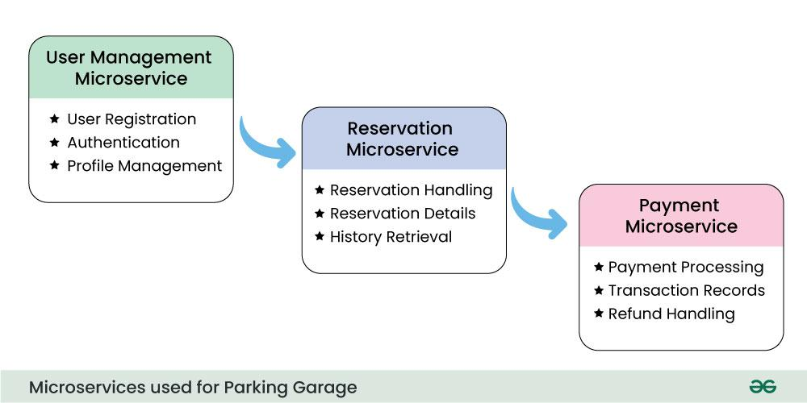

## Companies asked this

Amazon, Hertz

## Requirements

### Exponent Youtube Version

Reservation and payment system

1. reserve parking spot and receive receipt, cancel. remember where each car is parked. consistency: two people not able to reserve the same spot
2. pay for a parking spot. payment: 3rd party or existing API (Square, credit card, paypal)
3. 3 types: compact, regular, large. flat rate based on time, different rate for the 3 types
4. smaller car can fit into a larger type spot, clarify business logic about what to do. algorithm for allocating spot

Non-functional

1. 200 spots per floor, 10 floors per garage
2. probably not high traffic or scale

### opengenus version

The system includes core functions like giving the customer a ticket on entering and generate the bill or price on exit.In this case, we are considering two users: the customer and the admin(or, the owner of the parking lot). The customer can check availability of parking slot and can get a ticket after parking the vehicle. The admin has to set the parking rates and also generate a bill once the parked vehicle is taken.

Customer:
1. Register at the parking lot
2. Check parking slot availability
3. Get the ticket
4. Update parking slot reservation
5. Update parking status

Admin:
1. Set parking rates
2. Provide billing data
3. Manage the system and parking data
4. Analyse the parking data
5. Display bill amount
6. Generate a receipt

## Estimation (opengenus)

As there is nothing to compute except for the check-in time, more investment need not be done on the computing resources. Even for the storage, it is not necessary to store the details of the vehicle once the vehicle is checked out. Thus, the amount of storage required depends directly on the parking lot capacity as at any point of time, the database contains only the details of the vehicles that are in the parking lot at that time. Assuming the parking lot is very large and has a vehicle capacity of a lot of vehicles(10_000_000), the maximum storage needed will 1.5 GB as an average of 150 Bytes of data is needed to store the details of a vehicle.

## API

public

```
garage, parking spot, reservation
- create, post /spot_id (start_time, end_time) -> reservation_id 
- cancel, delete /spot_id/reservation_id
payment
- pay, post /reservation_id
create account (email, password, .etc) or single sign on
log in 
```

internal/private

```
calculate payment
payment/reservation_id?<params>
check for available spots
garage/garage_id/free_spots?<query_params>
alocate sport (garage_id, vehicle_type, time)
```

## Data

relational: postgres, mysql

```shell
reservation: reservation_id (increment as added more)
fields: gagrage, which spot, start and end time, payment status
garage_id, foreign key, int
spot_id, foreign key, int
start, timestamp
end, timestamp
paid, boolean

garage table
id, primary key, serial
location (zip code), varchar (might be useful for sharding)
rate_compact, decimal
rate_reg, decimal

spot table
id, primary key, serial
garage_id, foreign key, secondary key
status
vehicle_type, enum

user table
id
email, varchar
password, varchar (probably a hash)
first_name, varchar
last_name, varchar

vehicle table
id
user_id, foreign key, int
license, varchar
vehicle_type, enum
```

## High-Level Architecture

trade off: strong consistency, slightly larger response time, higher latency.

strongly consistent: read lock on the reservation spot, based on location
 


### GFG





## References

1. https://www.youtube.com/watch?v=NtMvNh0WFVM
2. https://iq.opengenus.org/system-design-for-parking-lot/
3. https://www.geeksforgeeks.org/designing-parking-lot-garage-system-system-design/
4. OOD: https://techbyexample.com/parking-lot-system-design/, doubly linked list
5. OOD: https://www.geeksforgeeks.org/design-parking-lot-using-object-oriented-principles/
6. https://medium.com/double-pointer/system-design-interview-parking-lot-system-ff2c58167651