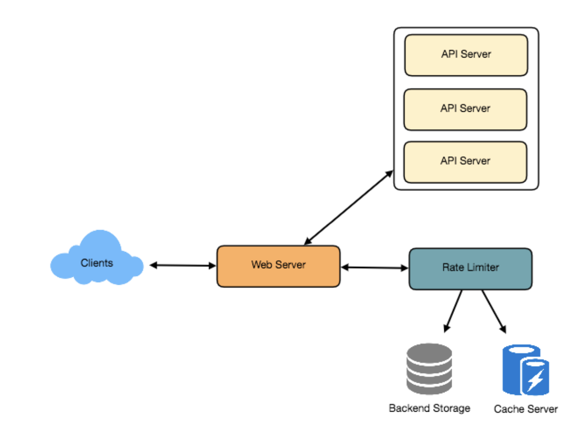

## Companies asked this

Pinterest

## Requirements

1. Need to consider the requests from the same source and process all requests that satisfy constraints.
2. If a request was not handled in this time window, should be handled later.

### Functional Requirements

1. Limit the number of requests an entity can send to an API within a time window, e.g., 15 requests per second.
2. The APIs are accessible through a cluster, so the rate limit should be considered across different servers. The user should get an error message whenever the defined threshold is crossed within a single server or across a combination of servers.

### Non-Functional Requirements

1. The system should be highly available. The rate limiter should always work since it protects our service from external attacks.
2. Our rate limiter should not introduce substantial latencies affecting the user experience.

## Benefits

1. prevent resource starvation caused by DoS (Denial of Service) attacks
2. reduce cost
3. prevent servers from being overloaded, manage load and scalability
4. enhance security

## Applied at what level

Can be applied at

1. user/client level, prevent spam or malicious bot
2. application level, ticket buying surge
3. API level

## Responses

1. blocking http 429
2. throttling, slowing down or delaying requests beyond the limit
3. shaping, allow to surpass the limit but assign lower priority

## Algorithms

1. fixed window counter, may not be smooth
2. sliding log, keep a time-stamped log of requests. sliding window in DDIA (see chapter 11)
3. sliding window counter. balance between 1 and 2. counts requests in the current window and a fraction of the requests from the previous window, based on the time elapsed
4. token bucket, tokens added to a bucket at a regular rate
5. leaky bucket, requests added to a queue (bucket) processed at a fixed rate to smooth out burst traffic

## Basic Design



Data: userid -> [count,start_time]

Then reset `if time-start_time>=1min` for fixed window algorithm.

Atomicity concern: two concurrent requests read-then-write, can exceed limit. For redis, can use redis lock and trade off is slowing down concurrent requests and added complexity.

For 1M users, 12(data)+20(overhead)+4(lock), 36Mb. Can fit in single server.

If limit 10 requests per second, 10M QPS. Can use redis or memcached distributed cache.

## Sliding Window

Data: userid -> SortedSet()

```
while ss[0]<time-1min: ss.pop(index=0)
if len(ss)>=3: throttle
else ss.add(time)
```

For each user, assume 500 requests allowed per hour, 8 + (4 + 20 (sorted set overhead)) * 500 + 20 (hash-table overhead) = 12KB. For 1M users, 12kb * 1M = 12 Gb.

### Improve Sliding Window: Reduce Memory

Assumption: 500 requests per hour, and 10 requests per minute.

We can store our counters in a Redis Hash since it offers incredibly efficient storage for fewer than 100 keys. When each request increments a counter in the hash, it also sets the hash to expire an hour later. We will normalize each ‘time’ to a minute.

Data: userid -> {time: count}

8 + (4 + 2 + 20 (Redis hash overhead)) * 60 + 20 (hash-table overhead) = 1.6KB. 1.6GB for 1M users.

## Data Sharding and Caching

We can shard based on user id, use consistent hashing for fault tolerance and replication. If we want to have different throttling limits for different APIs, we can choose to shard per user per API. Take the example of URL Shortener; we can have different rate limiter for createURL() and deleteURL() APIs for each user or IP.

If our APIs are partitioned, a practical consideration could be to have a separate (somewhat smaller) rate limiter for each API shard as well. Let’s take the example of our URL Shortener where we want to limit each user not to create more than 100 short URLs per hour. Assuming we are using Hash-Based Partitioning for our createURL() API, we can rate limit each partition to allow a user to create not more than three short URLs per minute in addition to 100 short URLs per hour.

Our system can get huge benefits from caching recent active users. Application servers can quickly check if the cache has the desired record before hitting backend servers. Our rate limiter can significantly benefit from the Write-back cache by updating all counters and timestamps in cache only. The write to the permanent storage can be done at fixed intervals. This way we can ensure minimum latency added to the user’s requests by the rate limiter. The reads can always hit the cache first; which will be extremely useful once the user has hit their maximum limit and the rate limiter will only be reading data without any updates.
Least Recently Used (LRU) can be a reasonable cache eviction policy for our system.

## Rate limit by IP or by user?

IP: In this scheme, we throttle requests per-IP; although it’s not optimal in terms of differentiating between ‘good’ and ‘bad’ actors, it’s still better than not have rate limiting at all. The biggest problem with IP based throttling is when multiple users share a single public IP like in an internet cafe or smartphone users that are using the same gateway. One bad user can cause throttling to other users. Another issue could arise while caching IP-based limits, as there are a huge number of IPv6 addresses available to a hacker from even one computer, it’s trivial to make a server run out of memory tracking IPv6 addresses!

User: Rate limiting can be done on APIs after user authentication. Once authenticated, the user will be provided with a token which the user will pass with each request. This will ensure that we will rate limit against a particular API that has a valid authentication token. But what if we have to rate limit on the login API itself? The weakness of this rate-limiting would be that a hacker can perform a denial of service attack against a user by entering wrong credentials up to the limit; after that the actual user will not be able to log-in.

How about if we combine the above two schemes?
Hybrid: A right approach could be to do both per-IP and per-user rate limiting, as they both have weaknesses when implemented alone, though, this will result in more cache entries with more details per entry, hence requiring more memory and storage.
