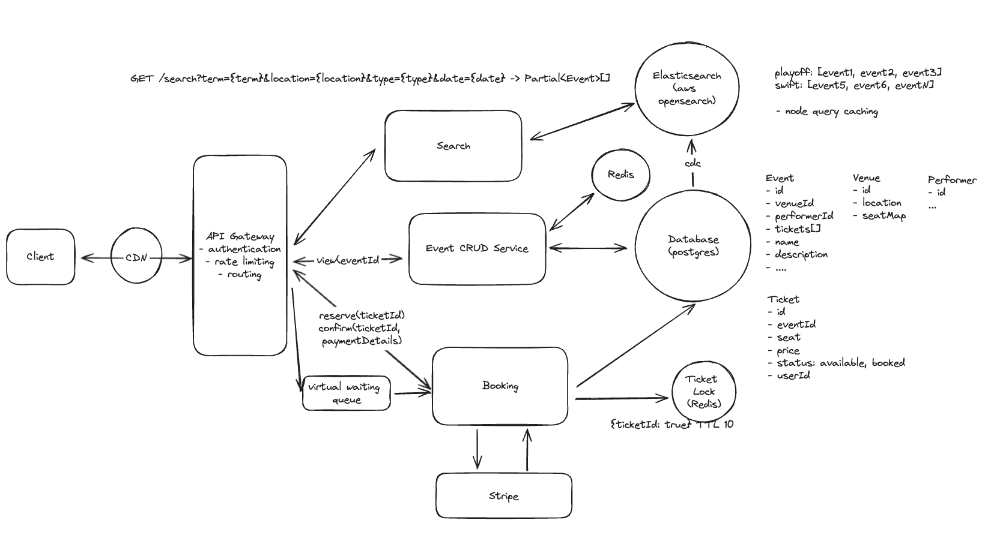

# Ticketmaster

## Companies

Circle.

## Requirements

Core Requirements

1. Users should be able to view events
2. Users should be able to search for events
3. Users should be able to book tickets to events

Below the line (out of scope):

1. Users should be able to view their booked events
2. Admins or event coordinators should be able to add events
3. Popular events should have dynamic pricing


Non-Functional Requirements

Core Requirements

1. The system should prioritize availability for searching & viewing events, but should prioritize consistency for booking events (no double booking)
2. The system should be scalable and able to handle high throughput in the form of popular events (10 million users, one event)
3. The system should have low latency search (< 500ms)
4. The system is read heavy, and thus needs to be able to support high read throughput (100:1)

Below the line (out of scope):

1. The system should protect user data and adhere to GDPR
2. The system should be fault-tolerant
3. The system should provide secure transactions for purchases
4. The system should be well tested and easy to deploy (CI/CD pipelines)
5. The system should have regular backups

## Data Schema and APIs

```
Event {
    id
    venueId (foreign key)
    performerId
    tickets[]
    name
    description
}

Venue {
    id
    location
    seatmap
}

Performer {
    id
}

Ticket {
    id
    eventId
    seat
    price
    status: enum
    userId
    reserved timestamp (one option)
}
Booking
```

APIs

1. GET /event/:eventId -> Event & Venue & Performer & Ticket[]
2. GET /search?term={}&location={}&type&date -> Partial<Event>[]
3. POST /booking/reserve `body: {ticketId}`, no userId in post body, header JWT or session token
4. PUT /booking/confirm `body: {ticketId, payment}`

## High Level Design



For ticket reservation status, need real time update.

1. reserved timestamp
2. cron job, delta
3. distributed lock (redis), ttl. `{ticketId: true} TTL 10 min`. Failure, in small 10 min window, some users may not be able to book, first one wins. Discuss with product team.

## Deep Dive

Define one-three places to show off. Look at non-functional requirements and see what is missing.

1. Low latency search. Search optimized database: elastic search (tokenize event). For example, `playoff: [event1, event2]`. Geospatial search using both hashing and quad trees. Usually not as primary datastore. Write throughput might be low. In this use case, write traffic is low. AWS opensearch node query caching.
   1. application write to both db and elastic search
   2. change data capture, use queue if write is a concern.
2. popular queries: caching. no personal ranking and recommendation. Or redis in front of elastic search. or cdn cache API calls (less useful if more permutations are in the search, low cache hit).
3. client click on seat 5 minutes later, no longer available. 1) long pulling to publish updates to client. 2) persistent connection: websockets or server sent events (SSE).
4. introduce choke point (admin enabled), virtual waiting queue (Redis sorted set or other a bit randomized, not just people closest to our servers) for popular events ticket booking. SSE to notify them out of queue.
5. Scaling: load balancer, dynamic, horizontally, math, back of the envelope calculations. Do we need to shard PostgreSQL, shard on eventId or venueId.
6. Redis cache for event, venue, performer since they don't change as frequently. eventId: {event, venue, .etc}

## Summary


## References

1. Hello Interview Ex Meta https://www.youtube.com/watch?v=fhdPyoO6aXI
