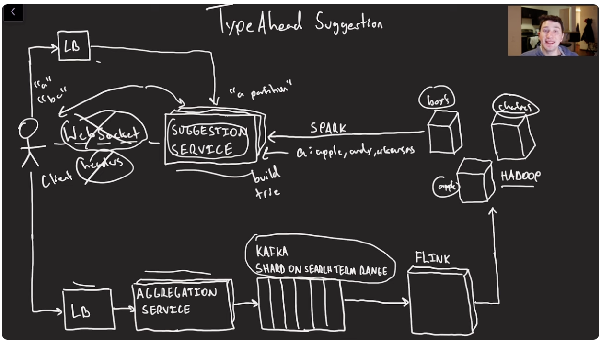

## Problem

Autocomplete or type-ahead searches.

## Companies asked this

Pinterest

## Examples

input: Hel
suggestions: Hell, Hello, Helena,

input: Jordan has
suggestions:
Jordan has no life
Jordan has a large schlong
Jordan has emotional issues

## Requirements

### Functional
1. show top suggestions, clarify whether incorporate personal history or suggestions
2. suggestions may be either individual words or full search terms
3. top terms list should be updated at least once per day

Main idea: make read speeds as fast as humanly possible.

### Capacity Estimations

1. around 200k words in English
2. average word length 5 characters
3. for each word, store result of all prefixes: "word"->"w","wo","wor",.etc.
4. 1 billion unique search queries per day, if store counts 4 billion bytes (4GB)
5. average search term is 20 characters: 1 billion terms*20prefixes = 20 billion entries; returning 10 search terms * 20 characters per term + prefix = ~ 200 bytes per entry; map 20 b entries * 200 bytes = 4 Tb

1 million keys in cache
1 million x (5 bytes word + 15 bytes suggestions) = 20 Mb, store on client device

store count for each word (4 bytes) 800kb for all words, compute on the fly (can be expensive, cache final result of top 3)

## Implementation

### local non-caching approach

store word counts, sort by word string, range based query, for all words with this prefix, use min heap to keep top 3
O(n*log3), linear, slow

### local caching approach

a:apple, andy, arkansas store in cache
O(len(prefix))

as typing, a, ap, app, find top 3 for each
to improve, use trie, cache top terms at each node, jump node O(1) time. need O(n) memory reduced from n^2.
dictionary compression: popular terms, use short->string to further lower the memory footprint.
use pointers instead of actual top 3 words, longer time to traverse to actual word (only do this for popular words)

### update trie

a word may need to bubble up the tree, require lock for each node

use batch jobs and update in background

suggestion service->kafka->flink(creates parquet file)->HDFS

compute top values

apple 16. recursively convert to (a,apple,16), (ap,apple,16), ...
shuffle partition by `tuple[0]` (starting with a on same node), hake top n of each term (use heap)

HDFS->memory and then trie

### Scaling up

4Tb data, 10+ memory servers to store, not including replicas

More read optimizations, stateful memory server
1. bidirectional correction: websockets
2. do not have to resent request/response headers

a give query have to go to the same node, stateful
so we should use range based partition instead of hash based

trie storage servers T1,T2,T3
distributed cache, zookeeper to load balance: N1, N2, N3, .etc

### hot spots

a terms might be more popular than x terms

1. more replicas of popular partitions
2. dynamic/easy ability to repartition

create lots of small fixed size partitions
a service can monitor load on all nodes and copy partitions from one node to another then update zookeeper/load balancer to reflect change.

### phrase and weight

aggregators: cassandra (NoSql)
schema: phrase, time, sum of weights, one row per hour, then create daily data. give more weights to recent data
drop phrase of weight less than threshold

## Diagram

## Notes

## References
1. https://www.youtube.com/watch?v=MCKX3n4-UR4&pp=ygUXZGVzaWduIHR5cGVhaGVhZCBzeXN0ZW0%3D
2. 